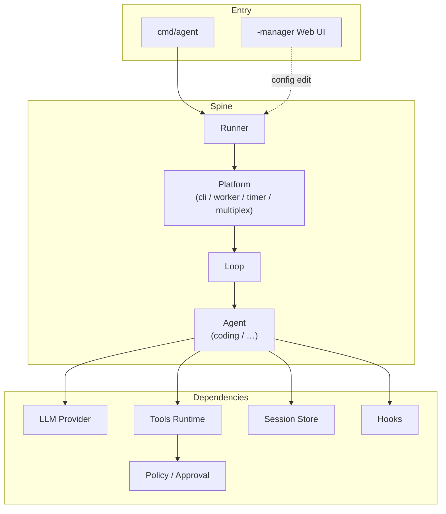
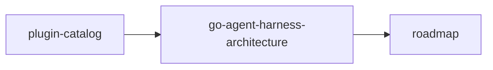

# AgentKit

**English** | **[中文](README.zh.md)**

Go Agent Harness runtime built on [pluginkit](https://github.com/lengzhao/pluginkit). Assemble Runner, Platform, Loop, Agent, tools, and policies from YAML. Supports interactive REPL, long-running autonomous loops, sub-agent delegation, MCP, Slack/Feishu/ACP integrations, and headless daemons.

## Features

- **Plugin assembly** — 79 registered plugin kinds; L0 defaults plus L1 overlays
- **Coding agent loop** — file I/O, shell, policy approval, JSONL session persistence
- **Autonomous runs** — turn continuation, layered budgets, todo/finish, token compaction, crash recovery
- **Sub-agent delegation** — define sub-agents in `agents/*.md`; the main agent only sees summarized results
- **Self-learning** — `/learn` for `memory.md`, Grounded Dreaming, Skill Workshop proposals
- **Network tools** — HTTP fetch, Exa search, human-in-the-loop prompts
- **Integrations** — Slack, Feishu, HTTP chat API, Langfuse; multiplex several IM channels; expose AgentKit or call remote agents over ACP (e.g. Cursor CLI). See [presets — Integrations](presets/README.md#integrations)
- **Headless** — worker (one-shot), timer (fixed interval), cron (calendar + agent scheduling)
- **Web manager** — edit the assembly graph, diagnose structure, dry-run build validation

## Architecture



Configuration: `config.base.yaml` (L0, shipped with the repo) plus `config.yaml` or `presets/*.yaml` (L1 overlays; later files win). The instance graph is built with `pluginkit/build`; the root id is `runner.default`.

## Quick start

### Requirements

- Go 1.26+
- OpenAI-compatible API key (optional for smoke presets)

### Install and run

```sh
git clone https://github.com/lengzhao/agentkit.git
cd agentkit

export OPENAI_API_KEY=sk-...

# Interactive REPL
go run ./cmd/agent

# REPL with an initial message
go run ./cmd/agent "Summarize this repo layout"

# Project coding preset
go run ./cmd/agent -config presets/coding.yaml "your task"

# Local smoke without an API key (scripted LLM)
go run ./cmd/agent -config presets/coding-smoke.yaml "List the directory and read README"
```

### Local overrides

Copy the example into an L1 file (listed in `.gitignore`):

```sh
cp config.example.yaml config.yaml
```

`-config` accepts comma-separated overlays merged in order (later overrides earlier):

```sh
go run ./cmd/agent -config presets/autonomous.yaml,presets/worker.yaml "one-shot job"
```

## Common scenarios

| Scenario | Example |
|---|---|
| Interactive coding | `go run ./cmd/agent -config presets/coding.yaml` |
| Autonomous run | `go run ./cmd/agent -config presets/autonomous.yaml "multi-step task"` |
| Sub-agent delegation | `go run ./cmd/agent "ask researcher to …"` (L0 default; smoke: `presets/subagent-smoke.yaml`) |
| Self-learning | `/learn`, `/learn dream run`, `/learn skill …` in the REPL |
| Search + fetch | `export TAVILY_API_KEY=...` and `-config presets/web.yaml` |
| Headless batch | `-config presets/autonomous.yaml,presets/worker.yaml` |
| Scheduled daemon | `-config presets/autonomous.yaml,presets/cron.yaml` |
| Config Web UI | `go run ./cmd/agent -manager -addr :8080` |

Full preset index: [presets/README.md](presets/README.md) ([中文](presets/README.zh.md)).

## Layout

```
agentkit/
├── cmd/agent/          # Main binary (REPL / headless / -manager)
├── config.base.yaml    # L0 default graph
├── presets/            # Scenario L1 overlays
├── runtime/            # Runner, Loop, Platform, cap implementations
├── plugins/            # Tools, hooks, policy, prompts, learning, …
├── cap/                # Swappable capability interfaces and DTOs
├── examples/
│   ├── agents/         # Sub-agent examples
│   └── skills/         # Agent skill examples
└── docs/               # Design docs (Chinese; see docs/README.md)
```

## Documentation

Detailed design docs live under `docs/` (Chinese). Start here:

- English index: [docs/README.md](docs/README.md)
- 中文索引: [docs/README.zh.md](docs/README.zh.md)

Suggested reading order:



| Doc | Topic |
|---|---|
| [go-agent-harness-architecture.zh.md](docs/go-agent-harness-architecture.zh.md) | Runner, spine, assembly, lifecycle |
| [plugin-catalog.zh.md](docs/plugin-catalog.zh.md) | Plugin kind catalog |
| [roadmap.zh.md](docs/roadmap.zh.md) | Status and roadmap |
| [guides/learning-dreaming.zh.md](docs/guides/learning-dreaming.zh.md) | Dreaming, diary, Skill Workshop |
| [guides/](docs/guides/) | Autonomous runs, multi-tenant, tools, HIL, … |

## Development

```sh
go test ./...
go generate ./...   # refresh blank imports after adding plugins
tail -f ~/.agentkit/agent.log
```

Plugins register with `pluginkit.Register(kind, New)`. Constructors use `(Config, Deps)`; dependencies come from the `deps` field in YAML.

## References

| Project | Notes |
|---|---|
| [pluginkit](https://github.com/lengzhao/pluginkit) | Plugin registry and graph build |
| [DeepSeek Harness](https://github.com/deepseek-ai/deepseek-harness) | Agent harness reference |
| [Pi](https://github.com/earendil-works/pi) | Coding agent extension model |

## License

[MIT](LICENSE)
