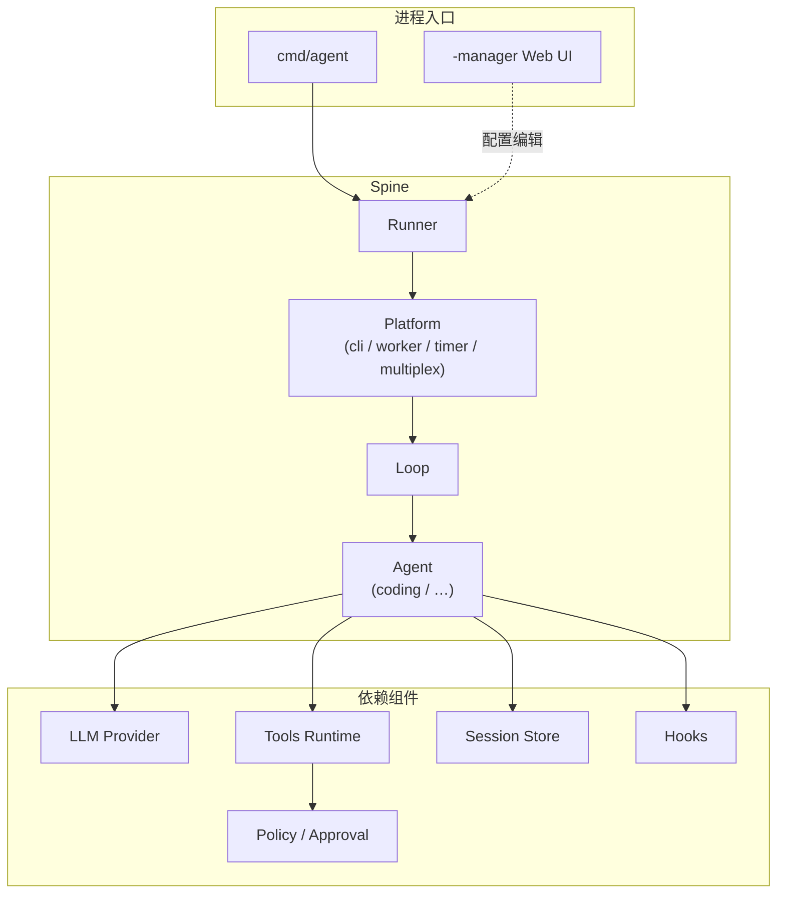
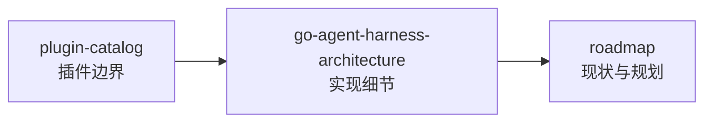

# AgentKit

基于 [pluginkit](https://github.com/lengzhao/pluginkit) 的 Go Agent Harness 运行时。通过 YAML 配置装配 Runner、Platform、Loop、Agent、工具与策略，支持交互式 REPL、自主长跑、子 Agent 委派、MCP 与 headless 守护等多种运行形态。

## 特性

- **插件化装配** — 64+ 已注册 Plugin Kind，L0 默认配置 + L1 overlay 按需覆盖
- **Coding Agent 闭环** — 文件读写、Shell、策略审批、Session 持久化（jsonl）
- **自主运行** — turn 续跑、预算分层、todo/finish 收尾、token 阈值压缩、崩溃恢复
- **子 Agent 委派** — `agents/*.md` 定义子 agent，主 agent 只读回结论
- **自我学习** — `/learn` 管理 `memory.md`，Grounded Dreaming 巩固短期信号，Skill Workshop 生成可审阅技能提案
- **网络能力** — HTTP 抓取、Exa 搜索、向用户提问（HIL）
- **Headless 模式** — worker（一次性）、timer（固定间隔）、cron（日历 + 自主排期）
- **Web 管理台** — 装配树编辑、结构诊断、试装配与 build 校验

## 架构概览



配置模型：`config.base.yaml`（L0 随仓库发布）+ `config.yaml` 或 `presets/*.yaml`（L1 overlay，后者覆盖前者）。实例图由 `pluginkit/build` 构造，root 通常为 `runner`。

## 快速开始

### 环境要求

- Go 1.26+
- OpenAI 兼容 API Key（冒烟 preset 可跳过）

### 安装与运行

```sh
git clone https://github.com/lengzhao/agentkit.git
cd agentkit

export OPENAI_API_KEY=sk-...

# 交互式 REPL
go run ./cmd/agent

# 带首条消息进入 REPL
go run ./cmd/agent "帮我看看这个项目结构"

# 项目目录 coding preset
go run ./cmd/agent -config presets/coding.yaml "你的任务"

# 无 API Key 本地冒烟（scripted LLM）
go run ./cmd/agent -config presets/coding-smoke.yaml "列出当前目录并读取 README"
```

### 本地配置

复制示例配置为 L1 override（已在 `.gitignore` 中）：

```sh
cp config.example.yaml config.yaml
```

`-config` 支持逗号分隔的多个 overlay，按顺序合并，后面的覆盖前面的：

```sh
go run ./cmd/agent -config presets/autonomous.yaml,presets/worker.yaml "一次性任务"
```

## 常用场景

| 场景 | 命令示例 |
|---|---|
| 交互式 coding | `go run ./cmd/agent -config presets/coding.yaml` |
| 自主长跑 | `go run ./cmd/agent -config presets/autonomous.yaml "多轮任务"` |
| 子 Agent 委派 | `go run ./cmd/agent "让 researcher 调研 …"`（L0 默认；冒烟见 `presets/subagent-smoke.yaml`） |
| 自我学习 | REPL 内执行 `/learn`、`/learn dream run`、`/learn skill 部署检查清单` |
| 网络搜索 + 抓取 | `export TAVILY_API_KEY=...` 后 `-config presets/web.yaml` |
| Headless 批处理 | `-config presets/autonomous.yaml,presets/worker.yaml` |
| 定时守护 | `-config presets/autonomous.yaml,presets/cron.yaml` |
| 配置管理 Web UI | `go run ./cmd/agent -manager -addr :8080` |

完整 preset 索引见 [presets/README.md](presets/README.md)。

## 项目结构

```
agentkit/
├── cmd/agent/          # 主入口（REPL / headless / -manager）
├── config.base.yaml    # L0 默认装配
├── presets/            # 场景 L1 overlay
├── runtime/            # Runner、Loop、Agent、Session、Platform、LLM
├── plugins/            # 工具、Hook、Policy、Prompt 等插件实现
├── cap/                # 能力接口（filesystem、workspace、compaction …）
├── examples/
│   ├── agents/       # 子 Agent 定义示例
│   └── skills/       # Agent Skill 示例（插件开发与配置更新）
└── docs/               # 架构与设计文档（中文）
```

## 文档

详细设计文档见 [docs/README.zh.md](docs/README.zh.md)。建议阅读顺序：



| 文档 | 说明 |
|---|---|
| [go-agent-harness-architecture.zh.md](docs/go-agent-harness-architecture.zh.md) | 完整架构：Runner、Spine、装配模型、生命周期 |
| [plugin-catalog.zh.md](docs/plugin-catalog.zh.md) | Plugin Kind 目录与分阶段落地 |
| [roadmap.zh.md](docs/roadmap.zh.md) | 现状基线与路线图 |
| [guides/learning-dreaming.zh.md](docs/guides/learning-dreaming.zh.md) | 自我学习：Dreaming、Dream Diary、Skill Workshop |
| [guides/](docs/guides/) | 场景专题：自主运行、多租户、工具、人机交互等 |

## 开发

```sh
# 运行测试
go test ./...

# 新增插件后更新 blank import
go generate ./...

# 查看日志（默认写入 ~/.agentkit/agent.log）
tail -f ~/.agentkit/agent.log
```

插件通过 `pluginkit.Register(kind, New)` 注册；构造函数支持 `(Config, Deps)` 形态，依赖由配置中的 `deps` 字段注入。

## 外部参考

| 项目 | 说明 |
|---|---|
| [pluginkit](https://github.com/lengzhao/pluginkit) | 插件注册与实例图构建 |
| [DeepSeek Harness](https://github.com/deepseek-ai/deepseek-harness) | Agent Harness 参考实现 |
| [Pi](https://github.com/badlogic/pi) | Coding Agent 扩展模型参考 |

## License

[MIT](LICENSE)
