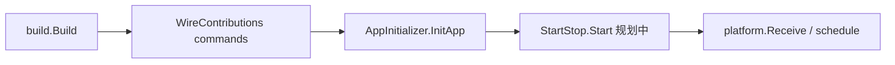

# App Init 运行时设计

> 日期：2026-09-02  
> 状态：已落地  
> 范围：Runner 启动前的一次性初始化，与 Composer / 配置生成解耦

## 1. 背景

部分能力需要在进程开始接收入站消息之前完成一次性准备，例如：

- 将 bundled 的 `agents/`、`skills/` 复制到工作区
- 在项目目录执行 `git init`
- 创建 `.agentkit` 下缺失的目录结构

这些工作不应放在插件构造函数里（构造函数只做轻量校验与对象组装），也不应混进 `StartStop.Start`（那是常驻后台任务，如 cron）。

## 2. 接口

```go
type AppInitializer interface {
    InitApp(context.Context) error
}
```

规则：

| 规则 | 说明 |
|---|---|
| 触发时机 | `build.Build` 成功后、`Runner.Run` 装配 commands 之后、schedule / platform 接收循环之前 |
| 收集范围 | `build.Result` 中所有实现 `AppInitializer` 的实例 |
| 执行顺序 | 与 `Result.Instances` 一致（依赖先于被依赖者） |
| 失败语义 | 任一 `InitApp` 失败则 `Run` 直接返回错误，进程不进入服务态 |
| 幂等 | 命令本身应可重复执行（如 `test -d .git \|\| git init`） |

与 `StartStop` 的分工：



## 3. 配置

把 bootstrap 实例挂到 `runner.deps.init`，它们会进入 build 子图并在 `Run` 时按依赖顺序执行。

示例：

```yaml
runner.default:
  deps:
    init:
      - bootstrap.shell.default

bootstrap.shell.default:
  use: bootstrap/shell
  config:
    workDir: local:..
    commands:
      - test -d .git || git init
      - mkdir -p .agentkit/skills
      - test -d skills || cp -R ~/.agentkit/skills skills
  deps:
    workspace: workspace.default
```

`runner.deps.init` 用于显式挂载 init 插件并控制 build 顺序；同一实例只执行一次 `InitApp`。

## 4. 内置插件

| Kind | 作用 |
|---|---|
| `bootstrap/shell` | 在 workspace 目录下按序执行 `bash -lc` 命令 |

复制目录、初始化 git 等场景都通过 shell 命令表达，不再单独提供专用 bootstrap kind。

## 5. 验收

- `Runner.Run` 在 platform 收到第一条消息前完成全部 `InitApp`
- init 失败时进程退出，且不启动 receive 循环
- 重复启动时命令本身保持幂等
