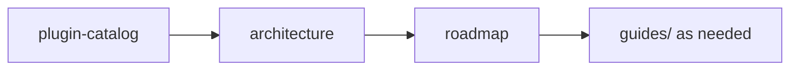

# AgentKit documentation

**English** | **[中文](README.zh.md)**

Go Agent Harness runtime built on [pluginkit](https://github.com/lengzhao/pluginkit).

Project README: [English](../README.md) · [中文](../README.zh.md)

Most design documents in this directory are **Chinese** (`.zh.md` suffix). Use the links below; the Chinese index has the same structure with localized descriptions.

## Layout

```
docs/
├── README.md                         # This page (English index)
├── README.zh.md                      # 中文索引与快速开始
├── go-agent-harness-architecture.zh.md
├── plugin-catalog.zh.md
├── roadmap.zh.md
├── agentkit-sharing.zh.md
├── migration-turn-envelope.zh.md
└── guides/
    ├── autonomous-run.zh.md
    ├── subagent.zh.md
    ├── multi-tenant.zh.md
    ├── tools.zh.md
    ├── platform-interaction.zh.md
    ├── schedule-timer.zh.md
    ├── learning-dreaming.zh.md
    ├── config-simplification.zh.md
    ├── testing.zh.md
    └── e2e-scenarios.zh.md
```

Presets: [presets/README.md](../presets/README.md) · [presets/README.zh.md](../presets/README.zh.md)

## Quick start

```sh
export OPENAI_API_KEY=sk-...
go run ./cmd/agent                                          # REPL
go run ./cmd/agent -config presets/coding.yaml "your task"
go run ./cmd/agent -config presets/coding-smoke.yaml "..."  # smoke, no API key
go run ./cmd/agent -config presets/autonomous.yaml "..."    # autonomous
go run ./cmd/agent -config presets/slack.yaml               # Slack
go run ./cmd/agent -config presets/feishu.yaml              # Feishu
go run ./cmd/agent -config presets/chat-api.yaml            # HTTP debug API
go run ./cmd/agent -config presets/langfuse.yaml "hello"    # Langfuse
go run ./cmd/agent -manager                                 # Web manager
go run ./cmd/agent scaffold tools                           # scaffold tools snippet (maintainers)
```

After adding plugins: `go generate ./...`

## Reading order



1. [plugin-catalog.zh.md](plugin-catalog.zh.md) — plugin kinds
2. [go-agent-harness-architecture.zh.md](go-agent-harness-architecture.zh.md) — Runner / Loop / Policy
3. [roadmap.zh.md](roadmap.zh.md) — gaps and priorities
4. [guides/](guides/) — scenario deep dives
