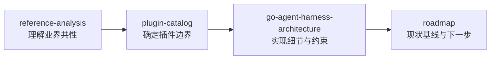

# AgentKit 文档索引

AgentKit 是基于 [pluginkit](https://github.com/lengzhao/pluginkit) 的 Go Agent Harness 运行时。

## 核心设计

| 文档 | 说明 |
|---|---|
| [roadmap.zh.md](roadmap.zh.md) | **现状基线与接下来的目标**（M0–M4）、缺口清单、文档与代码的核对方法 |
| [go-agent-harness-architecture.zh.md](go-agent-harness-architecture.zh.md) | 完整架构：Runner、Spine、装配模型、生命周期、测试策略 |
| [reference-analysis.zh.md](reference-analysis.zh.md) | DeepSeek Harness 与 Pi 对比分析，提炼通用 Agent 能力 |
| [plugin-catalog.zh.md](plugin-catalog.zh.md) | Plugin Kind 命名、分类目录、MVP 分阶段落地 |
| [plugin-interface-comparison.zh.md](plugin-interface-comparison.zh.md) | `plugin_*.go` 与 DSH 的接口级逐文件对比与取长补短 |
| [coding-workspace.zh.md](coding-workspace.zh.md) | Coding preset 工作区与 FS 边界 |
| [../presets/README.md](../presets/README.md) | 各场景 L1 preset 与用法 |
| [autonomous-run.zh.md](autonomous-run.zh.md) | 自主运行：turn 续跑契约、预算分层、todo/finish 判定、token 阈值压缩、崩溃恢复、无人值守安全边界 |
| [subagent.zh.md](subagent.zh.md) | 子 Agent 委派：`agents/*.md` 定义格式、目录查找、工具白名单、结论读回、串行边界 |
| [web.zh.md](web.zh.md) | 网络能力：抓取与搜索为何拆成两个接口、私网地址在 dial 时拦截、无 API Key / 无人可问时的降级 |

## 快速开始

```sh
# 交互式 REPL（L0 config.base.yaml + 可选 L1 config.yaml，API Key 走 OPENAI_API_KEY）
export OPENAI_API_KEY=sk-...
go run ./cmd/agent

# 本地 override：复制 config.example.yaml 为 config.yaml（已在 .gitignore），只写要覆盖的实例
cp config.example.yaml config.yaml

# 带首条消息进入 REPL
go run ./cmd/agent "帮我看看这个项目结构"

# 单次任务：把 platform.default.config.once 设为 true，或用 presets/coding-smoke.yaml

# 项目目录 coding preset（L1 overlay）
go run ./cmd/agent -config presets/coding.yaml "你的任务"

# 无 API Key 的本地冒烟（scripted LLM）
go run ./cmd/agent -config presets/coding-smoke.yaml "列出当前目录并读取 README"

# 自主运行：无人干预连续推进，靠 todo/finish 判定收尾，预算兜底（见 autonomous-run.zh.md）
go run ./cmd/agent -config presets/autonomous.yaml "你的多轮任务"
go run ./cmd/agent -config presets/autonomous-smoke.yaml "整理这个目录并收尾"

# 子 Agent 委派：主 agent 把子任务交给 agents/*.md 定义的子 agent，只把结论带回（见 subagent.zh.md）
# L0 已内置 delegate；以下 preset 额外纳入 examples/agents 并把 local 根改为项目目录
go run ./cmd/agent -config presets/subagent.yaml "让 researcher 查清 runtime/loop 的并发模型，再据此给我结论"
go run ./cmd/agent -config presets/subagent.yaml,presets/subagent-smoke.yaml "调研一下"   # 无 API Key 冒烟

# 网络能力：搜索 + 抓取 + 向用户提问（搜索需要 EXA_API_KEY，抓取不需要；见 web.zh.md）
export EXA_API_KEY=...
go run ./cmd/agent -config presets/web.yaml "查一下 xxx 的官方说法，给我结论并附来源"
go run ./cmd/agent -config presets/web.yaml,presets/web-smoke.yaml "loop 怎么保证同一 session 串行？"   # 无 key、无真实请求

# headless：-config 接受逗号分隔的多个 overlay，按顺序合并（后面的覆盖前面的）
# worker 跑完即退出（不读 stdin，适合 cron / CI / 容器）；daemon 常驻按间隔自己醒来
go run ./cmd/agent -config presets/autonomous.yaml,presets/worker.yaml "一次性任务"
go run ./cmd/agent -config presets/autonomous.yaml,presets/daemon.yaml

# cron 守护进程：5 段式 cron 表达式，agent 可用 tool/schedule 自主排期
go run ./cmd/agent -config presets/autonomous.yaml,presets/cron.yaml

# Web 工作台：装配树编辑、共享实例提取、结构/plan 诊断、试装配（含 build 校验）
go run ./cmd/agent -manager
go run ./cmd/agent -manager -addr :9090

# 打开已有配置编辑；试装配成功会写回 -config 指定的 L1 文件
go run ./cmd/agent -manager -config config.yaml
go run ./cmd/agent -manager -config presets/coding.yaml
```

Phase 1 已实现：Runner、CLI Platform、Loop、Coding Agent、Session（memory/jsonl）、OpenAI 兼容 LLM、read/write/bash 工具、Policy 与审批插件。

Phase 2 自主运行已实现：`TurnStopping` hook seam、跨 segment 运行预算（续跑/步数/墙钟/token）、token usage 计量、`hook/turn-continue` 驱动、`tool/todo` + `tool/finish`、`approval/auto-allow` 与 `policy/shell-allowlist` / `policy/path-denylist`。

Phase 2 长跑韧性已实现：崩溃恢复（中断 turn 的 orphan tool call 修补 + `session/recovery` 审计）、`compaction/token-limit` 按 token 阈值触发压缩。

Phase 3 网络能力已实现：`tool/web-fetch-http`（HTML → 文本、dial 时拦截私网地址）、`tool/web-search-exa`（缺 key 不阻断构造）、`tool/web-*-scripted` 无网络替身、`tool/ask-user`（HIL 由 Loop + platform 承载，见 [platform-interaction.zh.md](platform-interaction.zh.md)）。

Phase 3 守护外壳已实现：`platform/worker`（headless 任务，不读 stdin；带 `cron` 时转常驻定时模式）、`platform/timer`（固定间隔）、`cap/schedule` + `schedule/file` 持久化 job 表、`tool/schedule`（agent 自主排期）、runner 并发分发（跨 session 并行 + 同 session 保序 + per-turn panic 隔离 + 优雅关停）、overlay 链式合并。

新增插件后运行 `go generate ./...` 更新 `plugins/all.go` 的 blank import。

## 阅读顺序



1. **reference-analysis** — 了解 DSH / Pi 做了什么、共性是什么
2. **plugin-catalog** — 确定 AgentKit 要注册哪些 `pluginkit.Register` kind
3. **go-agent-harness-architecture** — 深入 Runner / Loop / Policy / Hook 语义与配置模型
4. **roadmap** — 现在缺什么、下一步做什么、怎么核对文档没漂移

## 外部参考

| 项目 | 关键文档 |
|---|---|
| [DeepSeek Harness](https://github.com/deepseek-ai/deepseek-harness) | `docs/architecture.md`、`docs/capability-seams.md` |
| [Pi](https://github.com/badlogic/pi) | `packages/coding-agent/docs/extensions.md`、`packages/agent/docs/harness.md` |
| [pluginkit](https://github.com/lengzhao/pluginkit) | 插件注册与实例图构建 |
