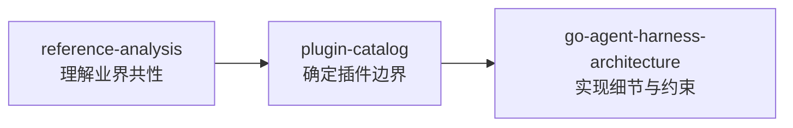

# AgentKit 文档索引

AgentKit 是基于 [pluginkit](https://github.com/lengzhao/pluginkit) 的 Go Agent Harness 运行时。

## 核心设计

| 文档 | 说明 |
|---|---|
| [go-agent-harness-architecture.zh.md](go-agent-harness-architecture.zh.md) | 完整架构：Runner、Spine、装配模型、生命周期、测试策略 |
| [reference-analysis.zh.md](reference-analysis.zh.md) | DeepSeek Harness 与 Pi 对比分析，提炼通用 Agent 能力 |
| [plugin-catalog.zh.md](plugin-catalog.zh.md) | Plugin Kind 命名、分类目录、MVP 分阶段落地 |

## 快速开始

```sh
# 交互式 REPL（默认，config 里 once: false）
go run ./cmd/agent

# 带首条消息进入 REPL
go run ./cmd/agent "帮我看看这个项目结构"

# 单次任务：把 config 里 platform.cli.once 设为 true，或用 presets/coding-smoke.yaml

# 使用预设配置
go run ./cmd/agent presets/coding.yaml "你的任务"

# 无 API Key 的本地冒烟（scripted LLM）
go run ./cmd/agent presets/coding-smoke.yaml "列出当前目录并读取 README"
```

Phase 1 已实现：Runner、CLI Platform、Loop、Coding Agent、Session（memory/jsonl）、OpenAI 兼容 LLM、read/write/bash 工具、Policy 与审批插件。

## 阅读顺序



1. **reference-analysis** — 了解 DSH / Pi 做了什么、共性是什么
2. **plugin-catalog** — 确定 AgentKit 要注册哪些 `pluginkit.Register` kind
3. **go-agent-harness-architecture** — 深入 Runner / Loop / Policy / Hook 语义与配置模型

## 外部参考

| 项目 | 关键文档 |
|---|---|
| [DeepSeek Harness](https://github.com/deepseek-ai/deepseek-harness) | `docs/architecture.md`、`docs/capability-seams.md` |
| [Pi](https://github.com/badlogic/pi) | `packages/coding-agent/docs/extensions.md`、`packages/agent/docs/harness.md` |
| [pluginkit](https://github.com/lengzhao/pluginkit) | 插件注册与实例图构建 |
