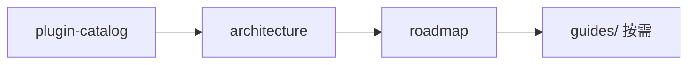

# AgentKit 文档

基于 [pluginkit](https://github.com/lengzhao/pluginkit) 的 Go Agent Harness 运行时。

## 文档结构

```
docs/
├── README.zh.md                      # 本页：索引与快速开始
├── go-agent-harness-architecture.zh.md  # 架构与装配模型
├── plugin-catalog.zh.md              # Plugin Kind 目录
├── roadmap.zh.md                     # 现状与规划
└── guides/                           # 场景专题
    ├── autonomous-run.zh.md          # 自主运行
    ├── subagent.zh.md                # 子 Agent 委派
    ├── multi-tenant.zh.md            # 多租户
    ├── tools.zh.md                   # 网络工具 + MCP
    ├── platform-interaction.zh.md    # Permission / HIL
    ├── schedule-timer.zh.md          # 一次性提醒 Timer 设计（草案）
    ├── config-simplification.zh.md   # 用户配置简化方案与路线
    └── e2e-scenarios.zh.md           # E2E 场景梳理与用例目录
```

Preset 用法见 [presets/README.md](../presets/README.md)。

## 快速开始

```sh
export OPENAI_API_KEY=sk-...
go run ./cmd/agent                                          # REPL
go run ./cmd/agent -config presets/coding.yaml "你的任务"    # 项目 coding
go run ./cmd/agent -config presets/coding-smoke.yaml "..."  # 无 key 冒烟
go run ./cmd/agent -config presets/autonomous.yaml "..."    # 自主运行
go run ./cmd/agent -config presets/slack.yaml               # Slack
go run ./cmd/agent -config presets/feishu.yaml              # 飞书
go run ./cmd/agent -config presets/chat-api.yaml            # HTTP 调试台
go run ./cmd/agent -config presets/langfuse.yaml "hello"    # Langfuse
go run ./cmd/agent -manager                                 # Web 工作台
go run ./cmd/agent scaffold tools                           # 生成 tools 配置片段（维护者）
```

新增插件后：`go generate ./...`

## 阅读顺序



1. [plugin-catalog](plugin-catalog.zh.md) — 有哪些 kind
2. [architecture](go-agent-harness-architecture.zh.md) — Runner / Loop / Policy 语义
3. [roadmap](roadmap.zh.md) — 缺口与优先级
4. [guides/](guides/) — 按场景深入
