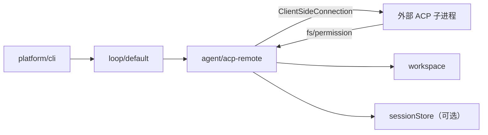

# ACP 远程 Agent（agent/acp-remote）

通过 [acp-go-sdk](https://github.com/coder/acp-go-sdk) 将外部 ACP Agent（Claude Code、Cursor CLI 等）接入 AgentKit Harness，作为 `agentkit.Agent` 插件运行。

## 架构



- **Loop 不变**：仍负责 per-session 串行、steer/follow-up、permission broker。
- **agent/acp-remote** 实现 `RunTurn`：把用户消息转成 `session/prompt`，把 `session/update` 映射为 `OutboundEvent`。
- **acp.Client 侧**由插件实现：`fs/*` 走本地文件、`session/request_permission` 走 Loop `PermissionBroker`。

## 配置

| 字段 | 说明 |
|---|---|
| `id` | Agent ID，loop `defaultAgent` 引用 |
| `command` | 子进程命令，如 `["agent", "acp"]` 或 Claude Code 适配器 |
| `env` | 额外环境变量 |
| `cwd` | `session/new` 的工作目录，空则用 workspace 根 |
| `autoApprove` | `true` 时自动批准工具权限 |
| `authMethod` | 非空时调用 `authenticate`（如 `cursor_login`） |
| `clientName` / `clientVersion` | `initialize` 中的客户端信息 |

### 依赖

| deps | 必填 | 说明 |
|---|---|---|
| `workspace` | 是 | 解析 `session/new` 的 cwd |
| `sessionStore` | 否 | 填写时记录 user/assistant 消息与 turn 生命周期 |

## Preset 示例

见 [presets/acp-remote.yaml](../presets/acp-remote.yaml)（默认 Cursor CLI）。

### Cursor CLI（默认）

```bash
agent login   # 或设置 CURSOR_API_KEY
```

```yaml
agent.acp.default:
  use: agent/acp-remote
  config:
    id: acp
    command: ["agent", "acp"]
    authMethod: cursor_login
```

### Claude Code（需 Node 适配器）

```yaml
agent.acp.default:
  use: agent/acp-remote
  config:
    id: acp
    command:
      - npx
      - -y
      - "@zed-industries/claude-code-acp@latest"
```

## 限制

- **终端**：`terminal/*` 尚未实现，依赖终端工具的 Agent 可能失败。
- **Steer**：ACP 无 steer 语义；取消 turn 时发送 `session/cancel`。
- **Session 双轨**：AgentKit `SessionID` 与 ACP `sessionId` 在插件内映射，外部 Agent 的会话状态不由 AgentKit compaction/policy 管理。
- **子进程生命周期**：首个 turn 时懒启动，进程级共享一个 ACP 连接。

## 相关

- [reference-analysis.zh.md](reference-analysis.zh.md) §4.2 ACP / SDK Server
- [roadmap.zh.md](roadmap.zh.md) M3 Host Adapters
