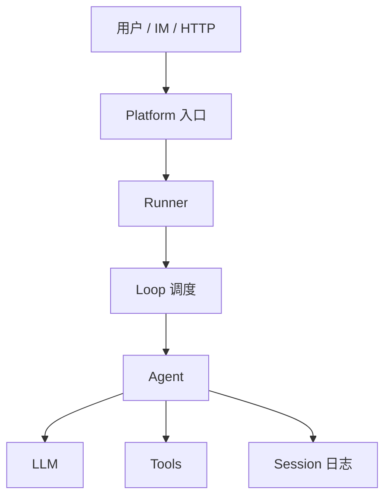
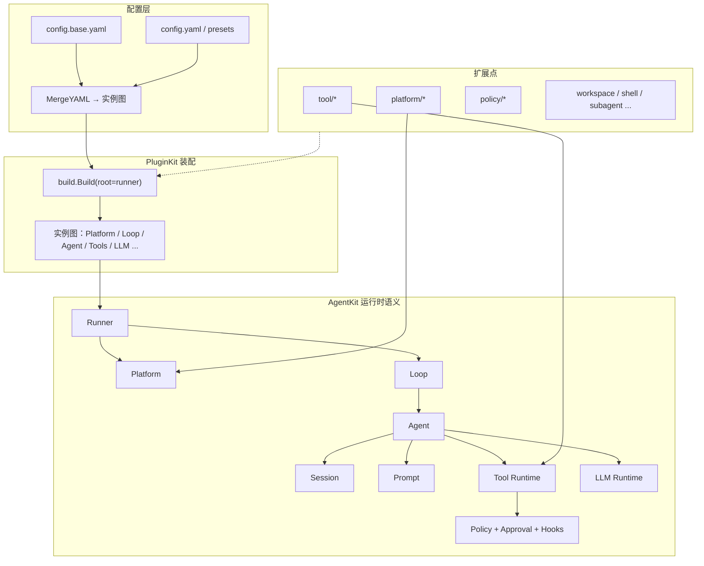
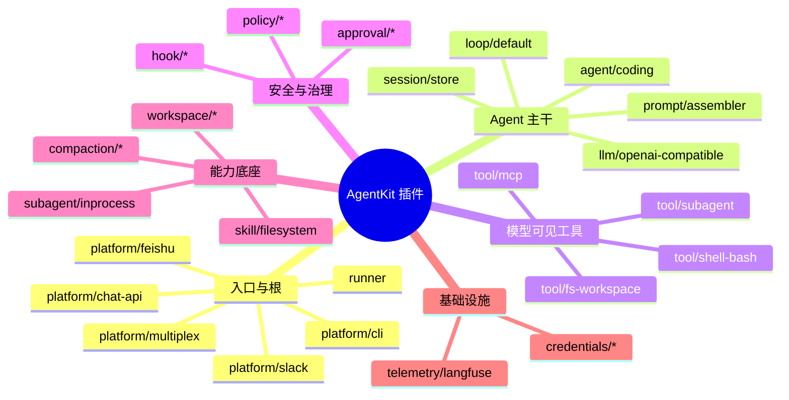
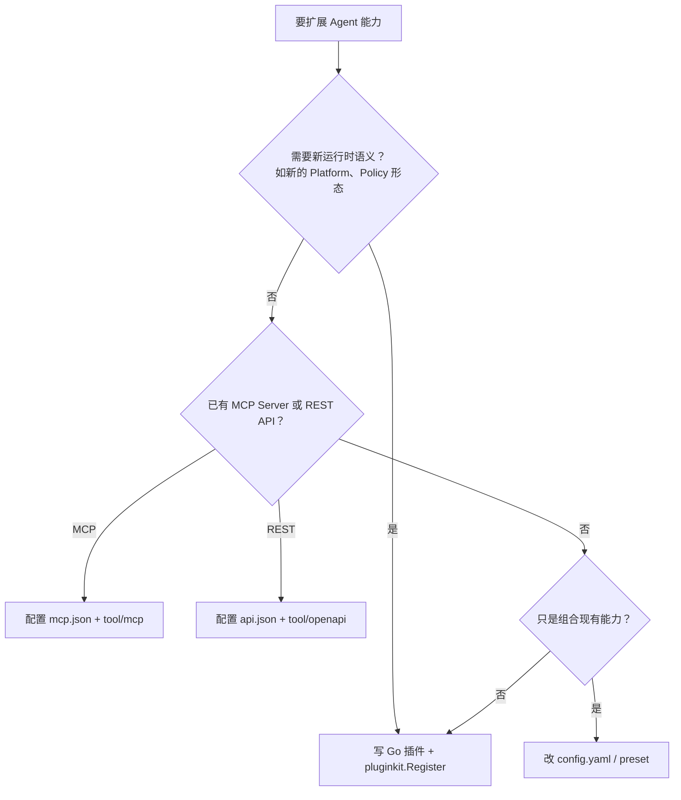
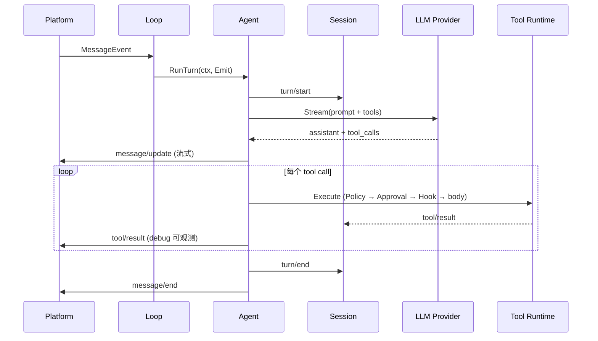

# AgentKit 技术分享：插件化 Go Agent 运行时

> 面向团队内部分享。深入设计见 [go-agent-harness-architecture.zh.md](go-agent-harness-architecture.zh.md)，Kind 全表见 [plugin-catalog.zh.md](plugin-catalog.zh.md)。

## 1. 我们在解决什么问题

做一个可用的 Coding Agent，表面上是「接一个大模型 + 写几个工具」，实际上要同时搞定：

- **入口多样**：CLI、HTTP、Slack、飞书……同一套 Agent 逻辑要能挂到不同通道
- **能力可组合**：读文件、跑 shell、搜网页、调 MCP、委派子 Agent……按需开关
- **安全可控**：哪些命令能跑、哪些路径能碰、要不要人工审批
- **可审计、可恢复**：崩溃后 session 不能坏；模型看到什么，日志里必须能重建

AgentKit 的定位：**用配置组装 Agent 运行时，用 Go 插件扩展能力**——而不是在业务代码里硬编码一整套 Agent 循环。



---

## 2. 什么是「插件」

在 AgentKit 里，**插件 ≠ 动态加载的 `.so` 文件**，而是：

> 一个在 `init()` 里向 `pluginkit` 注册、通过 YAML 配置实例化、由构造期 `Deps` 注入依赖的 **Go 组件**。

### 2.1 三个层次，别混为一谈

| 概念 | 是什么 | 例子 |
|---|---|---|
| **Plugin Kind** | 代码里注册的类型名 | `tool/fs-workspace`、`platform/slack` |
| **Plugin Instance** | 配置里的一次使用（有 id） | `tools.default`、`platform.feishu` |
| **Capability Interface** | 运行时角色接口 | `agentkit.Tool`、`agentkit.Platform` |

Kind 用 `pluginkit.Register(kind, New)` 登记；配置用 `use: <kind>` 引用；`build.Build` 根据 `deps` 拼出整张**实例图**，从 `runner` 根节点往下构造。

### 2.2 插件长什么样

每个插件通常就是：**Config + Deps + New 构造函数**。

```go
func init() {
    pluginkit.Register("tool/my-tool", New)
}

func New(cfg Config, deps Deps) (agentkit.Tool, error) {
    return agentkit.NewTool[Input, string]("my_tool", handler).Build()
}
```

规则很简单：

- `init()` **只注册**，不连网、不读配置、不起 goroutine
- 依赖写在 `Deps` struct 里，**不用**全局变量或 `context` 里偷拿服务
- 需要生命周期（监听端口等）实现 `StartStop`，由 Runner 统一启停
- **返回值类型决定挂载槽位**——返回 `agentkit.Tool` 就进工具列表，返回 `agentkit.Platform` 就是消息入口

### 2.3 配置即装配

用户不写 Go，只写 YAML 覆盖默认图。两层合并：

| 层 | 文件 | 作用 |
|---|---|---|
| L0 | `config.base.yaml` | 随版本发布的默认实例图 |
| L1 | `config.yaml` / preset | 用户按需覆盖 model、工具集、平台 |

```yaml
runner.default:
  use: runner
  deps:
    platform: platform.default
    loop: loop.default

agent.coder.default:
  use: agent/coding
  deps:
    llm: llm.default
    tools: tools.default
    sessionStore: sessionStore.default
```

改配置 = 换实现、调参数、增删依赖边——**不动 Agent 核心循环代码**。

### 2.4 插件 vs 非插件

有些东西故意**不是**插件，因为语义要稳定：

| 组件 | 是否插件 | 原因 |
|---|---|---|
| Tool Runtime、LLM Runtime、Policy Runtime | 内置 | 执行顺序、Session 写入、审批链路是平台契约 |
| `agents/*.md` 子 Agent 定义 | 磁盘文件 | 加一个文件即加一个子 Agent，不必改实例图 |
| MCP / OpenAPI 工具 | 配置驱动 | `mcp.json` / `api.json` 暴露动态工具，多数场景不必写 Go |

---

## 3. 为什么选择 Go

### 3.1 类型即契约

Agent 工具要生成 JSON Schema、做参数校验、在测试里 mock——Go 的 struct + tag 天然适合：

```go
type ReadInput struct {
    Path  string `json:"path" jsonschema:"File path relative to workspace"`
    Limit int    `json:"limit,omitempty"`
}
```

`agentkit.NewTool[ReadInput, string](...)` 把类型推导成 schema 和执行路径，**减少「字符串拼 JSON」类 bug**。

### 3.2 构造期注入，运行期零反射查表

`pluginkit/build` 在启动时根据实例图做拓扑排序和类型检查：

- 缺依赖 → 构建失败，而不是运行到一半 panic
- 依赖环 → 构建失败（例如子 Agent 的 `tools` 不能指回带 `delegate` 的主 runtime）

这比运行时 service locator 更适合**长寿命的 Agent 进程**。

### 3.3 单二进制，易部署

- 开发：`go run ./cmd/agent`
- 生产：一个二进制 + YAML + 工作目录，容器友好
- 不解释 `.go` 源码；插件是**编译进二进制**的，不是热插拔脚本

### 3.4 并发模型贴合 Agent Loop

- 同 session 内 turn 保序，跨 session 可有限并发
- `context` 传递取消、SessionID、OutboundEmit
- goroutine + channel 做调度，与 IM/HTTP 长连接场景匹配

### 3.5 与生态对齐

- `slog` 结构化日志
- 标准库 `net/http` 做 chat-api
- 与 OpenAI / Anthropic 等 HTTP API 对接直接
- 测试用 `testing` + 内存 Session，无需重型框架

**不选 Go 的场景**：已有大量 Python/TS 业务逻辑、强依赖 Jupyter 生态时，更适合用 MCP 把能力挂进来，而不是重写为 Go 插件。

---

## 4. 总体架构一图流



**一句话**：PluginKit 管「怎么装」，AgentKit 管「Agent 是什么意思」。

---

## 5. 当前插件体系（73 个 Kind）

命名规范：`<role>/<name>[/<variant>`，全小写连字符。完整表格见 [plugin-catalog.zh.md](plugin-catalog.zh.md)。

### 5.1 按角色分类



### 5.2 三类使用者

| 角色 | 做什么 | 典型产物 |
|---|---|---|
| **插件作者** | 写 Go，注册新 Kind | `tool/xxx`、`platform/xxx` |
| **应用组装者** | 写 YAML，选 preset | `config.yaml`、`presets/coding.yaml` |
| **运行时维护者** | 保 Session / Loop / Policy 语义稳定 | 架构文档、E2E 测试 |

### 5.3 工具插件的三种形态

| 返回类型 | 挂载位置 | 适用 |
|---|---|---|
| `agentkit.Tool` | `deps.tools` | 单工具，如 `finish`、`todo` |
| `agentkit.ToolPack` | `deps.toolPacks` | 一组相关工具，如 `fs-workspace`（read/write/grep…） |
| `agentkit.ToolProvider` | `deps.dynamicTools` | 运行时发现，如 `tool/mcp`、`tool/openapi` |

**扩展工具不一定写 Go**：配好 `mcp.json` 或 `api.json` 即可。

### 5.4 已落地 vs 规划

**已落地**（可开箱用）：Coding 闭环、自主运行、多租户 workspace、Slack/飞书/chat-api、子 Agent 委派、MCP/OpenAPI 动态工具、Langfuse、ACP 远程 Agent、定时任务等。

**已知缺口**（见 [roadmap.zh.md](roadmap.zh.md)）：`StartStop` 关停收尾、follow-up 持久化、`session/sqlite` 检索、`policy/network-deny` 独立插件、子 Agent 并行 fan-out 等。

---

## 6. 如何扩展

### 6.1 决策树：我该用哪种方式？



### 6.2 新增 Go 工具插件（最常见）

**步骤：**

1. 在 `plugins/tool/<name>/` 实现 `Config`、`Deps`、`New`
2. `register.go` 里 `pluginkit.Register("tool/<name>", New)`
3. 执行 `go generate ./...`（把包链进 `plugins/all.go`）
4. 在 `config.base.yaml` 或用户配置里把实例挂到 `tools/runtime` 的 `deps.tools` / `toolPacks`
5. 写单元测试 + 可选冒烟 preset

**单工具最小示例：**

```go
package greet

import (
    "context"
    "fmt"

    "github.com/lengzhao/agentkit"
    "github.com/lengzhao/pluginkit"
)

type Input struct {
    Name string `json:"name" jsonschema:"Who to greet"`
}

func init() {
    pluginkit.Register("tool/greet", New)
}

func New() (agentkit.Tool, error) {
    return agentkit.NewTool[Input, string]("greet", func(_ context.Context, in Input) (string, error) {
        return fmt.Sprintf("Hello, %s!", in.Name), nil
    }).Description("Say hello.").Build()
}
```

更完整的模板与测试约定见 Skill：`skills/tool-developer/SKILL.md`。

### 6.3 新增 Platform（新入口）

实现 `agentkit.Platform`：

- `Receive`：把外部消息转成 `MessageEvent`（**必须带 SessionID**）
- `Send`：把 `OutboundEvent` 写回外部（流式文本、tool 结果、权限弹窗等）

注册为 `platform/<name>`，在 `runner` 的 `deps.platform` 或通过 `platform/multiplex` 聚合多个入口。

### 6.4 新增 Policy / Hook

| 类型 | 接口 | 能做什么 | 不能做什么 |
|---|---|---|---|
| **Policy** | `agentkit.Policy` | `allow` / `deny` / `ask` | 不能偷偷改 tool 输入 |
| **Hook** | `agentkit.HookProvider` | 观察、截断、改写已 allow 的调用 | 不能翻转 deny |

拒绝必须走 Policy；观察改写走 Hook。详见架构文档 [§5.5 工具执行路径](go-agent-harness-architecture.zh.md#55-工具执行路径)。

### 6.5 子 Agent：文件即扩展

不加 Go 插件，在 `.agentkit/agents/*.md` 写 frontmatter + system prompt：

```markdown
---
description: 只读调研，返回结论与文件行号
tools: [read, grep, find, ls, finish]
---
你是调研子 agent……
```

主 Agent 通过 `delegate` 工具委派。详见 [guides/subagent.zh.md](guides/subagent.zh.md)。

### 6.6 配置扩展（零代码）

常见操作：

```yaml
# 换模型
llm.default:
  config:
    model: gpt-4o

# 只读工具集
tools.readonly:
  use: tools/runtime
  deps:
    tools:
      - tool.fs-workspace.readonly.default

# 多平台共存
platform.default:
  use: platform/multiplex
  deps:
    platforms: [platform.cli, platform.chat-api]
```

合并规则（覆盖 / `+` 追加 / `-` 删减 / `extends` / `${env:VAR}`）见 [guides/config-simplification.zh.md](guides/config-simplification.zh.md)。

---

## 7. 一条 Turn 怎么走（帮助理解插件边界）



插件作者通常只关心 **Tool body**、**Platform 适配**、**Policy 判定**、**Prompt section**——Loop 与 Session 语义由平台保证。

---

## 8. 设计原则（分享时可强调的「底线」）

1. **模型可见即记录**：进模型的内容必须能从 Session 重建
2. **构造期注入**：依赖在 `Deps` 里声明，请求路径不查全局 registry
3. **类型优先**：工具参数用 Go 类型，不用 `map[string]any` 做主路径
4. **先单包后拆分**：只有一个实现时允许单文件；多个 consumer 再拆 cap 接口
5. **安全分平面**：可见性 → Policy → Approval → Hook → 执行，顺序固定
6. **配置描述图，代码实现能力**：YAML 选型和连线，Go 实现行为

---

## 9. 快速上手 Demo

```sh
# 交互式 CLI
export OPENAI_API_KEY=sk-...
go run ./cmd/agent

# 项目 Coding（读写在 workspace 内）
go run ./cmd/agent -config presets/coding.yaml "列出目录并总结 README"

# 无 API Key 冒烟
go run ./cmd/agent -config presets/coding-smoke.yaml "hello"

# HTTP 调试台 + SSE
go run ./cmd/agent -config presets/chat-api.yaml

# 子 Agent 冒烟
go run ./cmd/agent -config presets/subagent-smoke.yaml "调研一下"

# 新增插件后刷新 import
go generate ./...
```

---

## 10. 延伸阅读

| 文档 | 适合谁 |
|---|---|
| [plugin-catalog.zh.md](plugin-catalog.zh.md) | 查 Kind 全表与 config 字段 |
| [go-agent-harness-architecture.zh.md](go-agent-harness-architecture.zh.md) | 深入 Runner / Session / Policy 语义 |
| [guides/tools.zh.md](guides/tools.zh.md) | MCP、OpenAPI、网络工具 |
| [guides/subagent.zh.md](guides/subagent.zh.md) | 子 Agent 委派 |
| [guides/platform-interaction.zh.md](guides/platform-interaction.zh.md) | 权限、HIL、chat-api 交互 |
| [roadmap.zh.md](roadmap.zh.md) | 现状缺口与优先级 |
| `skills/tool-developer/SKILL.md` | 写工具插件的操作手册 |
| `skills/agentkit-config/SKILL.md` | 写配置的操作手册 |

---

## 附录：分享提纲建议（30 分钟版）

| 时间 | 内容 |
|---|---|
| 5 min | §1 问题背景 + §4 架构一图 |
| 8 min | §2 什么是插件（Kind / 实例 / 配置装配） |
| 5 min | §3 为什么 Go |
| 7 min | §5 当前插件体系 + §6 如何扩展（带一个 tool 例子） |
| 3 min | §7 Turn 流程 + §8 设计原则 |
| 2 min | §9 Demo + Q&A |

如需 15 分钟版：压缩 §3、§5 为表格口述，Demo 只跑 `coding-smoke`。
