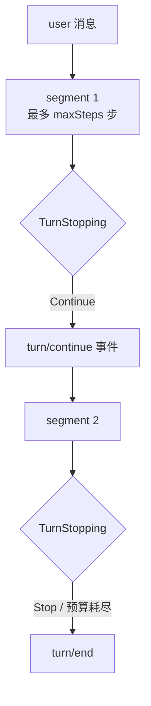

# 自主运行

本文描述 AgentKit 让 Agent **无人干预地连续推进一个任务** 的机制：turn 如何延展、凭什么判断该停、以及无人值守时靠什么守住危险操作。

相关文档：[go-agent-harness-architecture.zh.md §5.4](go-agent-harness-architecture.zh.md#54-typed-hooks)、[plugin-catalog.zh.md](plugin-catalog.zh.md)。

## 1. Turn / Segment 模型

引入 `TurnStopping` 之前，turn 在 assistant 不再调用工具时立即结束，`maxSteps` 是无法延展的硬上限。现在一个 turn 由若干 **segment** 组成：



段末进入 `TurnStopping` 的三种原因：

| `Reason` | 触发条件 |
|---|---|
| `no-tool-calls` | assistant 只回文本，没有工具调用 |
| `step-limit` | 本 segment 的 `maxSteps` 用完，任务还没做完 |
| `budget` | 硬预算已耗尽（此时 `Continue` 被忽略） |

## 2. 停/续契约

```go
type TurnStopping struct {
    Reason   TurnStopReason
    Steps    int             // 本 turn 累计步数
    Segments int             // 已续跑次数
    Budget   BudgetState
    Messages []ModelMessage  // 派生历史，只读
    Continue []ModelMessage  // 追加即续跑
    Stop     bool            // 强制收尾
    StopReason string
}
```

三条不变量：

1. **`Stop` 优先于 `Continue`** —— 任一 hook 说停就停。
2. **硬预算优先于 hook** —— `Budget.Exhausted` 时 `Continue` 被忽略。预算耗尽仍会调用 hook，让驱动有机会记录状态。
3. **续跑消息必须落盘** —— Agent 把注入内容写成 `turn/continue` 事件，`DeriveMessages` 再回放成 user 消息。因此续跑既是审计记录也是模型可见来源，满足 "Model-visible ⟺ Logged"。

`BudgetState` 里未设限的维度报 `-1`，与"额度为 0"区分开：

```go
type BudgetState struct {
    RemainingSteps, RemainingContinuations int
    RemainingSeconds, RemainingTokens      int
    SoftExhausted bool  // 越过 softRatio，该收尾了
    Exhausted     bool  // 硬上限到顶
}
```

## 3. 预算分层

`agent/coding` 的 `config.budget`：

```yaml
budget:
  maxContinuations: 30      # 单 turn 内最多续跑次数；0（默认）= 不自主
  maxTotalSteps: 300        # 跨 segment 的总步数
  wallClockSeconds: 7200    # 墙钟
  maxTotalTokens: 2000000   # 累计 token（来自 usage 事件）
  softRatio: 0.8            # 消耗到 80% 时置 SoftExhausted
```

两级刹车：**软阈值**让驱动改注入"收尾"提示，模型自己把工作收口；**硬上限**直接停，不给模型商量的机会。

`maxContinuations` 默认为 0，所以没配 budget 的 agent 行为与引入本机制之前完全一致，即使挂了 turn-stopping hook 也不会自主续跑。

token 计量来自 LLM provider 的 usage：`llm/openai-compatible` 两种 API 模式都会带出 usage（chat 走 `stream_options.include_usage`，responses 走 `response.usage`），Agent 每步写一条 `usage` 事件并累加进预算。provider 不报 usage 时 token 维度自然失效，其余三个维度照常生效。

## 4. 完成判定：todo + finish

停止信号不靠模型自述，而是两个可审计的事件：

| 工具 | 事件 | 作用 |
|---|---|---|
| `tool/todo` | `todo/update` | 任务清单快照。还有非 `done` 项就说明有活没干完 |
| `tool/finish` | `run/finish` | 显式收尾（`completed` / `blocked`），自主运行唯一的干净退出 |

`hook/turn-continue` 每次在段末读一遍 session 事件，按此顺序裁决：

```
已 run/finish            -> Stop
同一工具同参连续 N 次    -> Stop（stalled，默认 N=3）
Budget.Exhausted         -> 交给 Agent 停
Segments >= 上限         -> Stop
还有 pending todo        -> Continue（正文带未完成清单）
requireFinish 且未 finish -> Continue
否则                     -> Stop
```

所有信号都来自 session 日志，所以一次自主运行的每个"为什么继续/为什么停"都能从 transcript 复原。

长跑时用 `/status` 看运行态：续跑上限、本轮 token、当前上下文大小、是否已 finish、任务清单。

## 5. 上下文压缩：按 token 阈值触发

消息条数是很差的代理指标 —— 20 步 grep 输出可能比 200 轮短对话还大。`compaction/token-limit` 按上下文实际大小门控内层压缩链：

```yaml
compaction.token-limit.default:
  use: compaction/token-limit
  config:
    contextWindow: 200000   # 阈值 = contextWindow × triggerRatio
    triggerRatio: 0.7       # 留 30% 给本轮回复和下一个工具结果
    # maxTokens: 140000     # 也可直接给绝对阈值，优先于上面两项
    charsPerToken: 3        # 无 usage 可读时的兜底估算
  deps:
    services:
      - compaction.summary.default
```

越过阈值时它以 `Force=true` 调用内层服务，因此 `compaction/summary` 自己的 `minMessages` 门槛被跳过 —— **token 阈值本身就是那道门**。调用方已经 `Force`（手动 `/compact`、overflow 兜底）时无条件透传。

估算取两个信号的较大值：

| 信号 | 准确性 | 时效 |
|---|---|---|
| 最近一条 `usage` 事件的 prompt+reply | 精确（provider 实测） | 落后一步 |
| 字符数 / `charsPerToken` | 粗糙（中文、代码会低估） | 覆盖当前历史 |

取 max 的效果是**宁可压缩得早一点** —— 这是两种误差里代价小的那个。压缩后下一步 usage 变小，门自然重新关上。

**挂载位置有两处，都要配**：`hook/before-step.deps.services`（每步触发的路径）和 `agent.deps.compaction`（overflow 报错兜底路径）。`presets/autonomous.yaml` 两处都换成了 token-limit；L0 `config.base.yaml` 保持按条数触发的保守默认，要切换就照上面覆盖这两个实例。

## 6. 崩溃恢复

进程被 SIGKILL、panic、断电时，session 日志会停在半途：`turn/start` 没有 `turn/end`，更要命的是 assistant 消息带着 `tool_calls` 却没有对应的 tool 结果。**这种历史 provider 会直接拒收**（OpenAI 400：带 tool_calls 的 assistant 消息必须跟 tool 回复），也就是说崩溃的会话不修就再也跑不起来了。

两层防护：

| 层 | 位置 | 作用 |
|---|---|---|
| 运行时安全网 | `DeriveMessages` | 任何没有回复的 tool call 都补一条"被中断"的 stand-in 结果。派生历史是模型可见内容的唯一出口，所以补在这里，全部消费方（含 `/compact`、summary）都安全 |
| 持久化修复 | Agent 每个 turn 开始前 | 补齐 orphan `tool/result`、关掉悬空 `step/end`、写 `turn/end`，最后记一条 `session/recovery` 事件 |

补出来的 tool 结果是**模型可见**的，内容明确写着"被中断，需要的话重跑" —— 模型需要知道那次调用是被切断而不是静默成功了。

修复在每个 turn 开始前跑（不是只在启动时），因为同一个 session 可能被任何进程在任何时刻接手。已经干净的日志上它是 no-op，可重复执行。

```
$ 崩溃后重新运行
  1 turn/start          <- 崩溃前
  2 user/message
  3 step/start
  4 assistant/message   <- 带 tool_calls，没有结果
  5 tool/result         <- 修复：被中断
  6 step/end            <- 修复：关掉悬空 step
  7 turn/end            <- 修复：关掉 turn
  8 session/recovery    <- 审计：{"orphanResults":1,"closedStep":0,...}
  9 turn/start          <- 新 turn 正常开始
```

配合 todo 状态，恢复后的"接着干"是自然的：任务清单还在日志里，`hook/turn-continue` 看到 pending 项就继续推进。

优雅退出（SIGINT / SIGTERM）不走这条路：`turn/end` 写在 `defer` 里且用 `context.WithoutCancel`，正常收到信号时会照常落盘。

## 7. 守护外壳：worker 与 timer

前面几节让 agent 能自己把一个任务推完，这一节是"谁来发起任务"。

### 7.1 三种 headless 形态

| 配置 | 形态 | 用途 |
|---|---|---|
| `platform/worker` | 跑完 task 列表就 EOF 退出 | 批处理、CI、系统 cron 的执行体 |
| `platform/worker` + task 带 `cron` | 常驻，按 cron 表达式发起 turn | 日历型定时（[§7.4](#74-日历型定时worker-的-cron-模式)），agent 可自主排期 |
| `platform/timer` | 常驻，按固定间隔发起 turn | 简单的"每 N 分钟看一眼" |

它们都**从不读 stdin**。这是它们与 `platform/cli once=true` 的关键区别：在 systemd、cron、容器、CI 里 stdin 是 `/dev/null`，CLI 平台会挂在等输入上。

输出约定：**结果走 stdout，进度与诊断走 stderr**。所以 `output: json` 模式下 stdout 是干净的 JSON Lines，可以直接 `| jq`：

```sh
agent -config presets/autonomous.yaml,presets/worker.yaml "巡检" 2>/dev/null | jq -r 'select(.type=="message/end")'
```

`stream: false`（默认）不回显 token 增量，只在 `message/end` 打印最终结果 —— 无人值守要的是答案不是打字过程。

### 7.2 timer 的调度语义

```yaml
platform.default:
  use: platform/timer
  config:
    everySeconds: 900
    prompt: "巡检当前工作区……"
    immediate: true      # 启动即跑第一次，重启后立刻干活
    maxRuns: 0           # 0 = 跑到收到信号
    sessionMode: fresh   # 每个 tick 一个独立 session
```

两条刻意的设计：

- **tick 锚定启动时间**（`start + n × interval`），不是"上一个 turn 结束后再等一个间隔"。所以一个跑了 70 秒的 turn 不会让 60 秒的节奏永久漂移，下一次等待自动缩短到 50 秒。
- **错过的 boundary 直接跳过，不排队**。turn 跑了 5 分钟、间隔 1 分钟时，不会攒出 5 个 tick 连着跑 —— 攒一堆过期 tick 再补跑从来不是"定时"的本意。跳过多少会打一条 `WARN`。

### 7.3 session 模式：为什么默认 fresh

`fresh` 给每个 task / tick 独立 session，id 形如 `daemon:20260824-150135.197-p58317-1:run-2`（启动时间戳 + pid + 进程内序号）。三段各自补另外两段的漏：时间戳便于排序和阅读，pid 区分同一毫秒启动的并发进程，序号区分同一进程里的多个 timer（比如 multiplex 挂两个）。少任何一段，"新" session 都可能悄悄打开旧历史。

`fixed` 复用一个 session，能跨 tick 记事，**但必须配 `compaction/token-limit`**：每天巡检往同一份历史里追加，几天后必然撑爆窗口；即使配了压缩，也只是把无限增长换成无限摘要。所以默认是 fresh。

### 7.4 日历型定时：worker 的 cron 模式

`platform/timer` 只有固定间隔，表达不了"工作日早上 9 点"。worker 的 task 带上 `cron` 就变成常驻定时模式：

```yaml
platform.default:
  use: platform/worker
  config:
    tasks:
      # 无 cron：启动时立刻跑一次，跑完才进入 cron 等待
      - prompt: "启动巡检：看看工作区状态"
      # 带 cron + prompt：注册成定时 agent 任务
      - id: weekday-morning
        cron: "0 9 * * 1-5"
        prompt: "工作日早班巡检"
      # 带 cron + script：直接执行 bash 脚本，不经过 agent
      - id: nightly
        cron: "0 3 * * *"
        script: scripts/nightly.sh
    pollSeconds: 30
  deps:
    schedule: schedule.default   # 没有它，带 cron 的 task 是配置错误而不是被静默忽略
    workspace: workspace.default # script 路径通过 workspace 解析
    shell: shell.bash.default    # script 任务通过 shell 执行
```

支持完整 5 段式（分 时 日 月 周）：`*`、`N`、`a-b`、`a,b,c`、`*/n`、`a-b/n`，月份和星期可用 `jan` / `mon` 之类的名字，另有 `@hourly` / `@daily` / `@weekly` / `@monthly` / `@yearly`。星期 0 和 7 都是周日。

两个容易被忽略的语义，都按标准 cron 实现并有测试锁定：

- **日 和 星期同时限定时取"或"**。`0 0 1 * 5` 是"每月 1 号**或**任意周五"，不是两者都满足。这是最常被手写解析器搞错的一条。
- **错过的 boundary 直接跳过，不补跑**。进程停了 4 小时再起来，每小时的 job 只跑一次，不会连补 4 次 —— 与 timer 同一个原则。

`cron` 表达式在启动时就校验，写错立刻报错而不是安静地永不触发。

**和系统 cron 怎么选**：进程内 cron 不抗机器重启，但换来两件系统 cron 做不到的事 —— job 表持久化且 agent 能自己增删（见下节），以及不必为每次触发付进程启动 + 配置装配的开销。要抗重启就把这个进程交给 systemd（`Restart=always`）。纯粹的"每天跑一次然后退出"仍然可以用系统 cron + batch 模式的 worker：

```cron
0 9 * * * cd /path/to/repo && agent -config presets/autonomous.yaml,presets/worker.yaml "跑日常巡检" >> ~/agent.log 2>&1
```

### 7.5 agent 自主排期：tool/schedule

job 表是一个能力（`cap/schedule`），worker 的 cron 引擎和 `tool/schedule` **共用同一个 registry 实例**。于是 agent 可以给自己安排后续工作：

```
schedule(op="add", cron="*/30 * * * *", prompt="再看一眼那个部署有没有恢复", note="等 SRE 回复")
```

因此：

- 新加的 job **不用重启就会被拾起**，最迟一个 `pollSeconds` 之后（这也是 worker 轮询而不是直接睡到下一个 boundary 的原因）。
- job 表落在工作区的 `schedule.json`，**跨重启存活**。写入走临时文件 + rename：进程在写一半被杀，回来不会读到截断的 job 表。
- `nextRun` 由工具算好返回，agent 不必自己解析 cron。

job 分两个来源，这个区分是必要的：

| source | 归属 | 重启时 |
|---|---|---|
| `config` | preset 声明 | 每次启动按 preset 重新对账：preset 里删掉的 job 会从 registry 移除 |
| `agent` | 运行时由 `tool/schedule` 创建 | 完全不受 config 对账影响 |

少了这个区分，改一次 preset 就会把 agent 给自己排的所有后续工作删干净。对账时**保留原有的 `lastRun` 锚点** —— 否则一个每几分钟重启一次的进程会把 `0 9 * * *` 永远往后推。

`maxJobs`（默认 32）限制 agent 能排的数量，config 声明的 job 不占这个额度。

上手：

```sh
go run ./cmd/agent -config presets/autonomous.yaml,presets/cron.yaml
```

### 7.6 单个 turn 崩了不会带走进程

Runner 对每个 turn 做 panic 隔离：panic 被记成带堆栈的 `ERROR` 日志 + 该 session 的 error 事件，然后继续服务下一个事件。被打断的 turn 会留下悬空的 `turn/start`，由 [§6](#6-崩溃恢复) 的机制在下个 turn 修掉。一个 nil map 写入不该带走一个跑了三天的守护进程。

### 7.7 overlay 可以链式叠加

`-config` 接受逗号分隔的多个 overlay，按顺序合并，后面的覆盖前面的：

```sh
agent -config presets/autonomous.yaml,presets/daemon.yaml
```

所以 `worker.yaml` / `daemon.yaml` / `cron.yaml` 都是**薄 overlay**，能力栈从 `autonomous.yaml` 叠加，不必每个 preset 重述整张图。反过来说：单独用它们且未链 `autonomous.yaml` 时，L0 无 `approval/auto-allow`，policy ask 会走 Platform Permission 等人 —— 无人值守一定要一起链。`cron.yaml` 还扩展了 autonomous 的工具集（加 `tool/schedule`），所以它连单独装配都不成立，`config/presets_test.go` 里把它标为 chain-only。

### 7.8 并发分发

Runner 可以让**不同 session** 的 turn 并行，`runner.config.maxConcurrentTurns` 控制上限：

```yaml
runner.default:
  use: runner
  config:
    maxConcurrentTurns: 4
    shutdownTimeoutSeconds: 30
```

四条保证：

| 保证 | 为什么需要 |
|---|---|
| **同一 session 内严格保序** | Loop 也按 session 加锁，但用的是普通 mutex，而 **Go 的 mutex 不保证 FIFO** —— 同一会话的两条消息可能乱序执行。所以顺序在调度层用 per-session 队列显式保证，不依赖锁 |
| **并发上限可控** | 每个请求携带且仅携带一个 slot，dispatch 结束归还；入队请求不需要再抢 slot，所以不会死锁 |
| **读取不超前** | 入队前先取 slot，于是 `in-flight + queued ≤ 上限`。等于 1 时不会提前读走下一条事件，交互式 CLI 的 UX 与全串行完全一致 |
| **关停不截断 turn** | 退出前等进行中的 turn 落盘 `turn/end`，上限 `shutdownTimeoutSeconds`。被截断的 turn 会留下悬空 `turn/start`，虽然 [§6](#6-崩溃恢复) 能修，但能不留就不留 |

**默认是 1（串行），这是有意的**：不同 session 的 turn 共享同一个工作区，两个 agent 并发跑 `go build` 或改同一个文件是真实风险。会话之间真正独立的传输（多频道 IM、HTTP）才该往上调。实测 4 个 2 秒工作量：串行 8.2s，`maxConcurrentTurns: 2` 下 4.1s。

对第三方 Platform 的要求：`Send` 必须支持并发调用（每个 turn 从自己的 goroutine 发出），`Receive` 仍只由单个 goroutine 调用。

## 8. 无人值守的安全边界

交互式 Platform Permission 会阻塞等人，`approval/auto-deny` 会让自主跑全程被拒，所以无人值守用 `approval/auto-allow`。

**关键约束**：`auto-allow` 不做任何过滤，它只是不阻塞。唯一的 enforcement 是 Policy Plane。因此它必须与下面两个 policy 同时挂载：

| Policy | 作用 |
|---|---|
| `policy/shell-allowlist` | 命令前缀白名单，`strict: true` 时白名单外一律 deny。链式命令（`&&`、`\|\|`、`;`、`\|`）每一段都要命中白名单，`git status && rm -rf /tmp/x` 不会因为前缀合法而放行 |
| `policy/path-denylist` | 写路径 glob 黑名单，默认拒 `.git/**`、`**/.env*`、`**/.ssh/**`、`**/*.pem` |

单独启用 `auto-allow` 等于对模型放开一切。调整 allow 列表前先想清楚这台机器上"最坏情况"能做什么。

## 9. 上手

```sh
# 无 API Key 冒烟：scripted LLM 走完 "todo -> 续跑 -> finish" 全流程
go run ./cmd/agent -config presets/autonomous-smoke.yaml "整理这个目录并收尾"

# 交互式自主跑（需要 OPENAI_API_KEY）
go run ./cmd/agent -config presets/autonomous.yaml "<一个需要多轮的任务>"

# headless 一次性任务（不读 stdin，适合 cron / CI / 容器）
go run ./cmd/agent -config presets/autonomous.yaml,presets/worker.yaml "<任务>"

# 常驻守护进程，按固定间隔自己醒来；Ctrl+C / SIGTERM 停止
go run ./cmd/agent -config presets/autonomous.yaml,presets/daemon.yaml

# 常驻 cron 守护进程；agent 还能用 tool/schedule 给自己排后续工作
go run ./cmd/agent -config presets/autonomous.yaml,presets/cron.yaml
```

`presets/autonomous.yaml` 是 L1 overlay，改动集中在六处：`platform` once、`agent` budget、`hooks` 加 turn-continue、`tools` 加 todo/finish 与两个 policy、`approval` 换 auto-allow、压缩改按 token 阈值触发。

事后检查一次自主运行：

```sh
# 续跑次数、任务变更、收尾状态都在 session 事件里
python3 -c "
import json, glob, os, collections
f = max(glob.glob(os.path.expanduser('~/.agentkit/sessions/*.jsonl')), key=os.path.getmtime)
print(collections.Counter(json.loads(l)['Type'] for l in open(f)))
"
```

## 10. 尚未实现

仍缺的长期运行能力：

- **HTTP / RPC 触发**：`platform/http`、`platform/rpc` 仍未实现，外部系统目前只能通过 OS cron + worker 触发
- **进程级自动重启**：panic 隔离保住了单个 turn，但进程真的挂掉（OOM、被 kill）仍需外部 supervisor（systemd `Restart=always`）兜底
- `telemetry/*` 落地、异步审批、verifier 子 agent 二次确认
