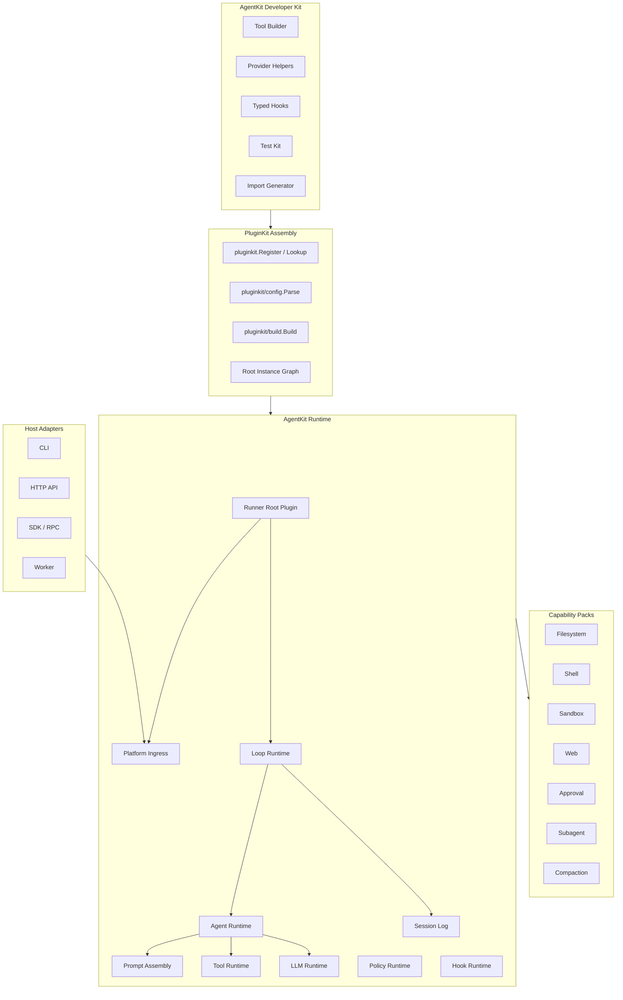
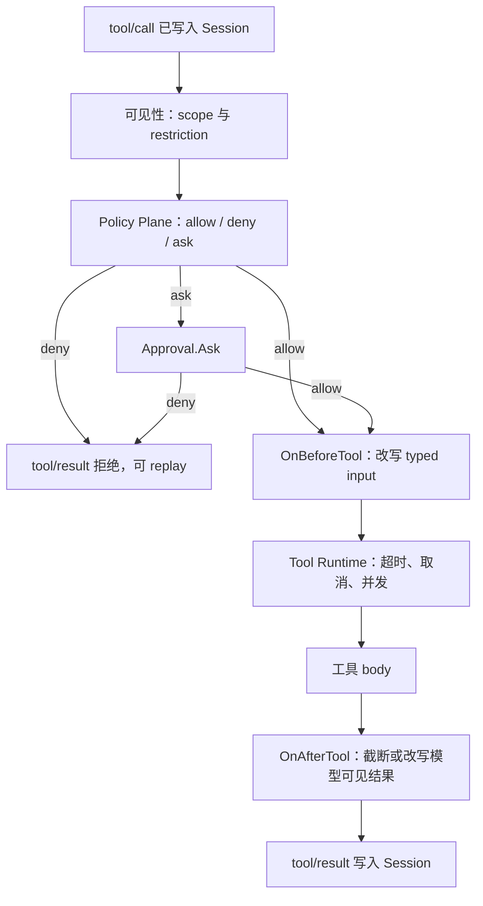
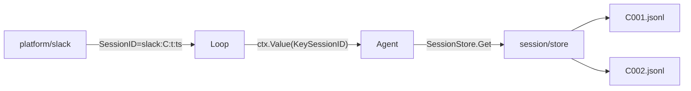

# Go Agent Harness 架构文档

本文描述 `github.com/lengzhao/agentkit` 的 Go Agent 运行时设计。项目使用 `github.com/lengzhao/pluginkit` 作为插件装配基础设施：`pluginkit` 负责插件类型注册、配置解析和实例图构建；`agentkit` 只在其上提供 Agent 语义、运行时接口和开发者体验。

相关参考：[plugin-catalog.zh.md](plugin-catalog.zh.md)（Plugin Kind 目录与分阶段范围）、[roadmap.zh.md](roadmap.zh.md)（现状与规划）。

## 1. 设计目标

平台面向三类使用者：

- **插件作者**：用少量 Go 代码增加工具、模型提供方、策略判定和能力实现。
- **应用组装者**：通过配置选择插件、模型、工具集、权限策略和运行模式。
- **运行时维护者**：保持 Agent Loop、Session、Tool、LLM、Policy 等语义稳定，同时复用 `pluginkit` 的装配边界。

核心原则：

- **复用 pluginkit**：底层插件类型注册使用 `pluginkit.Register`，配置识别使用 `pluginkit/config`，实例图构建使用 `pluginkit/build`。
- **Agent 语义上移**：`agentkit` 不再自建通用 registry、service container 或 Mount 协议，只定义 Tool、LLM、Policy、Hook、Session、Agent 等语义接口。
- **构造期注入**：插件依赖通过 `Deps` struct 注入，字段用 `json` tag 对齐配置中的 `deps`，请求路径不查服务容器。
- **Runner 驱动运行时**：Runner 建模为 root plugin，启动时通过 `build.Build[agentkit.Runner](ctx, graph, "runner")` 构造完整实例图；Platform 负责消息入口，Loop 负责循环调度，Agent 位于 Loop 下方并依赖 LLM / Tools。
- **类型优先**：插件构造函数返回具体类型或接口实现，`pluginkit/build` 做静态和运行时类型检查；工具输入输出继续由 Go 类型表达。
- **模型可见即记录**：任何进入模型请求的内容都必须能从 Session 日志重建。
- **先单包，后拆分**：一个能力只有一个 provider 或 consumer 时允许单包实现；出现多个 provider 或 consumer 时再拆 Definition / Provider / Consumer。

运行时永远不解释 `.go` 源码。开发态使用文件监听触发 `go run` 重启；生产态运行已构建的二进制或容器镜像。

## 2. 核心术语

`agentkit` 的配置模型建立在 `pluginkit` 的实例图之上。用户配置描述要构造哪些实例以及它们之间的依赖，Agent 运行时只消费构造完成后的语义接口。

| 术语 | 含义 |
|---|---|
| **Plugin Kind** | Go 包在 `init()` 中通过 `pluginkit.Register(kind, New)` 注册的插件类型，例如 `runner`、`platform/cli`、`loop/default`、`agent/coding`、`llm/openai`、`tool/read-file`。 |
| **Plugin Use** | 配置中的一次插件使用，包含 `use`、可选 `id`、`config` 和 `deps`。 |
| **Plugin Instance** | `build.Build` 成功构造出的实例，拥有稳定 `id`、`use` 和 Go 值。 |
| **Root Plugin** | 实例图入口。AgentKit 进程的 root id 通常是 `runner`，返回值实现 `agentkit.Runner`。 |
| **Deps** | 插件构造函数的第二个参数 struct，用字段类型和 `json` tag 声明依赖。 |
| **Capability Interface** | Agent 能力的 Go 接口，例如 `workspace.Service`、`shell.Executor`、`llm.Provider`。 |
| **Runtime Component** | Platform、Loop、Agent、Tool、LLM provider、Policy、Hook、Session backend 等被 Runner root 依赖和组合的语义组件。 |
| **Feature** | `agentkit` 配置层的可复用片段，最终会展开为 `pluginkit` 可识别的实例图；Feature 本身不注册 Go 插件类型。 |
| **Resolved Graph** | Preset、Feature、override 合并后的 `pluginkit` 实例图，供构建、诊断和测试使用。 |

`pluginkit` 的三层边界必须保持清晰：

- 根包 `github.com/lengzhao/pluginkit` 只提供 `Register`、`Lookup` 和 `Spec`。
- `github.com/lengzhao/pluginkit/config` 只识别 `PluginUse`，不查注册表、不调用构造函数。
- `github.com/lengzhao/pluginkit/build` 负责根据 root id 构造实例图，做依赖注入、拓扑排序和类型检查，但不解释 Agent 业务字段。

## 3. 插件作者体验

插件作者直接使用 `pluginkit.Register` 登记构造函数。`agentkit` 可以提供辅助构造器，降低 Tool、Policy、Hook 的样板代码，但这些辅助 API 最终仍返回普通 Go 值，由 `pluginkit` 统一装配。

`pluginkit` 支持的构造函数形态固定为：

```go
func New() (T, error)
func New(cfg Config) (T, error)
func New(cfg Config, deps Deps) (T, error)
```

构造函数只做轻量初始化和依赖组装，不读取全局配置、不启动无 owner 的 goroutine、不向全局 bus 注册回调。需要生命周期的组件实现 `agentkit.StartStop`，由 Runner root 在构建完成后统一启动和停止。

### 3.1 工具插件

文件类工具内聚实现读写逻辑，只依赖 `workspace.Service` 解析路径；`cap/filesystem` 仅提供 grep/find 等共享 DTO，不是可替换 Provider。

```go
package fs

import (
    "context"
    "os"

    "github.com/lengzhao/agentkit"
    "github.com/lengzhao/agentkit/cap/workspace"
    "github.com/lengzhao/pluginkit"
)

type Config struct {
    MaxBytes int `json:"maxBytes"`
}

type Deps struct {
    Workspace workspace.Service `json:"workspace"`
}

type ReadInput struct {
    Path string `json:"path" jsonschema:"File path relative to the workspace"`
}

func init() {
    pluginkit.Register("tool/fs-workspace", New)
}

func New(cfg Config, deps Deps) (agentkit.Tool, error) {
    read, err := agentkit.NewTool[ReadInput, string]("read", func(ctx context.Context, input ReadInput) (string, error) {
        abs, err := deps.Workspace.Resolve(ctx, input.Path)
        if err != nil {
            return "", err
        }
        data, err := os.ReadFile(abs)
        if err != nil {
            return "", err
        }
        // truncate, line numbers, etc. omitted
        return string(data), nil
    }).Description("Read a text file from the workspace.").Build()
    if err != nil {
        return nil, err
    }
    return read, nil
}
```

工具插件作者声明自身 kind、配置、依赖和 typed handler。单工具插件返回 `agentkit.Tool`，多工具插件返回 `agentkit.ToolPack`，动态发现工具的插件返回 `agentkit.ToolProvider`。依赖来自 `Deps`，不是从 `context.Context` 或包级变量中查找。`Tool.Call` 返回模型可见的纯文本；JSON Schema 由输入类型生成，执行顺序由 Tool Runtime 控制。

### 3.2 模型提供方

```go
func init() {
    pluginkit.Register("llm/openai-compatible", New)
}

func New(cfg Config) (agentkit.LLMProvider, error) {
    return newProvider(cfg)
}
```

模型提供方只实现流式接口；鉴权、重试、限流、日志和 Session 事件由 `agentkit` 的 LLM Runtime 适配器统一处理。

### 3.3 策略插件

拒绝、询问与允许只通过 Policy Plane 返回 `Decision`。策略插件作为普通 `pluginkit` 实例返回 `agentkit.Policy`，最终由 Agent 依赖并注入统一 Policy Runtime。

```go
func init() {
    pluginkit.Register("policy/deny-dangerous-shell", New)
}

func New() (agentkit.Policy, error) {
    return agentkit.PolicyFunc(evaluateShell), nil
}

func evaluateShell(ctx context.Context, in agentkit.PolicyInput) agentkit.Decision {
    if in.Name != "shell" {
        return agentkit.Allow()
    }
    var args struct {
        Command string `json:"command"`
    }
    if err := in.Decode(&args); err != nil {
        return agentkit.Deny("invalid shell arguments")
    }
    if args.Command == "rm -rf /" {
        return agentkit.Deny("dangerous shell command")
    }
    return agentkit.Allow()
}
```

观察或改写已允许的调用使用 typed hook，见 [5.4](#54-typed-hooks) 与 [5.5](#55-工具执行路径)。hook 不是拒绝通道，插件作者不调用 `next()`。

### 3.4 能力 Provider

只有跨多个插件共享、且需要换实现的能力才注册 Provider。例如工作区根路径解析：

```go
func init() {
    pluginkit.Register("workspace/default", New)
}

type Config struct {
    GlobalRoot string `json:"globalRoot"`
    LocalRoot  string `json:"localRoot"`
}

func New(cfg Config) (workspace.Service, error) {
    return newDefaultWorkspace(cfg)
}
```

Provider 实现 `cap/*` 里的能力接口。Consumer（如 `tool/fs-workspace`、`tool/shell-bash`）通过 `deps` 注入接口，不依赖具体 Provider kind。

## 4. 总体分层



| 层 | 职责 | 稳定性 |
|---|---|---|
| AgentKit Developer Kit | 给插件作者的 Tool、Policy、Hook、测试与 import 生成辅助 | 可以快速迭代 |
| PluginKit Assembly | 注册插件类型、解析实例图、构造 root plugin、注入 deps | 跟随 `pluginkit` |
| AgentKit Runtime | Runner、Platform、Loop、Agent、Session、Prompt、Tools、LLM、Policy、Hooks | 稳定扩展 |
| Capability Packs | 文件、命令、沙箱、Web、审批、子 Agent、压缩 | 可插拔 |
| Host Adapters | CLI、HTTP、SDK、Worker | 可替换 |

## 5. PluginKit 装配模型

AgentKit 不再设计独立 Micro Kernel。装配期稳定性取决于三条不变量：`init()` 只注册 kind 和构造函数；依赖只通过 `Deps` struct 注入；请求路径不做服务定位。

### 5.1 插件注册

插件类型通过 `pluginkit.Register(kind, constructor)` 注册。非法 kind、重复 kind 或不符合签名的构造函数会 panic，适合在 `init()` 中尽早失败。

```go
func init() {
    pluginkit.Register("runner", NewRunner)
    pluginkit.Register("platform/cli", NewCLIPlatform)
    pluginkit.Register("loop/default", NewLoop)
    pluginkit.Register("agent/coding", NewAgent)
    pluginkit.Register("llm/openai", NewOpenAI)
    pluginkit.Register("tool/shell", NewShellTool)
}
```

注册规则：

- `init()` 只调用 `pluginkit.Register`，不读取配置、不连接外部系统、不启动 goroutine。
- `kind` 使用稳定命名，例如 `runner`、`platform/cli`、`loop/default`、`agent/coding`、`llm/openai`、`tool/read-file`、`policy/deny-shell`。
- 同一个 kind 在一个进程内只能注册一次；新增源码插件通过 import 生成器进入依赖图。
- 测试可以直接导入插件包或调用包内导出的 `RegisterForTest` 辅助，但不得绕过 `pluginkit` 另建 registry。

### 5.2 依赖注入

依赖由构造函数的 `Deps` struct 声明。字段类型定义所需接口，`json` tag 对应配置中的 `deps` 键。

```go
type RunnerDeps struct {
    Platform agentkit.Platform `json:"platform"`
    Loop     agentkit.Loop     `json:"loop"`
}

func NewRunner(cfg RunnerConfig, deps RunnerDeps) (agentkit.Runner, error) {
    return agentkit.NewRunner(cfg, deps)
}

type LoopDeps struct {
    Agents []agentkit.Agent `json:"agents"`
}

func NewLoop(cfg LoopConfig, deps LoopDeps) (agentkit.Loop, error) {
    return agentkit.NewLoop(cfg, deps)
}

type AgentDeps struct {
    SessionStore agentkit.SessionStore `json:"sessionStore"`
    LLM          agentkit.LLMProvider  `json:"llm"`
    Tools        []agentkit.Tool       `json:"tools"`
    Policies     []agentkit.Policy     `json:"policies"`
}

func NewAgent(cfg AgentConfig, deps AgentDeps) (agentkit.Agent, error) {
    return agentkit.NewRuntime(cfg, deps)
}
```

对应配置：

```yaml
runner:
  use: runner
  config:
    shutdownTimeout: 10s
  deps:
    platform:
      use: platform/cli
    loop:
      use: loop/default
      config:
        maxTurns: 20
      deps:
        session:
          use: session/jsonl
          config:
            path: .agent/sessions
        agents:
          - use: agent/coding
            deps:
              llm:
                use: llm/openai
                config:
                  model: gpt-5.5
              tools:
                - use: tool/read-file
                  deps:
                    fs:
                      use: fs/local
                      config:
                        root: .
                - use: tool/shell
                  deps:
                    executor:
                      use: shell/bash
                    # 交互式 ask 由 platform Permission 承载；无人值守时配 approval/auto-allow
              policies:
                - use: policy/deny-dangerous-shell
```

注入规则：

- `deps` 可以引用已有实例 id，也可以内联私有插件对象。
- 内联实例未写 `id` 时，由 `pluginkit/build` 按路径生成稳定 id，例如 `runner.loop.agents[0].tools[0]`。
- `build.Build` 在 deps 阶段校验依赖类型；不实现目标接口的实例会启动失败。
- 缺失依赖、未知 kind、重复 id、配置无法 decode 都是启动错误，不是运行期回退。
- 标准 `context.Context` 只携带取消、deadline、`session_id`、`agent_id`、`tool_call_id` 等请求信息，不携带服务定位器。

### 5.3 生命周期

`pluginkit` 只负责构造实例，不负责启动、停止或热更新。AgentKit 对需要生命周期的组件定义可选接口，由 Runner root 统一管理。

```go
type StartStop interface {
    Start(context.Context) error
    Stop(context.Context) error
}

type AppInitializer interface {
    InitApp(context.Context) error
}
```

生命周期规则：

- 构造函数只创建对象和校验配置，不启动长期任务。
- `build.Build` 成功后，Runner 在 `Run` 中按实例图顺序调用 `AppInitializer.InitApp`（一次性准备，如复制 agents/skills、初始化 git）。
- 实现 `StartStop` 的组件按依赖顺序启动（规划中）。
- 任一组件启动失败时，已启动组件按反向顺序停止。
- `Stop` 必须有超时和错误收集，不能让一个插件阻塞全局关闭。
- 长任务必须受 `context.Context` 管理，并在 `Stop` 中停止。

### 5.3.1 插件文档（Help）

插件文档是 **kind 级** 的，不是实例级的：使用说明要在写 YAML 之前就能查到，那时还没有实例。文档写在构造函数与 Config struct 的 godoc 注释里，与 `pluginkit.Register` 同包、同文件。

约定：

- 构造函数注释以 `// NewXxx registers <kind>:` 开头，写一句话说明；`Best practices:` 段落列简短使用建议。
- Config 字段注释写语义与约束（对应 json 字段名）；字段清单本身由类型定义提供，不另维护一份。
- `pluginkit.Describe(kind)` 提供配置字段的结构化元信息，供配置工作台等程序消费。
- CLI 内置 `/plugin -l` 与 `/plugin <kind>`（`commands/registry` 贡献）；后者通过本地 `go doc` 展示对应构造函数文档（例如 `/plugin llm/openai-compatible`）。`/help plugin …` 等价于 `/plugin …`。模块发布到 pkg.go.dev 后也可直接浏览在线文档。
- `loop/default` 贡献 `/agent`、`/agent <id>` 与 `/agent use <id>`：列出已装配 agent、查看详情、为当前 session 绑定 agent；插件 kind 文档仍通过 `/plugin agent/coding` 查看。
- `subagent/inprocess` 贡献 `/subagent` 与 `/subagent <name>`：前者列出当前 workspace 默认目录（`local:agents`、`global:agents`）下的子 Agent 定义；后者展示定义详情，若名称匹配不到定义则回退到 `subagent/*` kind 的 `go doc`。

### 5.4 Typed Hooks

对外暴露 Agent 语义 hook，而不是通用字符串事件。hook 插件返回 `agentkit.HookProvider` 或具体 hook 函数集合，Loop 或 Agent 将它们装配进 Hook Runtime。

```go
type HookProvider interface {
    Hooks() []Hook
}

func OnBeforeStep(h func(context.Context, *BeforeStep) error) Hook
func OnBuildPrompt(h func(context.Context, *PromptBuilder) error) Hook
func OnBeforeTool(h func(context.Context, *ToolCall) error) Hook
func OnAfterTool(h func(context.Context, *ToolResult) error) Hook
func OnLLMRequest(h func(context.Context, *LLMRequest) error) Hook
func OnTurnStopping(h func(context.Context, *TurnStopping) error) Hook
```

内部 Hook Runtime 可以支持 chain、serial、parallel 三种模式；插件作者只看到稳定 payload 类型和返回约定，不调用 `next()`。hook 实例只有在 root graph 中被依赖后才会进入运行时；未配置的 hook 即使被 import 也不会运行。

`OnBeforeTool` / `OnAfterTool` 不是拒绝通道。允许、拒绝、询问只由 Policy Plane 产生 `Decision`，见 [5.5](#55-工具执行路径)。hook 返回的 `error` 表示插件执行失败，运行时中止该阶段并写入失败事件，它不是 Policy `deny`。

`OnTurnStopping` 是自主运行的唯一 seam：Agent 准备结束 turn 时调用它，hook 往 `Continue` 追加消息即延展一个 segment，置 `Stop` 即强制收尾。三条不变量：

| 规则 | 含义 |
|---|---|
| `Stop` 优先于 `Continue` | 任何 hook 说停就停，不看其它 hook 是否想继续 |
| 硬预算优先于 hook | `Budget.Exhausted` 时 `Continue` 被忽略；hook 仍会被调用以便记录/收尾 |
| 续跑消息必须落盘 | Agent 以 `turn/continue` 事件记录注入内容，derive 再把它回放成 user 消息 |

续跑策略（判断"做完没有"）属于插件，不属于 Agent；Agent 只负责执行与硬预算。详见 [guides/autonomous-run.zh.md](guides/autonomous-run.zh.md)。

### 5.5 工具执行路径

工具运行时按固定顺序执行一次调用。Policy Plane 是唯一 enforcement 点；typed hook 挂在这些阶段上观察或变换，不能另开拒绝通道。



| 阶段 | 决策者 | 允许 | 禁止 |
|---|---|---|---|
| 可见性 | Tools Runtime + [§8](#8-作用域与可见性) | 按 scope 过滤已注册工具 | 增加工具；用 prompt 隐藏代替过滤 |
| Policy | Policy Runtime | 返回 `allow` / `deny` / `ask`；deny 写入 Session | hook `return error` 充当 deny；把其它插件的 deny 改成 allow |
| 审批 | `approval` Provider | 只处理 `ask`；决定 allow 或 deny | 跳过 Policy；审批 allow 覆盖先前的 deny |
| `OnBeforeTool` | 已装配 hook | 改写已 `allow` 的 typed 输入 | 翻转 deny；跳过 Policy；使用 `map[string]any` 作为主输入 |
| 执行 | Tool Runtime + body | 运行时实施超时与取消；body 只使用构造期注入的接口 | hook 丢弃 caller 取消；在 deny 之后仍执行 body |
| `OnAfterTool` | 已装配 hook | 截断或改写将返回给模型的文本 | 不写 Session；删除审计字段；把失败改写成未发生 |

`Decision` 使用显式种类，不用布尔值兼表示询问：

```go
type DecisionKind string

const (
    DecisionAllow DecisionKind = "allow"
    DecisionDeny  DecisionKind = "deny"
    DecisionAsk   DecisionKind = "ask"
)

type Decision struct {
    Kind   DecisionKind
    Reason string
    Audit  map[string]string
}
```

拒绝或审批拒绝若反馈给模型，必须能从 Session 日志重建。超时、取消和并发上限由 Tool Runtime 按该工具实例的 Config 实施，不把 signal 所有权交给插件。

### 5.6 用户配置模型

MVP 配置使用两层 YAML 合并后得到 `pluginkit` root graph：

| 层 | 文件 | 说明 |
|---|---|---|
| L0 | `config.base.yaml` | 随版本发布的默认实例图；所有实例 id 以 `.default` 结尾 |
| L1 | `config.yaml` 或 `-config` 指定路径 | 用户 override；同 id 按下方规则与 L0 合并 |

合并规则（`config/loader.go` `MergeYAML` / `ResolveYAML`）：

1. **实例级**：L1 与 L0 同 id 时，若 L1 的 `use` 与 L0 不同（或 L0 无 `use` 而 L1 指定了 `use`），**整颗节点替换**；否则对 `config` / `deps` 等字段**递归深合并**。
2. **字段级**（深合并时）：标量覆盖；列表整体覆盖；`key+: [...]` 追加到 base 列表尾部；`key-: [...]` 按值从 base 列表删减（精确匹配元素）；`key: null` 删除 map 键。同一 overlay 内按「覆盖 → `+` 追加 → `-` 删减」顺序应用。
3. **实例禁用**：overlay 顶层 `instance.id: null` 表示禁用一个已有实例，loader 会自动从其他 `deps` 中清理指向它的引用，并沿用空 deps 级联裁剪。L0/base 中的顶层空实例仍是无效配置。
4. **`extends:`**（仅 YAML 层）：节点可 `extends: other.instance.id` 继承另一实例，在 `ResolveYAML` 展开后剥掉该键；需环检测。与深合并共用同一套 merge 函数。
5. **插值**（解析后的树上）：`${env:VAR}` gate 后展开为 `env:VAR`；`${var:VAR}` gate 后展开为明文；`env:VAR` 加载期不处理、运行期由 `credentials.Store` 解析。另支持 `${file:相对路径}`（路径相对当前 overlay 文件所在目录）。loader 不读 `.env` 文件；`config.env` 经可注入的 `GraphEnvSource` 参与 gate。dump / 日志须脱敏 `${var:}` 展开的敏感值。
6. 以 `runner.default` 为 root，裁剪从 root 可达的顶层实例（含 inline deps 中对共享实例的引用）。
7. 输出 merged graph 后调用 `build.Build`。

详见 [config-simplification.zh.md](guides/config-simplification.zh.md)。

```yaml
# config.yaml — 只写需要覆盖的实例
workspace.default:
  use: workspace/default
  config:
    global: ~/.agentkit
    local: .agentkit
    scope: local

llm.default:
  use: llm/openai-compatible
  config:
    model: gpt-5.4
    baseUrl: https://api.openai.com/v1
    apiKeyRef: env:OPENAI_API_KEY
  deps:
    credentials: credentials.default
```

`presets/*.yaml` 也是 L1 overlay（例如 `presets/coding.yaml` 只覆盖 workspace / sessionStore 等少数实例）。

完整 L0 示例见仓库根目录 [config.base.yaml](../config.base.yaml)。AgentKit 可以在更高层提供 Preset / Feature，但它们最终必须编译成 `use/config/deps` 结构。

```yaml
runner.default:
  use: runner
  config:
    shutdownTimeout: 10s
  deps:
    platform: platform.default
    loop: loop.default

platform.default:
  use: platform/cli

loop.default:
  use: loop/default
  config:
    maxTurns: 20
  deps:
    agents:
      - agent.coder.default

agent.coder.default:
  use: agent/coding
  deps:
    sessionStore: sessionStore.default
    llm:
      use: llm/openai
      config:
        model: gpt-5.5
    tools:
      - use: tool/read-file
        config:
          maxBytes: 1048576
        deps:
          fs:
            use: fs/local
            config:
              root: .
      - id: shell-tool
        use: tool/shell
        deps:
          executor: shell.default
          # 交互式 ask 由 platform Permission 承载

shell.default:
  use: shell/bash
  config:
    timeout: 30s
```

配置规则：

- 顶层 key 是实例 id；root id 通常是 `runner.default`。
- `use` 是 `pluginkit.Register` 注册的 kind。
- `config` 按 JSON 规则解码到构造函数的 Config 参数；未知字段失败。
- `deps` 的值可以是已有实例 id、内联插件对象，或它们的列表。
- 可复用实例放到顶层并通过 id 引用；私有实例优先内联在依赖处。
- `agentkit config resolve`（即 `config.ResolveFiles` / `ResolveYAML`）对 L0 + L1 overlay、`extends:` 与插值展开，输出仍是 `pluginkit` root graph。见 [config-simplification.zh.md](guides/config-simplification.zh.md)。

### 5.7 Feature 与 Preset

> **目标 API，当前未实现。** 节点级复用请先用 `extends:` + preset 链（`-config a.yaml,b.yaml`）。启动高层前端的判据见 [config-simplification.zh.md §8.2](guides/config-simplification.zh.md#82-启动判据)。

`Feature` 是可复用能力片段，适合表达“coding shell”“只读文件系统”“安全 Web”等产品能力。Feature 不执行 Go 代码，也不拥有额外生命周期。

```yaml
apiVersion: agentkit.dev/v1
kind: Feature
metadata:
  name: coding-shell

graph:
  shell.default:
    use: shell/bash
    config:
      timeout: 30s

  approval.default:
    use: approval/auto-deny

  tool.shell:
    use: tool/shell
    deps:
      executor: shell.default
      approval: approval.default
```

Preset 选择 Feature 并声明 root Runner：

```yaml
apiVersion: agentkit.dev/v1
kind: Preset
metadata:
  name: coding
features:
  - coding-shell

graph:
  runner:
    use: runner
    deps:
      platform:
        use: platform/cli
      loop: loop.default

  loop.default:
    use: loop/default
    deps:
      agents:
        - agent.coder

  agent.coder:
    use: agent/coding
    deps:
      llm:
        use: llm/openai
        config:
          model: gpt-5.5
      session:
        use: session/jsonl
        config:
          path: .agent/sessions
      tools:
        - use: tool/read-file
          deps:
            fs:
              use: fs/local
              config:
                root: .
        - tool.shell
      policies:
        - use: policy/deny-dangerous-shell
```

Feature 合并规则：

- Preset 引入多个 Feature 时，后写的 Preset 字段覆盖 Feature 默认值。
- 两个 Feature 写入同一实例 id 且值不同，必须由 Preset 显式覆盖。
- Feature 只能组合配置，不能注册 Plugin Kind。
- 展开后必须生成合法 `pluginkit` root graph，再交给 `build.Build`。

用户侧简化路线（Profile、Preset、Scaffold、resolve 分阶段）见 [guides/config-simplification.zh.md](guides/config-simplification.zh.md)。

### 5.8 Resolved Graph

Resolved Graph 是 `agentkit` 高层配置展开后的结果，供 `agentkit config resolve`、测试 golden 和诊断使用。它必须可以直接传给 `build.Build`。

```yaml
runner:
  use: runner
  deps:
    platform: platform.default
    loop: loop.default

platform.default:
  use: platform/cli

loop.default:
  use: loop/default
  deps:
    agents:
      - agent.coder

agent.coder:
  use: agent/coding
  deps:
    llm: llm.default
    session: session.default
    tools:
      - tool.read-file
      - tool.shell
    policies:
      - policy.deny-dangerous-shell

llm.default:
  use: llm/openai
  config:
    model: gpt-5.5

session.default:
  use: session/jsonl
  config:
    path: .agent/sessions

fs.workspace:
  use: fs/local
  config:
    root: .

tool.read-file:
  use: tool/read-file
  deps:
    fs: fs.workspace

tool.shell:
  use: tool/shell
  deps:
    executor: shell.default
    approval: approval.default
```

启动流程：

```mermaid
flowchart TB
  Imports["generated imports load plugin packages"] --> Register["init calls pluginkit.Register"]
  Preset["preset + features + overrides"] --> Resolve["agentkit config resolve"]
  Resolve --> Graph["pluginkit root graph"]
  Register --> Build["build.Build[agentkit.Runner](ctx, graph, \"runner\")"]
  Graph --> Build
  Build --> Start["Runner starts platform and loop"]
  Start --> Run["run turn"]
```

这种模型保留 Go 的静态 import 约束，同时把用户配置维持在“声明实例图”的层级。整行 patch、配置热 reconcile、远程配置中心可以作为后续能力，不进入 MVP。

### 5.9 多 Agent 配置

多个 Agent 不需要复制完整实例图。推荐做法是：`Preset` 定义可复用能力集合，`AgentSet` 为每个 Agent 生成独立 Agent 实例，并由同一个 Runner / Loop 管理入口与调度。

```yaml
apiVersion: agentkit.dev/v1
kind: AgentSet
metadata:
  name: local-coding-team

agents:
  coder:
    preset: coding
    workspace: .
    session:
      mode: persistent
    overrides:
      shell.default.use: shell/bash

  reviewer:
    preset: readonly-review
    workspace: .
    session:
      mode: persistent
    overrides:
      tool.shell: null

  summarizer:
    preset: summarizer
    session:
      mode: ephemeral
```

配置复用规则：

- 每个 Agent 展开为独立实例 id，例如 `agent.coder`、`agent.reviewer`；Runner 仍是进程 root。
- 多个 Agent 可以共享同一 Plugin Kind，但不共享已构造实例，除非显式引入外部服务。
- Agent 级 override 只影响该 Agent 的 Resolved Graph，不修改共享 Preset。
- 临时子 Agent 使用 agent template，由父 Agent 或 workflow 在运行时生成新的 Agent 实例片段，并挂入当前 Runner / Loop 管理的执行上下文。

### 5.10 子 Agent 委派（subagent）

AgentSet 解决的是"进程里有几个平级 Agent"；子 Agent 解决的是"一个 Agent 在一个 turn 内把子任务外包出去"。已落地 `subagent/composite`（合并 `subagent/inprocess` 与 `subagent/loop-agent`）+ `tool/subagent` + `prompt/section/subagents`。进程内子 Agent 来自工作目录 `agents/*.md`；Loop agent（如 `cursor`）在 `subagent/loop-agent` 的 `config.agents` 里声明——加一个子 Agent = 加一个文件或配置项，不改实例图。使用手册见 [guides/subagent.zh.md](guides/subagent.zh.md)。

**为什么值得做**：委派的收益是**上下文隔离**，不是并发。子 Agent 烧掉的十几轮 grep 输出留在它自己的 Session 里，回到父 Session 的只有一段结论——父 Agent 的 turn 因此不必靠 compaction 去救那些一次性的探索输出。

**子 Agent 必须有自己的 Tool Runtime**。把父 Agent 的 runtime 直接接给 Spawner 会在构造期成环：

```text
tools.default → tool.subagent.default → subagent.default → tools.default
```

`prompt` 侧同理（`prompt.default → prompt.subagents.default → subagent.default → prompt.default`）。pluginkit 在 `build` 阶段直接判 dependency cycle，所以配置里必须给子 Agent 一份兄弟实例 `tools.subagent.default` / `prompt.subagent.default`。这个约束正好和产品要求同向：兄弟实例里没挂 `tool/subagent`，"只有主 Agent 能委派"就从一条约定变成**结构性事实**——子 Agent 的可见工具列表里根本没有 `delegate`，不依赖深度计数去兜底（Spawner 内部另有一个 ctx 标记，只用于配置接错时的第二道锁）。

定义里的 `tools` 白名单是在那份兄弟 runtime 之上再做一层收窄的包装器：`Visible` 过滤、`Execute` 对名单外的调用返回模型可读的 deny 结果。policy / approval / hook / 超时 / 结果截断全部沿用被包装的那条执行路径（[5.5](#55-工具执行路径)），不另建一条。

**结论的读回**：`Agent.RunTurn` 只返回 `error`，答案必须从子 Session 里取——子 Agent 调了 `tool/finish` 就用其结构化 `status` + `summary`，没调则退回最后一条 assistant 文本并标 `status=stopped`。父 Session 上只落 `subagent/start` / `subagent/end` 两条审计事件；模型看到的结论走 `delegate` 的 tool result 那一条路，"Model-visible ⟺ Logged" 不破。`subagent/loop-agent` 委派到 Loop 里已注册的 agent（如 `agent/acp-remote` 的 `cursor`）；`async: true` 时 `delegate` 立即返回 `status=running`，完成后 runner 经 `SubmitBinder` 向父 session 投递带 `[subagent-complete ...]` 前缀的 follow-up turn。

**出站可观测性**：Spawner 用 `forwardParentEmit` 包一层父 turn 的 `OutboundEmit`（来自 `ctx` 的 `KeyOutboundEmit`）：只转发 `toolcall_end`（`message/update`）与 `tool/result`，文本与 thinking delta 一律丢弃，并把 `SessionID` 改回父 delivery session，避免主 Agent 的 answer 流与子 Agent 交错。`platform/chat-api` 启用 `debugUi` 时把这两类事件映射为 SSE `tool_call`（仅在 `toolcall_end`、参数完整后发送）与 `tool_result`（正文限长 1024 rune，超出标 `truncated`）；`OutboundEvent.AgentID` 用于在 `/debug/` 标注 `subagent · <name>`。详见 [guides/subagent.zh.md §6](guides/subagent.zh.md#6-跑起来)。

**并发边界**：一次 `delegate` 仍只启动一个子 Agent。`subagent/inprocess` 同步阻塞至子 Agent 结束；`subagent/loop-agent` 支持 `async: true`，让主 turn 先结束，但同一父 session 默认只允许 1 个 running 的 async job。并行 fan-out 需要更多并发控制，并先解决共享 workspace 的写冲突——那是与 `runner.maxConcurrentTurns` 默认 1 同源的问题。

### 5.11 MCP 动态工具

MCP server 使用与 Cursor 等项目相同的 `mcpServers` JSON（默认 `.cursor/mcp.json` + `global:mcp.json`），由 `tool/mcp` 加载并作为动态工具源，经 `tools/runtime` 的 `deps.dynamicTools` 暴露给模型。每次工具发现前重读配置并重连变更的 server；模型看到的是带 prefix 的原生 MCP 工具 schema，而不是泛化 `mcp_call`。使用手册见 [guides/tools.zh.md](guides/tools.zh.md)。

## 6. Agent Spine

### 6.1 Session

Session 是 Agent 的事实源。模型请求、工具调用、工具结果、用户输入、系统注入、压缩替换都必须能由 Session 日志重建。

```go
type Session interface {
    ID() SessionID
    Append(ctx context.Context, event Event) (EventSeq, error)
    Read(ctx context.Context, from EventSeq) ([]Event, error)
    DeriveMessages(ctx context.Context) ([]Message, error)
}
```

MVP 可以使用 JSONL；生产版增加 SQLite、索引和查询 API。Session backend 也是普通 `pluginkit` 插件，例如 `session/jsonl`。

Session backend 必须守住两条不变量，否则依赖 seq 的一切（compaction 的 `beforeSeq` 截断、run-state 扫描、`Read(from)`）都会静默出错：

| 不变量 | 说明 |
|---|---|
| **seq 单调递增** | 重新打开已有 session 后，编号必须从既有最大值之上继续，不能从 1 重新开始 |
| **派生历史始终可回放** | `DeriveMessages` 不得输出没有对应结果的 tool call —— provider 会直接拒收这种历史。中断留下的 orphan call 由 derive 补一条"被中断"的 stand-in 结果 |
| **落盘消息瘦身** | `AppendMessage` 写入 `user/message` 与 `assistant/message` 前会调用 `SanitizeModelMessageForStorage`：附件存为 `attachment_ref`（`Source`/`URL`），文本按 8KB 截断并记录 `logical_chars` 元数据。LLM 调用前由 `HydrateLocalAttachments` 从 workspace 重载本地图片为 vision：最近一条 user 消息的 `attachment_ref`，以及当前轮次 `read` 工具返回的图片路径 |

崩溃（SIGKILL / panic / 断电）会留下 `turn/start` 无 `turn/end`、tool call 无结果的日志。Agent 在每个 turn 开始前扫描并修复它，写 `session/recovery` 事件留痕；详见 [guides/autonomous-run.zh.md §6](guides/autonomous-run.zh.md#6-崩溃恢复)。

#### 6.1.1 多会话路由（IM / Slack）

单 Agent 进程可能同时服务多个对话（Slack 频道、thread、DM 等）。**每个对话单元应有独立 Session**，不能共用一个 JSONL 文件。

```go
// SessionStore 按 SessionID 打开/缓存持久化 Session
type SessionStore interface {
    Get(ctx context.Context, id SessionID) (Session, error)
}
```

**SessionID 格式**（对齐 cc-connect，由平台生成，Loop/Agent 视为不透明字符串）：

```
<platform>:<segment>[:<segment>...]
```

示例：`slack:C123ABC`、`slack:C123ABC:u:U456`、`slack:C123ABC:t:1712345678.123456`、`feishu:oc_xxx:t:om_yyy`、`chat-api:default_channel:t:conv_abc`、`cli:default`。

路由约定：

| 组件 | 职责 |
|------|------|
| **Platform**（如 `platform/slack`） | 从 IM 事件生成稳定 `MessageEvent.SessionID`（必填）；出站 `OutboundEvent` 回带同一 ID，由 `Send` 解析投递目标（含主动发送） |
| **Loop** | 按 `MessageEvent.SessionID` 选择 Agent 并串行调度；不调用 `SessionStore` |
| **Agent** | `RunTurn` 从 `ctx.Value(agentkit.KeySessionID)` 读取 SessionID，并通过 `deps.sessionStore.Get` 加载 Session |
| **`session/store`** | 按不透明 SessionID 懒加载 `{safe_id}.jsonl`；进程内 LRU 缓存最近活跃的 session；内存只保留 compaction 标记 + 最近 `maxLoadedEvents` 条事件，压缩后裁剪已折叠历史；完整审计读盘 |

所有入口（含 CLI）必须在 `MessageEvent` 上设置 `SessionID`。CLI 启动时读 `sessions/cli_current.jsonl` 软链恢复上次会话（缺省指向 `cli:default`）；`/new` 创建新 id 并更新软链。配置示例：

```yaml
loop:
  use: loop/default
  deps:
    agents:
      - agent.coder

session.store:
  use: session/store
  config:
    dir: .agent/sessions
    maxCachedSessions: 64   # 0 = 不限制
    cacheIdleTTL: 30m       # 可选；空闲超过该时长从内存淘汰
    maxLoadedEvents: 256    # 0 = 全量加载；有 compaction 时自动跳过已折叠历史

agent.coder:
  use: agent/coding
  deps:
    sessionStore: session.store
    llm: llm
    tools: tools
```




进程内上下文键由 `agentkit` 根包定义，插件直接读取，不再提供 `WithTurn` / `TurnFrom` 包装层：

```go
ctx.Value(agentkit.KeySessionID)
ctx.Value(agentkit.KeyAgentID)
ctx.Value(agentkit.KeyPlatformID)
ctx.Value(agentkit.KeyUserID)
ctx.Value(agentkit.KeyTurnID)
ctx.Value(agentkit.KeyToolCallID)
```

这些 key 只承载请求标识，不承载 `Session`、`SessionStore`、LLM、ToolRuntime 等服务对象。

### 6.2 Runner

```go
type Runner interface {
    Run(context.Context) error
    Stop(context.Context) error
}
```

Runner 是 `pluginkit` root plugin 的返回值，负责连接 Platform 和 Loop，管理生命周期、取消、优雅退出和后台错误收集。Runner 不直接调用 LLM 或 Tools，也不持有具体业务策略；这些由 Loop 下方的 Agent 处理。

**并发分发**（`config.maxConcurrentTurns`，默认 1）：

| 保证 | 实现 |
|---|---|
| 同一 session 内严格保序 | 每个 session 一个 worker 顺序消费自己的队列。Loop 虽然也按 session 加锁，但用的是普通 mutex，而 Go 的 mutex 不保证 FIFO，所以顺序必须在调度层显式保证，不能依赖锁 |
| 并发上限可控 | slot 信号量；**每个请求携带且仅携带一个 slot**，dispatch 结束后归还。入队请求不需要再抢 slot，因此不会死锁 |
| 读取不超前 | 入队前先取 slot，所以 `in-flight + queued ≤ maxConcurrentTurns`；等于 1 时行为与全串行完全一致（不会提前读走下一条事件） |
| 单个 turn 崩溃隔离 | 每个 turn 包一层 recover，panic 记堆栈 + 报到该 session 的 error 通道后继续服务 |
| 关停不截断 turn | 退出前等待进行中的 turn 落盘 `turn/end`，上限 `shutdownTimeoutSeconds` |

默认 1（串行）是有意的：不同 session 的 turn **共享同一个工作区**，两个 agent 并发跑 `go build` 或改同一个文件是真实风险。会话之间真正独立的传输（IM、HTTP）才该往上调。

由此 `Platform.Send` 必须支持并发调用（每个 turn 从自己的 goroutine 发出），`Receive` 仍只由单个 goroutine 调用。

**入站前缀**（对齐 cc-connect）：Runner 在 `handleInbound` 前按 `runner.config.inject` prepend `[meta sender_id=... timestamp="..." task_id="..." ...]`，写入 session 后 derive 原样回放。详见 [multi-tenant.zh.md](guides/multi-tenant.zh.md#2-识别不同用户)。

### 6.3 Platform

```go
type Platform interface {
    Receive(context.Context) (MessageEvent, error)
    Send(context.Context, OutboundEvent) error
}
```

Platform 是消息入口适配层。CLI、HTTP、SDK、IM、Worker 都可以是不同 Platform 插件。它只负责把外部输入转成 `MessageEvent`（**必填 `SessionID`**），以及把 Runner / Loop 产生的输出写回外部系统，不负责 Agent 决策、工具执行或模型调用。各 `platform/*` 插件拥有 SessionID 生成规则；Loop 与 Agent 不解析 ID 段。

多个 Platform 可在同一 Agent 中共存：用 `platform/multiplex` 聚合各入口，Runner 仍只依赖一个 `Platform`。入站消息携带 `PlatformID`，出站事件必须携带 `PlatformID` 并路由回对应 leaf 通道；`multiplex` 不接受空 `PlatformID`，不会向所有子平台广播。

Assistant 流式输出对齐 Pi RPC，经 `OutboundEmit` 在 turn 执行期间即时 `Send`：

| OutboundEvent.Type | 含义 |
|---|---|
| `message/start` | assistant 流开始，携带初始 message |
| `message/update` | 增量更新，`data.assistantMessageEvent.type` 为 `text_delta` / `thinking_delta` / `toolcall_delta` / `toolcall_end` 等 |
| `message/end` | assistant 消息定稿（session 在此时持久化） |
| `tool/result` | 单条工具执行完成，携带 `ToolResult`（`ID` / `Name` / `Content`）；Agent 在 `AppendToolResult` 之后发出，供 Platform 实时展示，**不**进入 `DeriveMessages` |

`message/update` 的 wire payload 不包含 cumulative partial，只携带 delta 与 `contentIndex`，与 Pi `toJsonEvent()` 一致。

`platform/chat-api` 在 `debugUi: true` 时把上述出站事件映射为 SSE：`text_delta` / `thinking_delta` → `text_delta`；`toolcall_end` → `tool_call`（含完整 `input`，不在 `toolcall_start` 时提前发）；`tool/result` → `tool_result`（正文限长 1024 rune）。子 Agent 经 [§5.10](#510-子-agent-委派subagent) 的 `forwardParentEmit` 转发的工具事件走同一路径，`agent_id` 区分来源。交互细节见 [guides/platform-interaction.zh.md](guides/platform-interaction.zh.md)。

### 6.4 Agent

```go
type Agent interface {
    ID() AgentID
    RunTurn(ctx context.Context, input TurnInput) error
}
```

- **context key**：Loop 在 `Dispatch` 时把已解析的 `MessageEvent.SessionID`、`DeliverySessionID`、解析后的 `AgentID`、`PlatformID`、`UserID` 以及 per-session `Control` 写入 `ctx`；`workspace` 插件读取 SessionID 做租户隔离，Agent 读写历史使用同一 SessionID。下游插件通过 deps 注入 `workspace.Service`，调用 `Resolve(ctx, rel)` 解析相对配置路径。
- **Active Session**：Slack / 飞书等 IM 以及 chat-api 的 delivery key 是固定投递地址，`/new` 不改变它，而是在 `session/store` 里记录 `sessions/<stable>/current.json`，把 stable delivery/effective key 指向新的 SessionID；没有映射时 SessionID 默认等于 runner 折叠后的 effective id，chat-api 的 stable key 由 `conversation_id` 组成。
- **Agent 路由**：Runner 在解析 SessionID 后统一解析 agent，再交给 Loop。优先级为 `MessageEvent.AgentID`（Platform 从自己的存储/请求填入）→ session 工作目录下的 `agent.json` → `loop.defaultAgent`。channel / user 级绑定不由 Runner 静态配置，而由 Platform 在入站时写入 `AgentID`。
- **TurnInput**：只携带本次 turn 的业务载荷（`Message`、`Emit`），不重复携带 SessionID / AgentID / Control。
- **Loop.Steer/FollowUp**：从 `ctx.Value(agentkit.KeySessionID)` 路由到 Loop 侧 per-session `Control` 队列；`Dispatch` 时把同一 `Control` 写入 `KeySessionControl`。Steer 对齐 Pi：入队后不 `cancelStep`，Agent 在当前 step（LLM + 工具）自然结束后、下次 LLM 调用前 `PopSteering` 注入；有待处理的 steering 时重置 segment 内 `maxSteps` 计数，避免 steer 刚入队就因步数耗尽而结束 turn；Runner 在 session busy 时将入站消息路由到 `Steer` 而非开新 turn。
- **FollowUp**：写入 followUps 队列；由 `Loop.Dispatch` 在 turn 结束后按 `followUpMode`（`one-at-a-time` / `all`）继续调度。
- **Cancel**：设置取消原因并打断当前 step；与 steer 不同，会终止整个 turn。

### 6.5 Agent Loop

Loop 消费 Platform 进入 Runner 的消息事件，选择目标 Agent，并驱动完整 Turn / Step。默认实现应覆盖单 Agent 和多 Agent 的调度路径。

```mermaid
sequenceDiagram
  participant User
  participant Platform
  participant Runner
  participant Loop
  participant Agent
  participant Session
  participant Prompt
  participant LLM
  participant Tools

  User->>Platform: inbound message
  Platform->>Runner: MessageEvent
  Runner->>Loop: Dispatch
  Loop->>Agent: RunTurn
  Agent->>Session: turn/start
  Loop->>Loop: OnBeforeStep
  Agent->>Session: step/start + user/message
  Agent->>Prompt: BuildPrompt
  Agent->>LLM: Stream
  LLM-->>Agent: assistant deltas
  Agent->>Platform: message/start + message/update*
  Agent->>Session: assistant/message
  Agent->>Tools: execute calls
  Tools-->>Session: tool/call + tool/result
  Agent->>Platform: tool/result*
  Agent->>Session: step/end
  Agent->>Agent: OnTurnStopping
  Agent->>Session: turn/continue（若续跑，回到 step/start）
  Agent->>Session: turn/end
  Agent->>Platform: message/end
```

Loop 不直接依赖具体工具、模型、压缩器、审批器或沙箱。它只调用 Agent 接口、调度策略和已装配的 loop-level hooks。

一个 turn 由一个或多个 **segment** 组成：每个 segment 最多跑 `maxSteps` 步，段末由 `OnTurnStopping` 决定收尾还是续跑。`config.budget` 给出跨 segment 的硬上限（续跑次数 / 总步数 / 墙钟 / token），不配则 `maxContinuations=0`，turn 退化为单 segment——与引入该 seam 之前行为一致。

### 6.6 Prompt

Prompt 组装器管理多个 section：

```go
type Section struct {
    Name  string
    Build func(context.Context, PromptRequest) (PromptSection, error)
}
```

`prompt/assembler/default` 按 `deps.sections` 列表顺序组装，不再使用显式 `order` 字段。`PromptRequest` 只携带历史 `Messages`；工具 schema 由 Agent 直接传给 LLM，不经过 Prompt 组装器。`PromptAssembler.Assemble` 直接返回 `[]ModelMessage`（section 在组装时合并进 leading system message）。

插件可以作为 `prompt/section/*` 返回 Section 或 SectionProvider。Prompt 组装结果必须能追溯到 Session 日志和当前配置；临时运行态信息如果进入模型，也需要对应事件或可重建来源。

### 6.7 Tools

工具运行时负责：

- 工具注册和同名冲突检查。
- JSON Schema 生成与校验。
- scoped 工具可见性。
- 审批、超时、并发、结果截断和审计事件；顺序与禁止项见 [5.5](#55-工具执行路径)。
- 工具结果写入 Session。

```go
type Tool interface {
    Name() string
    Description() string
    InputSchema() JSONSchema
    Call(context.Context, json.RawMessage) (string, error)
}
type ToolResult struct {
    ID      ToolCallID
    Name    string
    Content string
    Audit   map[string]string // runtime-only
}
```

工具作者仍使用泛型输入输出；`agentkit.NewTool` 负责把 typed handler 包装为运行时接口。handler 返回 `string` 时直接作为 tool result；其他 Go 值 JSON 化为文本。`Tool.Call` 返回纯文本；Tool Runtime 补上 `ID`/`Name` 及可选 `Audit` 后写入 Session。Policy `Decision.Audit` 在 deny 时会合并进 `ToolResult.Audit`。

### 6.8 LLM

```go
type LLMProvider interface {
    Stream(ctx context.Context, req Request) (Stream, error)
}
```

LLM Runtime 负责：

- Provider 选择。
- 请求构造和 hook。
- 流式 chunk 归一化。
- 使用量统计。
- provider 错误分类和可重试策略。

## 7. 能力扩展模型

**默认规则：一个模型可见功能就是一个具体 tool 插件**，配置直接写在该插件的 `config` 里，不再为了形态统一拆成 provider + consumer 两段接线。

```text
plugins/tool/
  fs/           # tool/fs-workspace, tool/fs-memory
  shell/        # tool/shell-bash
  web/          # tool/web-fetch-http, tool/web-search-tavily, tool/web-search-exa, ...
  mcp/          # tool/mcp
  subagent/     # tool/subagent
  todo/         # tool/todo
  finish/       # tool/finish
  ...
```

只有真正跨多个插件共享、且不适合内聚进单个 tool 的能力才保留独立插件：

| 插件 | 何时保留 |
|---|---|
| `workspace/default` | 多插件共享根路径解析 |
| `credentials/env` | LLM / Exa 等共用 key 解析 |
| `session/store` | todo / finish / skill 写 Session |
| `approval/*` | Policy Plane 的 ask 出口 |
| `schedule/file` | worker cron 与 tool/schedule 共用 registry |
| `skill/filesystem` | skill 发现与加载 |

常用 tool 插件：

| 插件 kind | 模型工具名 | 说明 |
|---|---|---|
| `tool/fs-workspace` | `read` / `write` / `edit` / `grep` / `find` / `ls` | 工作区文件工具组；`read` 分页、`grep`/`find`/`ls` 可调 `limit`，`grep` 支持 `literal`/`context`，`find` 支持 `**`，`grep`/`find` 尊重 `.gitignore`；`edit` 对原文批量匹配；详见 [plugin-catalog.zh.md](plugin-catalog.zh.md) |
| `tool/fs-memory` | 同上 | 内存 FS，测试与冒烟 |
| `tool/shell-bash` | `bash` | bash 执行，依赖 `workspace` |
| `tool/web-fetch-http` | `web_fetch` | HTTP 抓取，无需凭据 |
| `tool/web-search-tavily` | `web_search` | Tavily 搜索（L0 默认），缺 key 不阻断构造 |
| `tool/web-search-exa` | `web_search` | Exa 搜索（可选替代） |
| `tool/web-fetch-scripted` / `tool/web-search-scripted` | 同上 | 无网络替身 |
| `tool/skill` | `skill` | 加载 `SKILL.md` 注入会话；可选 `file` 读附属文件、`script` 执行 skill 目录内脚本。依赖 `skills` + `sessionStore` |
| `tool/subagent` | `delegate` | 子 agent 委派 |
| `tool/ask-user` | `ask_user` | HIL 提问 |

`tools/runtime` 按工具来源分开挂载：`deps.tools` 接收单个 `agentkit.Tool`，`deps.toolPacks` 接收 `agentkit.ToolPack`（一个插件实例暴露多个模型工具），`deps.dynamicTools` 接收运行时动态发现的 `agentkit.ToolProvider`。

`cap/*` 保留真正可替换的能力接口（如 `workspace.Service`、`compaction.Service`）；`cap/filesystem` 仅是 grep/find 共享类型与 gitignore 工具，**不是 Provider 边界**。Tool 内聚实现为主，只有 workspace、credentials、session 等运行时共享能力继续作为 deps 注入。

设计规则：

- 优先单插件完成模型可见功能；出现多个真实实现或多个消费者时再拆分。
- 只有 workspace、credentials、session、approval 等运行时共享能力继续作为 deps 注入。
- 安全策略挂在执行路径上（Policy Plane + provider 内硬约束），不能只靠 prompt 隐藏工具。

### 7.1 Policy Plane

安全策略不应分散在 shell、fs、web、subagent 各自实现里。平台提供统一的 Policy Plane；高风险能力在 body 之前走 [5.5](#55-工具执行路径) 的同一组判定。工具是否出现在模型可见列表由 scope 与 restriction 决定，不由 Policy 增删工具。

Policy Plane 判定已可见调用以及能力操作：

- 调用是 `allow`、`deny` 还是 `ask`。
- 文件路径是否可读写。
- 命令是否允许执行。
- 网络访问是否允许。
- 凭据引用是否可解析。
- 子 Agent 是否允许启动。

策略插件返回 `agentkit.Policy`，由 Agent 注入统一 Policy Runtime。拒绝与审批拒绝必须写入 Session 或审计日志；反馈给模型的内容必须可从 Session 重建。

## 8. 作用域与可见性

作用域解决“同一进程内多个 Agent 能力不同”的问题。由于能力由构造期 deps 固定，作用域只影响模型可见组件和运行时 restriction，不在请求路径重新解析 Provider。

| 作用域 | 可见范围 | 用途 |
|---|---|---|
| global | 当前 root graph 的基础组件 | 默认工具、默认 provider |
| preset | 使用该 preset 的 Agent | coding、安全模式、只读模式 |
| agent | 单个 Agent | 临时工具、子任务 persona、一次性限制 |
| turn | 当前 Turn | 注入上下文、临时策略 |

规则：

- 更小作用域可以 shadow 同名工具，但不能替换构造期注入的能力接口。
- restriction 只减少可见工具集，不增加工具。
- scoped 注册必须绑定生命周期，Agent 结束后自动释放。
- 若要换一套能力实例，创建另一个 Agent 实例或 Runner root graph，或在构造期注入包装后的接口。

### 8.1 Workspace 路径

`workspace/default` 定义 **global**（默认 `~/.agentkit`）与 **local**（默认 `<cwd>/.agentkit`）两个根，通过 `scope` 选择默认根（L0 默认 `global`）。

需要解析相对路径的插件（`tool/fs-workspace`、`tool/shell-bash`、`session/store`、`skill/filesystem` 等）调用 `workspace.Resolve(ctx, rel)`：

| 写法 | 含义 |
|---|---|
| `sessions` | 相对当前 `scope` 默认根 |
| `global:skills` | `~/.agentkit/skills` |
| `local:../skills` | `<cwd>/skills`（项目根，随仓库提交） |
| `local:skills` | `<cwd>/.agentkit/skills`（运行时/租户私有覆盖） |
| `..` | 项目根（`workspace/default`）；`workspace/tenant` 禁止 `..` |
| `~/foo` | 绝对路径 |

| 场景 | fs/shell 根 | 说明 |
|---|---|---|
| L0 默认 | `work` | `~/.agentkit/work/`，避免误伤 `sessions/` |
| `presets/coding.yaml` | `..` | 项目根目录读写 |
| `presets/multi-tenant.yaml` | `work` | 租户根下操作区，默认限制在 `root` 内；可设 `unrestricted: true` 关闭路径权限控制 |

```yaml
# coding preset 典型绑定
workspace.default:
  use: workspace/default
  config:
    scope: local

tool.fs-workspace.default:
  use: tool/fs-workspace
  config:
    root: ..
  deps:
    workspace: workspace.default

# 关闭路径权限控制（不限于 root，可用 ../、绝对路径等）
tool.fs-workspace.unrestricted:
  use: tool/fs-workspace
  config:
    root: work
    unrestricted: true
  deps:
    workspace: workspace.default
```

Skills 目录叠加示例：`dirs: [local:../skills, local:skills, global:skills]`，先命中者优先。

多租户路径语义见 [guides/multi-tenant.zh.md](guides/multi-tenant.zh.md)。

## 9. 插件发现与开发工作流

Go 无法运行时扫描 `.go` 文件并执行新包的 `init()`，本设计也永远不解释 Go 源码。平台通过 import 生成器提供接近“放目录即启用”的体验。

```text
agentkit/
├── cmd/agent/main.go
├── agentkit/
├── runtime/
├── spine/
├── cap/
├── plugins/
│   ├── fs/                 # fs/local, fs/memory, fs/readonly
│   ├── tool/               # tool/read-file, tool/write-file, ...
│   └── compaction/         # compaction/summary, compaction/prune-tool-results
├── presets/
│   └── coding.yaml
└── scripts/
    └── gen-imports/
```

生成文件：

```go
package all

import (
    _ "github.com/lengzhao/agentkit/plugins/fs"
    _ "github.com/lengzhao/agentkit/plugins/tool/fs"
    _ "github.com/lengzhao/agentkit/plugins/tool/mcp"
    _ "github.com/lengzhao/agentkit/plugins/compaction"
)
```

开发命令：

```sh
go generate ./...
go run ./cmd/agent --preset coding "inspect this repo"
```

开发态 watcher：

```text
*.go / *.yaml 变更 → go generate ./... → 停止旧进程 → go run ./cmd/agent
```

这不是进程内 HMR，但符合 Go 工具链，也能保持插件状态和生命周期语义简单。

## 10. 可观测性与诊断

易扩展的平台必须能解释“为什么插件没有生效”。诊断命令分为两层：`agentkit` 解释高层配置如何展开，`pluginkit/build` 错误解释实例图构造失败在哪个阶段。

必备诊断：

- `agentkit plugins list`：基于 generated import manifest 和 `pluginkit.Lookup` 列出可解析的 kind、构造函数形态和返回类型。
- `agentkit config resolve --preset coding`：输出 Preset、Feature、override 展开后的 `pluginkit` root graph。
- `agentkit config graph --preset coding`：输出实例 id、kind、deps 和 root id。
- `agentkit config explain <id>`：展示某个实例配置来自哪个 preset、feature、override 或 CLI flag。
- `agentkit build dry-run --preset coding`：调用 `build.Build` 做类型检查和依赖检查，但不运行 Runner。
- `agentkit session replay <id>`：从 Session 日志重放模型可见上下文。
- `agentkit hooks list`：展示已装配 hook 顺序和提供插件。

日志使用 Go 标准库 `log/slog`。`cmd/agent` 默认写入 `~/.agentkit/agent.log`，避免干扰 CLI TUI。每条启动、停止、工具执行、LLM 请求、审批决策日志都应带 `plugin_id`、`plugin_kind`、`session_id`、`agent_id` 或 `tool_call_id`。

错误分类也应统一，便于日志、CLI、SDK 和模型可见错误复用：

| 分类 | 场景 |
|---|---|
| `ConfigError` | 配置无效、未知字段、Preset / Feature 合并冲突 |
| `BuildError` | unknown kind、重复 id、deps 类型不匹配、构造函数失败 |
| `PluginError` | 插件启动、停止、依赖声明或配置 schema 失败 |
| `PolicyError` | 权限拒绝、审批拒绝、安全策略拒绝 |
| `ToolError` | 工具输入无效、执行失败、超时、结果超限 |
| `LLMError` | 鉴权、限流、上下文超限、流中断、provider 响应非法 |
| `SessionError` | 持久化、读取、重放、事件版本不兼容 |

### 10.1 Langfuse 导出

`telemetry/langfuse` 经 `cap/telemetry` 旁路导出 turn 链路到 Langfuse UI。Session JSONL 仍是权威事实源；导出失败写 `slog.Warn`，不阻断 turn。

| AgentKit | Langfuse | 插入点 |
|---|---|---|
| RunTurn | Trace `agent.turn`（input 为结构化 JSON，含 `attachments`；output 为用户可见文本；metadata 含 `usage_*_tokens`、`steps`、`stop_reason`） | `loop.Dispatch` |
| LLM 准备 | Span `agent.step.prep`（history hydrate、tools.Visible、prompt.Assemble） | `agent.runStep` |
| LLM 调用 | Generation（原生 `usage` 字段供 Langfuse 计费；`completionStartTime` 优先取首段 text/thinking，否则取首个 tool call；output 含 content 与 toolCalls） | `agent.runStep` |
| Tool 执行 | Tool observation | `tools.Execute` |
| Compaction | Span `compaction.apply`（input 为 `automatic` 或 `force`；无 service 或未实际 apply 时不导出） | `cap/compaction.ApplyAll` |
| MCP 初始化 | Span `mcp.init`（读 mcp.json、连接并 initialize 各 server、ListTools 发现工具；无 server 时不导出） | `tool/mcp.reload` |
| OpenAPI 初始化 | Span `openapi.init`（读 api.json 与引用 spec、解析 operation；无 API 时不导出） | `tool/openapi.reload` |
| Turn token 汇总 | Trace metadata `usage_*_tokens` | `loop.Dispatch` + `agent.recordUsage` |

```sh
export LANGFUSE_PUBLIC_KEY=pk-lf-...
export LANGFUSE_SECRET_KEY=sk-lf-...
go run ./cmd/agent -config presets/langfuse.yaml "hello"
```

## 11. 测试策略

平台内建 `testing/agenttest` testkit，而不是让插件作者手写大量 runtime 装配。测试仍应走 `pluginkit` 注册和构建路径，避免生产与测试两套装配逻辑。完整分层、命令与 CI 见 [guides/testing.zh.md](guides/testing.zh.md)。

```go
func TestReadFileTool(t *testing.T) {
    graph := map[string]any{
        "tool": map[string]any{
            "use": "tool/read-file",
            "deps": map[string]any{
                "fs": map[string]any{
                    "use": "fs/memory",
                    "config": map[string]any{
                        "files": map[string]string{"README.md": "hello"},
                    },
                },
            },
        },
    }

    tool := agenttest.Build[agentkit.Tool](t, graph, "tool")
    result := agenttest.CallTool(t, context.Background(), tool, `{"path":"README.md"}`)
    // assert on result JSON...
}
```

测试层级：

| 层级 | 目标 |
|---|---|
| Plugin contract test | 验证插件 kind、构造函数签名、配置 decode 和 deps 注入 |
| Config resolve test | 验证 Preset 继承、Feature 展开和 overrides 的最终 root graph |
| Build graph test | 验证 unknown kind、重复 id、缺失依赖、类型不匹配和循环依赖 |
| Import coverage test | 验证配置引用的 Plugin Kind 已经通过 generated imports 注册 |
| Tool test | 验证输入输出、错误、权限、结果截断 |
| Loop replay test | 用 fake LLM 和固定工具调用重放 Turn / Step |
| Session golden test | 验证模型可见内容能从日志重建 |
| Preset smoke test | 用真实配置 `build.Build[agentkit.Runner]` 启动最小 Runner |

分阶段落地与后续目标见 [roadmap.zh.md](roadmap.zh.md)。

## 12. 关键取舍

| 主题 | 建议 |
|---|---|
| 动态插件 | 第一版使用 `init()` + import 生成器 + `go run` 重启，不做源码解释 |
| 注册时机 | `init()` 只 `pluginkit.Register(kind, New)`；IO、goroutine、hook 装配只发生在 Runner root 构建后 |
| 插件 API | 普通作者返回 `agentkit` 语义接口，高级作者也不绕过 `pluginkit` |
| 服务容器 | 不设计独立容器；依赖只通过 `Deps` struct 和 `build.Build` 注入 |
| 事件系统 | 对外暴露 typed hooks，Hook Runtime 作为 AgentKit 内部实现；作者不调用 `next()` |
| 工具执行 | 唯一 enforcement 是 Policy Plane 的 `allow` / `deny` / `ask`；hook 只变换或观察 |
| 能力拆分 | 单包起步，出现多个 provider 或 consumer 后再拆 |
| 配置 | MVP 直接使用 `pluginkit` root graph；Preset / Feature 只是生成 root graph 的上层语法 |
| 安全 | 策略在执行路径 enforcement，不能只靠 prompt 或工具隐藏 |
| 日志 | 使用 `slog`，所有关键日志带稳定对象 ID |

## 13. 总结

Go 版 Agent Harness 的核心不是自研一套插件内核，而是在 `pluginkit` 的最小装配模型上提供低心智负担的 Agent 平台。插件作者只注册 Go 构造函数并返回语义接口；应用组装者通过 root graph 声明 Runner、Platform、Loop、Agent、LLM、Tools、Policy、Session 的组合；运行时维护者把复杂度集中在 Agent Spine、Policy Plane、Session replay 和诊断工具中。

最小可行设计由四部分组成：AgentKit Developer Kit、PluginKit Assembly、AgentKit Runtime、Capability Packs。Developer Kit 决定易用性，PluginKit Assembly 决定装配一致性，AgentKit Runtime 决定产品行为，Capability Packs 决定扩展空间。
