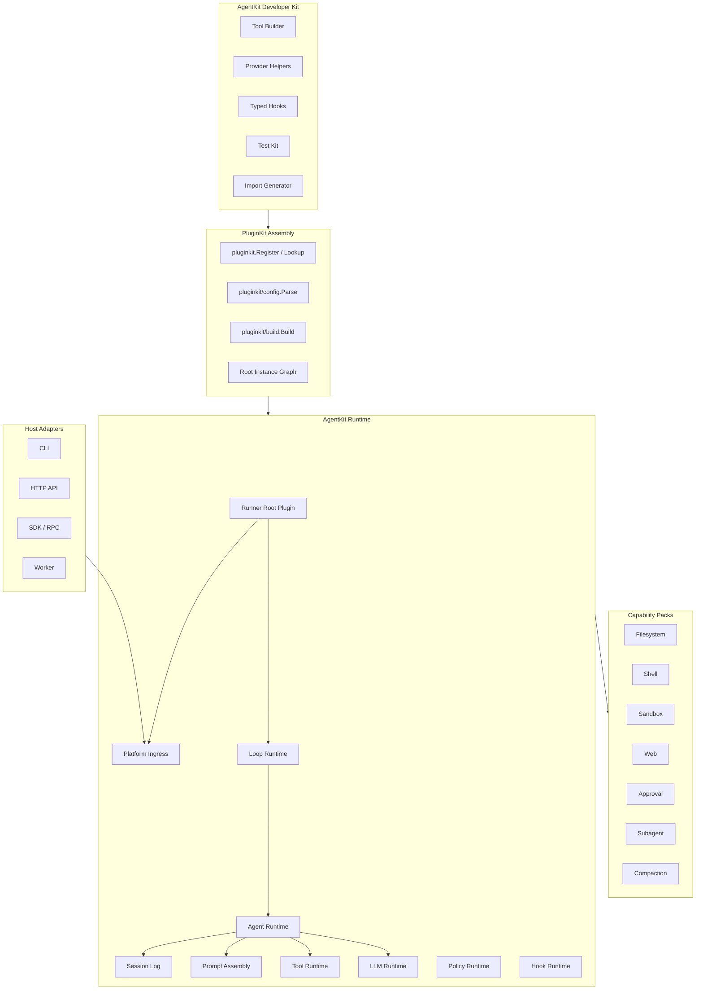
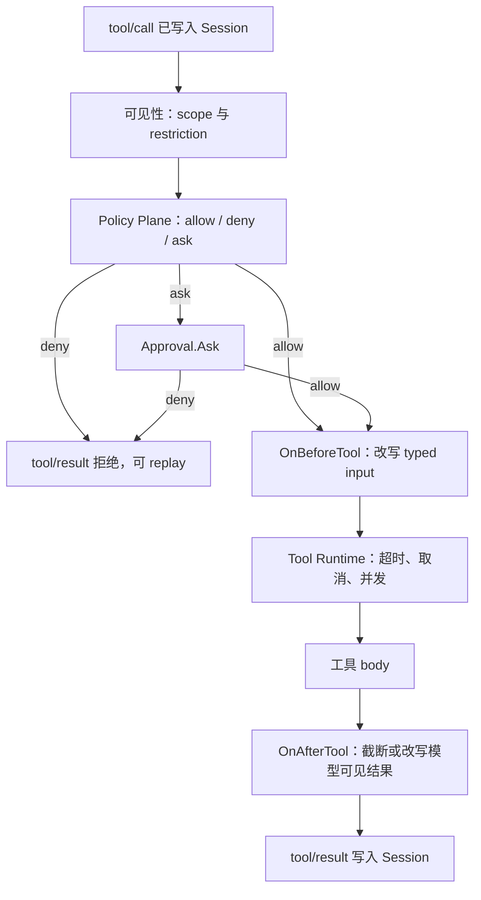
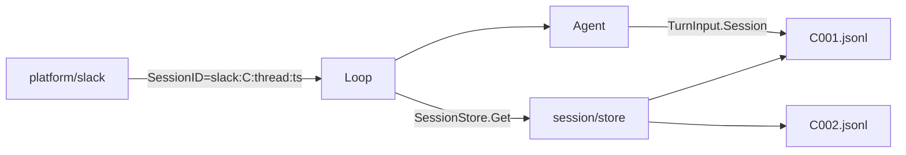

# Go Agent Harness 架构文档

本文描述 `github.com/lengzhao/agentkit` 的 Go Agent 运行时设计。项目使用 `github.com/lengzhao/pluginkit` 作为插件装配基础设施：`pluginkit` 负责插件类型注册、配置解析和实例图构建；`agentkit` 只在其上提供 Agent 语义、运行时接口和开发者体验。

相关参考：[reference-analysis.zh.md](reference-analysis.zh.md)（DSH / Pi 对比与通用能力提炼）、[plugin-catalog.zh.md](plugin-catalog.zh.md)（Plugin Kind 目录与分阶段范围）。

## 1. 设计目标

平台面向三类使用者：

- **插件作者**：用少量 Go 代码增加工具、模型提供方、策略判定和能力实现。
- **应用组装者**：通过配置选择插件、模型、工具集、权限策略和运行模式。
- **运行时维护者**：保持 Agent Loop、Session、Tool、LLM、Policy 等语义稳定，同时复用 `pluginkit` 的装配边界。

核心原则：

- **复用 pluginkit**：底层插件类型注册使用 `pluginkit.Register`，配置识别使用 `pluginkit/config`，实例图构建使用 `pluginkit/build`。
- **Agent 语义上移**：`agentkit` 不再自建通用 registry、service container 或 Mount 协议，只定义 Tool、LLM、Policy、Hook、Session、Agent 等语义接口。
- **构造期注入**：插件依赖通过 `Deps` struct 注入，字段用 `json` tag 对齐配置中的 `deps`，请求路径不查服务容器。
- **Runner 驱动运行时**：Runner 建模为 root plugin，启动时通过 `build.Build[agentkit.Runner](ctx, graph, "runner")` 构造完整实例图；Platform 负责消息入口，Loop 负责循环调度，Agent 位于 Loop 下方并依赖 LLM / Tools。
- **类型优先**：插件构造函数返回具体类型或接口实现，`pluginkit/build` 做静态和运行时类型检查；工具输入输出继续由 Go 类型表达。
- **模型可见即记录**：任何进入模型请求的内容都必须能从 Session 日志重建。
- **先单包，后拆分**：一个能力只有一个 provider 或 consumer 时允许单包实现；出现多个 provider 或 consumer 时再拆 Definition / Provider / Consumer。

运行时永远不解释 `.go` 源码。开发态使用文件监听触发 `go run` 重启；生产态运行已构建的二进制或容器镜像。

## 2. 核心术语

`agentkit` 的配置模型建立在 `pluginkit` 的实例图之上。用户配置描述要构造哪些实例以及它们之间的依赖，Agent 运行时只消费构造完成后的语义接口。

| 术语 | 含义 |
|---|---|
| **Plugin Kind** | Go 包在 `init()` 中通过 `pluginkit.Register(kind, New)` 注册的插件类型，例如 `runner`、`platform/cli`、`loop/default`、`agent/coding`、`llm/openai`、`tool/read-file`。 |
| **Plugin Use** | 配置中的一次插件使用，包含 `use`、可选 `id`、`config` 和 `deps`。 |
| **Plugin Instance** | `build.Build` 成功构造出的实例，拥有稳定 `id`、`use` 和 Go 值。 |
| **Root Plugin** | 实例图入口。AgentKit 进程的 root id 通常是 `runner`，返回值实现 `agentkit.Runner`。 |
| **Deps** | 插件构造函数的第二个参数 struct，用字段类型和 `json` tag 声明依赖。 |
| **Capability Interface** | Agent 能力的 Go 接口，例如 `filesystem.Service`、`shell.Executor`、`llm.Provider`。 |
| **Runtime Component** | Platform、Loop、Agent、Tool、LLM provider、Policy、Hook、Session backend 等被 Runner root 依赖和组合的语义组件。 |
| **Feature** | `agentkit` 配置层的可复用片段，最终会展开为 `pluginkit` 可识别的实例图；Feature 本身不注册 Go 插件类型。 |
| **Resolved Graph** | Preset、Feature、override 合并后的 `pluginkit` 实例图，供构建、诊断和测试使用。 |

`pluginkit` 的三层边界必须保持清晰：

- 根包 `github.com/lengzhao/pluginkit` 只提供 `Register`、`Lookup` 和 `Spec`。
- `github.com/lengzhao/pluginkit/config` 只识别 `PluginUse`，不查注册表、不调用构造函数。
- `github.com/lengzhao/pluginkit/build` 负责根据 root id 构造实例图，做依赖注入、拓扑排序和类型检查，但不解释 Agent 业务字段。

## 3. 插件作者体验

插件作者直接使用 `pluginkit.Register` 登记构造函数。`agentkit` 可以提供辅助构造器，降低 Tool、Policy、Hook 的样板代码，但这些辅助 API 最终仍返回普通 Go 值，由 `pluginkit` 统一装配。

`pluginkit` 支持的构造函数形态固定为：

```go
func New() (T, error)
func New(cfg Config) (T, error)
func New(cfg Config, deps Deps) (T, error)
```

构造函数只做轻量初始化和依赖组装，不读取全局配置、不启动无 owner 的 goroutine、不向全局 bus 注册回调。需要生命周期的组件实现 `agentkit.StartStop`，由 Runner root 在构建完成后统一启动和停止。

### 3.1 工具插件

```go
package readfile

import (
    "context"

    "github.com/lengzhao/agentkit"
    "github.com/lengzhao/agentkit/cap/filesystem"
    "github.com/lengzhao/pluginkit"
)

type Config struct {
    MaxBytes int `json:"maxBytes"`
}

type Deps struct {
    FS filesystem.Service `json:"fs"`
}

type Input struct {
    Path string `json:"path" jsonschema:"required,description=File path relative to the workspace"`
}

type Output struct {
    Content string `json:"content"`
}

func init() {
    pluginkit.Register("tool/read-file", New)
}

func New(cfg Config, deps Deps) (agentkit.Tool, error) {
    return agentkit.NewTool[Input, Output]("read_file", readFile(deps.FS, cfg)).
        Description("Read a text file from the workspace.").
        Build()
}

func readFile(fs filesystem.Service, cfg Config) func(context.Context, Input) (Output, error) {
    return func(ctx context.Context, input Input) (Output, error) {
        content, err := fs.ReadText(ctx, input.Path, cfg.MaxBytes)
        if err != nil {
            return Output{}, err
        }
        return Output{Content: content}, nil
    }
}
```

工具插件作者声明自身 kind、配置、依赖和 typed handler。依赖来自 `Deps`，不是从 `context.Context` 或包级变量中查找。JSON Schema 可以由 `agentkit` 根据输入输出类型生成，工具执行顺序由 Tool Runtime 控制。

### 3.2 模型提供方

```go
func init() {
    pluginkit.Register("llm/openai-compatible", New)
}

func New(cfg Config) (agentkit.LLMProvider, error) {
    return newProvider(cfg)
}
```

模型提供方只实现流式接口；鉴权、重试、限流、日志和 Session 事件由 `agentkit` 的 LLM Runtime 适配器统一处理。

### 3.3 策略插件

拒绝、询问与允许只通过 Policy Plane 返回 `Decision`。策略插件作为普通 `pluginkit` 实例返回 `agentkit.Policy`，最终由 Agent 依赖并注入统一 Policy Runtime。

```go
func init() {
    pluginkit.Register("policy/deny-dangerous-shell", New)
}

func New() (agentkit.Policy, error) {
    return agentkit.PolicyFunc(evaluateShell), nil
}

func evaluateShell(ctx context.Context, in agentkit.PolicyInput) agentkit.Decision {
    if in.Name != "shell" {
        return agentkit.Allow()
    }
    var args struct {
        Command string `json:"command"`
    }
    if err := in.Decode(&args); err != nil {
        return agentkit.Deny("invalid shell arguments")
    }
    if args.Command == "rm -rf /" {
        return agentkit.Deny("dangerous shell command")
    }
    return agentkit.Allow()
}
```

观察或改写已允许的调用使用 typed hook，见 [5.4](#54-typed-hooks) 与 [5.5](#55-工具执行路径)。hook 不是拒绝通道，插件作者不调用 `next()`。

### 3.4 能力 Provider

```go
func init() {
    pluginkit.Register("fs/local", New)
}

type Config struct {
    Root string `json:"root"`
}

func New(cfg Config) (filesystem.Service, error) {
    return filesystem.NewLocal(cfg.Root)
}
```

Provider 负责实现某个能力接口。Consumer 依赖能力接口，不依赖具体 Provider；实例图里由 `deps` 决定 Consumer 绑定哪个 Provider。

## 4. 总体分层



| 层 | 职责 | 稳定性 |
|---|---|---|
| AgentKit Developer Kit | 给插件作者的 Tool、Policy、Hook、测试与 import 生成辅助 | 可以快速迭代 |
| PluginKit Assembly | 注册插件类型、解析实例图、构造 root plugin、注入 deps | 跟随 `pluginkit` |
| AgentKit Runtime | Runner、Platform、Loop、Agent、Session、Prompt、Tools、LLM、Policy、Hooks | 稳定扩展 |
| Capability Packs | 文件、命令、沙箱、Web、审批、子 Agent、压缩 | 可插拔 |
| Host Adapters | CLI、HTTP、SDK、Worker | 可替换 |

## 5. PluginKit 装配模型

AgentKit 不再设计独立 Micro Kernel。装配期稳定性取决于三条不变量：`init()` 只注册 kind 和构造函数；依赖只通过 `Deps` struct 注入；请求路径不做服务定位。

### 5.1 插件注册

插件类型通过 `pluginkit.Register(kind, constructor)` 注册。非法 kind、重复 kind 或不符合签名的构造函数会 panic，适合在 `init()` 中尽早失败。

```go
func init() {
    pluginkit.Register("runner", NewRunner)
    pluginkit.Register("platform/cli", NewCLIPlatform)
    pluginkit.Register("loop/default", NewLoop)
    pluginkit.Register("agent/coding", NewAgent)
    pluginkit.Register("llm/openai", NewOpenAI)
    pluginkit.Register("tool/shell", NewShellTool)
}
```

注册规则：

- `init()` 只调用 `pluginkit.Register`，不读取配置、不连接外部系统、不启动 goroutine。
- `kind` 使用稳定命名，例如 `runner`、`platform/cli`、`loop/default`、`agent/coding`、`llm/openai`、`tool/read-file`、`policy/deny-shell`。
- 同一个 kind 在一个进程内只能注册一次；新增源码插件通过 import 生成器进入依赖图。
- 测试可以直接导入插件包或调用包内导出的 `RegisterForTest` 辅助，但不得绕过 `pluginkit` 另建 registry。

### 5.2 依赖注入

依赖由构造函数的 `Deps` struct 声明。字段类型定义所需接口，`json` tag 对应配置中的 `deps` 键。

```go
type RunnerDeps struct {
    Platform agentkit.Platform `json:"platform"`
    Loop     agentkit.Loop     `json:"loop"`
}

func NewRunner(cfg RunnerConfig, deps RunnerDeps) (agentkit.Runner, error) {
    return agentkit.NewRunner(cfg, deps)
}

type LoopDeps struct {
    Agents []agentkit.Agent `json:"agents"`
}

func NewLoop(cfg LoopConfig, deps LoopDeps) (agentkit.Loop, error) {
    return agentkit.NewLoop(cfg, deps)
}

type AgentDeps struct {
    LLM      agentkit.LLMProvider `json:"llm"`
    Tools    []agentkit.Tool      `json:"tools"`
    Policies []agentkit.Policy    `json:"policies"`
    Session  agentkit.Session     `json:"session"`
}

func NewAgent(cfg AgentConfig, deps AgentDeps) (agentkit.Agent, error) {
    return agentkit.NewRuntime(cfg, deps)
}
```

对应配置：

```yaml
runner:
  use: runner
  config:
    shutdownTimeout: 10s
  deps:
    platform:
      use: platform/cli
    loop:
      use: loop/default
      config:
        maxTurns: 20
      deps:
        agents:
          - use: agent/coding
            deps:
              session:
                use: session/jsonl
                config:
                  path: .agent/sessions
              llm:
                use: llm/openai
                config:
                  model: gpt-5.5
              tools:
                - use: tool/read-file
                  deps:
                    fs:
                      use: fs/local
                      config:
                        root: .
                - use: tool/shell
                  deps:
                    executor:
                      use: shell/bash
                    approval:
                      use: approval/cli
              policies:
                - use: policy/deny-dangerous-shell
```

注入规则：

- `deps` 可以引用已有实例 id，也可以内联私有插件对象。
- 内联实例未写 `id` 时，由 `pluginkit/build` 按路径生成稳定 id，例如 `runner.loop.agents[0].tools[0]`。
- `build.Build` 在 deps 阶段校验依赖类型；不实现目标接口的实例会启动失败。
- 缺失依赖、未知 kind、重复 id、配置无法 decode 都是启动错误，不是运行期回退。
- 标准 `context.Context` 只携带取消、deadline、`session_id`、`agent_id`、`tool_call_id` 等请求信息，不携带服务定位器。

### 5.3 生命周期

`pluginkit` 只负责构造实例，不负责启动、停止或热更新。AgentKit 对需要生命周期的组件定义可选接口，由 Runner root 统一管理。

```go
type StartStop interface {
    Start(context.Context) error
    Stop(context.Context) error
}
```

生命周期规则：

- 构造函数只创建对象和校验配置，不启动长期任务。
- `build.Build` 成功后，Runner root 收集实现 `StartStop` 的组件并按依赖顺序启动。
- 任一组件启动失败时，已启动组件按反向顺序停止。
- `Stop` 必须有超时和错误收集，不能让一个插件阻塞全局关闭。
- 长任务必须受 `context.Context` 管理，并在 `Stop` 中停止。

### 5.4 Typed Hooks

对外暴露 Agent 语义 hook，而不是通用字符串事件。hook 插件返回 `agentkit.HookProvider` 或具体 hook 函数集合，Loop 或 Agent 将它们装配进 Hook Runtime。

```go
type HookProvider interface {
    Hooks() []Hook
}

func OnBeforeStep(h func(context.Context, *BeforeStep) error) Hook
func OnBuildPrompt(h func(context.Context, *PromptBuilder) error) Hook
func OnBeforeTool(h func(context.Context, *ToolCall) error) Hook
func OnAfterTool(h func(context.Context, *ToolResult) error) Hook
func OnLLMRequest(h func(context.Context, *LLMRequest) error) Hook
func OnTurnStopping(h func(context.Context, *TurnState) (StopDecision, error)) Hook
```

内部 Hook Runtime 可以支持 chain、serial、parallel 三种模式；插件作者只看到稳定 payload 类型和返回约定，不调用 `next()`。hook 实例只有在 root graph 中被依赖后才会进入运行时；未配置的 hook 即使被 import 也不会运行。

`OnBeforeTool` / `OnAfterTool` 不是拒绝通道。允许、拒绝、询问只由 Policy Plane 产生 `Decision`，见 [5.5](#55-工具执行路径)。hook 返回的 `error` 表示插件执行失败，运行时中止该阶段并写入失败事件，它不是 Policy `deny`。

### 5.5 工具执行路径

工具运行时按固定顺序执行一次调用。Policy Plane 是唯一 enforcement 点；typed hook 挂在这些阶段上观察或变换，不能另开拒绝通道。



| 阶段 | 决策者 | 允许 | 禁止 |
|---|---|---|---|
| 可见性 | Tools Runtime + [§8](#8-作用域与可见性) | 按 scope 过滤已注册工具 | 增加工具；用 prompt 隐藏代替过滤 |
| Policy | Policy Runtime | 返回 `allow` / `deny` / `ask`；deny 写入 Session | hook `return error` 充当 deny；把其它插件的 deny 改成 allow |
| 审批 | `approval` Provider | 只处理 `ask`；决定 allow 或 deny | 跳过 Policy；审批 allow 覆盖先前的 deny |
| `OnBeforeTool` | 已装配 hook | 改写已 `allow` 的 typed 输入 | 翻转 deny；跳过 Policy；使用 `map[string]any` 作为主输入 |
| 执行 | Tool Runtime + body | 运行时实施超时与取消；body 只使用构造期注入的接口 | hook 丢弃 caller 取消；在 deny 之后仍执行 body |
| `OnAfterTool` | 已装配 hook | 截断或改写将返回给模型的文本 | 不写 Session；删除审计字段；把失败改写成未发生 |

`Decision` 使用显式种类，不用布尔值兼表示询问：

```go
type DecisionKind string

const (
    DecisionAllow DecisionKind = "allow"
    DecisionDeny  DecisionKind = "deny"
    DecisionAsk   DecisionKind = "ask"
)

type Decision struct {
    Kind   DecisionKind
    Reason string
    Audit  map[string]string
}
```

拒绝或审批拒绝若反馈给模型，必须能从 Session 日志重建。超时、取消和并发上限由 Tool Runtime 按该工具实例的 Config 实施，不把 signal 所有权交给插件。

### 5.6 用户配置模型

MVP 配置直接使用 `pluginkit` root graph。AgentKit 可以在更高层提供 Preset / Feature，但它们最终必须编译成 `use/config/deps` 结构。

```yaml
runner:
  use: runner
  config:
    shutdownTimeout: 10s
  deps:
    platform: platform.default
    loop: loop.default

platform.default:
  use: platform/cli

loop.default:
  use: loop/default
  config:
    maxTurns: 20
  deps:
    agents:
      - agent.coder

agent.coder:
  use: agent/coding
  deps:
    session:
      use: session/jsonl
      config:
        path: .agent/sessions
    llm:
      use: llm/openai
      config:
        model: gpt-5.5
    tools:
      - use: tool/read-file
        config:
          maxBytes: 1048576
        deps:
          fs:
            use: fs/local
            config:
              root: .
      - id: shell-tool
        use: tool/shell
        deps:
          executor: shell.default
          approval:
            use: approval/cli

shell.default:
  use: shell/bash
  config:
    timeout: 30s
```

配置规则：

- 顶层 key 是实例 id；root id 通常是 `runner`。
- `use` 是 `pluginkit.Register` 注册的 kind。
- `config` 按 JSON 规则解码到构造函数的 Config 参数；未知字段失败。
- `deps` 的值可以是已有实例 id、内联插件对象，或它们的列表。
- 可复用实例放到顶层并通过 id 引用；私有实例优先内联在依赖处。
- `agentkit config resolve` 只做 Preset / Feature / override 展开，输出仍是 `pluginkit` root graph。

### 5.7 Feature 与 Preset

`Feature` 是可复用能力片段，适合表达“coding shell”“只读文件系统”“安全 Web”等产品能力。Feature 不执行 Go 代码，也不拥有额外生命周期。

```yaml
apiVersion: agentkit.dev/v1
kind: Feature
metadata:
  name: coding-shell

graph:
  shell.default:
    use: shell/bash
    config:
      timeout: 30s

  approval.default:
    use: approval/cli

  tool.shell:
    use: tool/shell
    deps:
      executor: shell.default
      approval: approval.default
```

Preset 选择 Feature 并声明 root Runner：

```yaml
apiVersion: agentkit.dev/v1
kind: Preset
metadata:
  name: coding
features:
  - coding-shell

graph:
  runner:
    use: runner
    deps:
      platform:
        use: platform/cli
      loop: loop.default

  loop.default:
    use: loop/default
    deps:
      agents:
        - agent.coder

  agent.coder:
    use: agent/coding
    deps:
      llm:
        use: llm/openai
        config:
          model: gpt-5.5
      session:
        use: session/jsonl
        config:
          path: .agent/sessions
      tools:
        - use: tool/read-file
          deps:
            fs:
              use: fs/local
              config:
                root: .
        - tool.shell
      policies:
        - use: policy/deny-dangerous-shell
```

Feature 合并规则：

- Preset 引入多个 Feature 时，后写的 Preset 字段覆盖 Feature 默认值。
- 两个 Feature 写入同一实例 id 且值不同，必须由 Preset 显式覆盖。
- Feature 只能组合配置，不能注册 Plugin Kind。
- 展开后必须生成合法 `pluginkit` root graph，再交给 `build.Build`。

### 5.8 Resolved Graph

Resolved Graph 是 `agentkit` 高层配置展开后的结果，供 `agentkit config resolve`、测试 golden 和诊断使用。它必须可以直接传给 `build.Build`。

```yaml
runner:
  use: runner
  deps:
    platform: platform.default
    loop: loop.default

platform.default:
  use: platform/cli

loop.default:
  use: loop/default
  deps:
    agents:
      - agent.coder

agent.coder:
  use: agent/coding
  deps:
    llm: llm.default
    session: session.default
    tools:
      - tool.read-file
      - tool.shell
    policies:
      - policy.deny-dangerous-shell

llm.default:
  use: llm/openai
  config:
    model: gpt-5.5

session.default:
  use: session/jsonl
  config:
    path: .agent/sessions

fs.workspace:
  use: fs/local
  config:
    root: .

tool.read-file:
  use: tool/read-file
  deps:
    fs: fs.workspace

tool.shell:
  use: tool/shell
  deps:
    executor: shell.default
    approval: approval.default
```

启动流程：

```mermaid
flowchart TB
  Imports["generated imports load plugin packages"] --> Register["init calls pluginkit.Register"]
  Preset["preset + features + overrides"] --> Resolve["agentkit config resolve"]
  Resolve --> Graph["pluginkit root graph"]
  Register --> Build["build.Build[agentkit.Runner](ctx, graph, \"runner\")"]
  Graph --> Build
  Build --> Start["Runner starts platform and loop"]
  Start --> Run["run turn"]
```

这种模型保留 Go 的静态 import 约束，同时把用户配置维持在“声明实例图”的层级。整行 patch、配置热 reconcile、远程配置中心可以作为后续能力，不进入 MVP。

### 5.9 多 Agent 配置

多个 Agent 不需要复制完整实例图。推荐做法是：`Preset` 定义可复用能力集合，`AgentSet` 为每个 Agent 生成独立 Agent 实例，并由同一个 Runner / Loop 管理入口与调度。

```yaml
apiVersion: agentkit.dev/v1
kind: AgentSet
metadata:
  name: local-coding-team

agents:
  coder:
    preset: coding
    workspace: .
    session:
      mode: persistent
    overrides:
      shell.default.use: shell/bash

  reviewer:
    preset: readonly-review
    workspace: .
    session:
      mode: persistent
    overrides:
      tool.shell: null

  summarizer:
    preset: summarizer
    session:
      mode: ephemeral
```

配置复用规则：

- 每个 Agent 展开为独立实例 id，例如 `agent.coder`、`agent.reviewer`；Runner 仍是进程 root。
- 多个 Agent 可以共享同一 Plugin Kind，但不共享已构造实例，除非显式引入外部服务。
- Agent 级 override 只影响该 Agent 的 Resolved Graph，不修改共享 Preset。
- 临时子 Agent 使用 agent template，由父 Agent 或 workflow 在运行时生成新的 Agent 实例片段，并挂入当前 Runner / Loop 管理的执行上下文。

## 6. Agent Spine

### 6.1 Session

Session 是 Agent 的事实源。模型请求、工具调用、工具结果、用户输入、系统注入、压缩替换都必须能由 Session 日志重建。

```go
type Session interface {
    ID() SessionID
    Append(ctx context.Context, event Event) (EventSeq, error)
    Read(ctx context.Context, from EventSeq) ([]Event, error)
    DeriveMessages(ctx context.Context) ([]Message, error)
}
```

MVP 可以使用 JSONL；生产版增加 SQLite、索引和查询 API。Session backend 也是普通 `pluginkit` 插件，例如 `session/jsonl`。

#### 6.1.1 多会话路由（IM / Slack）

单 Agent 进程可能同时服务多个对话（Slack 频道、thread、DM 等）。**每个对话单元应有独立 Session**，不能共用一个 JSONL 文件。

```go
// SessionStore 按 SessionID 打开/缓存持久化 Session
type SessionStore interface {
    Get(ctx context.Context, id SessionID) (Session, error)
}
```

路由约定：

| 组件 | 职责 |
|------|------|
| **Platform**（如 `platform/slack`） | 从 `channel_id` + `thread_ts` 生成 `MessageEvent.SessionID`，例如 `slack:C123:thread:1234567890.123` |
| **Loop** | 若配置了 `SessionStore` 且 `SessionID` 非空，则 `Get` 对应 Session 并传入 `TurnInput.Session`；同一 `SessionID` 内串行执行 Turn |
| **Agent** | `RunTurn` 优先使用 `TurnInput.Session`，否则回退到构造期注入的默认 Session（CLI 单会话） |
| **`session/store`** | 在目录下为每个 ID 懒加载 `{safe_id}.jsonl` |

CLI 保持向后兼容：不传 `SessionID` 时 Loop 使用 Agent 默认 Session。IM 配置示例：

```yaml
loop:
  use: loop/default
  deps:
    sessionStore: session.store
    agents:
      - agent.coder

session.store:
  use: session/store
  config:
    dir: .agent/sessions

agent.coder:
  use: agent/coding
  deps:
    session:
      use: session/memory   # 占位默认 Session，满足 Agent 构造；实际 Turn 走 SessionStore
```



### 6.2 Runner

```go
type Runner interface {
    Run(context.Context) error
    Stop(context.Context) error
}
```

Runner 是 `pluginkit` root plugin 的返回值，负责连接 Platform 和 Loop，管理生命周期、取消、优雅退出和后台错误收集。Runner 不直接调用 LLM 或 Tools，也不持有具体业务策略；这些由 Loop 下方的 Agent 处理。

### 6.3 Platform

```go
type Platform interface {
    Receive(context.Context) (MessageEvent, error)
    Send(context.Context, OutboundEvent) error
}
```

Platform 是消息入口适配层。CLI、HTTP、SDK、IM、Worker 都可以是不同 Platform 插件。它只负责把外部输入转成 `MessageEvent`，以及把 Runner / Loop 产生的输出写回外部系统，不负责 Agent 决策、工具执行或模型调用。

多个 Platform 可在同一 Agent 中共存：用 `platform/multiplex` 聚合各入口，Runner 仍只依赖一个 `Platform`。入站消息携带 `PlatformID`，出站事件按 `PlatformID` 路由回对应通道（Slack、飞书等后续实现为独立 `platform/*` 插件）。

Assistant 流式输出对齐 Pi RPC，经 `OutboundEmit` 在 turn 执行期间即时 `Send`：

| OutboundEvent.Type | 含义 |
|---|---|
| `message/start` | assistant 流开始，携带初始 message |
| `message/update` | 增量更新，`data.assistantMessageEvent.type` 为 `text_delta` / `toolcall_delta` 等 |
| `message/end` | assistant 消息定稿（session 在此时持久化） |

`message/update` 的 wire payload 不包含 cumulative partial，只携带 delta 与 `contentIndex`，与 Pi `toJsonEvent()` 一致。

### 6.4 Agent

```go
type Agent interface {
    ID() AgentID
    Session() Session
    RunTurn(ctx context.Context, msg Message) error
    Cancel(ctx context.Context, reason string) error
}
```

Agent 是 Loop 下方的执行主体，拥有 Session、Prompt、LLM、Tools、Policy 和 Hooks。它不接收外部平台协议，只处理已归一化的 `Message`；是否进入模型由 `OnBeforeStep` 决定。

### 6.5 Agent Loop

Loop 消费 Platform 进入 Runner 的消息事件，选择目标 Agent，并驱动完整 Turn / Step。默认实现应覆盖单 Agent 和多 Agent 的调度路径。

```mermaid
sequenceDiagram
  participant User
  participant Platform
  participant Runner
  participant Loop
  participant Agent
  participant Session
  participant Prompt
  participant LLM
  participant Tools

  User->>Platform: inbound message
  Platform->>Runner: MessageEvent
  Runner->>Loop: Dispatch
  Loop->>Agent: RunTurn
  Agent->>Session: turn/start
  Loop->>Loop: OnBeforeStep
  Agent->>Session: step/start + user/message
  Agent->>Prompt: BuildPrompt
  Agent->>LLM: Stream
  LLM-->>Agent: assistant deltas
  Agent->>Platform: message/start + message/update*
  Agent->>Session: assistant/message
  Agent->>Tools: execute calls
  Tools-->>Session: tool/call + tool/result
  Agent->>Session: step/end
  Loop->>Loop: OnTurnStopping
  Agent->>Session: turn/end
  Agent->>Platform: message/end
```

Loop 不直接依赖具体工具、模型、压缩器、审批器或沙箱。它只调用 Agent 接口、调度策略和已装配的 loop-level hooks。

### 6.6 Prompt

Prompt 组装器管理多个 section：

```go
type Section struct {
    Name  string
    Order int
    Scope Scope
    Build func(context.Context, PromptRequest) (string, error)
}
```

插件可以作为 `prompt/section/*` 返回 Section 或 SectionProvider。Prompt 组装结果必须能追溯到 Session 日志和当前配置；临时运行态信息如果进入模型，也需要对应事件或可重建来源。

### 6.7 Tools

工具运行时负责：

- 工具注册和同名冲突检查。
- JSON Schema 生成与校验。
- scoped 工具可见性。
- 审批、超时、并发、结果截断和审计事件；顺序与禁止项见 [5.5](#55-工具执行路径)。
- 工具结果写入 Session。

```go
type Tool interface {
    Name() string
    Schema() ToolSchema
    Run(context.Context, json.RawMessage) (ToolResult, error)
}
```

工具作者仍使用泛型输入输出；`agentkit.NewTool` 负责把 typed handler 包装为运行时接口。

### 6.8 LLM

```go
type LLMProvider interface {
    Stream(ctx context.Context, req Request) (Stream, error)
}
```

LLM Runtime 负责：

- Provider 选择。
- 请求构造和 hook。
- 流式 chunk 归一化。
- 使用量统计。
- provider 错误分类和可重试策略。

## 7. 能力扩展模型

能力可以从单包开始：

```text
cap/shell/
  definition.go   # Shell 接口
  local.go        # local provider，注册 shell/bash
  tool.go         # 面向模型的 shell 工具，注册 tool/shell
```

当出现多个 provider 或 consumer 时再拆分：

```text
cap/shell/
cap/shell-local/
cap/shell-sandbox/
cap/tool-shell/
```

常用能力：

| 能力 | Definition | Provider 示例 | Consumer 示例 |
|---|---|---|---|
| filesystem | `Read`, `Write`, `Edit` | `fs/local`、`fs/sandboxed` | `tool/read-file`、`tool/edit-file` |
| subprocess | `Spawn`, `Kill`, `ReadOutput` | `process/local` | shell、terminal |
| shell | `Run(command)` | `shell/bash`、`shell/pwsh` | `tool/shell` |
| sandbox | `WrapExec`, `AuthorizePath` | landlock、seatbelt、bwrap | fs、subprocess |
| approval | `Ask`, `Decide` | `approval/cli`、`approval/web`、`approval/auto-deny` | tool policy |
| credentials | `Resolve(ref)` | env、file、vault | LLM、web |
| settings | typed namespaces | file、remote | model defaults |
| web | `Search`, `Fetch` | HTTP providers | web tools |
| subagent | `Start`, `Join`, `Cancel` | in-process、RPC | delegate tool |
| compaction | `Compact(session)` | summary provider | before-step hook |

设计规则：

- Consumer 依赖 Definition，不依赖 Provider。
- Provider 只实现能力，不决定模型如何看到它。
- 模型可见工具是 Consumer，负责 schema、描述、错误文本和 Session 事件。
- 安全策略挂在执行路径上，不能只靠 prompt 隐藏或工具过滤。

### 7.1 Policy Plane

安全策略不应分散在 shell、fs、web、subagent 各自实现里。平台提供统一的 Policy Plane；高风险能力在 body 之前走 [5.5](#55-工具执行路径) 的同一组判定。工具是否出现在模型可见列表由 scope 与 restriction 决定，不由 Policy 增删工具。

Policy Plane 判定已可见调用以及能力操作：

- 调用是 `allow`、`deny` 还是 `ask`。
- 文件路径是否可读写。
- 命令是否允许执行。
- 网络访问是否允许。
- 凭据引用是否可解析。
- 子 Agent 是否允许启动。

策略插件返回 `agentkit.Policy`，由 Agent 注入统一 Policy Runtime。拒绝与审批拒绝必须写入 Session 或审计日志；反馈给模型的内容必须可从 Session 重建。

## 8. 作用域与可见性

作用域解决“同一进程内多个 Agent 能力不同”的问题。由于能力由构造期 deps 固定，作用域只影响模型可见组件和运行时 restriction，不在请求路径重新解析 Provider。

| 作用域 | 可见范围 | 用途 |
|---|---|---|
| global | 当前 root graph 的基础组件 | 默认工具、默认 provider |
| preset | 使用该 preset 的 Agent | coding、安全模式、只读模式 |
| agent | 单个 Agent | 临时工具、子任务 persona、一次性限制 |
| turn | 当前 Turn | 注入上下文、临时策略 |

规则：

- 更小作用域可以 shadow 同名工具，但不能替换构造期注入的能力接口。
- restriction 只减少可见工具集，不增加工具。
- scoped 注册必须绑定生命周期，Agent 结束后自动释放。
- 若要换一套能力实例，创建另一个 Agent 实例或 Runner root graph，或在构造期注入包装后的接口。

## 9. 插件发现与开发工作流

Go 无法运行时扫描 `.go` 文件并执行新包的 `init()`，本设计也永远不解释 Go 源码。平台通过 import 生成器提供接近“放目录即启用”的体验。

```text
agentkit/
├── cmd/agent/main.go
├── agentkit/
├── runtime/
├── spine/
├── cap/
├── plugins/
│   └── read-file/
│       └── plugin.go
├── presets/
│   └── coding.yaml
└── scripts/
    └── gen-imports/
```

生成文件：

```go
package plugins

import (
    _ "github.com/lengzhao/agentkit/plugins/read-file"
    _ "github.com/lengzhao/agentkit/plugins/shell"
)
```

开发命令：

```sh
go generate ./...
go run ./cmd/agent --preset coding "inspect this repo"
```

开发态 watcher：

```text
*.go / *.yaml 变更 → go generate ./... → 停止旧进程 → go run ./cmd/agent
```

这不是进程内 HMR，但符合 Go 工具链，也能保持插件状态和生命周期语义简单。

## 10. 可观测性与诊断

易扩展的平台必须能解释“为什么插件没有生效”。诊断命令分为两层：`agentkit` 解释高层配置如何展开，`pluginkit/build` 错误解释实例图构造失败在哪个阶段。

必备诊断：

- `agentkit plugins list`：基于 generated import manifest 和 `pluginkit.Lookup` 列出可解析的 kind、构造函数形态和返回类型。
- `agentkit config resolve --preset coding`：输出 Preset、Feature、override 展开后的 `pluginkit` root graph。
- `agentkit config graph --preset coding`：输出实例 id、kind、deps 和 root id。
- `agentkit config explain <id>`：展示某个实例配置来自哪个 preset、feature、override 或 CLI flag。
- `agentkit build dry-run --preset coding`：调用 `build.Build` 做类型检查和依赖检查，但不运行 Runner。
- `agentkit session replay <id>`：从 Session 日志重放模型可见上下文。
- `agentkit hooks list`：展示已装配 hook 顺序和提供插件。

日志使用 Go 标准库 `log/slog`。每条启动、停止、工具执行、LLM 请求、审批决策日志都应带 `plugin_id`、`plugin_kind`、`session_id`、`agent_id` 或 `tool_call_id`。

错误分类也应统一，便于日志、CLI、SDK 和模型可见错误复用：

| 分类 | 场景 |
|---|---|
| `ConfigError` | 配置无效、未知字段、Preset / Feature 合并冲突 |
| `BuildError` | unknown kind、重复 id、deps 类型不匹配、构造函数失败 |
| `PluginError` | 插件启动、停止、依赖声明或配置 schema 失败 |
| `PolicyError` | 权限拒绝、审批拒绝、安全策略拒绝 |
| `ToolError` | 工具输入无效、执行失败、超时、结果超限 |
| `LLMError` | 鉴权、限流、上下文超限、流中断、provider 响应非法 |
| `SessionError` | 持久化、读取、重放、事件版本不兼容 |

## 11. 测试策略

平台应内建 testkit，而不是让插件作者手写大量 runtime 装配。测试仍应走 `pluginkit` 注册和构建路径，避免生产与测试两套装配逻辑。

```go
func TestReadFileTool(t *testing.T) {
    graph := map[string]any{
        "tool": map[string]any{
            "use": "tool/read-file",
            "deps": map[string]any{
                "fs": map[string]any{
                    "use": "fs/memory",
                    "config": map[string]any{
                        "files": map[string]string{"README.md": "hello"},
                    },
                },
            },
        },
    }

    tool, _, err := build.Build[agentkit.Tool](context.Background(), graph, "tool")
    require.NoError(t, err)

    result := agenttest.CallTool(t, tool, `{"path":"README.md"}`)
    require.Equal(t, "hello", result.JSON("content"))
}
```

测试层级：

| 层级 | 目标 |
|---|---|
| Plugin contract test | 验证插件 kind、构造函数签名、配置 decode 和 deps 注入 |
| Config resolve test | 验证 Preset 继承、Feature 展开和 overrides 的最终 root graph |
| Build graph test | 验证 unknown kind、重复 id、缺失依赖、类型不匹配和循环依赖 |
| Import coverage test | 验证配置引用的 Plugin Kind 已经通过 generated imports 注册 |
| Tool test | 验证输入输出、错误、权限、结果截断 |
| Loop replay test | 用 fake LLM 和固定工具调用重放 Turn / Step |
| Session golden test | 验证模型可见内容能从日志重建 |
| Preset smoke test | 用真实配置 `build.Build[agentkit.Runner]` 启动最小 Runner |

## 12. 分阶段落地

### Phase 1：可用 Runner root

- 引入 `github.com/lengzhao/pluginkit`，所有插件类型使用 `pluginkit.Register`。
- 定义 `agentkit.Runner` root plugin，使用 `build.Build[agentkit.Runner](ctx, graph, "runner")` 构造。
- 定义 `Platform` 和 `Loop` 接口，消息入口由 Platform 进入 Runner，循环处理由 Loop 调度 Agent。
- 工具、LLM provider、Session backend、Policy 都建模为 `pluginkit` 实例。
- 构造期 `Deps` 注入接口；请求路径没有 `Use(Key)`，也不得使用包级能力单例。
- 工具路径：可见性 → Policy →（可选审批）→ `OnBeforeTool` → Runtime 超时/取消 → body → `OnAfterTool` → Session。
- 内存 Session + JSONL persistence。
- 单 Agent、单 Turn、多 Step。
- OpenAI 兼容 LLM provider。
- read/write file、shell 两个工具。
- 一份可直接解析的 root graph coding 配置；Preset / Feature 可以先作为薄转换层。
- import generator + `go run` watcher。

验收：`go run ./cmd/agent "列出当前目录并读取 README"` 能通过 `pluginkit/build` 构造 Runner，由 CLI Platform 产生消息事件，Loop 调度 coding Agent，最终产出 Session 日志，并可 replay 出同一模型上下文。未被 root graph 依赖的 hook / policy 不运行；工具命中构造期注入的 FS / shell。

### Phase 2：安全与组合

- approval、sandbox、credentials、settings。
- Feature 合并、override 与完整 Resolved Graph 校验。
- scoped tools 和 restrictions。
- hook 诊断与插件依赖图。
- fake LLM replay testkit。

### Phase 3：规模化

- SQLite Session backend 和查询索引。
- subagent、compaction、background jobs。
- HTTP / SDK host。
- 多 provider 选择和策略路由。
- RPC 或 WASM 插件隔离。

## 13. 关键取舍

| 主题 | 建议 |
|---|---|
| 动态插件 | 第一版使用 `init()` + import 生成器 + `go run` 重启，不做源码解释 |
| 注册时机 | `init()` 只 `pluginkit.Register(kind, New)`；IO、goroutine、hook 装配只发生在 Runner root 构建后 |
| 插件 API | 普通作者返回 `agentkit` 语义接口，高级作者也不绕过 `pluginkit` |
| 服务容器 | 不设计独立容器；依赖只通过 `Deps` struct 和 `build.Build` 注入 |
| 事件系统 | 对外暴露 typed hooks，Hook Runtime 作为 AgentKit 内部实现；作者不调用 `next()` |
| 工具执行 | 唯一 enforcement 是 Policy Plane 的 `allow` / `deny` / `ask`；hook 只变换或观察 |
| 能力拆分 | 单包起步，出现多个 provider 或 consumer 后再拆 |
| 配置 | MVP 直接使用 `pluginkit` root graph；Preset / Feature 只是生成 root graph 的上层语法 |
| 安全 | 策略在执行路径 enforcement，不能只靠 prompt 或工具隐藏 |
| 日志 | 使用 `slog`，所有关键日志带稳定对象 ID |

## 14. 总结

Go 版 Agent Harness 的核心不是自研一套插件内核，而是在 `pluginkit` 的最小装配模型上提供低心智负担的 Agent 平台。插件作者只注册 Go 构造函数并返回语义接口；应用组装者通过 root graph 声明 Runner、Platform、Loop、Agent、LLM、Tools、Policy、Session 的组合；运行时维护者把复杂度集中在 Agent Spine、Policy Plane、Session replay 和诊断工具中。

最小可行设计由四部分组成：AgentKit Developer Kit、PluginKit Assembly、AgentKit Runtime、Capability Packs。Developer Kit 决定易用性，PluginKit Assembly 决定装配一致性，AgentKit Runtime 决定产品行为，Capability Packs 决定扩展空间。
