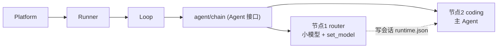

# Agent 链式编排（agent/chain）

`agent/chain` 把一次入站消息依次交给多个 Agent 节点执行，共享同一 session。典型用途：**路由节点先做意图识别并切换模型，主节点再完成任务**。



## 语义

| 项 | 行为 |
|---|---|
| 节点 | `deps.agents` 注入的任意 `agentkit.Agent`（`agent/coding`、嵌套 `agent/chain`），`config.nodes` 按 id 引用。注意：非首节点收到空消息，要求非空 prompt 的 Agent（`agent/acp-remote`）只能做首节点 |
| 顺序 | 按 `nodes` 顺序串行；每节点是一个完整 turn（自己的 model 解析、hooks、tools、policy） |
| Session | 全部节点共享；节点 N 经 `DeriveMessages` 看到节点 N-1 的消息 |
| 入站消息 | 只在**首个节点**落盘为 `user/message`；后续节点以空消息续跑（`agent/coding` 对空消息不落盘） |
| 出错 | 默认中止 chain（`continueOnError: true` 可继续后续节点） |
| 取消 | `/stop` 按 session 取消当前执行中的节点，chain 随 ctx 中止 |

**chain 不做**：条件分支、并行、循环、跳过/重复执行策略（如「路由每会话只跑一次」）。这些由节点自身逻辑或包装插件承载——例如路由节点可先读会话模型绑定，已有 `/model` 覆盖时直接 `finish` 返回。

## 配置示例：路由 + 主 Agent

```yaml
agent.pipeline.default:
  use: agent/chain
  config:
    id: pipeline
    nodes: [router, coding]

  # deps 由实例图接线：
  # deps:
  #   agents: [agent.router.default, agent.coding.default]

agent.router.default:
  use: agent/coding
  config:
    id: router
    model: gpt-4o-mini   # 便宜模型做意图识别
    maxSteps: 3
  # deps.tools 只挂 tool/set-model + tool/finish

tool.set-model.default:
  use: tool/set-model
  config:
    allowModels: [gpt-4o, gpt-4o-mini]
  # deps.sessionStore 与主 Agent 同源
```

执行流：用户消息 → router 节点（小模型判断任务类型，调 `set_model` 写会话 `runtime.json`）→ coding 节点（`effectiveModel` 解析到新绑定，**本 turn 即用新模型**）。每个节点独立解析模型，因此路由结果对同一次入站的后续节点立即生效。

## 与相关机制的关系

| 机制 | 区别 |
|---|---|
| `tool/subagent`（delegate） | 模型自主、层级委派、上下文隔离；chain 是声明式、平级、共享 session。节点内部仍可 delegate |
| `/model`、`tool/set-model` | 写同一会话 `runtime.json` 覆盖；用户手动 `/model` 与路由节点写入互相可见，优先级一致 |
| `llm/fallback` | 失败兜底切换，与 chain 编排正交 |
| AgentSet | 静态多实例（`/agent use` 切换）；chain 是一次入站内的动态流转 |

## 可观测性

每个节点写自己的 `turn/start` / `turn/end`（`agent_id` 区分节点），telemetry 按节点分段；一条入站消息产生 N 个 turn 事件属预期行为。
