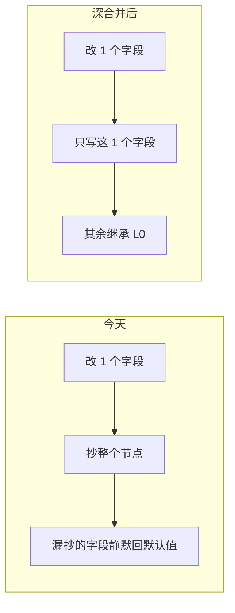
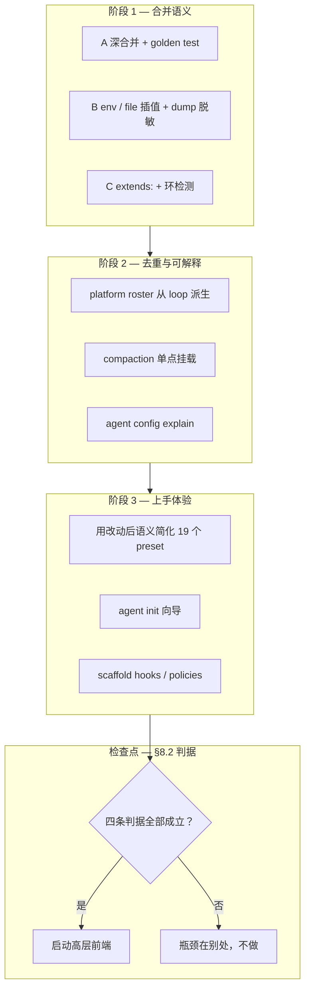

# 配置简化方案

本文分析 AgentKit 用户侧配置为什么重，并给出成本最低的三步走。

相关文档：[go-agent-harness-architecture.zh.md](../go-agent-harness-architecture.zh.md)（§5.6 配置规则）、[plugin-catalog.zh.md](../plugin-catalog.zh.md)、[presets/README.md](../../presets/README.md)。

## 1. 结论先行

**问题不在配置模型的抽象层次，在 overlay 的合并语义。**（阶段 1 已落地，见下文 §3～§5。）

L1 覆盖曾经是**整节点替换**（`baseMap[id] = node`）。想改一个字段就得把整个节点连 `deps` 抄一遍。抄写义务派生出三件事：配置变长、L0 调优被静默丢弃、多 agent 场景出现大段复制粘贴。

三个 loader 层改动即可消除，全部向后兼容，不引入新的配置 DSL：

| 改动 | 解决 | 代码量 |
|---|---|---|
| **A. 节点内深合并** | 机械抄写 + 静默丢配置 | ~40 行 |
| **B. `${env:}` / `${file:}` 插值** | 明文密钥 + 人设内联 | ~40 行 |
| **C. 节点 `extends:`** | 多 agent 复制粘贴 | ~40 行 |

效果（本仓库当前 `config.yaml`，实测行数）：**195 行 → 约 70 行**，另有 36 行人设文本移出到 `.agentkit/agents/meetingbot.md`。用户不需要学任何新概念——写的还是同一张实例图。

更高层的前端（`profile:` DSL、架构文档 §5.7 的 `Feature`）**保留为长期目标**，但本轮不做：启动判据与需守住的约束见 §8。

## 2. 重新诊断：机械重复 vs 概念复杂

把 `config.yaml` 的 195 行按性质分桶，是判断该修什么的前提：

| 性质 | 行数 | 成因 |
|---|---|---|
| 人设正文内联 | ~36 | `prompt/section/static` 只有 `content`，没有 `contentFile` |
| 注释掉的备选 platform | ~13 | — |
| 纯抄写 L0（改 0～2 字段却复制整节点） | ~35 | **整节点替换语义** |
| `agent.meetingbot` 复制 `agent.assistant` | ~15 | 节点间无继承 |
| 真正的意图配置 | ~60 | 入口、模型、密钥、agent 名单 |
| 空行与注释 | ~36 | — |

**约 85 行（44%）是机械重复，不是配置模型的表达力不足。** 原文档 §4 的七个候选方案（profile DSL、feature 开关、agent 文件化……）都在改造那 60 行意图配置的写法，而对 85 行机械重复无能为力——因为那 85 行是合并语义的产物，换任何前端 DSL 都会照样展开出来。

### 2.1 静默丢配置：不只是啰嗦

整节点替换让"抄不全"直接变成静默降级。当前 `config.yaml` 已经发生了四处（见下表），用户没有得到任何警告：

| 节点 | 用户改了什么 | 被还原成插件默认值的 |
|---|---|---|
| `sessionStore.default` | 无（纯抄 L0） | `maxCachedSessions: 64`、`cacheIdleTTL: 30m`、`maxLoadedEvents: 256` |
| `tool.fs-workspace.default` | 无（纯抄 L0） | `maxBytes: 1048576` |
| `llm.default` | `model`、`baseUrl` | `api: responses`、`hostedTools`、`retry.provider` 整块 |
| `credentials.default` | `files` | `workspace` dep（`local:` 前缀失去解析根） |

这是本次分析最强的动机：**深合并不是便利性优化，是修一类正确性问题。**



## 3. 改动 A：节点内深合并

### 规则

| 覆盖形态 | 语义 | 理由 |
|---|---|---|
| `use` 与 base 不同 | **整节点替换**（今天的行为） | 换插件后旧 `config` 字段会触发"未知字段"失败 |
| `use` 相同或省略 | `config` / `deps` 按 map 递归合并 | 只写差异 |
| 标量 | 覆盖 | — |
| 列表 | 整体覆盖 | 保持可预测；缩短列表仍然可行 |
| `key+: [...]` | 追加到 base 列表尾部 | `deps.agents+` 加 bot 不必重列 |
| `key-: [...]` | 按值从 base 列表删减 | `deps.tools-` 从 L0 长列表摘掉少数项 |
| `key: null` | 删除 map 键 | 删 dep、清空字段；列表删减用 `key-` |

`use` 变更走替换这一条，使改动**严格向后兼容**：今天所有 preset 写的都是完整节点，完整节点深合并的结果与替换一致；换插件的 preset（如 `chat-api.yaml` 把 `platform/cli` 换成 `platform/chat-api`）继续走替换。

### 验证

`config/presets_test.go` 的 `TestPresetsBuild` / `TestPresetsChainedBuild` 已经会构建全部 preset 与 7 条链，直接就是回归网。再补一个 golden test：对 `ResolveYAML` 的输出做快照，确认现有 preset 展开结果**逐字节不变**，然后才允许简化 preset 自身。

### 风险

- 链式 overlay 的调试难度上升——一个字段可能来自 L0、preset、本地三层。需要配套 `agent config explain`（见 §7）。
- 列表默认覆盖而非合并，与部分用户直觉相反。文档里必须写死，并用 `+` 后缀显式表达追加。

## 4. 改动 B：`${env:}` 与 `${file:}` 插值

### 现状

密钥引用是**每插件各自实现**的 `*Ref` 约定，只有 4 处有：`llm/openai-compatible.apiKeyRef`、`telemetry/langfuse.publicKeyRef` / `secretKeyRef`、`tool/web-search-tavily`、`tool/web-search-exa`。`platform/slack` 没有 `botTokenRef`，于是本仓库 `config.yaml` 里躺着两个明文 token。每加一个需要密钥的插件，就要再加一对 `*Ref` 字段和一次 `credentials` 依赖。

同理 `prompt/section/static` 只有 `content`，人设必须内联，36 行正文因此挤在实例图里。

### 规则

在 loader 解析出的**树上**做插值（不是在原始字节上做字符串替换，否则会破坏 YAML block scalar 缩进），对任意插件的任意字符串字段生效：

| 语法 | 展开 |
|---|---|
| `${env:SLACK_BOT_TOKEN}` | 环境变量；缺失则禁用该实例并从依赖图清理 |
| `${env:X:-}` | 可选字段；缺失展开为 `""`，不禁用实例 |
| `${env:X:-default}` | 带默认值 |
| `${file:.agentkit/agents/meetingbot.md}` | 文件内容，注入为 YAML 字符串节点；缺失则禁用实例 |
| `${file:.agentkit/agents/custom.md:-}` | 可选文件；缺失展开为 `""`，不禁用实例 |

**可选字段 vs 可选能力**：

- **可选字段**（插件仍运行）：字段值写 `${env:VAR:-}` 或 `${file:path:-}`。
- **可选能力**（整实例可清理）：实例上的开关字段用必填 `${env:VAR}`（如 Slack 的 `botToken`），不配则自动清理该插件。

一处改动同时解决明文密钥和人设内联，且**零插件改动**——不需要给 slack 加 `botTokenRef`，不需要给 static section 加 `contentFile`。现有 `*Ref` 字段保持可用（`credentials/env` 仍负责 `.env` 加载与脱敏），新插件不必再重复这套样板。

### 4.1 缺值自动清理

L0（`config.base.yaml`）可以保留完整插件图。用户侧只需为要启用的能力提供必要值；未提供时，loader 在 `expandExtends` 之后、`interpolateInstances` 之前自动清理不可用实例：

1. **探测缺值**：`${env:VAR}` 或 `${file:path}` 缺失（且无 `:-` 默认值）时，标记该实例 unavailable。`${env:VAR:-}` / `${file:path:-}` 视为可选字段，缺失展开为 `""`，不禁用实例。
2. **级联删 dep**：从仍存活的实例中删除指向 unavailable 实例的依赖边（单值 dep 删键；列表 dep 过滤）。
3. **空 deps 屏蔽**：若实例原本有 deps，清理后 deps 全空，则该实例也 unavailable，继续向上游传播，直到图稳定。
4. **移除并运行**：删除所有 unavailable 实例，对剩余实例做插值，再 `pruneToReachable` 构建。
5. **根链路失败**：若 `runner.default` 或必需运行链最终不可用，报错并汇总被清理原因。

日志（`slog.Warn`）完整记录：

| 消息 | 字段 |
|---|---|
| `config plugin disabled` | `instance_id`、`use`、`reason`、`field`、`missing_ref` |
| `config dep pruned` | `instance_id`、`dep_key`、`dep_value`、`disabled_instance_id` |
| `config plugin disabled by empty deps` | `instance_id`、`use`、`dep_keys` |
| `config prune summary` | `disabled_count`、`pruned_dep_count`、`remaining_count`、`root_id` |

效果：用户不必为了"没配 Slack/Feishu/Langfuse"手动删节点；`config.yaml` 只写自己要启用的能力和密钥即可。

### 风险

- `${env:}` 在加载期展开，意味着解析后的图里带明文。任何 dump 路径（`config explain`、pluginkit manager Web UI、错误信息）必须脱敏，或保留未展开的原文。这条要在实现时一起做，否则等于把密钥从 YAML 挪到日志。
- `${file:}` 的相对路径基准要写死（建议：相对 overlay 文件所在目录，而非进程 cwd），否则换工作目录就断。

## 5. 改动 C：节点 `extends:`

`agent.meetingbot.default` 与 `agent.assistant.default` 只差 `id` 和 `prompt`，却抄了 19 行。加一个纯 YAML 层的节点继承（在 `ResolveYAML` 里展开并剥掉 `extends` 键，`manager.FromYAML` 完全看不到它）：

```yaml
agent.meetingbot.default:
  extends: agent.assistant.default
  config:
    id: meetingbot
  deps:
    prompt: prompt.meetingbot.default
```

- 与改动 A 共用同一套合并函数，边际成本很低。
- 通用于任何节点类型，不是 agent 专用糖：`prompt.*`、`tools.*`、`platform.*` 同样受益。
- 需要环检测（`extends` 成环直接报错）与展开顺序（拓扑序）。

节点级复用由这条覆盖后，架构文档 §5.7 的 `Feature` 只剩「文档种类」本身的增量，因此 §8 把它降级为**条件性目标**而非本轮工作。

## 6. 改动后的 config.yaml

三条改动落地后，本仓库 `config.yaml` 等价形态（**约 70 行，原 195 行**）：

```yaml
# L1：chat-api + Slack 双入口，assistant + meetingbot 双 agent

runner.default:
  config:
    shutdownTimeoutSeconds: 100
    maxConcurrentTurns: 8          # ask_user 阻塞 turn，intake 需并行 Receive

workspace.default:
  use: workspace/tenant            # use 变了 → 整节点替换
  config:
    global: .agentkit
    localBase: .agentkit
    scope: local

llm.default:
  config:                          # api / retry 继承 L0，不再静默丢失
    model: gpt-5.4
    baseUrl: https://chatai-api.amberainsider.com/v1

credentials.default:
  config:
    files: [.env]

platform.default:
  use: platform/multiplex
  deps:
    platforms: [platform.chat-api, platform.slack]

platform.chat-api:
  use: platform/chat-api
  config:
    listenAddr: ":8070"
    path: /v1/
    agentId: assistant
    busyPolicy: queue
    debugUi: true
    metadataHeaders: [x-task-id]
  deps:
    commands: commands.default
    sessionStore: sessionStore.default
    workspace: workspace.default

platform.slack:
  use: platform/slack
  config:
    botTokenRef: env:SLACK_BOT_TOKEN
    appTokenRef: env:SLACK_APP_TOKEN
    domain: https://im-gateway-sit.amberainsider.com/api/
    groupReplyAll: false
  deps:
    commands: commands.default
    sessionStore: sessionStore.default
    credentials: credentials.default

telemetry.default:
  use: telemetry/langfuse
  config:
    baseUrl: https://langfuse-prod.amberainsider.com
    publicKeyRef: env:LANGFUSE_PUBLIC_KEY
    secretKeyRef: env:LANGFUSE_SECRET_KEY
    environment: development
    redactInputs: true
    redactOutputs: true
  deps:
    credentials: credentials.default

loop.default:
  deps:
    agents+: [agent.meetingbot.default]     # 追加，不重列 assistant

agent.meetingbot.default:
  extends: agent.assistant.default
  config:
    id: meetingbot
  deps:
    prompt: prompt.meetingbot.default

prompt.meetingbot.default:
  extends: prompt.default
  deps:
    sections:
      - prompt.persona.meetingbot
      - prompt.agents-md.default
      - prompt.skills.default
      - prompt.subagents.default

prompt.persona.meetingbot:
  use: prompt/section/static
  config:
    name: persona
    content: ${file:.agentkit/agents/meetingbot.md}
```

消失的整节点：`sessionStore.default`、`tool.fs-workspace.default`（原本 12 行纯抄 L0）。消失的重复：`runner.default.deps`（9 行）、`agent.meetingbot` 的全套 deps（15 行）、`loop.default` 里重列的 assistant。移出的正文：36 行人设。

## 7. 剩下的真问题：需要改代码而非改配置

深合并解决不了的部分，才是值得单独立项的：

| 问题 | 现状 | 方向 |
|---|---|---|
| **agent 名单重复** | `loop.default.deps.agents`（实例 id）与 `platform/chat-api.config.agents`（agent id 字符串，`chatapi.go:49`）两处手写同一份名单，加 bot 要同步两处 | platform 从 loop 拿 roster，配置里的 `agents` 降级为可选白名单/排序 |
| **compaction 双挂载** | `agent.*.deps.compaction` 与 `hook.before-step.deps.services` 各写一遍 | hook 从 agent 读，只配一处 |
| **调试可解释性** | 三层 overlay + extends 后，字段来源不明 | `agent config explain <instance-id>`：打印每个字段的最终值与来源文件行号（脱敏后） |
| **presets/README 索引失配** | README 索引 `p1-context.yaml`（文件不存在，`presets_test.go` 里有对应 skip 项），而 `acp-remote`/`feishu`/`langfuse`/`multiplex`/`slack` 未入索引 | 补齐索引，或用测试断言索引与目录一致 |

前两条是**同一份事实写两遍**——它们比配置行数更容易导致线上不一致，优先级应当高于任何 DSL 工作。

## 8. 高层前端（profile DSL / Feature）：条件性长期目标

原方案 §4.1 的 `profile: chat-api` + `agents[]` 前端，和架构文档 §5.7 的 `kind: Feature` / `kind: Preset` 文档种类，**保留为长期目标，但不在本轮实施**。理由不是方向错，而是**判据未成立**：现在动手会在缺少证据和缺少调试工具的前提下先付掉全部成本。

### 8.1 为什么不是现在

- **收益尚未确定。** §6 的 70 行里真正的意图配置只剩约 45 行。高层前端省下的是这 45 行的一部分，而代价是一整套展开器、golden test 和"展开结果不符预期"的调试面。在阶段 1 的实测行数出来之前，收益是估计值，成本是确定值。
- **`Feature` 的复用诉求已被覆盖。** preset 链（`-config a.yaml,b.yaml`）已经在做能力片段组合，`presets_test.go` 的 7 条链是活证据；改动 C 的 `extends:` 用约 40 行覆盖了节点级复用。`Feature` 目前的增量只是 `apiVersion` / `metadata` / `graph` 三层包装和一套新的冲突规则。
- **缺少可解释性就等于不可调试。** 多一层展开，就多一层"这个字段到底从哪来"。`agent config explain`（阶段 2）是高层前端的**前置依赖**，不是配套优化。
- **双前端是长期负担。** 一旦 `profile:` 与实例图并存，文档、报错、manager UI、每个新插件都要同时支持两条路径。这笔账要在引入前就有还法。

### 8.2 启动判据

四条**全部**成立才启动；任一条不成立，说明当前瓶颈另在别处：

| # | 判据 | 如何验证 |
|---|---|---|
| 1 | 阶段 1 落地后，意图配置仍是主要障碍 | 实测若干真实部署的 L1 行数与首次上手耗时；若已降到几十行且反馈集中在别处（如 roster 重复、密钥管理），说明瓶颈不在语法 |
| 2 | 一等 preset 已收敛 | `coding` / `chat-api` / `autonomous` / `worker` 稳定，新部署不再需要新增 preset。preset 还在长，说明能力边界未定，此时固化高层语义会立刻过时 |
| 3 | `agent config explain` 可用 | 能指出任一字段的最终值与来源文件行号（脱敏后） |
| 4 | 单前端有还法 | 高层配置能 `explain` 到实例图（理想情况可 round-trip），不长期维护两套等价写法 |

### 8.3 若启动，需守住的约束

- 展开产物仍是合法 `pluginkit` root graph，最终交给 `build.Build`——高层前端是**纯前端**，不新增运行期概念。
- `Feature` 只能组合配置，不能注册 plugin kind。
- 高层写法与实例图**可混写**：高层字段展开后允许被实例图 overlay 覆盖，避免"用了 profile 就丧失逃生口"。
- 引入 `Feature` 前须给出至少一个 `extends:` + preset 链做不到的真实场景，写进本文。

### 8.4 现在就该做的替代品

新用户的真实痛点是"第一份配置从哪来"，这个用 `agent init` 交互式生成 + 一等 preset 解，不需要新语法。它同时服务判据 2。

## 9. 已落地：Scaffold（框架维护者）

`pluginkit` v0.1.2+ 提供 `Scaffold`；AgentKit 在 `config/scaffold.go` 用 `CompatibleKinds` 按返回类型分桶（避免 `build.Scaffold` 递归 deps 组合爆炸）。

```bash
go run ./cmd/agent scaffold tools                          # 主 agent 工具段
go run ./cmd/agent scaffold tools -profile subagent        # 子 agent（白名单）
go run ./cmd/agent scaffold tools -blacklist tool/send
go run ./cmd/agent scaffold tools -o tools.generated.yaml
```

| Profile | 默认策略 | 含义 |
|---|---|---|
| `default`（主 agent） | `DefaultToolBlacklist()` | 新 tool 插件默认进 catalog，黑名单排除测试/替身/备选实现 |
| `subagent` | `DefaultSubagentToolWhitelist()` | 仅 `finish`、`web-fetch-http`、`web-search-auto`、只读 `fs-workspace`；新插件**不会**自动进入 |

Scaffold 产出的是**开发态**片段，用于维护 `config.base.yaml` 或 review diff，不是终端用户的运行时格式。这条与 §3～§5 正交：scaffold 缩短 L0 的维护成本，深合并缩短 L1 的编写成本。

## 10. 插件装配：用户要不要列 kind

不是所有插件都需要在用户配置里枚举：

| 类别 | 配置方式 | 用户要列 kind？ | 说明 |
|---|---|---|---|
| **tools** | `tools/runtime.deps.tools` / `toolPacks` / `dynamicTools` | 要（或 scaffold 生成 L0） | 主 agent 走黑名单 |
| **子 agent tools** | `tools.subagent.default` | 要（白名单） | 新插件不会自动进入 |
| **commands** | 单个 `commands/registry` | **不要** | 图里可达的 `CommandProvider` 由 `WireContributions` 自动汇总；用户只用 `allow`/`deny` 过滤命令名 |
| **hooks** | `hooks/runtime.deps.providers[]` | 要 | 可 scaffold |
| **policies** | `tools/runtime.deps.policies[]` | 要 | 可 scaffold |
| **prompt sections** | `prompt/assembler.deps.sections[]` | 部分 | `static` 的正文用 `${file:}` 外置 |
| **platform / llm / workspace** | 单值 deps | 选 preset | 不适合全量枚举 |

Slash 命令**不必**在 `commands.default.deps` 里逐个挂：只要贡献方在 runner 可达子图里，启动时自动注册。

| 命令 | 贡献方 | 如何进图 |
|---|---|---|
| `/plugin` | `commands/registry` | `platform.deps.commands` |
| `/new`, `/session` | `session/store` | `runner.deps.sessionStore` |
| `/env` | `credentials/env` | `llm.deps.credentials` |
| `/mcp`, `/openapi` | `tool/mcp`, `tool/openapi` | `tools.deps.dynamicTools` |
| `/shell`, `/send`, `/cron` | 对应 tool | `tools.deps.tools` |
| `/subagent` | `subagent/inprocess` | `subagent.default` |
| `/compact` | `hook/before-step` | `hooks.deps.providers` |
| `/status` | `hook/turn-continue` | 需 preset 挂到 hooks（如 autonomous） |
| `/learn` | `learning/default` | `prompt.memory.deps.learning` |

关掉某个 tool 或从图里移除对应实例，其 slash 命令一并消失。

### Slash 管理员

在 `commands/registry.config` 同时配置 `admins`（管理员用户 ID）与 `adminOnly`（受限命令名/别名）。两者都非空时才启用限制：

- 非管理员调用 `adminOnly` 中的命令会被拒绝
- registry 在 `ctx` 写入 `agentkit.KeyIsAdmin`，命令实现可调用 `agentkit.IsAdmin(ctx)`

```yaml
commands.default:
  use: commands/registry
  config:
    admins: [U02ABC, U03DEF]
    adminOnly: [shell, sh, cron, env, mcp, openapi, send]
```

未配置 `admins` 或 `adminOnly` 时不做限制，与旧行为兼容。

## 11. 路线



| 阶段 | 内容 | 判据 |
|---|---|---|
| **1** | 改动 A / B / C | 全部 preset 展开结果字节级不变；`config.yaml` 重写到 ~70 行且行为等价；YAML 里不再有明文 token |
| **2** | roster 派生、compaction 单点、`config explain` | 加一个 bot 只改一处；`explain` 能指出任一字段的来源文件行号 |
| **3** | 简化 preset、`agent init`、scaffold 扩展 | 一等 preset（`coding` / `chat-api` / `autonomous` / `worker`）各自只需用户覆盖密钥与入口 |

阶段 1 三条改动共约 120 行 loader 代码，无新概念、无新文档种类、无插件改动，且自带回归网。

阶段 3 之后是一个**显式检查点**，而不是默认继续：用 §8.2 的四条判据对照实测结果，成立则启动高层前端，不成立则说明瓶颈在别处。阶段 1～3 本身也是这四条判据的取证过程——判据 1 的行数、判据 2 的 preset 收敛、判据 3 的 `config explain` 都在这三个阶段里产出。

## 12. 与架构文档的关系

- 架构文档 [§5.6](../go-agent-harness-architecture.zh.md) 的配置规则需补充深合并语义（`use` 变更 → 替换；`key+` 追加；`key-` 列表删减；`key: null` 删 map 键）与 `${env:}` / `${file:}` 插值。
- 架构文档 §5.7 的 `Feature` / `Preset` 文档种类**保留为目标状态**，启动判据见 §8.2；建议在 §5.7 开头标注「目标 API，当前未实现；节点级复用先用 `extends:` + preset 链」，避免被读成已落地契约。其中「`agentkit config resolve`（规划中）」一句应改为指向本文的三条改动。
- 底层装配始终不变：`build.Build[Runner](ctx, graph, rootID)`。
