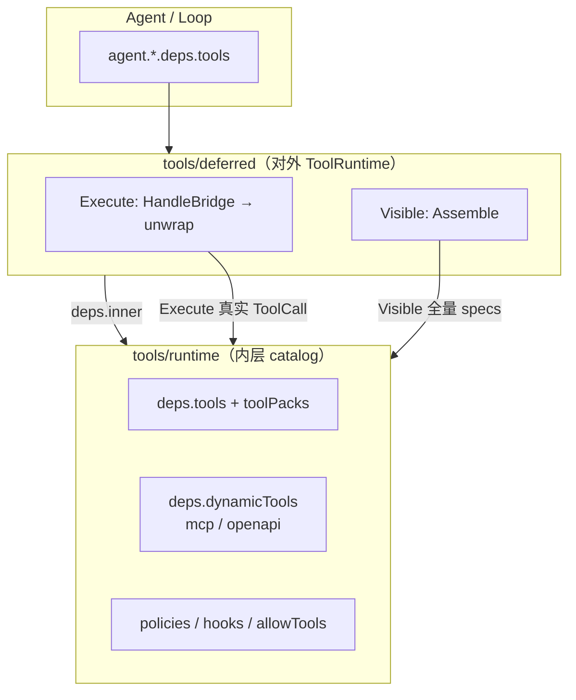

# 渐进式工具披露（`tools/deferred`）

当 MCP / OpenAPI 等动态工具数量很大时，每轮把全部 JSON Schema 塞进 LLM 会占用大量上下文，且多数工具与当前任务无关。本文定义 **包装型 `ToolRuntime`**：`tools/deferred` 包在 `tools/runtime` 之外，对模型做渐进披露（progressive disclosure），对执行仍走内层完整的 policy / hooks / 审批链路。

参考实现思路：[Hermes Tool Search](https://github.com/NousResearch/hermes-agent/blob/main/website/docs/user-guide/features/tool-search.md)（`tool_search` / `tool_describe` / `tool_call` 三桥 + listing）。

相关文档：[tools.zh.md](tools.zh.md)、[go-agent-harness-architecture.zh.md](../go-agent-harness-architecture.zh.md)、[subagent.zh.md](subagent.zh.md)。

## 1. 目标与非目标

### 目标

- **常驻工具**（`deps.tools` / `deps.toolPacks`）每轮完整暴露给模型。
- **动态工具**（`deps.dynamicTools`：MCP、OpenAPI 等）在开启披露时，模型侧主要看到三座「桥」工具，按需搜索 schema、再调用。
- 桥上的 `tool_call` 解开为真实工具名后，由 **内层 `tools/runtime`** 执行（policy、approval、hooks、timeout 与今天一致）。
- 子 Agent、worker、主 Agent 可通过 **不同 tools 实例** 选择是否启用披露（例如子 agent 无 MCP 则继续裸 `tools/runtime`）。

### 非目标（首版）

- 远程 Connector 网关（`connectors__*`）、与 Hermes Portal 的混合检索。
- 按「toolset / 平台预设」切工具集（继续用 `allowTools`、独立 `tools.*` 实例）。
- 默认把 `skill`、`delegate` 等核心工具 defer（可通过配置 `deferTools` 扩展，首版默认只 defer 动态来源）。

## 2. 架构总览



**设计原则**

| 原则 | 说明 |
|------|------|
| 内层不变 | `tools/runtime` 不拆 catalog/visible 双 map；MCP reload、`mcp -u` 语义不变 |
| 装饰器模式 | 与 `runtime/subagent/filter.go` 相同：`inner agentkit.ToolRuntime`，只改边界行为 |
| 逻辑在 runtime | 组装、检索、unwrap 放在 `runtime/tools/deferred/` 纯包，可单测 |
| 注册在 runtime | `pluginkit.Register("tools/deferred", …)` 与 `tools/runtime` 同目录族 |

## 3. 配置拓扑

### 3.1 推荐实例划分

| 实例 id | kind | 角色 |
|---------|------|------|
| `tools.catalog.default` | `tools/runtime` | 真实工具图：静态 + dynamicTools + policy |
| `tools.default` | `tools/deferred` | Agent 挂载入口；`deps.inner` → catalog |
| `tools.worker.default` | 同上或仅 catalog | worker 若需 MCP，可 `tools/deferred` + 独立 inner |
| `tools.subagent.default` | `tools/runtime` | 通常无 dynamicTools，**不包 deferred** |

示例：

```yaml
tools.catalog.default:
  use: tools/runtime
  config:
    defaultTimeoutSeconds: 120
    toolTimeouts:
      delegate: 900
      ask_user: 900
    # allowTools / denyTools 配在内层，对 unwrap 后的真实名生效
  deps:
    hooks: hooks.default
    tools:
      - tool.shell-bash.default
      - tool.skill.default
      # ...
    toolPacks:
      - tool.fs-workspace.default
    dynamicTools:
      - mcp.default
      - openapi.default
    policies:
      - policy.dangerous-shell.default

tools.default:
  use: tools/deferred
  config:
    enabled: true
    thresholdPct: 5
    listingMaxTokens: 4000
    searchDefaultLimit: 5
    maxSearchLimit: 25
    listing: auto   # auto | on | off
  deps:
    inner: tools.catalog.default
```

Agent 仍写 `deps.tools: tools.default`，仅将 `tools.default` 的 `use` 从 `tools/runtime` 改为 `tools/deferred`。

### 3.2 关闭披露

`tools/deferred.config.enabled: false` 时，外层 **透传**：`Visible` / `Execute` 直接委托 `inner`，行为与直接挂 catalog 等价。便于灰度与对比测试。

## 4. 运行时行为

### 4.1 Visible（每步 LLM 调用前）

```mermaid
sequenceDiagram
  participant Loop as agent loop
  participant D as tools/deferred
  participant R as tools/runtime inner

  Loop->>D: Visible(ctx)
  D->>R: Visible(ctx)
  R-->>D: specs[] 全量（含 MCP schema）
  D->>D: Classify + Assemble(config)
  Note over D: eager 保留<br/>deferrable 替换为三桥 + listing
  D-->>Loop: 精简 specs[]
```

步骤：

1. `inner.Visible(ctx)` 得到完整 `[]agentkit.ToolSpec`（含 dynamic 刷新）。
2. **分类**（见 §5）：每个 spec 标记 `eager` 或 `deferrable`。
3. **组装**：
   - 无 deferrable，或 `enabled: false` → 原样返回。
   - 有 deferrable 且 `enabled: true` → 返回 `eager specs + bridge specs`（三桥）；deferrable 的完整 schema **不**进入列表。
4. 若内层配置了 `allowTools` / `denyTools`，过滤在 **inner.Visible** 已生效；外层组装基于过滤后的列表。

**Listing（披露层级）**：与 Hermes 类似，将 deferrable 工具的「名称 + 短描述」嵌入 `tool_search` 的 description（受 `listingMaxTokens` 与 `thresholdPct` 约束）。超预算时降级为仅名称、再降级为按来源（MCP server / OpenAPI api）一行摘要，避免模型误以为能力不存在。

### 4.2 Execute

```mermaid
sequenceDiagram
  participant Loop as agent loop
  participant D as tools/deferred
  participant R as tools/runtime inner

  Loop->>D: Execute(call)
  alt call 为 tool_search / tool_describe
    D->>R: Visible(ctx) 作 catalog
    D->>D: Search / Describe(catalog)
    D-->>Loop: JSON 文本结果
  else call 为 tool_call
    D->>D: 校验参数，解析为真实 name + arguments
    D->>R: Execute(rewritten call)
    Note over R: policy / hooks / 真实 MCP 工具
    R-->>D: ToolResult
    D-->>Loop: ToolResult（Name 可保留真实名供 session）
  else 其它（eager 工具）
    D->>R: Execute(call)
    R-->>D: ToolResult
    D-->>Loop: ToolResult
  end
```

要点：

- **unwrap 在外层、委托在内层**：`tool_call` 不得在内层注册为 stub 后绕过 policy。
- `tool_search` / `tool_describe` 为只读目录操作，不经过 MCP 网络；catalog 来自当前 `inner.Visible`（与 Hermes `skip_tool_search_assembly` 等价）。
- Telemetry：unwrap 后对 generation 观测建议使用 **真实工具名**（与 Hermes activity 一致）；桥工具可记为 `tool.deferred.search` 等 span 名（实现细节）。

### 4.3 桥工具契约

| 模型工具名 | 作用 |
|------------|------|
| `tool_search` | 多 query 并行检索 deferrable catalog；返回按 query 分组的命中名 + 共享 `tools` 摘要 map |
| `tool_describe` | 批量加载完整 `parameters` JSON Schema |
| `tool_call` | `calls: [{name, arguments}, …]`；本地工具单次一条；批量规则首版与 Hermes 对齐（仅同类可批，混合拒绝） |

桥名保留 `tool_*` 前缀，与现有 `ask_user`、`web_fetch` 风格一致。注册时 **禁止** 内层 catalog 出现同名工具（构造时校验或文档约定）。

## 5. Defer 分类规则（首版）

在 `inner.Visible` 返回的 spec 列表上判定：

| 类别 | 规则 |
|------|------|
| **Eager（不 defer）** | 配置项 `eagerTools` 显式列出；或 **默认**：内层构造时记录的「静态工具名集合」（来自 `deps.tools` + `toolPacks` 注册名，在 deferred 初始化时从 inner 一次解析或配置传入） |
| **Deferrable** | 出现在 Visible 中、且 **不在** eager 集合中的工具（典型为 MCP / OpenAPI 动态名） |
| **桥工具** | 永不 defer；仅由外层组装注入 |

扩展（后续 PR）：

- `deferTools`：强制 defer 的 eager 名（如大型可选核心工具）。
- `deferSources`：按工具名前缀 / 标签（`mcp__`、`petstore__`）过滤。

**激活条件**：`enabled: true` 且 deferrable 非空（或 listing 仅连接器场景，首版不做）。与 Hermes 一致：「有没有 deferrable」决定是否出现桥，listing 预算只影响 description 丰富度。

## 6. 配置字段

`tools/deferred` 的 `config`：

| 字段 | 类型 | 默认 | 说明 |
|------|------|------|------|
| `enabled` | bool | `false`（首版建议，稳定后改 `true`） | `false` 时透传 inner |
| `thresholdPct` | number | `5` | listing 预算占模型上下文百分比上限（与 `listingMaxTokens` 取 min） |
| `listingMaxTokens` | int | `4000` | listing 绝对 token 上限 |
| `listing` | string | `auto` | `auto` / `on` / `off`：是否嵌入 catalog 清单到 `tool_search` description |
| `searchDefaultLimit` | int | `5` | 单次 query 默认命中数 |
| `maxSearchLimit` | int | `25` | query 的 `limit` 硬顶 |
| `eagerTools` | []string | 空 | 额外永不 defer 的工具名 |
| `deferTools` | []string | 空 | 额外强制 defer 的工具名（覆盖默认 eager） |

`deps`：

| 字段 | 类型 | 必填 |
|------|------|------|
| `inner` | `agentkit.ToolRuntime` | 是 |

内层 `tools/runtime` 的 `allowTools` / `denyTools` / `toolTimeouts` 仍在 catalog 实例上配置。

## 7. 与其它能力的关系

### 7.1 子 Agent（`filteredTools`）

子进程内子 Agent 使用 `newFilteredTools(ctx, parentTools, def.Tools, …)` 包装 **Agent 已注入的 ToolRuntime**。

约定：

- 主 Agent 注入 `tools.default`（deferred）→ 子 Agent 过滤的是 **组装后的可见名**（含三桥，不含数百 MCP 名）。
- `tool_call` unwrap 后 `inner.Execute` 仍执行 catalog 中的真实工具；若子 Agent 的 `tools:` 白名单不含该真实名，应在 **filter Execute** 层拒绝（今日 subagent 按 allowlist 拒绝）。因此子 Agent 定义里若要用 MCP，须在 `tools:` 中列出具体 MCP 名，或主 Agent 不给子 Agent 挂带 MCP 的 catalog——与现网行为一致，需在 subagent 文档补一句。

推荐包装顺序：

```text
filteredTools( tools/deferred( tools/runtime catalog ) )
```

### 7.2 MCP / OpenAPI reload

不变：reload 命令更新 **inner** 的 provider 缓存。下一轮 `inner.Visible` 反映新工具；外层 catalog 与 listing 自动更新。

### 7.3 `tool/skill`

Skill 目录在 prompt 中；`skill` 工具保持 eager。与工具桥互补，不合并为同一机制。

### 7.4 Policy

Policy 仅评估 **unwrap 后的** `call.Name`。`tool_search` / `tool_describe` 默认 allow；若需限制可后续加专用 policy kind。

## 8. 代码布局

```
runtime/tools/
  runtime.go          # 现有 tools/runtime，不修改语义
  register.go         # 增加 Register("tools/deferred", NewDeferred)
  deferred/
    deferred.go       # ToolRuntime 包装：Visible / Execute 入口
    config.go         # 配置解析与默认值
    classify.go       # eager vs deferrable
    assemble.go       # 三桥 schema + listing
    catalog.go        # 从 []ToolSpec 建检索索引
    search.go         # tool_search / tool_describe 实现（首版可用简单 token 匹配，再换 BM25）
    bridge.go         # tool_call 解析与参数校验
    deferred_test.go
```

不在 `plugins/` 新增包：与 `tools/runtime` 同属运行时执行平面。

**Eager 集合来源（实现二选一，推荐 A）**：

- **A**：`NewDeferred` 时调用 `inner.Visible` 一次，将当时可见且来自静态注册的工具名记入集合；动态名一律 deferrable。若静态工具也出现在 dynamic（重名），以内层 `tools` map 优先为准。
- **B**：catalog 实例配置 `deferredEagerSnapshot: [...]` 由 scaffold 生成。维护成本高，不推荐。

## 9. 检索实现（分阶段）

| 阶段 | 行为 |
|------|------|
| **P1** | 子串 / token 重叠排序，满足基本可用 |
| **P2** | BM25 + 英文 stem（对齐 Hermes `tool_search_catalog.py`） |
| **P3** | 按 MCP server / OpenAPI api 分组 listing 与 `available_sources` 提示 |

## 10. 实施计划

| PR | 内容 | 验收 |
|----|------|------|
| **1** | `tools/deferred` 透传模式 + 配置 + `config.base.yaml` 拆 `tools.catalog` / `tools.default`；`enabled: false` | 全量测试通过，行为与改前一致 |
| **2** | Classify + Assemble + 三桥 Visible；Execute 仅 eager 直通 | 集成测试：mock dynamic 工具多时不进 Visible |
| **3** | `tool_search` / `tool_describe` / `tool_call` + unwrap 委托 inner | 冒烟：桥调用真实 MCP mock |
| **4** | Listing 预算与降级 | 大 catalog 下单测 tier |
| **5** | 文档：`tools.zh.md` 链接、架构文档一小节、`plugin-catalog` 登记 kind |

## 11. 测试策略

- **单元测试**：`assemble`、`search`、`bridge` 解析与校验、listing 截断。
- **集成测试**：`agenttest` 图 fragment：inner 带 stub `ToolProvider` 返回 N 个假工具；deferred `Visible` 长度 ≈ eager + 3。
- **回归**：`enabled: false` 与直接 `tools/runtime` 的 Visible/Execute 字节级等价（spec 顺序可约定稳定排序）。

## 12. 已决 / 待决

| 项 | 决定 |
|----|------|
| 主实现形态 | 包装 `ToolRuntime`（本文） |
| unwrap 位置 | `tools/deferred.Execute`，再 `inner.Execute` |
| 内层是否修改 | 否 |
| 默认 `enabled` | **首版 `false`**，preset 显式开启 |

待产品确认：

- worker / 多 tenant 是否共用同一 `tools.catalog` 实例。
- 管理端列出「全部工具」是否新增命令（读 inner.Visible），或复用现有调试接口。

---

## 附录：与 Hermes 概念对照

| Hermes | AgentKit |
|--------|----------|
| `assemble_tool_defs` | `deferred.Assemble` |
| `_HERMES_CORE_TOOLS` | eager 静态集合 + `eagerTools` |
| `skip_tool_search_assembly` | 外层对 inner 取全量 Visible 作 catalog |
| `handle_function_call` unwrap | `deferred.Execute` → `inner.Execute` |
| `tools.tool_search` 配置 | `tools/deferred.config` |
