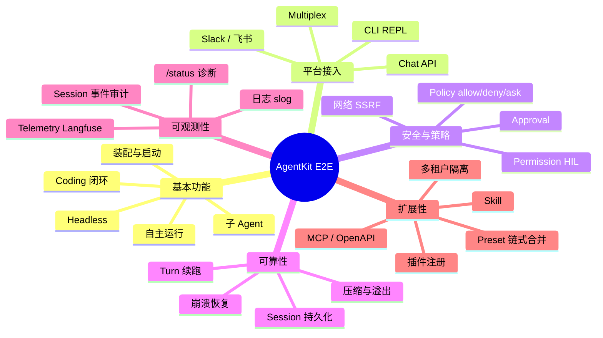
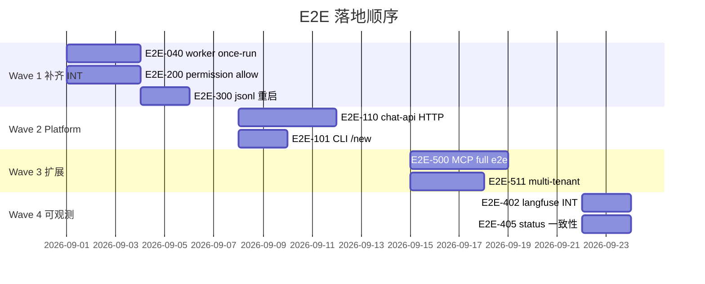

# E2E 场景梳理与用例目录

本文从**产品能力维度**梳理 AgentKit 需要支持的场景，并给出可落地的 **E2E 用例规格**（输入、断言、preset、测试层级）。实现时仍走 `pluginkit` 装配路径，与 [testing.zh.md](testing.zh.md) 的分层策略一致。

## 1. 能力维度总览



| 维度 | 核心验收问题 | 主要落点 |
|---|---|---|
| **基本功能** | 配好 preset 能否完成 coding / 自主 / 委派任务？ | `runtime/agent`、`runtime/loop`、`plugins/tool/*` |
| **平台接入** | 不同 ingress 能否收发消息、审批、/new？ | `runtime/platform/*` |
| **安全与策略** | 危险工具是否被 policy / approval 拦住？ | `plugins/policy`、`cap/permission` |
| **可靠性** | 崩溃、中断、预算耗尽后状态是否可恢复？ | `runtime/session`、`runtime/agent/recovery` |
| **可观测性** | 行为能否从 session 事件与 telemetry 复原？ | `events.go`、`plugins/telemetry/*` |
| **扩展性** | 新工具 / MCP / preset 能否无改 spine 接入？ | `pluginkit.Register`、`presets/` |

## 2. 测试分层与用例编号

| 前缀 | 层级 | 命令 | 特点 |
|---|---|---|---|
| `SMK-` | Smoke | `go test ./testing/smoke/...` | scripted LLM，无 API Key，默认 CI |
| `INT-` | Integration | `go test -tags=integration ./integration/...` | 真实 preset `RunOnce`，较慢 |
| `BLD-` | Build | `go test ./config/...` | preset 可 `build.Build[Runner]` |
| `E2E-` | 端到端（待建） | 见 §6 | 跨 platform / 进程 / 外部 mock，可选 CI |

**状态图例**：`✅` 已有覆盖 · `🔶` 部分覆盖 · `⬜` 待实现 · `🔧` 需真实 Key / 外部服务

## 3. 基本功能

### 3.1 装配与启动

| ID | 场景 | 优先级 | 状态 | 层级 |
|---|---|---|---|---|
| BLD-001 | 每个独立 preset 可 build | P0 | ✅ | `config/presets_test.go` |
| BLD-002 | 链式 preset 可 build（autonomous+worker 等） | P0 | ✅ | `TestPresetsChainedBuild` |
| SMK-001 | L0 最小图 fragment 构建 tool | P1 | ✅ | 各包 `agenttest.Build` |
| E2E-001 | `-manager` Web UI 启动、装配树可加载 | P2 | ⬜ | HTTP GET `/` |
| E2E-002 | `go generate ./...` 后新注册 kind 可被 build 引用 | P1 | ⬜ | CI import coverage |

### 3.2 Coding 闭环（读 / 写 / Shell）

| ID | 场景 | 输入 | 断言 | 状态 | 层级 |
|---|---|---|---|---|---|
| INT-001 | coding-smoke once-run | `"列出目录并读取 README"` | `turn/end` ≥1；`tool/result` ≥2 | ✅ | `integration/preset_smoke_test.go` |
| SMK-010 | scripted read 链 | turn + read tool | `turn/end`；derive 无 orphan call | ✅ | `testing/smoke/tool_test.go` |
| SMK-011 | policy deny 拒绝工具 | deny read | tool result 含拒绝；turn 正常结束 | ✅ | `tool_test.go` |
| E2E-010 | 写文件 + bash 组合 | coding preset | jsonl 含 write + bash 事件 | ⬜ | INT + scripted overlay |
| E2E-011 | gitignore 尊重 | read 被忽略路径 | 工具返回错误而非泄漏 | ⬜ | smoke + temp workspace |

### 3.3 自主运行（Turn Continue / Todo / Finish）

| ID | 场景 | 输入 | 断言 | 状态 | 层级 |
|---|---|---|---|---|---|
| INT-002 | autonomous-smoke once-run | `"读取 README 并汇报"` | 无 `session/recovery`；`run/finish` ≥1；`todo/update` ≥2；`turn/continue` ≥1 | ✅ | integration |
| E2E-020 | step-limit 触发续跑 | scripted 多步 | `turn/continue`；segments > 1 | ✅ | `testing/smoke/autonomous_test.go` |
| E2E-021 | 预算耗尽强制停止 | 极低 step 预算 | `turn/end`；无无限续跑 | ✅ | `testing/smoke/autonomous_test.go` |
| E2E-022 | stalled 检测（同参重复调用） | scripted 重复 tool | `turn/end` + stop reason | ✅ | `testing/smoke/autonomous_test.go` |
| E2E-023 | token-limit 触发压缩 | 大上下文 seed | `session/compaction` 事件 | ⬜ | smoke |

### 3.4 子 Agent 委派

| ID | 场景 | 输入 | 断言 | 状态 | 层级 |
|---|---|---|---|---|---|
| INT-003 | subagent-smoke once-run | `"调研一下 loop 串行机制"` | `AssertSubagentParentSession` | ✅ | integration |
| SMK-020 | 父→delegate→子→回传 | turn | 子 session 1 turn；父无 duplicate delegate | ✅ | `smoke_test.go` |
| SMK-021 | logical store session 映射 | chat-api 风格 ID | derive 无 interrupted；logical 事件正确 | ✅ | `smoke_test.go` |
| SMK-022 | 经 Loop.Dispatch 委派 | loop 入站 | 同上 | ✅ | `smoke_test.go` |
| SMK-023 | 第二轮 turn 子事件不泄漏 | 连续两轮 | 父 session 隔离 | ✅ | `subagent_test.go` |
| E2E-030 | 子 agent tools 白名单 | 定义仅 read | 子 session 无 write/bash | ⬜ | smoke |
| E2E-031 | 子 agent 超时 | 极低 timeout | `subagent/end` + 错误回传 | ⬜ | smoke |

### 3.5 Headless（Worker / Timer / Cron）

| ID | 场景 | 输入 | 断言 | 状态 | 层级 |
|---|---|---|---|---|---|
| BLD-003 | autonomous+worker 可 build | — | build 成功 | ✅ | presets_test |
| E2E-040 | worker prompt 模式 once-run | autonomous-smoke+worker | 任务完成；进程退出 | ✅ | `integration/preset_smoke_test.go` |
| E2E-041 | worker 多 task 顺序执行 | 3 个 prompt | 3 次 turn/end | ⬜ | headless 单测已有平台层 🔶 |
| E2E-042 | worker script 模式 | bash 脚本 | 不经 agent 直接执行 | ⬜ | INT |
| E2E-043 | cron 触发 + agent 排期 | cron preset | schedule 事件 + finish | ⬜ | INT + 短 cron |
| E2E-044 | 一次性提醒 | `schedule kind=delay in=5s` | `send` + `MarkFired` | ⬜ | 见 [schedule-timer.zh.md](schedule-timer.zh.md) |

## 4. 平台接入

### 4.1 CLI

| ID | 场景 | 断言 | 状态 | 层级 |
|---|---|---|---|---|
| E2E-100 | REPL 多轮对话 | 同一 session 串行 | 🔶 | loop_test 覆盖锁 |
| E2E-101 | `/new` 切换 logical session | 新 logical id；投递不变 | ✅ | `runtime/platform/cli/session_new_e2e_test.go` |
| E2E-102 | `/agent use` 绑定 | `agent.json` 写入；derive 过滤 | ⬜ | INT |
| E2E-103 | `/status` 输出运行态 | 含 budget / todo | ⬜ | CLI 单测 🔶 |

### 4.2 Chat API

| ID | 场景 | 断言 | 状态 | 层级 |
|---|---|---|---|---|
| E2E-110 | HTTP POST 消息 → SSE/JSON 回复 | 200 + assistant 内容 | ✅ | `runtime/platform/chatapi/runner_e2e_test.go` |
| E2E-111 | 会话发现 API | sessions 列表含测试 session | ⬜ | `sessions_discover_test` 单测 🔶 |
| E2E-112 | 文件上传附件 | 工具可读附件路径 | ⬜ | INT |

### 4.3 IM（Slack / 飞书）与 Multiplex

| ID | 场景 | 断言 | 状态 | 层级 |
|---|---|---|---|---|
| BLD-004 | slack / feishu / multiplex preset build | build 成功 | ✅ | presets_test |
| E2E-120 | Slack mock 入站 → 出站 | Outbound 格式正确 | ⬜ | mock webhook |
| E2E-121 | Multiplex 多 platform 共存 | 路由到正确 runner | ⬜ | INT |
| E2E-122 | 飞书卡片审批回调 | permission resolved | ⬜ | mock + feishu preset |

## 5. 安全、策略与人机交互

| ID | 场景 | 输入 | 断言 | 状态 | 层级 |
|---|---|---|---|---|---|
| SMK-030 | policy deny | read 被拒 | ✅ | tool_test |
| E2E-200 | policy ask → 用户 allow | ask_user / approval | `permission/request` → `resolved` → tool 执行 | ✅ | `testing/smoke/permission_test.go` |
| E2E-201 | policy ask → 用户 deny | deny | tool result 含拒绝 | ✅ | `testing/smoke/permission_test.go` |
| E2E-202 | permission 超时 | 短 timeout | `OutcomeTimeout`；turn 继续或停 | ⬜ | cap/permission 单测 🔶 |
| E2E-203 | headless 下 ask_user 降级 | web preset headless | 不挂 pending；返回 guidance | ⬜ | INT |
| E2E-204 | web_fetch 私网拦截 | loopback URL | dial 阶段拒绝 | ⬜ | web 单测 🔶 |
| E2E-205 | `policy/network-deny`（roadmap） | SSRF 尝试 | 统一策略拒绝 | ⬜ | 待 M2 |

## 6. 可靠性与 Session

| ID | 场景 | 输入 | 断言 | 状态 | 层级 |
|---|---|---|---|---|---|
| SMK-040 | orphan tool call 恢复 | seed 崩溃 | `session/recovery`；synthetic interrupted result | ✅ | recovery_test |
| SMK-041 | 干净 session 不触发 recovery | 正常 turn | recovery = 0 | ✅ | recovery_test |
| SMK-042 | 同 session 串行 | 并发 dispatch | 无交错 turn | ✅ | loop_test |
| SMK-043 | 跨 session 隔离 | 两 session 并行 | 事件不混 | ✅ | loop_test |
| E2E-300 | jsonl 持久化重启后继续 | 写盘后新进程 | 历史可 derive | ✅ | `integration/session_persist_test.go` |
| E2E-301 | compaction 后 derive 一致 | 触发压缩 | Model-visible ⟺ Logged | ⬜ | golden test |
| E2E-302 | follow-up inbox 崩溃恢复 | roadmap M2 | 排队消息不丢 | ⬜ | 待实现 |
| E2E-303 | Ctrl-C 优雅关停 | roadmap M2 | session flush 完整 | ⬜ | 待实现 |

## 7. 可观测性

| ID | 场景 | 断言 | 状态 | 层级 |
|---|---|---|---|---|
| E2E-400 | session 事件完整链路 | 一次 turn 含 start/end/tool/usage | 🔶 | smoke 部分断言 |
| E2E-401 | Langfuse exporter flush | mock ingestion API 收到 batch | ✅ | `langfuse_test.go` 单测 |
| E2E-402 | Langfuse preset 端到端 | langfuse-smoke once-run | exporter 在 turn 后 flush | ✅ | `integration/langfuse_test.go` |
| E2E-403 | telemetry 层级 trace | parent/subagent turn | 子 span 挂父 trace | 🔶 | hierarchy 单测 |
| E2E-404 | 日志 redact 敏感字段 | api key 不出现在 slog | ✅ | `cap/telemetry/redact_test` |
| E2E-405 | `/status` 与 session 事件一致 | budget 数字匹配 usage 累加 | ✅ | `integration/status_test.go` |

### 可观测性最小断言模板（INT/SMK 通用）

```go
// 一次完整 turn 的事件骨架
agenttest.AssertEventAtLeast(t, events, agentkit.EventTurnStart, 1)
agenttest.AssertEventAtLeast(t, events, agentkit.EventTurnEnd, 1)
agenttest.AssertDeriveMessagesToolCallsAnswered(t, sess, ctx)

// 自主运行
agenttest.AssertEventAtLeast(t, events, agentkit.EventRunFinish, 1)
agenttest.AssertEventAtLeast(t, events, agentkit.EventTodoUpdate, 1)

// 子 agent
agenttest.AssertSubagentParentSession(t, events)
```

## 8. 扩展性

### 8.1 动态工具

| ID | 场景 | 断言 | 状态 | 层级 |
|---|---|---|---|---|
| SMK-050 | OpenAPI mock + bind + turn | tool 调用 petstore | ✅ | openapi_test |
| INT-004 | web+web-smoke preset build | build 成功 | ✅ | web_smoke_test |
| SMK-051 | scripted web_search / web_fetch | 无真实网络 | ✅ | web_test |
| E2E-500 | MCP stdio server 绑定 | list_tools + call_tool | ✅ | `testing/smoke/mcp_test.go` |
| E2E-501 | MCP 配置热加载 | 改 mcp.json 后重绑 | ✅ | `integration/mcp_reload_test.go` |
| E2E-502 | OpenAPI 真实 HTTP（mock server） | 与 SMK-050 同路径走 INT | ✅ | `integration/openapi_test.go` |

### 8.2 Skill / Prompt / 多租户

| ID | 场景 | 断言 | 状态 | 层级 |
|---|---|---|---|---|
| E2E-510 | skill 加载事件 | `skill/load` in session | ✅ | `testing/smoke/skill_test.go` |
| E2E-511 | 多租户目录隔离 | 两 tenant key 各写文件 | work/ 不交叉 | ✅ | `integration/multi_tenant_test.go` |
| E2E-512 | sessionScope thread vs channel | 不同 delivery 折叠 | effective ID 正确 | ✅ | `testing/smoke/session_scope_test.go` |
| E2E-513 | inject 前缀写入 session 后原样回放 | 多用户 channel | derive 含 `[agentkit ...]` | ✅ | `testing/smoke/session_attribution_test.go` |
| BLD-005 | autonomous+multi-tenant build | — | ✅ | presets_test |

### 8.3 ACP Remote

| ID | 场景 | 断言 | 状态 | 层级 |
|---|---|---|---|---|
| BLD-006 | acp-remote preset build | build 成功 | ✅ | presets_test |
| E2E-520 | ACP 远程 agent 委派 | 外部进程响应 | ⬜ | 需 mock ACP server |

## 9. 优先级与落地 waves



| Wave | 目标 | 新增用例 |
|---|---|---|
| **W1** | 补齐 preset 级 once-run 缺口 | worker、permission、jsonl 重启 |
| **W2** | Platform ingress 可自动化 | chat-api、CLI 命令 |
| **W3** | 扩展性与多租户 | MCP、multi-tenant 写隔离 |
| **W4** | 可观测性端到端 | Langfuse INT、status 一致性 |

## 10. 用例编写模板

新增 E2E 时复制以下结构到 `testing/smoke/` 或 `integration/`：

```go
func TestE2E040WorkerOnceRun(t *testing.T) {
    if testing.Short() {
        t.Skip("integration")
    }
    result := presettest.RunOnce(t,
        "读取 README 并 finish",
        "presets/autonomous-smoke.yaml",
        "presets/worker.yaml",
    )
    ctx := context.Background()
    events := agenttest.SessionEvents(t, ctx, result.Store, result.SessionID)

    agenttest.AssertEventAtLeast(t, events, agentkit.EventRunFinish, 1)
    agenttest.AssertEventAtLeast(t, events, agentkit.EventTurnEnd, 1)
    if got := agenttest.CountEvents(events, agentkit.EventSessionRecovery); got != 0 {
        t.Fatalf("session/recovery = %d, want 0", got)
    }
}
```

**编写原则**（与 [testing.zh.md](testing.zh.md) 一致）：

1. 断言优先 session 事件，而非 stdout 文本。
2. 复用 `agenttest` / `presettest`，不复制装配代码。
3. 需要交互的 platform 用 mock `Interactive=true` + 注入 `Reply`。
4. 并行：smoke 用 `t.Parallel()`；integration preset 默认串行（cwd 共享）。
5. 新 preset 先加 `BLD-*`，再考虑 `INT-*`。

## 11. 覆盖率快照（2026-08）

| 维度 | 已覆盖 | 待补 | 覆盖率（粗估） |
|---|---|---|---|
| 装配 build | 18 preset + 6 chain | manager UI | ~85% |
| Coding / 工具 | read、deny、openapi | write+bash INT | ~70% |
| 自主运行 | autonomous-smoke + step-limit/预算/stalled | 压缩 | ~75% |
| 子 Agent | 6 smoke + 1 INT | 白名单/超时 | ~75% |
| Headless | build + INT once-run | cron/script | ~60% |
| Platform | chat-api HTTP E2E、CLI /new、单测分散 | IM E2E | ~50% |
| 安全与策略 | deny、permission allow/deny | headless 降级 | ~55% |
| 可靠性 | recovery + loop 锁 + jsonl 重启 | 跨进程 jsonl | ~75% |
| 可观测性 | langfuse 单测 + INT turn flush、status 一致性 | — | ~70% |
| 扩展性 | openapi + MCP + skill + scope/attribution | — | ~80% |

---

维护：新增场景时同步更新本文 §3–§8 表格与 §11 快照；实现后把状态改为 ✅ 并链接测试文件。
