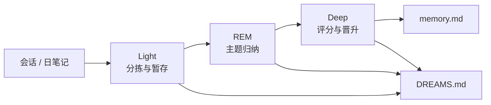

# 自我学习：Dreaming、Dream Diary 与 Skill Workshop

本文描述 AgentKit 借鉴 [OpenClaw 2.0](https://docs.openclaw.ai/concepts/dreaming) 的记忆巩固与技能治理模型，在 `learning/default` 上的落地方式。

相关文档：[plugin-catalog.zh.md](../plugin-catalog.zh.md)、[roadmap.zh.md](../roadmap.zh.md)。

## 1. OpenClaw 对照

| OpenClaw 能力 | 作用 | AgentKit 落点 |
|---|---|---|
| **Grounded Dreaming** | 三阶段后台巩固：Light → REM → Deep，仅 grounded 片段可晋升 `MEMORY.md` | `plugins/learning/dreaming` |
| **Dream Diary** | `DREAMS.md` 叙事日志，供人审阅，**不参与晋升** | 租户根 `DREAMS.md` |
| **Skill Workshop** | 提案先行（`PROPOSAL.md`），扫描通过后 apply 才写 `SKILL.md` | `plugins/learning/workshop` |
| **Self-learning** | `auto` / `propose` / `off` 三档自主捕获 | `learning.workshop.mode` |

## 2. 文件布局

租户 local 根（如 `.agentkit/chat-api_default_channel/` 或 `tenants/slack_C001/`）：

```
├── memory.md              # 长期记忆（prompt/section/memory 注入）
├── DREAMS.md              # Dream Diary（只读审阅，不注入模型）
└── memory/
    └── dreaming/
        ├── state.json     # 短期信号、召回计数、检查点
        └── deep/
            └── YYYY-MM-DD.md   # Deep 阶段报告（可选）

work/                      # shell 默认 cwd 与临时产物
└── ...

work/skills/               # 或 local:skills 解析目录
└── .workshop/
    └── <proposal-id>/
        ├── meta.json
        └── PROPOSAL.md
```

## 3. Dreaming 三阶段



| 阶段 | 写入 memory.md | 写入 DREAMS.md |
|---|---|---|
| Light | 否 | `## Light Sleep` 摘要 |
| REM | 否 | `## REM Sleep` 摘要 |
| Deep | 是（通过门槛者） | `## Deep Sleep` 摘要 |

### 3.1 Grounded 原则

- 只有带来源引用的片段可进入 Deep 候选（`source=session:<id>` 或 `source=learn-*`）。
- `DREAMS.md` 与阶段报告**永不**作为晋升来源。
- session ingestion 会记录已处理事件指纹，重复 sweep 不会把同一条消息重复计数。
- `/learn memory` 写入长期记忆成功后，dreaming signal 记录失败只返回 warning，不回滚已写入的 `memory.md`。

### 3.2 Deep 评分门槛（默认）

| 信号 | 权重 | 说明 |
|---|---|---|
| relevance | 0.30 | 偏好/纠正类关键词命中 |
| frequency | 0.24 | 短期信号累计次数 |
| queryDiversity | 0.15 | 不同 session 来源数 |
| recency | 0.15 | 时间衰减 |
| consolidation | 0.10 | 跨天重复 |
| richness | 0.06 | 内容长度与结构 |

默认门槛：`minScore=0.75`、`minRecallCount=3`、`minUniqueSessions=2`。

## 4. Dream Diary

每次 sweep 在各阶段结束后追加结构化摘要块。内容为确定性模板（不调用 LLM），避免日记污染晋升链路。

示例：

```markdown
## Light Sleep — 2026-09-01T03:00:00Z

- ingested 4 sessions, 18 signals
- staged 6 new candidates, reinforced 2

## REM Sleep — 2026-09-01T03:00:01Z

- themes: yaml-config (3), testing (2), deploy (1)

## Deep Sleep — 2026-09-01T03:00:02Z

- promoted 2 entries to memory.md
- skipped 4 below threshold
```

## 5. Skill Workshop

### 5.1 生命周期

```text
create/update → pending → apply → applied
              ↘ reject → rejected
```

- **仅 apply 写入 live `SKILL.md`**；create 不会写入已存在的 skill 目录，手写 skill 目录只读。
- apply 前运行 scanner（密钥、危险模式、体积上限 10000 字符）。
- 最多 **3** 个 pending 提案（对齐 OpenClaw Workshop 可审阅上限）。

### 5.2 自主模式

| `workshop.mode` | 行为 |
|---|---|
| `off` | 不自动捕获；仅 `/learn skill` 显式创建 |
| `propose`（默认） | 高信号会话可生成 pending 提案，需人工 apply |
| `auto` | scanner 通过的 create 提案自动 apply |

## 6. `/learn` 命令

```text
/learn                         查看 memory.md
/learn memory <text>           立即追加记忆
/learn remove <text>           删除匹配条目
/learn session                 从当前会话沉淀（同时记录 dreaming 信号）
/learn dream status            dreaming 状态
/learn dream run               手动执行一次三阶段 sweep
/learn dream on|off            开关后台 sweep（learning/dream-sweep）
/learn skill [focus]           从当前会话生成 skill 提案
/learn workshop list           列出 pending 提案
/learn workshop show <id>      查看提案
/learn workshop apply <id>     应用提案
/learn workshop reject <id>    拒绝提案
/learn help                    帮助
```

## 7. 调度

`learning/dream-sweep` 实现 `schedule.Runtime`，由 runner 与 `schedule/cron` 并列启动。默认 cron `0 3 * * *`（每天 03:00）。

当前后台 sweep 使用启动时的 workspace context，适合单工作区配置；`workspace/tenant` 的全租户枚举需要后续补 tenant registry。多租户入口可先用 `/learn dream run` 在具体会话内手动触发。

L0 [config.base.yaml](../../config.base.yaml) 已装配 `learning.default`（`dreaming.enabled: true`、`workshop.mode: propose`），**默认不启用**后台 sweep 实例——`learning.dreamSweep` 以注释形式保留在 `learning.default` 与 `runner.default` 旁，避免未配置多租户时误跑全局 sweep。需要定时巩固时取消注释并挂到 `runner.deps.schedules`：

```yaml
# L0 中 learning.default 已存在；仅补充可选 sweep 实例与 runner 挂载
learning.dreamSweep:
  use: learning/dream-sweep
  deps:
    learning: learning.default

runner.default:
  deps:
    schedules:
      - schedule.cron
      - learning.dreamSweep   # 可选；也可仅 /learn dream run
```

## 8. 与 prompt/section/memory 的关系

- `memory.md`：继续由 `prompt/section/memory` 向上搜索并注入。
- `DREAMS.md`：**不注入**模型上下文。
- Skill 提案在 apply 前对 agent 不可见；apply 后由 `skill/filesystem` 发现。

## 9. 后续（未做）

- LLM 驱动的 Dream Diary 叙事子 agent
- `memory forget` 与会话准入策略
- Deep 阶段从 live session 重新 rehydrate source snippet
- 周度 collection review（skill 去重/合并）
- SQLite 信号索引与跨 session 全文检索（依赖 roadmap M3 `session/sqlite`）
