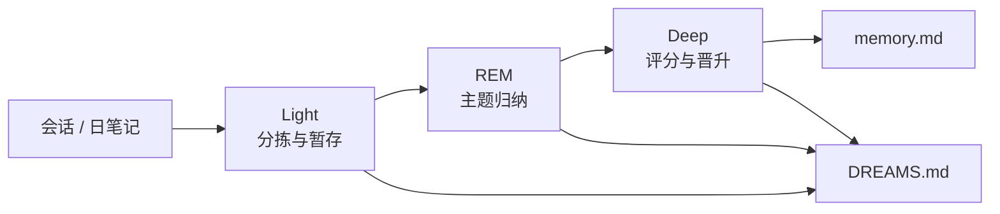
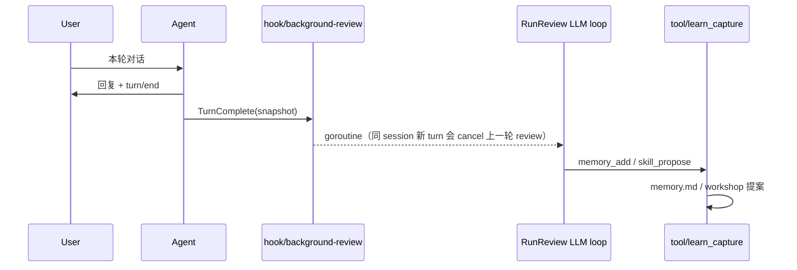

# 自我学习：Dreaming、Dream Diary 与 Skill Workshop

本文描述 AgentKit 借鉴 [OpenClaw 2.0](https://docs.openclaw.ai/concepts/dreaming) 的记忆巩固与技能治理模型，在 `learning/default` 上的落地方式。

相关文档：[plugin-catalog.zh.md](../plugin-catalog.zh.md)、[roadmap.zh.md](../roadmap.zh.md)、[todo.md](todo.md)（后续改进清单）。

## 1. OpenClaw 对照

| OpenClaw 能力 | 作用 | AgentKit 落点 |
|---|---|---|
| **Grounded Dreaming** | 三阶段后台巩固：Light → REM → Deep，仅 grounded 片段可晋升 `MEMORY.md` | `plugins/learning/dreaming` |
| **Dream Diary** | `DREAMS.md` 叙事日志，供人审阅，**不参与晋升** | 租户根 `DREAMS.md` |
| **Skill Workshop** | 提案先行（`PROPOSAL.md`），扫描通过后 apply 才写 `SKILL.md` | `plugins/learning/workshop` |
| **Self-learning** | `auto` / `propose` / `off` 三档自主捕获 | `learning.workshop.mode` |

## 2. 文件布局

`learning.default.config.memoryRoot` 控制 `memory.md`、`memory/dreaming/`、review 暂存等路径（默认 `"."` = 当前租户 **local** 根）。单部署希望全 channel 共用一份记忆时，在 L1 设 `memoryRoot: global:.`（解析到 `workspace` 的 global 根，如 `~/.agentkit` 或 L1 的 `global:` 目录）。

默认（`memoryRoot: "."`）落在租户 local 根（如 `.agentkit/chat-api_default_channel/` 或 `tenants/slack_C001/`）：

```
├── memory.md              # 长期记忆（prompt/section/memory 注入）
├── DREAMS.md              # Dream Diary（只读审阅，不注入模型）
└── memory/
    └── dreaming/
        ├── state.json     # 短期信号、召回计数、检查点
        └── deep/
            └── YYYY-MM-DD.md   # Deep 阶段报告（可选）

work/                      # shell 默认 cwd 与临时产物
└── ...

work/skills/               # 或 local:skills 解析目录
└── .workshop/
    └── <proposal-id>/
        ├── meta.json
        └── PROPOSAL.md
```

## 3. Dreaming 三阶段



| 阶段 | 写入 memory.md | 写入 DREAMS.md |
|---|---|---|
| Light | 否 | `## Light Sleep` 摘要 |
| REM | 否 | `## REM Sleep` 摘要 |
| Deep | 是（通过门槛者） | `## Deep Sleep` 摘要 |

### 3.1 Grounded 原则

- 只有带来源引用的片段可进入 Deep 候选（`source=session:<id>` 或 `source=learn-*`）。
- `DREAMS.md` 与阶段报告**永不**作为晋升来源。
- session ingestion 会记录已处理事件指纹，重复 sweep 不会把同一条消息重复计数。
- `/learn memory` 写入长期记忆成功后，dreaming signal 记录失败只返回 warning，不回滚已写入的 `memory.md`。

### 3.2 Deep 评分门槛（默认）

| 信号 | 权重 | 说明 |
|---|---|---|
| relevance | 0.30 | 偏好/纠正类关键词命中 |
| frequency | 0.24 | 短期信号累计次数 |
| queryDiversity | 0.15 | 不同 session 来源数 |
| recency | 0.15 | 时间衰减 |
| consolidation | 0.10 | 跨天重复 |
| richness | 0.06 | 内容长度与结构 |

默认门槛：`minScore=0.75`、`minRecallCount=3`、`minUniqueSessions=2`。

## 4. Dream Diary

每次 sweep 在各阶段结束后追加结构化摘要块。内容为确定性模板（不调用 LLM），避免日记污染晋升链路。

示例：

```markdown
## Light Sleep — 2026-09-01T03:00:00Z

- ingested 4 sessions, 18 signals
- staged 6 new candidates, reinforced 2

## REM Sleep — 2026-09-01T03:00:01Z

- themes: yaml-config (3), testing (2), deploy (1)

## Deep Sleep — 2026-09-01T03:00:02Z

- promoted 2 entries to memory.md
- skipped 4 below threshold
```

## 5. Skill Workshop

### 5.1 生命周期

```text
create/update → pending → apply → applied
              ↘ reject → rejected
```

- **仅 apply 写入 live `SKILL.md`**；create 不会写入已存在的 skill 目录，手写 skill 目录只读。
- apply 前运行 scanner（密钥、危险模式、体积上限 10000 字符）。
- 最多 **3** 个 pending 提案（对齐 OpenClaw Workshop 可审阅上限）。

### 5.2 自主模式

| `workshop.mode` | 行为 |
|---|---|
| `off` | 不自动捕获；仅 `/learn skill` 显式创建 |
| `propose`（默认） | 高信号会话可生成 pending 提案，需人工 apply |
| `auto` | scanner 通过的 create 提案自动 apply |

## 6. `/learn` 命令

### 6.1 写入策略（租户 `memory/learning/policy.json`）

在 **需授权** 与 **自动** 之间切换，优先级高于 L0 的 `review.writeApproval` / `workshop.mode`（`/learn policy reset` 恢复为配置默认）：

| 命令 | 效果 |
|---|---|
| `/learn policy` | 查看当前 memory / skills 策略 |
| `/learn policy memory approve` | background-review 写入进 `memory/.staged/`，需 `/learn approve` |
| `/learn policy memory auto` | background-review 直接写 `memory.md` |
| `/learn policy skills propose` | skill 提案进 workshop，需 apply |
| `/learn policy skills auto` | scanner 通过后自动写入 `skills/` |
| `/learn policy skills off` | 关闭自动捕获（显式 `/learn skill` 仍可用，除非 L0 `workshop.mode=off`） |

说明：`/learn memory`、手动 `/learn skill` 不受 memory approve 限制；Dreaming Deep 晋升 `memory.md` 仍为规则驱动、与 review 策略无关。

```text
/learn                         使用说明（同 /learn help）
/learn show                    查看 memory.md（不含 staged 待审批）
/learn memory <text>           立即追加记忆
/learn remove <text>           删除匹配条目
/learn session                 从当前会话沉淀（同时记录 dreaming 信号）
/learn dream status            dreaming 状态
/learn dream run               手动执行一次三阶段 sweep
/learn dream on|off            开关后台 sweep（learning/dream-sweep）
/learn skill [focus]           从当前会话生成 skill 提案
/learn workshop list           列出 pending 提案
/learn workshop show <id>      查看提案
/learn workshop apply <id>     应用提案
/learn workshop reject <id>    拒绝提案
/learn help                    帮助
```

## 7. 调度

`learning/dream-sweep` 实现 `schedule.Runtime`，由 runner 与 `schedule/cron` 并列启动。默认 cron `0 3 * * *`（每天 03:00）。

L0 [config.base.yaml](../../config.base.yaml) 默认挂载 `learning.dreamSweep` 到 `runner.deps.schedules`（与 `schedule.cron` 并列）。`workspace/tenant` 下按各租户 local 根独立 sweep；单租户 `workspace/default` 只跑当前根。仍可用 `/learn dream off` 关闭 dreaming，或从 L1 去掉 `learning.dreamSweep` 实例以禁用后台 sweep。

## 8. 与 prompt/section/memory 的关系

- `memory.md`：继续由 `prompt/section/memory` 向上搜索并注入。
- `DREAMS.md`：**不注入**模型上下文。
- Skill 提案在 apply 前对 agent 不可见；apply 后由 `skill/filesystem` 发现。

## 9. Background Review（Hermes 式激进路径）

每轮 **成功结束** 的 turn（已发出 `turn/end`、未取消）后，`hook/background-review` 在后台 fork 一次 **独立 LLM 工具循环**，不写入主 session 历史、不阻塞用户下一条消息。



| 项 | 行为 |
|---|---|
| 触发 | `TurnCompleteHook`（`runtime/agent` 在 turn 成功 defer 中调用） |
| 工具 | 仅 `learn_capture`（`memory_add`、`memory_remove`、`skill_propose`） |
| 记忆来源 | `source=background-review`，并记录 dreaming signal（与 `/learn memory` 一致） |
| 技能 | 走 Workshop：`workshop.mode=propose` 为 pending；`auto` 则 scanner 通过后直接 apply |
| 跳过 | 无有效用户文本、或近端只有 `/` 命令（`skipSlashOnly: true`） |
| 关闭 | `hook.background-review` 配置 `enabled: false`，或从 `hooks.default` deps 移除该 provider |
| 写入审批 | `learning.default.config.review.writeApproval: true` 时，review 的 `memory_add` 进入 `memory/.staged/`，用 `/learn pending`、`/learn approve <id>`；默认 `false`（auto，直接写 `memory.md`） |
| 节流 | `maxReviewsPerDay`、`minTurnTokens`、`minIdleSeconds`（见 `hook.background-review` config） |
| LLM | 默认 `llm.review`（如 `gpt-4o-mini`），与主 agent `llm.fallback` 分离 |
| 关停 | `runner.Stop` 调用 `CancelAllBackgroundReviews()` |
| 可观测 | OpenTelemetry span `learning.review`；`notify: true` 时额外 slog `learning notification` |

L0 默认已挂载 `tool.learn-capture.default` 与 `hook.background-review.default`（见 [config.base.yaml](../../config.base.yaml)）。

与 **Dreaming sweep** 的关系：review 负责「刚结束这一轮」的 LLM 判断；sweep 仍负责跨会话、无 LLM 的 grounded 晋升。两者可同时开启。

### 9.1 跨 session 检索（P1）

- **`session/sqlite-index`**：按租户 workspace 在 `sessions/.index.sqlite` 维护 FTS5；`hook/session-index` 在每轮成功后异步 sync。
- **`tool/session-query`**：主 Agent 可搜索本租户全部 `session/store` JSONL 历史。
- **Background review**：若配置了 `sessionIndex`，会把与本轮最后一条用户消息相关的检索摘要附在 review digest 末尾，便于避免重复记忆。

### 9.2 memory.md 与 prompt 冻结

- **Frozen snapshot**：同一 turn 内 `prompt/section/memory` 在首次组装时快照 `memory.md`；本 turn 内后续 step（含 background review 写入）**下一 turn** 才会进入 system prompt。

### 9.3 多租户 dreaming sweep

`learning/dream-sweep` 在 `workspace/tenant` 下通过 `WalkLocalTenants` 对每个 local 根单独判断 cron 并执行 sweep，各自使用 `memory/dreaming/state.json`。

## 10. 后续（未做）

可执行清单与优先级见 **[todo.md](todo.md)**。摘要：

- LLM 驱动的 Dream Diary 叙事子 agent
- `memory forget` 与会话准入策略
- Deep 阶段从 live session 重新 rehydrate source snippet
- 周度 collection review（skill 去重/合并）——可参考 Hermes Curator
- review 的 `write_approval` 与 IM 侧 `💾` 通知
- 独立 auxiliary 模型（`hook.background-review.config.model` 已支持覆盖；未做专用 cheap LLM 实例图）
- Curator 与更细的 dreaming/review 写入门策略（见 [todo.md](todo.md) P2）
