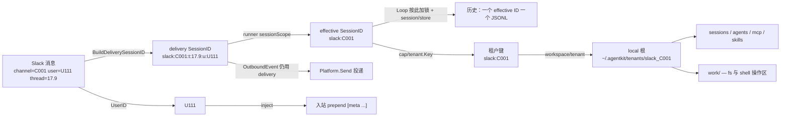

# 多租户：一个进程服务多个群

一个常驻 agent 进程同时服务多个 Slack 频道（或飞书群、多个项目）时，要同时回答三个**互相独立**的问题：

| 问题 | 由谁回答 | 落点 |
|---|---|---|
| 这条消息接到哪段历史后面？ | `runner.config.sessionScope` 折叠 delivery SessionID | `runtime/session.ApplyScope` |
| 这句话是谁说的？ | `runner.config.inject` 入站 prepend `[meta ...]` | `runtime/runner/inbound_format`、`MessageEvent.UserID` / `Metadata` |
| 这个 turn 在哪个目录干活？ | effective SessionID 推出的**租户键** | `cap/tenant.Key`、`workspace/tenant` |

把三者拆开是这套设计的核心。**会话粒度与工作目录粒度可以分别决定**：一个群从"整群共用一段历史"改成"每个 thread 一段历史"，工作目录不会跟着分裂 —— 因为三种 scope 推出的租户键都是同一个。



## 1. 会话隔离

Platform 只生成 **delivery SessionID**（最细粒度，含 channel / thread / user 路由信息）。Runner 按 `sessionScope` 折叠为 **effective SessionID**，Loop 按 effective 串行加锁。`/new` 不改变 IM 的 delivery key，而是在 `session/store` 里把稳定 key 映射到新的 **logical SessionID**；没有映射时 logical id 默认等于 effective id。Outbound 仍回写 delivery ID，platform 据此投递。

Platform 侧：

```go
delivery := session.BuildDeliverySessionID("slack", channelID, threadTS, userID)
// MessageEvent.SessionID = delivery
```

Runner 侧（`config.base.yaml` 或 preset）：

```yaml
runner.default:
  config:
    sessionScope: channel   # channel | thread | user，默认 channel
```

| sessionScope | effective SessionID | 语义 |
|---|---|---|
| `channel` | `slack:C001` | 整群共用一段历史，靠用户归属区分发言人 |
| `thread` | `slack:C001:t:1712345678.9` | 每个 thread 一段历史，群里的顶层消息共用一段 |
| `user` | `slack:C001:u:U456` | 共享工作目录、各自私有历史 |

未知 scope 配置值回落到 `channel`。

### `/new` 与 logical SessionID

Slack / 飞书这类 IM 的 sessionKey 是固定投递地址，不能因为 `/new` 改掉。`/new` 只更新 active-session 映射：

| key | value | 文件 |
|---|---|---|
| stable delivery/effective SessionID | 当前 logical SessionID | `sessions/<stable>/current.json` |

Runner 每次入站先拿 delivery / effective key 查 active mapping，查到就把 logical id 写入 `KeyStoreSessionID`；Agent 读写历史时使用这个 logical id。这样同一个 IM 或 chat-api 入口可以切到新历史，回复仍投回原来的 channel/thread/user/conversation。

### Agent 路由

与 `sessionScope` 一样，agent 选择在 **Runner** 统一完成：折叠 effective SessionID 并解析 logical SessionID 后，从持久化存储读出绑定，写入 `MessageEvent.AgentID` 再交给 Loop。

| 优先级 | 来源 | 存储 |
|---|---|---|
| 1 | 单条消息 | Platform 入站时填入 `MessageEvent.AgentID`（如 chat-api 请求体、platform 自己的索引） |
| 2 | Session 绑定 | `sessions/<logical-id>/agent.json`（`/agent use <id>` 写入） |
| 3 | 默认 | `loop.defaultAgent` |

Runner **不**维护静态路由表。channel / user 级绑定由 Platform 读自己的配置或索引，在 `Receive` 时写入 `MessageEvent.AgentID`；session 级切换写入 logical session 工作目录下的 `agent.json`。`DeriveMessages` 按当前 `agent_id` 过滤回放，同一会话文件里切换 agent 不会串上下文。

## 2. 识别不同用户

`sessionScope: channel` 下整个频道共用一段历史，模型看到的是一串 user 消息。如果不标注发言人，它分不清"这是刚才那个人的追问"还是"另一个人的新需求"。

**推荐做法**：配置 `runner.config.inject`（`presets/multi-tenant.yaml` 已默认注入发言人相关字段）。Runner 在交给 Loop 之前 prepend 一行 cc-connect 风格的元数据，Platform 只填原始 `Message` 与 `Metadata`：

```yaml
runner.default:
  config:
    inject:
      - sender_id
      - sender_name
      - sender_email      # 可选，Metadata 有 email 时注入
      - platform
      - chat_id
      - timestamp         # 可选
      - task_id           # 可选，来自 Metadata
      - trace_id
      - language
      - custom.*          # 可选，Metadata 中 custom.* 前缀键
    defaultTimezone: Asia/Shanghai
```

示例：

```text
[meta timestamp="2026-08-31T10:00:00+08:00" timezone="Asia/Shanghai" sender_id=U111 sender_name="Alice" platform=slack chat_id=C001 task_id="job-9"]
改一下 README
```

| inject 项 | 来源 | 输出 attr |
|---|---|---|
| `sender_id` | `MessageEvent.UserID` | `sender_id=U111` |
| `sender_name` | Metadata（displayName / userName / name 等） | `sender_name="Alice"` |
| `sender_email` | Metadata（email / sender_email） | `sender_email="..."` |
| `platform` | `MessageEvent.PlatformID` 或 delivery SessionID | `platform=slack` |
| `chat_id` | delivery SessionID 的 channel 段 | `chat_id=C001` |
| `timestamp` | 当前时间 + 时区 | `timestamp="RFC3339" timezone="IANA"` |
| `task_id` / `trace_id` / `language` | Metadata（含常见 HTTP header 别名） | `task_id="..."` 等 |
| `custom.*` | Metadata 键前缀匹配 | `custom.tenant="..."` 等 |
| 任意其它键 | Metadata 精确匹配 | `org_id="..."` 等 |

`UserID` 仍落在 **事件信封**（`SessionEvent.UserID`）供审计与 tool `metadata.*` 绑定；模型可见的上下文由入站时写入 session 的 `[meta ...]` 前缀承担。

单条跳过前缀：`MessageEvent.Metadata.skipPromptMeta: true`（chat-api 可通过 HTTP header 映射）。

三条固定规则：

- **只标 user 消息。** assistant 不应带发言人标注。
- **逐条独立判定。** 不做"出现第二人才追溯标注全部历史"。
- **`UserID` 为空时 sender 相关项跳过。** CLI、timer、worker 不受影响。

## 3. 不同群不同工作目录

**为什么这一层不需要改任何下游插件**：`workspace.Service.Resolve(ctx, rel)` 本身带 ctx，而 fs 工具、shell、skills、AGENTS.md、mcp.json、`session/store`、subagent 定义目录**全部**经它解析路径，且都是每次调用现算、不缓存解析结果。所以把 local 根按租户分开，隔离就自动贯穿到全部文件访问。

### local 根 vs tool 工作区

local 根放**运行时与配置**，tool 只在 **`work/` 子目录**读写，避免 `rm`、`mv` 之类操作误伤 `sessions/` 或 `mcp.json`：

```
tenants/slack_C001/
├── sessions/          # session/store：*.jsonl + <stable>/current.json + <logical>/agent.json
├── agents/            # 子 agent 定义
├── mcp.json
├── skills/            # 租户私有 skill
└── work/              # fs / shell 的操作区（preset 默认 root）
```

`presets/multi-tenant.yaml` 把 `tool/fs-workspace`、`tool/shell-bash`、`prompt/section/agents-md` 的 `root` / `workDir` 都指到 `work`，与 coding preset 里「`.agentkit` 放运行时、`..` 落到项目根」是同一思路，但多租户**不允许 `..`**，所以用子目录而不是向上一级。

```yaml
workspace.default:
  use: workspace/tenant
  config:
    global: ~/.agentkit              # 全租户共享：技能库、子 agent 定义、公共 mcp.json
    localBase: ~/.agentkit/tenants   # 每租户一个子目录
    scope: local                     # 不带前缀的路径落在调用方自己的租户根下
    tenants:                         # 钉到已有项目时，local 根指向项目下的 .agentkit/
      "slack:C123ABC":
        root: ~/work/project-a/.agentkit

tool.fs-workspace.default:
  config:
    root: work                       # 只在此子目录读写
```

- **默认就是隔离的。** 没在 `tenants` 里列出的群走 `localBase/<租户键>`，新群接进来零配置。
- **`omitPlatformPrefix: true`** 时目录名只保留路由段：`slack:C001` → `C001`，`chat-api:slack_x` → `slack_x`（`tenants` 映射键仍是完整租户键）。
- **`tenants` 的键是租户键，不是 SessionID。** 该频道下所有 thread、所有人共用这一条。
- **`global:` 是唯一共享的根。** 装一次的技能库对所有群可见。
- **没有 session 时落在 `localBase/_default`。** timer、cron、库直调不会掉进某个真实租户的目录里。
- **`schedule.json` 用 `global:` 前缀。** agent 排期与 `schedule/cron` 轮询共用全局 job 表；各 job 自带 `deliverySessionId`，触发时仍能回到原会话。
- **钉项目目录时指 `.agentkit/` 而不是项目根。** 运行时落在 `<项目>/.agentkit/`，工具在 `<项目>/.agentkit/work/` 操作；项目源码树不会被 `sessions/` 污染。

### 与 `workspace/default` 唯一的行为差异：`..` 不解析

`workspace/default` 允许向上一级：local 根是 `<项目>/.agentkit` 时，工具靠 `..` 落到项目根 —— 这是 coding preset 依赖的便利。

但租户根是**并列**的（`tenants/slack_C001` 与 `tenants/slack_C002` 互为兄弟），同一个豁免就成了越权通道：A 群一个 `../slack_C002` 就读写到 B 群。所以 `workspace/tenant` 全部走 `cap/workspace.ResolveRelStrict`，`..` 一律不解析，`global:` 也一样。

多租户 preset 进一步把 tool 根限制在 `work/` 子目录：`tool/fs-workspace` 在解析用户路径时还会拒绝 `../` 逃出 `work/`。路径只能落在 local/global 根下的子树里，不能靠 `..` 访问兄弟租户、父目录或 `sessions/`。

要让某个群在已有项目里干活：把 `tenants` 的 `root` 指到 `<项目>/.agentkit`，工具在 `work/` 下操作。若必须直接改项目源码树，用 [coding.yaml](../../presets/coding.yaml)（单租户 CLI）或自行把 `work/` 换成项目内其他子目录名。

## 4. 并发

`runner.maxConcurrentTurns` 默认 **64**，限制跨 effective session 的并行 turn 数。同一 effective session 内的顺序始终由 Loop 的 per-session 锁 + scheduler FIFO 保证。

单租户 coding CLI 若多个 session 共享同一工作区、担心并发写冲突，可在 L1 显式调低 `maxConcurrentTurns`。多租户场景下租户根已分开，默认 64 即可。

同一租户内若把 `sessionScope` 设为 `thread` 或 `user`，这些 effective session 仍共享一个工作目录 —— 它们之间的并发写冲突需要靠 scope 选择或调低并发上限控制。

## 5. MCP 客户端池按租户分槽

`tool/mcp` 的客户端池原先按 `server.Name` 建 key。多租户下两个群常各自声明一个同名 server（比如都叫 `filesystem`、各指向自己的工作区），共用一个槽位会让**每次交替调用都把对方的客户端踢掉并重启子进程**。

现在池按 `(租户键, server 名)` 建 key：两个租户各持自己的连接；租户内部仍按 config 指纹判定替换，改了 `mcp.json` 照常重连。

## 6. 上手

```sh
go run ./cmd/agent -config presets/multi-tenant.yaml

# 多租户 IM 通常是无人值守的，两个 overlay 可以叠：
go run ./cmd/agent -config presets/autonomous.yaml,presets/multi-tenant.yaml
```

`presets/multi-tenant.yaml` 只装内核。可与 `presets/slack.yaml`、`presets/feishu.yaml`、`presets/chat-api.yaml` 等 overlay 组合。platform 侧的全部义务就两件：

1. 用 `session.BuildDeliverySessionID` 生成 `MessageEvent.SessionID`（delivery，最细粒度）；
2. 在 `MessageEvent.UserID` 填上发言人；
3. 可选 `metadataHeaders`：HTTP 请求头白名单，非空值写入 `MessageEvent.Metadata`，供 `runner.config.inject` 与 tool `metadata.*` 绑定使用。

`sessionScope` 由 runner 配置（默认 `channel`），不在 platform 重复实现。出站 `OutboundEvent` 回带 **delivery** SessionID，由 platform 解析投递目标。

`platform/chat-api` 在 workspace 下维护两层持久化：

| 层 | 路径 | 用途 |
|---|---|---|
| 会话索引 | `chat-api/conversations/<channel>.json` | 重启后恢复会话列表 |
| 展示历史 | `sessions/chat-api_<channel>_t_<conv>.jsonl` | 调试页 / messages API 按 conversation 隔离 |

Runner 仍按 `sessionScope` 折叠 delivery SessionID 做 Loop 加锁；chat-api 的 stable key 是 `conversation_id` 组成的 delivery id，`/new` 不再创建并切换新的 `conversation_id`，而是更新 `sessions/<stable>/current.json` 指向新的 logical SessionID。因此同一个 HTTP conversation 可以清空模型历史，展示与投递仍留在原 conversation。`DeriveMessages` 还会按当前 `agent_id` 过滤回放，避免同一会话文件里切换 agent 时串上下文。

messages API / 调试页直接读取 agent 写入的 per-conversation session JSONL（`user/message`、`assistant/message` 等），chat-api 不再额外镜像一份摘要。

### 文件上传

chat-api 与 IM 平台共用租户 `work/upload/` 目录（相对 `tool/fs-workspace` 根），agent 在 prompt 里看到的是 `upload/<filename>`。图片附件会走 vision；非图片文件可被 `read` / `find` 命中。`read` 读取图片时只返回路径与元数据，不含 base64；Agent 在调用 LLM 前会从 workspace 重载为 vision（与入站 `attachment_ref` 共用 hydrate 管道）。

历史 session 落盘时图片存为 `attachment_ref`（`Source` 指向 `upload/...`），不含 base64；Agent 在调用 LLM 前会对**最近一条 user 消息**的 `attachment_ref`，以及**当前轮次 read 工具读到的图片路径**，从 workspace 重载并注入 vision。

| API | 方法 | 说明 |
|---|---|---|
| `/v1/files` | `POST` multipart `file` | 上传用户文件，返回 `file_*` id |
| `/v1/files` | `GET` | 列出当前 channel 的上传/下载文件 |
| `/v1/files/{id}` | `GET` | 下载文件（上传或 agent 出站） |

`POST /v1/chat-messages` 请求体可带 `inputs[]`：

- `type`: `file` / `image` / `audio`
- `transfer_method`: `local_file`（引用已上传 id）、`local_path`（workspace 内已有路径，如 `upload/foo.png`）或 `base64`（内联 `data`）
- `local_file` 时使用 `upload_file_id`
- `local_path` 时使用 `path`（相对 `work/`）

Agent 通过 `tool/send` 发出的文件会以 SSE `file_ready` 事件推送，并落在 `work/download/`。事件与上传响应均包含：

- `path`：相对站点根的路径，如 `/v1/files/file_xxx`
- `url`：完整下载地址（从当前 HTTP 请求推导，或配置 `publicBaseUrl` 覆盖）

下载只需 URL 查询参数 `?channel=`（与上传相同租户）；`GET /v1/files/{id}` 不校验 `apiToken`，便于浏览器直接打开。上传、列表等其它接口仍走 Bearer 鉴权。

## 7. 验收

| 测试 | 覆盖 |
|---|---|
| `multitenant_test.go` | 两个群写 `work/` 下同一相对路径 → 落在各自根下；某群钉到项目 `.agentkit/`；同群两人共用一段历史且各自具名 |
| `runtime/session/scope_test.go` | ApplyScope 三种粒度、legacy delivery 格式、CLI passthrough |
| `runtime/runner/runner_test.go` | scope 折叠调度键、outbound 仍用 delivery ID |
| `runtime/workspace/tenant_test.go` | 默认隔离、三种粒度同租户、pin 生效、`global:` 共享、`..` 越权被拒、无 session 落 `_default` |
| `runtime/session/attribution_test.go` | 只标 user 消息、无 `UserID` 不改变回放、重启后归属仍在、图片消息也具名 |
| `cap/tenant/tenant_test.go` | 租户键推导规则、目录名不可能变成 `..` |
| `config/presets_test.go` | preset 单独可构建，且与 `autonomous.yaml` 可叠加 |
