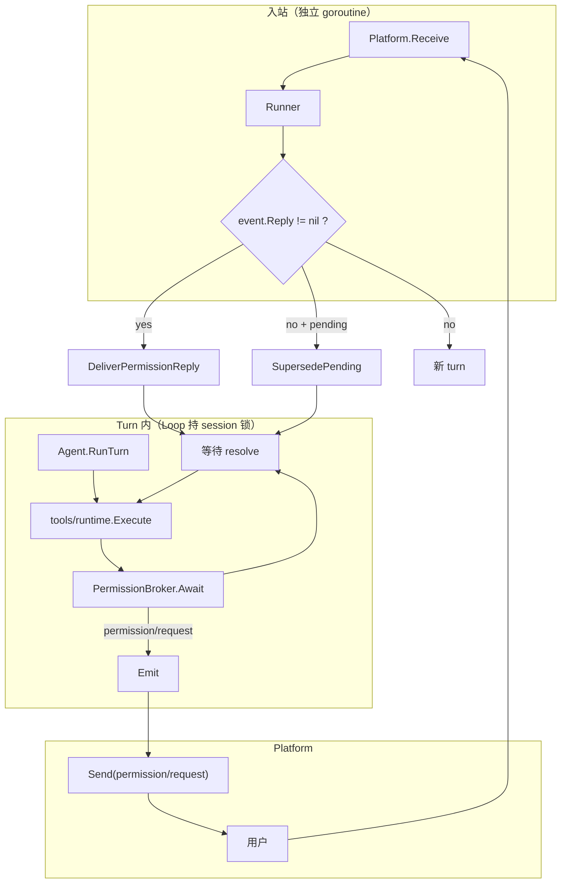

# Platform 人机交互（Permission 协议）

`ask_user`、工具审批、表单/多选统一走 **Permission 协议**（`cap/permission` + Loop `PermissionBroker`），对齐 cc-connect 的 pending + 入站分流模型。

> **Permission** 指「一次需要人类输入才能继续的裁决」，不限于权限检查——`ask_user` 的开放提问同样走这条通道。

## 架构



核心原则：

1. **入站与 turn 解耦**：turn 等待回复时 Runner 仍能 `Receive`。
2. **`Reply != nil` 不开新 turn**：Platform 回传 `MessageEvent.Reply`，Runner 投递给 Broker。
3. **同一 session 至多一个 pending**；`KindQuestion` 一次一题。
4. **无交互 platform 立即降级**：`Interactive=false` → `OutcomeNoHuman`，不挂 pending。

## 核心类型

```go
type Kind string
const (
    KindAllowDeny Kind = "allow_deny" // 工具是否允许执行
    KindQuestion  Kind = "question"   // ask_user / 单选 / 多选
)

type Request struct {
    ID       string
    Kind     Kind
    ToolCall *agentkit.ToolCall // allow_deny
    Question *Question          // question，仅一题
    Timeout  time.Duration      // 0 → EffectiveTimeout（交互平台默认 10 分钟）
    AskedBy  string
}

type Reply struct {
    RequestID    string
    UserID       string
    Decision     string         // allow_deny: allow/deny/y/n
    Selected     []int
    Text         string
    UpdatedInput map[string]any
    Cancelled    bool
}

type Outcome string
const (
    OutcomeResolved   Outcome = "resolved"
    OutcomeTimeout    Outcome = "timeout"
    OutcomeNoHuman    Outcome = "no_human"
    OutcomeCancelled  Outcome = "cancelled"
    OutcomeSuperseded Outcome = "superseded"
)

type Capability struct {
    Interactive    bool
    MultiSelect    bool
    DefaultTimeout time.Duration
    AnswerScope    AnswerScope // asker（默认）| anyone
}
```

`Capable` 由 **leaf** platform 实现；`multiplex` 经 `CapabilityRouter` 按 `PlatformID` 转发。

Broker 经 `KeySessionControl`（`*loop.Control`）注入；`tools/runtime` 与 `ask_user` 通过 `permission.BrokerFrom(ctx)` 获取。

## 事件

| Type | 含义 |
|---|---|
| `permission/request` | 开始等待人类输入 |
| `permission/resolved` | 结束等待（含 `Outcome`） |

`MessageEvent.Reply` 为 `json.RawMessage`，与 `Message` 互斥。

## Platform 接入

| 平台 | Capability | 展示 | 回传 |
|---|---|---|---|
| `platform/cli` | `Interactive`, `DefaultTimeout=10m`, `ScopeAnyone` | stderr prompt | `Receive` → `Reply` |
| `platform/feishu` | `Interactive`, `MultiSelect`, `DefaultTimeout≥10m` | 卡片 + 按钮 | callback 或 reply-to |
| `platform/slack` | 同上 | Block Kit 卡片 + 按钮 | 交互 payload |
| `platform/chat-api` | 默认 `Interactive=true`；`config.interactive: false` 降级为 headless | SSE `question_request` / debug 弹窗 | `POST /runs/.../respond` |
| `platform/acp` | `Interactive`, `DefaultTimeout=10m`, `ScopeAnyone` | ACP `session/update` 流式 chunk | ACP `request_permission`（Send 内同步） |
| `platform/headless` | `Interactive=false` | 无 | 直接 `NoHuman` |
| `platform/multiplex` | **转发 leaf Capability** | 按 `PlatformID` 路由 | 子平台 `Receive` 原样上送 |

`multiplex` 必须转发 leaf 的 `PermissionCapability()`，不能自己在 root 实现。

## 飞书流式进度卡片

`platform/feishu` / `platform/lark` 在 `enableFeishuCard: true`（默认）时，通过 **CardKit 卡片实体 + 流式文本 API** 展示 agent 输出。`card` / `compact` 模式下，**整轮 turn 只发一张卡**：thinking 与 tool 合并写入折叠的「处理过程，点开可以看详情」面板（`expanded: false`），正文写入默认展开的「正文」面板（`expanded: true`，用户可自行折叠）；两区分别通过 `progress_md` / `body_md` 的 CardKit 流式 API 更新。

| 区域 | 内容 | 展示 |
|---|---|---|
| **处理过程** | thinking + tool + subagent（运行中无状态行） | `collapsible_panel` 标题「处理过程，点开可以看详情」，**默认折叠** |
| **正文** | `text_delta` 正文 | `collapsible_panel` 标题「正文」，**默认展开**（用户可折叠）；CardKit 流式更新 `body_md` |
| **定稿** | `turn/end` | 关闭 `streaming_mode`；保留流式已上屏内容，不再全量替换卡片 |

```mermaid
flowchart TD
  start[turn/start] --> card[创建统一 CardKit 卡]
  card --> progress[处理过程面板 默认折叠]
  card --> body[正文面板 默认展开]
  thinking[thinking_delta] --> progress
  tool[tool / subagent] --> progress
  text[text_delta] --> body
  end[turn/end] --> fin[关闭 streaming + 定稿]
```

未启用 CardKit（`enableFeishuCard: false`）时，`card` / `compact` 仍按片段类型分卡：同一类型原地更新，类型切换则定稿旧卡并新开一张。

`legacy` 模式正文同样走 CardKit 流式（若 `enableFeishuCard: true`），不含进度面板。

| 配置 | 默认 | 说明 |
|---|---|---|
| `progressStyle` | `legacy` | `card`：Card 2.0 可折叠进度面板；`compact`：结构化进度列表；`legacy`：仅流式正文 |
| `showThinking` | `false` | `card`/`compact` 下是否在进度区展示 thinking |
| `showToolProgress` | `card`/`compact` 时为 `true` | 是否展示 tool 调用名与参数摘要 |
| `enableFeishuCard` | `true` | `false` 时回退纯文本出站 |
| `replyInThread` | `true` | 仅群聊出站时 `Im.Message.Reply` 带 `reply_in_thread`；私聊（p2p）始终平铺回复 |
| `replyToTrigger` | `true` | `false` 时不引用触发消息，改用 `Im.Message.Create` |

`card` / `compact` 模式下，**整轮 turn** 的过程记录（thinking / tool）累积在同一张卡的处理过程面板中，不会因新一轮 assistant `message/start` 清空；仅正文缓冲在每条 assistant 消息开始时重置。平台监听 `tool/result` 生命周期事件写入结果行。subagent 委托经 runtime outbound 发出 `subagent/start`、`subagent/end`，在过程面板中以「子Agent:{agentID}」展示（与 tool 同级）。**统一 CardKit 双面板**模式下过程区保留全部 tool / subagent 记录；旧版分卡 `card` 路径仍仅保留最近 **2** 条（超出时显示「仅显示最近更新」）。

`card` / `compact` 模式下，处理过程区通过 CardKit **全量文本 + 前缀延续**实现流式：运行中只追加 thinking / tool 行（不截断、不重写状态行）；`turn/end` 时在末尾追加 `⏱ 用时 …` 状态尾注。正文区同理流式更新 `body_md`。tool 在 `tool_call_end` / `tool/result` 时上屏（不在参数 delta 中途改行，避免前缀断裂）。

```yaml
platform.default:
  use: platform/feishu
  config:
    progressStyle: card
    showThinking: true
    showToolProgress: true
```

与 hermes-agent `display.*` 的对应关系：`tool_progress` → `showToolProgress` + `progressStyle: card`；`thinking_progress` → `showThinking`；过程与正文在同一张卡的两个面板中分别流式更新。

## 消息 Reaction（处理中 / 完成）

飞书 / Lark 与 Slack 在收到用户消息时会给原消息加「处理中」reaction；turn 结束（`turn/end`）或 slash 命令本地处理完成时，移除处理中 reaction，并视配置加上「完成」reaction。

| 平台 | 收到消息 | turn 结束 |
|---|---|---|
| `platform/feishu` / `platform/lark` | `reactionEmoji`（默认 `OnIt`；`none` 关闭） | 移除处理中 reaction，添加 `doneEmoji`（默认 `CheckMark`）；取消 turn 时 `cancelledEmoji`（默认 `HEARTBROKEN` 💔）；异常 turn 时 `errorEmoji`（默认 `CrossMark`）；均可设 `none` 关闭 |
| `platform/slack` | `eyes` | 移除 `eyes`，添加 `white_check_mark` |

飞书 / Lark 默认开启 reaction，无需配置。关闭示例：

```yaml
platform.default:
  use: platform/feishu
  config:
    reactionEmoji: none  # 关闭处理中 reaction
    doneEmoji: none      # 关闭完成 reaction
    cancelledEmoji: none # 关闭取消 reaction（/stop 等，默认 HEARTBROKEN 💔）
    errorEmoji: none     # 关闭异常 reaction（默认 CrossMark）
```

Slack 在 `EventMessageStart` 后还会启动渐进式 typing reaction（`clock1` 等），`turn/end` 时一并清理。

## 停止进行中的 Turn

`/stop` 由 `runner` 贡献，通过 `Loop.Cancel` 打断当前 session 正在执行的 turn（取消进行中的 step，并在下一步边界收尾）。与 `Steer` 不同，**不会**把消息注入对话历史。

| 平台 | 行为 |
|---|---|
| 飞书 / Slack / chat-api | slash 在入队前本地处理，turn 进行中也可 `/stop` |
| CLI | turn 进行中仅接受 `/stop`（及 `/exit`）；其他输入会暂存到 turn 结束后再处理 |
| ACP | 客户端 `session/cancel` 走同一条 `Control.Cancel` 路径 |

无进行中的 turn 时返回 `no turn in progress`。

被取消的 turn 在 `turn/end` 时会携带 `cancelled: true`：飞书 / Lark 在**触发该 turn 的原消息**上移除处理中 reaction 并加上 `cancelledEmoji`（默认 `HEARTBROKEN` 💔），流式卡的处理过程/正文区追加「已取消」说明。异常结束的 turn 使用 `errorEmoji`（默认 `CrossMark`）。不会误把 reaction 打到 `/stop` 命令消息上。

## 无人值守与 Policy 分工

| 场景 | 行为 |
|---|---|
| `approval/auto-allow` | runtime 短路 allow，不创建 pending |
| `approval/auto-deny` | runtime 短路 deny |
| `policy` deny | 不进入 Permission 平面 |
| headless / `Interactive=false` | allow_deny → deny；question → guidance |
| schedule fire turn | 出站仍走 delivery platform（如 chat-api `send`）；permission 强制 `Interactive=false`，`ask_user` 降级为 `NoHuman` |
| 超时 | `OutcomeTimeout`，按 kind 降级并**继续** turn |

`auto-allow` / `auto-deny` 只作用于 allow_deny；`KindQuestion` 始终走 Broker。

## chat-api SSE 重连

SSE 连接与 run 解耦：客户端断开只 **detach** HTTP sink，agent turn 继续在后台执行。

| 操作 | 行为 |
|---|---|
| 客户端断开 SSE | run 保留在内存；缓存最后一个可恢复事件 |
| 重连 | `POST /v1/chat-messages`，body 带 `{"run_id":"run_xxx"}`（`user` / `channel` header 须与创建时一致） |
| 取消 run | `POST /v1/runs/{run_id}/cancel`（等同 `/stop`，与断开不同） |
| 交互回复 | `POST /v1/runs/{run_id}/interactions/{id}/respond`（SSE 可断开） |

重连行为：

- run 存在且无活跃 SSE → 200，重放最后一个可恢复快照（`text_delta` / `thinking_delta` / `question_request` / `permission_request`，断线期间为 `replace:true` 全量），然后继续流式输出直至 `message_end`
- run 不存在或 user 不匹配 → 200，立即 `message_end`（graceful close）
- run 已有活跃 SSE → 409 `run already attached`

可恢复事件只保留**最后一个**；`tool_call` / `tool_result` / `file_ready` 等断线期间不重放。服务**重启**后 run 不恢复（见下节）。

## 超时与持久化

- 超时链：`Request.Timeout` → `Capability.DefaultTimeout` → 10 分钟。
- 等待 ≥ `permissionPersistAfterSeconds`（默认 60s）时 `permission/request` 落入 session 日志（审计用，模型不可见）。
- **不做跨重启 durable resume**：进程内 SSE 可重连；服务重启后 `session/recovery` 收尾悬挂 pending，补 orphan `tool/result`。

## 配置

```yaml
tool.ask-user.default:
  use: tool/ask-user

platform.chat-api:
  use: platform/chat-api
  config:
  # interactive: false   # 无人值守 BFF：ask_user 降级为 NoHuman，不挂 SSE 提问

loop.default:
  config:
    permissionPersistAfterSeconds: 60
```

## 实现入口

`cap/permission/`、`runtime/loop/permission.go`、`runtime/runner/dispatch.go`、`runtime/tools/runtime.go`、`runtime/platform/cli/permission.go`

外部 ACP Agent 的权限请求经 `agent/acp-remote` 桥接到同一 Broker，见 [plugin-catalog.zh.md](../plugin-catalog.zh.md) §3.2 `agent/acp-remote`。
