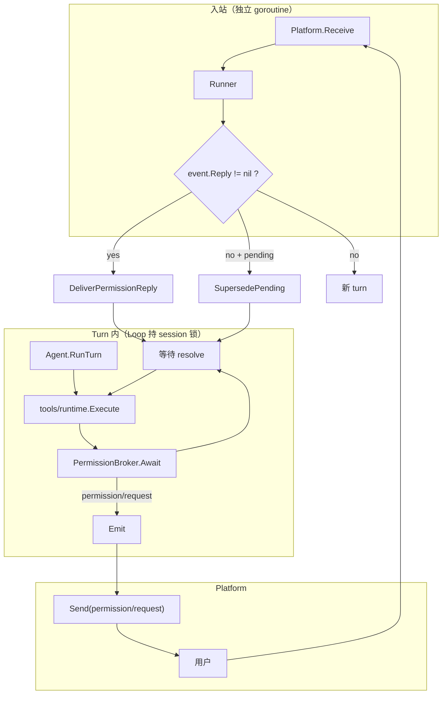

# Platform 人机交互（Permission 协议）

`ask_user`、工具审批、表单/多选统一走 **Permission 协议**（`cap/permission` + Loop `PermissionBroker`），对齐 cc-connect 的 pending + 入站分流模型。

> **Permission** 指「一次需要人类输入才能继续的裁决」，不限于权限检查——`ask_user` 的开放提问同样走这条通道。

## 架构



核心原则：

1. **入站与 turn 解耦**：turn 等待回复时 Runner 仍能 `Receive`。
2. **`Reply != nil` 不开新 turn**：Platform 回传 `MessageEvent.Reply`，Runner 投递给 Broker。
3. **同一 session 至多一个 pending**；`KindQuestion` 一次一题。
4. **无交互 platform 立即降级**：`Interactive=false` → `OutcomeNoHuman`，不挂 pending。

## 核心类型

```go
type Kind string
const (
    KindAllowDeny Kind = "allow_deny" // 工具是否允许执行
    KindQuestion  Kind = "question"   // ask_user / 单选 / 多选
)

type Request struct {
    ID       string
    Kind     Kind
    ToolCall *agentkit.ToolCall // allow_deny
    Question *Question          // question，仅一题
    Timeout  time.Duration      // 0 → EffectiveTimeout（交互平台默认 10 分钟）
    AskedBy  string
}

type Reply struct {
    RequestID    string
    UserID       string
    Decision     string         // allow_deny: allow/deny/y/n
    Selected     []int
    Text         string
    UpdatedInput map[string]any
    Cancelled    bool
}

type Outcome string
const (
    OutcomeResolved   Outcome = "resolved"
    OutcomeTimeout    Outcome = "timeout"
    OutcomeNoHuman    Outcome = "no_human"
    OutcomeCancelled  Outcome = "cancelled"
    OutcomeSuperseded Outcome = "superseded"
)

type Capability struct {
    Interactive    bool
    MultiSelect    bool
    DefaultTimeout time.Duration
    AnswerScope    AnswerScope // asker（默认）| anyone
}
```

`Capable` 由 **leaf** platform 实现；`multiplex` 经 `CapabilityRouter` 按 `PlatformID` 转发。

Broker 经 `KeySessionControl`（`*loop.Control`）注入；`tools/runtime` 与 `ask_user` 通过 `permission.BrokerFrom(ctx)` 获取。

## 事件

| Type | 含义 |
|---|---|
| `permission/request` | 开始等待人类输入 |
| `permission/resolved` | 结束等待（含 `Outcome`） |

`MessageEvent.Reply` 为 `json.RawMessage`，与 `Message` 互斥。

## Platform 接入

| 平台 | Capability | 展示 | 回传 |
|---|---|---|---|
| `platform/cli` | `Interactive`, `DefaultTimeout=10m`, `ScopeAnyone` | stderr prompt | `Receive` → `Reply` |
| `platform/feishu` | `Interactive`, `MultiSelect`, `DefaultTimeout≥10m` | 卡片 + 按钮 | callback 或 reply-to |
| `platform/slack` | 同上 | Block Kit 卡片 + 按钮 | 交互 payload |
| `platform/chat-api` | 默认 `Interactive=true`；`config.interactive: false` 降级为 headless | SSE `question_request` / debug 弹窗 | `POST /runs/.../respond` |
| `platform/acp` | `Interactive`, `DefaultTimeout=10m`, `ScopeAnyone` | ACP `session/update` 流式 chunk | ACP `request_permission`（Send 内同步） |
| `platform/headless` | `Interactive=false` | 无 | 直接 `NoHuman` |
| `platform/multiplex` | **转发 leaf Capability** | 按 `PlatformID` 路由 | 子平台 `Receive` 原样上送 |

`multiplex` 必须转发 leaf 的 `PermissionCapability()`，不能自己在 root 实现。

## 飞书流式进度卡片

`platform/feishu` / `platform/lark` 在 `enableFeishuCard: true`（默认）时展示 Card 2.0 交互卡。

`progressStyle: card`：**每轮一张回复卡**，规则尽量简单：

| 阶段 | 耗时 | 完成感 |
|---|---|---|
| 进行中（工具/thinking） | 可折叠区：工具调用、结果、thinking 摘要；标题 `处理中 · N 个工具` / `思考中` | — |
| 进行中（纯对话） | 无折叠区 | — |
| 结束 | 折叠区保留为 `已调用 N 个工具` 等 + 正文首行 `☑️ 用时 …` | 用户原消息仍可用 `doneEmoji`；**不再**给机器人回复卡消息加 reaction |

`turn/end` 先关 CardKit 流式再整卡 Patch；仅正文变长且工具区未变时走 `main_text` 元素流式。

`progressStyle: compact` 仍按 thinking / tool / 正文**分卡**更新；类型切换时定稿旧卡并新开一张。

`legacy` 在 `enableFeishuCard: true` 时正文可走 CardKit 单元素流式；`enableFeishuCard: false` 时出站为纯文本。

```mermaid
flowchart TD
  start[turn/start] --> card[SendPreviewStart rich 卡]
  tool[tool / thinking] --> patch[UpdateMessage 整卡刷新]
  text[text_delta] --> patch
  end[turn/end] --> fin[最终 Patch + 关闭 streaming]
```

`legacy` 模式正文同样走 CardKit 流式（若 `enableFeishuCard: true`），不含进度面板。

| 配置 | 默认 | 说明 |
|---|---|---|
| `progressStyle` | `legacy` | `card`：cc-connect 单卡 Patch；`compact`：分卡进度；`legacy`：仅流式正文 |
| `showThinking` | `false` | `card`/`compact` 下是否在进度区展示 thinking |
| `showToolProgress` | `card`/`compact` 时为 `true` | 是否展示 tool 调用名与参数摘要 |
| `asyncSubagentProgressCard` | `true` | `async` 委派子 Agent 时另发一张后台过程卡（生命周期独立于父 turn 回复卡） |
| `enableFeishuCard` | `true` | `false` 时回退纯文本出站 |
| `replyInThread` | `true` | 仅群聊出站时 `Im.Message.Reply` 带 `reply_in_thread`；私聊（p2p）始终平铺回复 |
| `replyToTrigger` | `true` | `false` 时不引用触发消息，改用 `Im.Message.Create` |

`progressStyle: card` 时，**整轮 turn** 的 thinking / tool / 正文都在同一张 rich 卡内刷新；同一 turn 内多条 assistant 消息的正文会在每条 `message/start` 时**定稿到累积区**（段间空行拼接），不会互相覆盖。出站流式状态按 `Route.ReplyTo`（触发消息 id）与 delivery 组合隔离，连发多条用户消息时各用各的卡片句柄。`compact` 按片段分卡。平台监听 `tool/result` 与 `subagent/start|end` 更新过程区。`renderProgressBody` 在面板 JSON 中默认仅保留最近 **2** 条 tool 行（超出显示「仅显示最近更新」），与 cc-connect 一致。

**异步子 Agent**（`delegate` + `async: true`）：父 turn 回复卡仍在 `turn/end` 定稿；子 Agent 在 `subagent/start`（`async`）时另发一张「后台子 Agent」过程卡，按 `OutboundEvent.AgentID` 与子 Agent 区分，刷新子 Agent 经 `forwardParentEmit` 转发的 **`toolcall_start` / `toolcall_end` / `tool/result`** 与**限长思考区内容**（原生 `thinking_delta`，以及 **ACP 等子 Agent 的 `text_delta` 重映射为 `thinking_delta`**，不进入主回复正文 lane），在 `subagent/end` 定稿。完整结论仍由 follow-up turn 以新消息送达。可通过 `asyncSubagentProgressCard: false` 关闭。

```yaml
platform.default:
  use: platform/feishu
  config:
    progressStyle: card
    showThinking: true
    showToolProgress: true
```

与 hermes-agent `display.*` 的对应关系：`tool_progress` → `showToolProgress` + `progressStyle: card`；`thinking_progress` → `showThinking`；过程与正文在同一张卡的两个面板中分别流式更新。

## 消息 Reaction（处理中 / 完成）

飞书 / Lark 与 Slack 在收到用户消息时会给原消息加「处理中」reaction；turn 结束（`turn/end`）或 slash 命令本地处理完成时，移除处理中 reaction，并视配置加上「完成」reaction。

| 平台 | 收到消息 | turn 结束 |
|---|---|---|
| `platform/feishu` / `platform/lark` | `reactionEmoji`（默认 `OnIt`；`none` 关闭） | 用户消息：移除处理中 reaction，添加 `doneEmoji`（默认 `CheckMark`）等；**`card`/`compact` 时不给机器人回复卡加 reaction**（卡片内已有 `☑️ 用时`） |
| `platform/slack` | `eyes` | 移除 `eyes`，添加 `white_check_mark` |

飞书 / Lark 默认开启 reaction，无需配置。关闭示例：

```yaml
platform.default:
  use: platform/feishu
  config:
    reactionEmoji: none  # 关闭处理中 reaction
    doneEmoji: none      # 关闭完成 reaction
    cancelledEmoji: none # 关闭取消 reaction（/stop 等，默认 HEARTBROKEN 💔）
    errorEmoji: none     # 关闭异常 reaction（默认 CrossMark）
```

Slack 在 `EventMessageStart` 后还会启动渐进式 typing reaction（`clock1` 等），`turn/end` 时一并清理。

## 停止进行中的 Turn

`/stop` 由 `runner` 贡献，通过 `Loop.Cancel` 打断当前 session 正在执行的 turn（取消进行中的 step，并在下一步边界收尾）。与 `Steer` 不同，**不会**把消息注入对话历史。

| 平台 | 行为 |
|---|---|
| 飞书 / Slack / chat-api | slash 在入队前本地处理，turn 进行中也可 `/stop` |
| CLI | turn 进行中仅接受 `/stop`（及 `/exit`）；其他输入会暂存到 turn 结束后再处理 |

multiplex（CLI + IM 等）下，`/exit` 只关闭 CLI  stdin，**不会**结束 Lark / chat-api / 定时任务；要停整个进程请用 **Ctrl+C**（SIGINT）或 `kill -TERM` 目标 agent 进程。

**Ctrl+C / SIGTERM（默认）**：立刻 `CancelAllBackgroundReviews` + `CancelAllInFlight`，**不再**等待 `shutdownTimeoutSeconds`（你配置的 100s）；默认 `shutdownGraceSecondsOnSignal: 0` 即 abandoning in-flight turns，进程应很快出现 `agent shutting down` / `agent stopped`。若需要信号退出前留几秒收尾，可设 `runner.config.shutdownGraceSecondsOnSignal`（秒）。

正常 platform EOF 退出（无信号）仍受 `shutdownTimeoutSeconds` 约束。
| ACP | 客户端 `session/cancel` 走同一条 `Control.Cancel` 路径 |

无进行中的 turn 时返回 `no turn in progress`。

## 切换会话模型

`/model` 由 `agent/catalog-commands` 贡献，作用于 **coding agent**（`agent/coding`）的 LLM 请求，与会话 agent 覆盖一并写入会话目录下的 `runtime.json`。

| 命令 | 行为 |
|---|---|
| `/model` | 显示当前生效模型、会话/全局覆盖与 agent 默认 |
| `/model <name>` | 将会话模型设为任意 provider 支持的模型名（用户自行输入，无内置列表） |
| `/model -g <name>` | 为**当前 agent** 设置全局默认（写入 `global:runtime.json` 的 `models`，所有未单独覆盖的会话生效） |
| `/model reset` | 清除本会话的模型覆盖 |
| `/model -g reset` | 清除当前 agent 的全局覆盖 |

与 `/agent use` 相同，会话模型绑定写在当前 active conversation（`/new` 子会话各自独立）。ACP 远程 agent 不使用模型覆盖。

**Agent 全局默认**：`/agent -g use <id>` 写入 `global:runtime.json` 的 `agentId`，对所有未设会话覆盖的会话生效；`/agent -g reset` 清除。优先级：会话 `runtime.json` → 全局 → 请求里的 `agent_id` → `loop.defaultAgent`。会话/全局 agent 绑定优先于 chat-api 请求体中的 `agent_id`。

`/model -g` 的全局条目按**当前路由到的 agent id**（含 `/agent -g use`）写入 `global:runtime.json`，与 runner 入站解析一致。

`platform/lark`（及 `platform/feishu`）的 `config.sessionScope` 应与 `runner.config.sessionScope` 一致；不一致时 turn 可能锁在一种 session id 上，而 `/stop` 在另一种 id 上查 `IsSessionBusy`，会误判为无进行中的 turn。`/stop` 会按 delivery、scope 与 `/new` 子 session 等多种候选 id 匹配 busy session。群聊里若命令被解析成 `/stop@_user_x`，也会按 `stop` 处理。

被取消的 turn 在 `turn/end` 时会携带 `cancelled: true`：飞书 / Lark 在**触发该 turn 的原消息**上移除处理中 reaction 并加上 `cancelledEmoji`（默认 `HEARTBROKEN` 💔），流式卡的处理过程/正文区追加「已取消」说明。异常结束的 turn 使用 `errorEmoji`（默认 `CrossMark`）。不会误把 reaction 打到 `/stop` 命令消息上。同一 turn 内被 steer 合并处理的多条用户消息，会在 `turn/end` 时一并更新 reaction。

## 无人值守与 Policy 分工

| 场景 | 行为 |
|---|---|
| `approval/auto-allow` | runtime 短路 allow，不创建 pending |
| `approval/auto-deny` | runtime 短路 deny |
| `policy` deny | 不进入 Permission 平面 |
| headless / `Interactive=false` | allow_deny → deny；question → guidance |
| schedule fire turn | 出站仍走 delivery platform（如 chat-api `send`）；permission 强制 `Interactive=false`，`ask_user` 降级为 `NoHuman` |
| 超时 | `OutcomeTimeout`，按 kind 降级并**继续** turn；policy ask 的 tool result 含 `reason` + `guidance` |

`auto-allow` / `auto-deny` 只作用于 allow_deny；`KindQuestion` 始终走 Broker。

## chat-api 会话列表与 session 索引

L0 为 `platform.chat-api` 注入 `sessionIndex.default`（与 `tool/session-query`、background review 共用同一 SQLite FTS 索引）。

| 能力 | 数据源 | 说明 |
|------|--------|------|
| `GET /v1/conversations` | `session/sqlite-index` + session JSONL | 按 channel 过滤；列表顺序与索引 `MAX(seq)` 一致（`indexLastSeq`）；`updated_at` 取 JSONL 事件时间与索引 `LastMod`（文件 mtime）的较新者 |
| `chat-api/conversations/*.json` | 本地 JSON | 保留 `created_by`、`agent_id` 等 Chat API 专有字段；与索引合并展示 |
| `tool/session-search` | 同一索引 | FTS / list / scroll；租户 workspace 内跨会话 |

未配置 `deps.sessionIndex` 时，chat-api 回退为扫描 `sessions/` 目录（旧行为）。

## chat-api SSE 重连

SSE 连接与 run 解耦：客户端断开只 **detach** HTTP sink，agent turn 继续在后台执行。

| 操作 | 行为 |
|---|---|
| 客户端断开 SSE | run 保留在内存；缓存最后一个可恢复事件 |
| 重连 | `POST /v1/chat-messages`，body 带 `{"run_id":"run_xxx"}`（`user` / `channel` header 须与创建时一致） |
| 取消 run | `POST /v1/runs/{run_id}/cancel`（等同 `/stop`，与断开不同） |
| 交互回复 | `POST /v1/runs/{run_id}/interactions/{id}/respond`（SSE 可断开） |

重连行为：

- run 存在且无活跃 SSE → 200，重放最后一个可恢复快照（`text_delta` / `thinking_delta` / `question_request` / `permission_request`，断线期间为 `replace:true` 全量），然后继续流式输出直至 `message_end`
- run 不存在或 user 不匹配 → 200，立即 `message_end`（graceful close）
- run 已有活跃 SSE → 409 `run already attached`

可恢复事件只保留**最后一个**；`tool_call` / `tool_result` / `file_ready` 等断线期间不重放。服务**重启**后 run 不恢复（见下节）。

## 超时与持久化

- 超时链：`Request.Timeout` → `Capability.DefaultTimeout` → 10 分钟。
- 等待 ≥ `permissionPersistAfterSeconds`（默认 60s）时 `permission/request` 落入 session 日志（审计用，模型不可见）。
- **不做跨重启 durable resume**：进程内 SSE 可重连；服务重启后 `session/recovery` 收尾悬挂 pending，补 orphan `tool/result`。

## 配置

```yaml
tool.ask-user.default:
  use: tool/ask-user

platform.chat-api:
  use: platform/chat-api
  deps:
    sessionIndex: sessionIndex.default   # 与会话列表、session_search 共用索引
  config:
  # interactive: false   # 无人值守 BFF：ask_user 降级为 NoHuman，不挂 SSE 提问

loop.default:
  config:
    permissionPersistAfterSeconds: 60
```

## 实现入口

`cap/permission/`、`runtime/loop/permission.go`、`runtime/runner/dispatch.go`、`runtime/tools/runtime.go`、`runtime/platform/cli/permission.go`

外部 ACP Agent 的权限请求经 `agent/acp-remote` 桥接到同一 Broker，见 [plugin-catalog.zh.md](../plugin-catalog.zh.md) §3.2 `agent/acp-remote`。

**`agent/acp-remote` 权限回传**：Broker 超时、用户拒绝或被新消息 supersede 时，桥接层向 ACP Agent 返回 `reject_once`（而非 `cancelled`），并在响应 `_meta` 中携带 `outcome` / `reason` / `guidance`，便于外部 Agent 自行决定跳过该工具后继续或结束 turn。仅 session/turn 取消（`session/cancel`、context abandoned）才回传 ACP `cancelled`。
