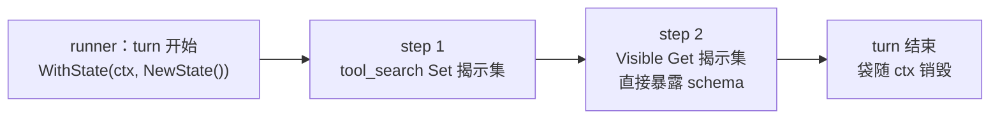

# 插件统一状态机制（ctx State 袋）

插件（tools / hook / policy / compaction 等）经常需要记录运行态：`tools/deferred` 的 reveal 集合、hook 的轮次标记、policy 的计数器等。目前各插件只能自建私有内存 map（按 session id 做 key），重复造轮子且语义不一。

本文定义**单一机制**：`rctx` 提供一个可写状态袋 `State`（`Get` / `Set` / `Delete`），runner 在 turn 开始时挂到 ctx 上，全链路共享，**turn 结束即销毁**。不做 session 级存储、不做持久化。

相关文档：[go-agent-harness-architecture.zh.md](../go-agent-harness-architecture.zh.md)、[deferred-tools.zh.md](deferred-tools.zh.md)。

## 1. 设计出发点

### 为什么直接挂 ctx 就够了

`context.Context` 不可变，`WithValue` 写入的值只对下游可见——但**袋本身是可变指针**：turn 开始注入一次，hook → tool → policy 全链路拿到同一个袋，`Set` 的内容后续 step 的 `Get` 可见。loop 在同一个 ctx 上迭代所有 step，因此 turn 内跨 step 共享天然成立。

跨 turn 不保留是有意的取舍：插件状态一律视为**优化类缓存**（如 reveal 只是可见性提升），丢了自愈（agent 重新 search），不影响正确性。真需要持久化的状态应走 session JSONL 契约事件，而不是这个袋。

### 对比被否决的方案

| 方案 | 否决原因 |
|------|---------|
| 插件私有 map（现状） | 容量/淘汰/空 session 语义各自为政，重复造轮子 |
| session 级 registry / `cap` 接口 / sidecar 持久化 | 过重；优化类状态不需要跨 turn，更不需要落盘 |

## 2. 接口（`runtime/rctx`）

```go
// State is a mutable per-turn bag injected by the runner at turn start.
type State struct { /* map[string]any + sync.RWMutex */ }

func NewState() *State
func WithState(ctx context.Context, s *State) context.Context
func StateFrom(ctx context.Context) *State // 未注入返回 nil

func (s *State) Get(key string) (any, bool)
func (s *State) Set(key string, v any)
func (s *State) Delete(key string)
```

- 位置：`runtime/rctx`（ctx 读写协议的既定位置，只依赖根包）；根包仅需一个 ctx key 常量（与 `KeyTurnEnvelope` 同级）。
- **nil 语义**：未注入时 `StateFrom` 返回 nil，插件必须判 nil 并降级为无状态——状态仅作优化，不得影响正确性。
- **键名约定**：`namespace.key`，namespace 用插件 kind（如 `tools/deferred`、`hook/turncontinue`）；约定常量由插件包导出，禁止裸字符串散落。

## 3. 生命周期



- **注入点**：runner 在 turn 开始（envelope 注入附近）执行 `WithState(ctx, NewState())`。
- **共享范围**：本 turn 的所有 step、hook、policy、tool；子 agent 经 `RunTurn` 会注入独立新袋，与父 turn 天然隔离（互不可见）。
- **销毁**：turn 结束即失去引用，无需清理；无 session 隔离问题——每 turn 都是新袋，天然不泄漏。

## 4. 插件使用示例

`tools/deferred` reveal 迁移后：

```go
// 写（tool_search 命中时）
if st := rctx.StateFrom(ctx); st != nil {
	st.Set("tools/deferred.revealed", append(revealedNames(st), hits...))
}

// 读（Visible 组装时）
if st := rctx.StateFrom(ctx); st != nil {
	if v, ok := st.Get("tools/deferred.revealed"); ok { ... }
}
```

相比原 `revealStore` 的变化：

| 原私有实现 | ctx 袋 |
|---|---|
| 双层 LRU（512 会话 × 24 工具） | 无容量管理；24 工具/turn 上限由 deferred 在 `Set` 前自行截断 |
| session 级跨 turn 保留 | **仅 turn 内**；下一轮 agent 重新 search，自愈 |
| 空 session 特判 | 不需要——每 turn 新袋 |
| 插件持有存储字段 | 插件无状态，只读写 ctx |

## 5. 与分层规则的对齐

| 规则 | 落实 |
|------|------|
| ctx 读写、键名约定放 `rctx` | `State` / `WithState` / `StateFrom` 在 `rctx`，只依赖根包 |
| 根包不放实现 | 根包仅一个 ctx key 常量 |
| 插件轻量、不读全局 | 插件只用 `StateFrom(ctx)`，无 deps、无配置、无存储字段 |
| `cap/*` 按需提取 | 无跨插件注入需求，**不提取** cap 接口 |

## 6. 实施计划（已完成）

| PR | 内容 | 状态 |
|----|------|------|
| 1 | `rctx.State` + runner 注入（`RunTurn` 开头 `WithState(ctx, NewState())`） | ✅ 单测 `runtime/rctx/state_test.go` |
| 2 | `tools/deferred` reveal 迁移，`reveal.go` 改为 ctx 袋读写助手 | ✅ reveal 测试适配 turn 级语义后全绿 |

## 7. 已决 / 待决

| 项 | 决定 |
|----|------|
| 机制 | 单一 ctx 袋，turn 级生命周期 |
| 存储 / 持久化 | **不做**；跨 turn 状态走 session JSONL 契约事件（另行设计） |
| 容量管理 | 袋不管；插件自行截断各自 value |
| 子 agent | 经 `RunTurn` 注入独立新袋，与父 turn 隔离 |

待确认：

- 若某插件后续确需跨 turn 状态，再评估是否走 session 事件，而非扩展这个袋。
