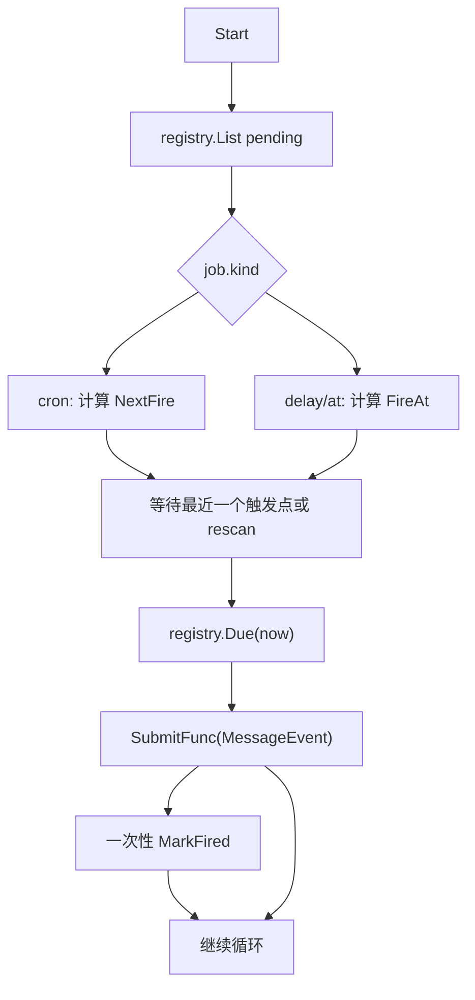

# Schedule v2：统一 Cron 与一次性提醒

> 状态：**已实现**  
> 背景：「1 分钟后提醒我喝水」类需求；旧版 `inMinutes` 把相对延时折成 5 段 cron，精度和语义都不够自然。

## 1. 结论

Cron 和 Timer 不必拆成两个 agent 工具，也不必拆成两份持久化表。更合适的边界是：

- 对 agent：只有一个 `schedule` 工具。
- 对配置：全局一份 `global:schedules/schedule.json`（`schedule/multi`）。
- 对框架：一个 `Job` 模型，用 `kind` 区分 `cron`、`delay`、`at`。
- 对运行时：`schedule/cron` 按 `kind` 分支；重复任务走 cron 计算，一次性任务用 `time.Timer` 精准唤醒。

这样既保留 cc-connect 的关键经验（一次性延时不伪装成 cron、路由和清理由框架负责），也避免暴露 `tool/remind` / `tool/schedule` 两套入口给模型选择。

## 2. 历史问题（已解决）

| 旧现状 | 问题 |
|------|------|
| `inMinutes` → 5 段 cron | 只能精确到分钟 |
| `Once` + cron | 一次性提醒本质上不是 cron |
| 纯 poll 轮询 | 秒级提醒体验差 |
| prompt 曾要求手写 `sessionId` / `op=remove` | 应由框架处理 |

参考 cc-connect：`TimerJob` 用绝对时间和 `time.AfterFunc`，触发后框架 `MarkFired`，投递路由由创建时保存的 `session_key` 决定。agentkit 可以吸收这些语义，但保持统一工具和统一 job 表。

## 3. 目标

1. **统一入口**：`tool/schedule` 覆盖重复任务和一次性提醒。
2. **参数清晰**：显式 `kind`，不用让模型猜 oneOf。
3. **秒级延时**：支持 `30s`、`1m`、`2h`、`1h30m`。
4. **绝对时间**：支持 RFC3339 / 本地 ISO 时间。
5. **框架负责路由和收尾**：创建时捕获投递上下文，触发后 `send` 默认回原 inbox，一次性任务标记 `Fired`。
6. **按 channel 隔离**：`schedule/multi` 在全局 `schedule.json` 存所有 job，创建时写入 `channelKey`；`list` / `remove` / `/cron` 按当前会话 channel 过滤。

非目标（首版不做）：

- `mute` / `silent` / `timeout_mins`
- 平台级 `ReplyTargetResolver`
- shell `exec` 的一次性 timer 语义（保留现有 cron `script`）

## 4. 工具接口

推荐不要依赖 JSON Schema 的 `oneOf` 让模型自己推断。很多模型对 oneOf 约束不稳定，显式 `kind` 更清楚，错误提示也更好。

### 一次性相对延时

```json
{
  "op": "add",
  "kind": "delay",
  "in": "1m",
  "prompt": "用 send 提醒用户：该喝水了。",
  "note": "喝水提醒"
}
```

### 一次性绝对时间

```json
{
  "op": "add",
  "kind": "at",
  "at": "2026-08-30T16:00:00+08:00",
  "prompt": "用 send 提醒用户：该喝水了。"
}
```

### 重复 cron

```json
{
  "op": "add",
  "kind": "cron",
  "cron": "0 9 * * 1-5",
  "prompt": "用 send 提醒用户看日报。"
}
```

### 列表与取消

```json
{ "op": "list", "includeFired": false }
```

```json
{ "op": "remove", "id": "agent-1" }
```

用户也可在 IM 里用 slash 命令查看当前 channel 的任务：

```text
/cron
/cron list all
/cron remove agent-1
```

字段规则：

| `kind` | 必填 | 触发后 |
|--------|------|--------|
| `cron` | `cron` | 更新 `lastRun`，继续保留 |
| `delay` | `in` | `fired=true`，保留历史 |
| `at` | `at` | `fired=true`，保留历史 |

## 5. 数据模型

继续使用 `cap/schedule.Job`，扩展为统一模型：

```go
type Job struct {
    ID     string `json:"id"`
    Kind   string `json:"kind"` // cron | delay | at
    Cron   string `json:"cron,omitempty"`
    In     string `json:"in,omitempty"` // 仅用于展示原始输入，可选
    FireAt time.Time `json:"fireAt,omitzero"`

    Prompt string `json:"prompt,omitempty"`
    Script string `json:"script,omitempty"`
    Source string `json:"source"`
    Note   string `json:"note,omitempty"`

    Disabled bool `json:"disabled,omitempty"`
    CreatedAt time.Time `json:"createdAt,omitzero"`
    LastRun   time.Time `json:"lastRun,omitzero"`
    Fired     bool      `json:"fired,omitempty"`
    FiredAt   time.Time `json:"firedAt,omitzero"`
    LastError string    `json:"lastError,omitempty"`

    DeliverySessionID string `json:"deliverySessionId,omitempty"`
    PlatformID        string `json:"platformId,omitempty"`
    UserID            string `json:"userId,omitempty"`
    AgentID           string `json:"agentId,omitempty"`
}
```

兼容规则：

- `kind` 为必填字段；`tool/schedule` 与 `schedule/file.Add` 不再根据 `cron` / `in` / `at` 自动推断类型。
- `schedule/file.SyncSource` 在 config 声明的 job 未写 `kind` 时默认补为 `kind=cron`。

## 6. Registry 语义

`schedule.Registry` 保持统一，但增加一次性任务需要的操作：

```go
type Registry interface {
    List(ctx context.Context) ([]Job, error)
    Add(ctx context.Context, job Job) (Job, error)
    Remove(ctx context.Context, id string) (bool, error)
    SyncSource(ctx context.Context, source string, jobs []Job) error
    Due(ctx context.Context, now time.Time) ([]Job, error)
    MarkFired(ctx context.Context, id string, firedAt time.Time, err error) error
}
```

`Due` 的规则：

- `kind=cron`：按 `NextFire(job, job.LastRun)` 判断，到期后更新 `LastRun`。
- `kind=delay|at`：到期时设置 `inFlight=true` 并返回；`MarkFired` 清除 `inFlight` 并标记 `fired`。`inFlight` 超过 `InFlightTimeout`（默认 30 分钟）可被 reclaim。

`schedule/cron` 用 `time.Timer` 按最近 `NextFire` 精准唤醒；无待触发 job 时以 `pollSeconds` 空闲退避。

## 7. Runtime 语义

可以继续叫 `schedule/cron`，但更准确是新增或重命名为 `schedule/runtime`。为了兼容配置，建议：

- 保留 `schedule/cron` kind 名称，内部升级为统一 runtime。
- 文档中称为 schedule runtime。

运行逻辑：



触发规则：

| 类型 | 触发算法 | 成功后 |
|------|----------|--------|
| `cron` | cron next boundary | 更新 `LastRun` |
| `delay` | 创建时 `FireAt = now + duration` | `MarkFired` |
| `at` | `FireAt = parse(at)` | `MarkFired` |

过期处理：

- 过期 ≤ `missedGraceSeconds`：立即触发。
- 过期 > `missedGraceSeconds`：`MarkFired` + `LastError=stale`，不补跑。
- cron 继续保持现有策略：错过 boundary 跳过，不 backfill。

## 8. 投递路由

`tool/schedule` 创建 job 时自动保存当前 turn 的路由信息：

- `deliverySessionId`
- `platformId`
- `userId`
- `agentId`

runtime 触发时构造 inbound event：

```go
event.Envelope.Conversation = string(sideSession(job.ID)) // 侧会话（stateless）或 delivery 会话（reuse）
event.Envelope.Route = agentkit.SessionRoute(job.PlatformID, job.DeliverySessionID) // outbound/send 仍回原 inbox
event.PlatformID = job.PlatformID
event.UserID = job.UserID
event.AgentID = job.AgentID
event.Message = "[schedule kind=delay id=agent-1] ⏰ 吃饭\n\n这是一次定时任务触发..."
event.Metadata = {"schedule": {"fired": true, "jobId": "agent-1", "kind": "delay", "sessionMode": "stateless"}}
```

然后 runner 仍按现有逻辑处理：

- `job.DeliverySessionID` 决定 outbound / send 往哪发（写入 `Envelope.Route`）。
- `Envelope.Conversation` 决定 loop 锁与历史：`stateless` 为独立侧会话，`reuse` 为原对话。
- 若 turn 内已调用 `send`，框架抑制 turn-end 重复文本。
- **Permission**：`metadata.schedule.fired=true` 时 runner 强制该 turn 为**非交互**（`ask_user` 降级为 `NoHuman`），避免 cron 在 chat-api 等交互平台上挂起等人；`send` 仍走 `Envelope.Route` 回原 inbox。

因此创建 job 时 prompt 只需要写提醒内容，例如：

> 向用户发送提醒：该喝水了。

不需要 channel、不需要 sessionId、不需要 `schedule remove`。

### sessionMode

`schedule.cron.config.sessionMode` 控制触发时 agent 是否看到主对话历史：

| 模式 | 行为 | 适用场景 |
|------|------|----------|
| `stateless`（默认） | 每次触发使用独立侧会话 `schedule:{jobId}:{nano}`，不继承 delivery 的 ActiveSession 映射；类似 delegate subagent | 一次性提醒、避免历史污染 |
| `reuse` | `SessionID` 使用 delivery 会话，在原对话上执行 | 需要上下文延续的周期任务 |
| `fixed` | 所有触发共享固定侧会话 `{sessionId}:default` | 跨触发累积记忆（需配合 compaction） |

`fresh` 是 `stateless` 的别名。outbound / `send` 始终通过 `Envelope.Route`（源自 `job.DeliverySessionID`）回到原 inbox，与 sessionMode 无关。

## 9. 配置

保持默认简单：

```yaml
runner.default:
  deps:
    schedules:
      - schedule.cron

schedule.default:
  use: schedule/multi
  config:
    path: global:schedules/schedule.json
  deps:
    workspace: workspace.default

schedule.cron:
  use: schedule/cron
  config:
    jobs: []
    sessionMode: stateless
    pollSeconds: 15
    missedGraceSeconds: 300
  deps:
    schedule: schedule.default
    workspace: workspace.default

tool.schedule.default:
  use: tool/schedule
  config:
    maxJobs: 32
  deps:
    schedule: schedule.default
```

所有 job（含各 channel 的 agent job 与 config job）写入同一份 `global:schedules/schedule.json`。`channelKey` 字段用于 list/remove 过滤；`schedule/cron` 的 `Due` 扫描全部 job。

## 10. 与 cc-connect / 当前 agentkit 对照

| 维度 | cc-connect | agentkit 现状 | schedule v2 |
|------|------------|---------------|-------------|
| Agent 入口 | `/timer` + `/cron` | `tool/schedule` | `tool/schedule` |
| 模型 | `TimerJob` + `CronJob` | `Job` + `Once` | `Job(kind)` |
| 一次性延时 | `scheduled_at` + `AfterFunc` | `inMinutes` 伪 cron | `kind=delay/at` + `FireAt` |
| 重复任务 | cron | cron | `kind=cron` |
| 存储 | 两份 JSON | 一份 `schedule.json` | 全局一份 + `channelKey` 过滤 |
| 路由 | `session_key` | `deliverySessionId` | `deliverySessionId` |
| 一次性收尾 | `MarkFired` 保留 | `Remove` | `MarkFired` 保留 |

## 11. 迁移步骤

1. 扩展 `cap/schedule.Job`：`Kind`、`FireAt`、`Fired`、`FiredAt`、`LastError`。
2. 扩展 `schedule/file`：解析兼容旧 job；实现 `MarkFired`。
3. 扩展 `tool/schedule`：新增 `kind`、`in`、`at`、`includeFired`；`kind` 必填。
4. 升级 `schedule/cron`：内部处理 cron 与 one-shot；触发 one-shot 后 `MarkFired`。
5. persona：相对延时用 `schedule kind=delay`，重复任务用 `schedule kind=cron`。
6. 文档：`plugin-catalog`、`autonomous-run`、`e2e-scenarios` 更新。

## 12. 实现分期

### P0（可用）

- [ ] 统一 `Job(kind)` 模型
- [ ] `schedule/file` 支持 `FireAt` / `Fired` / `MarkFired`
- [ ] `tool/schedule` 支持 `kind=delay|at|cron`
- [ ] `schedule/cron` 支持 one-shot `time.Timer` 或精准 wait
- [ ] 路由上下文保持框架自动捕获
- [ ] 单测 + E2E-044

### P1（体验）

- [ ] `op=cancel` 别名（内部仍走 remove）
- [x] `sessionMode: reuse` 选项
- [ ] Langfuse span：`schedule.fired`

### P2（对齐 cc-connect）

- [ ] `mute` / `silent`
- [ ] 触发失败重试策略
- [ ] 平台级 ReplyTargetResolver

## 13. 测试要点

| 场景 | 断言 |
|------|------|
| `kind=delay, in=2s` | 到点 submit，触发 turn 调 `send` |
| `kind=at` | 按绝对时间触发 |
| `kind=cron` | 保持现有 cron 语义 |
| 租户 workspace | job 写入 `global:schedule.json`，后台 runtime 能读到 |
| 过期 3min | grace 内立即触发 |
| 过期 10min | `MarkFired` + stale error，不触发 |
| 重启后 | pending one-shot 重新调度 |
| delivery 路由 | 无 sessionId 的 `send` 回到原 chat-api 会话 |

---

相关文档：[自主运行 §7](autonomous-run.zh.md)、[多租户](multi-tenant.zh.md)、[E2E 场景](e2e-scenarios.zh.md)。
