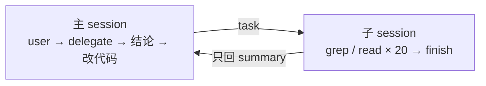
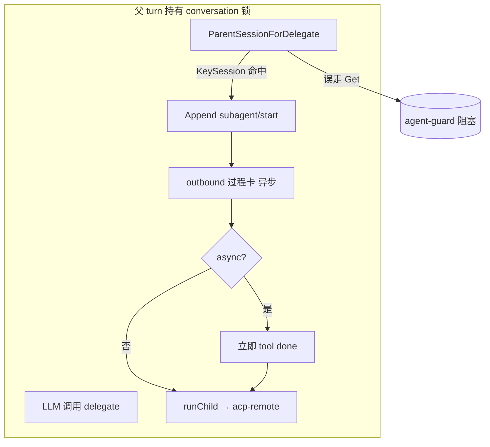

# 子 Agent 委派

本文描述 AgentKit 的子 Agent：定义文件长什么样、目录怎么查、子 Agent 能用哪些工具、结论怎么回到主 Agent，以及为什么这一版只做串行。

相关文档：[go-agent-harness-architecture.zh.md §5.10](../go-agent-harness-architecture.zh.md#510-子-agent-委派subagent)、[plugin-catalog.zh.md](../plugin-catalog.zh.md)。

## 1. 为什么要委派

委派的收益是**上下文隔离**，不是并发。

一个"读 20 个文件搞清楚某个机制，然后改代码"的任务，如果全在一个 session 里做，那 20 份文件内容会一直躺在上下文里，直到 `compaction/token-limit` 出手摘要——而摘要是有损的，被丢掉的往往正是刚读过的细节。委派换成这样：



子 Agent 的 20 轮探索留在它自己的 session 文件里（可审计、可复查），主 session 只多了一条 tool result。

## 2. 定义文件

子 Agent 不是配置里的实例，而是工作目录下的 `agents/*.md`。加一个子 Agent = 加一个文件，不用改实例图。

```markdown
---
name: researcher          # 可省，默认取文件名（researcher.md → researcher）
description: 只读调研：读代码、搜索、定位实现，返回结论与文件行号，不改任何文件
tools: [read, grep, find, ls, web_search, web_fetch, skill, finish]
skills: [context7-mcp]  # 可省，空 = 子 agent runtime 的全部 skill
model: ""                 # 可省，默认用 Spawner 的 llm dep 的默认模型
maxSteps: 20              # 可省，默认取 subagent 实例的 config.maxSteps
---
你是调研子 agent。你的唯一产出是一段结论，交回给主 agent。

- 先用 grep / find 定位，再 read 具体片段。
- 结论里必须带 `文件:行号`。
- 查清楚以后调用 finish，summary 就是给主 agent 的答案。
```

| 字段 | 必填 | 说明 |
|---|---|---|
| `description` | 是 | 主 Agent **凭这句话选人**，它会进主 Agent 的 system prompt。缺失则该文件被跳过并 `slog.Warn`——收进名单只会污染 prompt |
| 正文 | 是 | 子 Agent 的 system prompt（人格）。空正文同样被跳过 |
| `name` | 否 | 默认文件名去掉 `.md`；委派时大小写不敏感 |
| `tools` | 否 | 工具名白名单，空 = 该 runtime 的全部工具。写的是**模型可见的工具名**而不是 kind 名（`tool/read-file` → `read`，`tool/list-dir` → `ls`）；名字写错会被丢弃并告警。见 [§4](#4-子-agent-的能力边界) |
| `skills` | 否 | Skill 名白名单，空 = 该 runtime 的全部 skill。同时收窄 prompt 里的 skill 目录与 `skill` 工具的加载范围；名字写错会告警。需在 `tools` 里包含 `skill` 才能加载 |
| `model` | 否 | 覆盖模型，用于"便宜模型跑调研" |
| `maxSteps` | 否 | 该子 Agent 单次委派的步数上限 |
| `modalities` | 否 | 声明该子 Agent 处理的输入类型：`text`、`image`、`audio`（可写别名 `vision`）。会出现在主 Agent 的 subagents prompt；空表示不额外标注 |

`agents/*.md` 只用于进程内（`inprocess`）子 Agent。委派到 Loop 里已注册的 agent（如 `cursor`）在 `subagent/loop-agent` 实例的 `config.agents` 里声明，见 [§3](#3-目录查找)。

一个文件解析失败不会影响其它子 Agent：坏文件被跳过，其余照常可用。

## 3. 目录查找

L0 默认通过 `subagent/composite` 合并 `subagent/inprocess` 与 `subagent/loop-agent`。`inprocess` 的 `config.dirs` 按顺序扫描，**先命中的目录赢**：

```yaml
subagent.default:
  use: subagent/composite
  deps:
    inprocess: subagent.inprocess.default
    loop: subagent.loop.default

subagent.inprocess.default:
  use: subagent/inprocess
  config:
    dirs:
      - local:agents
      - local:../examples/agents
      - global:agents
    maxSteps: 20
    timeoutSeconds: 600
  deps:
    llm: llm.openai
```

`llm.openai`（或等价的多模态实例）是默认值：进程内子 agent 在 `read` 图片后依赖 `PrepareMessagesForLLM` 注入 `image_url`；若误接 `llm.fallback` → `llm.text`，modalities 仅为 `[text]`，vision 会只看到 read 返回的元数据。

`loop-agent` 在配置里声明可委派的 Loop agent，不扫描 `agents/*.md`：

```yaml
subagent.loop.default:
  use: subagent/loop-agent
  config:
    timeoutSeconds: 1800
    agents:
      - name: cursor
        description: 复杂编码：多文件重构、深度调试。简单问答不要委派。
        agent: cursor
        async: true
        timeoutSeconds: 1800
  deps:
    agents:
      - agent.cursor.default
```

每个 `agents` 条目字段：

| 字段 | 必填 | 说明 |
|---|---|---|
| `name` | 是 | 主 Agent 委派时使用的名字 |
| `description` | 是 | 进入主 Agent system prompt，用于选人 |
| `agent` | 否 | Loop 里注册的 agent id，默认与 `name` 相同 |
| `async` | 否 | 默认是否异步委派 |
| `timeoutSeconds` | 否 | 覆盖实例级 `timeoutSeconds` |

`local:` / `global:` 前缀由 workspace 解析（见 [架构文档 §8.1](../go-agent-harness-architecture.zh.md#81-workspace-路径)）。L0 默认扫描 `local:agents`（`<cwd>/.agentkit/agents`）、`local:../examples/agents`（`<cwd>/examples/agents`，不存在则跳过）与 `global:agents`（`~/.agentkit/agents`）。

定义是**每次委派前重读**的，改完 md 文件不用重启进程。

## 4. 子 Agent 的能力边界

子 Agent 的可见工具 = **它自己那份 Tool Runtime** ∩ 定义里的 `tools` 白名单。

第一层是配置约束，也是构造期的硬性要求。把主 Agent 的 runtime 接给 Spawner 会成环：

```text
tools.default → tool.subagent.default → subagent.default → tools.default
```

pluginkit 在 build 阶段直接判 dependency cycle，所以必须给子 Agent 一份兄弟实例：

```yaml
tools.subagent.default:      # 只读 + web 抓取 + skill + finish，没有 delegate；搜索由 llm.default.hostedTools 提供
  use: tools/runtime
  deps:
    tools:
      - tool.fs-workspace.readonly.default
      - tool.finish.default
      - tool.web-fetch-http.default
      - tool.skill.default
```

这个约束和产品要求同向：兄弟实例里没挂 `tool/subagent`，**"只有主 Agent 能委派"就成了结构性事实**——子 Agent 的工具列表里根本没有 `delegate`，不依赖深度计数去兜底。若配置误把 `delegate` 挂到子 Agent 上，`delegate` 工具会根据当前 session id 的嵌套层数限制链长：**最多 2 次 delegate（3 层）**，超出则返回模型可读的错误。

第二层是白名单包装器：`Visible` 只返回名单内的工具，名单外的调用返回一条模型可读的 deny 结果（不是 error，所以子 Agent 的 turn 不会因此崩掉）。`skills` 白名单同理：收窄 prompt 里的 skill 目录，并在 `skill` 工具执行时拒绝名单外的加载。policy / approval / hook / 超时 / 结果截断全部沿用被包装的那条执行路径，不另建一条。定义里写了不存在的工具名会被丢弃并告警；**全部写错**则委派直接报错，而不是放一个空手的子 Agent 上场。

`prompt` 侧同理需要一份兄弟实例：`prompt.default` 挂了 `prompt/section/subagents`，而该 section 依赖 Spawner，接同一个又是环。语义上也正确——子 Agent 不能委派，给它看可委派名单毫无意义。

### 4.1 多模态（modalities）

主 Agent 与 LLM 实例可声明 **`config.modalities`**（`llm/openai-compatible`）：默认 `[text, image]`；纯文本模型设为 `[text]` 时，调用 LLM 前不会 hydrate 图片，用户消息里的附件变为 `[attachment: work/upload/…]` 文本提示。

子 Agent 可在 `agents/*.md` 写 **`modalities: [image]`**（示例见 `examples/agents/vision.md`）。`prompt/section/subagents` 会把 modalities 写进主 Agent system prompt；当主 LLM 为 text-only 且存在**在 frontmatter 里显式声明** `modalities` 含 `image` 的子 Agent 时，会追加「请 delegate 并在 task 里带上路径」的说明（未写 `modalities` 的子 Agent 不参与该判断）。

典型分工：主 Agent `modalities: [text]` + `delegate` → `vision` 子 Agent（`read` 图片 + vision 模型 + `finish`）→ 主 Agent 只消费 summary 继续对话。vision 子 Agent 通过 `read` 声明路径后，运行时 hydrate 会从 workspace 载入原图再发给模型；子 Agent frontmatter 的 `modalities: [image]` 会强制开启 hydrate（即使 LLM 实例声明为 text-only）。`vision.md` 需包含 `finish` 工具以便 `delegate` 返回 `completed`。Audio 尚未有 hydrate 管道；`modalities` 可预留 `audio`，需配合落盘或 ASR 工具后才有端到端能力。

## 5. 委派与结论读回

主 Agent 看到的是 `delegate` 工具：

```json
{"agent": "researcher", "task": "查清 runtime/loop 怎么保证同一 session 串行，给出文件行号"}
```

异步委派 Loop agent（如 cursor）：

```json
{"agent": "cursor", "task": "重构 auth 模块并补测试", "async": true}
```

`async` 可省略：若子 agent 定义或配置里写了 `async: true`，默认即异步。

`task` 必须自带完整背景——**子 Agent 从空 session 起跑，看不到主对话**。返回：

```json
{"agent":"researcher","status":"completed","summary":"…结论…","session":"sub:cli:default:researcher:42","steps":11}
```

异步立即返回：

```json
{"agent":"cursor","status":"running","jobId":"sub:cli:default:cursor:7","session":"sub:cli:default:cursor:7","summary":"subagent started in the background; results will arrive in a follow-up turn"}
```

完成后 runner 向父 session 投递一条带 `[subagent-complete ...]` 前缀的 user 消息，主 agent 自动开新 turn 汇总。若父 session 仍在执行当前 turn（常见于子 Agent 很快失败），该消息进入 **FollowUp** 队列，在当前 turn 结束后再开 turn，而不是当作普通入站 **Steer**（避免结论被吞或无法单独回复用户）。

`status` 取值：

| status | 含义 |
|---|---|
| `completed` | 子 Agent 调了 `tool/finish` 且报告完成 |
| `blocked` | 子 Agent 调了 `tool/finish` 但报告无法继续 |
| `stopped` | 没调 finish（步数用完 / 只回了文本），`summary` 退回最后一条 assistant 文本 |
| `failed` | 子 Agent turn 返回 error（如 ACP 认证失败、外部 CLI 退出）；follow-up 正文含 error 文本 |
| `running` | 异步委派已启动，结论尚未返回 |

`Agent.RunTurn` 只返回 `error`，答案必须从子 session 里读回来，所以**给子 Agent 挂上 `tool/finish` 很值**：调了就有结构化的 status + summary，没调就只能拿"它最后说的那段话"。即使子 Agent 中途出错，已经跑出来的部分结论也会带回。

审计侧：父 session 上落 `subagent/start` / `subagent/end` 两条事件（含子 session id、status、steps、错误），子 session id 形如 `sub:<父 session>:<agent>:<seq>`，独立成文件。这两条是纯审计事件，不进 `DeriveMessages`——模型看到的结论走 tool result 那一条路，"Model-visible ⟺ Logged" 不破。

## 6. 跑起来

L0 默认已挂载 `tool/subagent`（`delegate`）与 `prompt/section/subagents`，并扫描 `local:agents`、`local:../examples/agents` 与 `global:agents`。在 `.agentkit/agents/` 放好 `*.md` 定义后即可委派；仓库自带的 `examples/agents/` 也会被自动纳入：

```sh
go run ./cmd/agent
> 让 researcher 查清 runtime/loop 是怎么保证同一 session 串行的，然后给我结论
```

不想花 API Key 就先看一遍事件流：

```sh
go run ./cmd/agent -config presets/subagent-smoke.yaml "调研一下"
```

scripted LLM 按"父 delegate → 子 finish → 子收尾 → 父转述"四步走完，跑完可以对着 session 文件核对：父 session 里是 `subagent/start` + `subagent/end` + 一条 delegate 的 `tool/result`，子 session 是独立文件、装着它自己那两步。

启用 `platform/chat-api` 的 `debugUi` 时，子 Agent 内部的 tool call 会通过 SSE `tool_call`（参数完整后，仍在 `toolcall_end`）与 `tool_result`（结果限长 1k）事件转发到 `/debug/` 页面（标签为 `subagent · <name>`）；`toolcall_start` 与限长 `thinking_delta` 在飞书 / Lark 过程卡可见，debug SSE 仍以 end 时 `tool_call` 为主。主 Agent 的文本流仍不会与子 Agent 交错。

同步委派时，runtime 还会把 `subagent/start`、`subagent/end` 经父 delivery session 的 outbound 发给平台（如飞书过程卡展示「子 Agent · {agentID}」）；子 Agent 内部的 **`text_delta` 不会进入父回复正文**，但会**限长重映射为 `thinking_delta`** 供过程卡思考区展示（与原生 `thinking_delta` 共用转发配额）；同时转发 **`toolcall_start` / `toolcall_end` / `toolcall_delta` 与 `tool/result`** 到父 delivery。`subagent/loop-agent` 子 turn **继承父 turn 的 `KeySessionControl`**，同步委派时 Cursor/Claude ACP 的权限卡仍走同一飞书 broker；`subagent/inprocess` 仍会清空 control，避免 steering 串进子 LLM。outbound 过程卡失败不会阻断 `delegate`（session 里已有 `subagent/start` 审计）；过程卡 outbound 异步发送，不阻塞工具返回。`delegate` 复用当前 turn 已打开的 session 写父 session 审计，避免在 `session/agent-guard` 等包装 store 上重入 `Get` 死锁。

**异步委派**（`async: true` 或工具参数 `async`）：父 turn 可先结束；若平台开启 `asyncSubagentProgressCard`（L0 默认 `true`），会在 `subagent/start` 时另发一张独立过程卡，展示上述转发的工具/思考进度直至 `subagent/end` 定稿。结论仍由 `[subagent-complete …]` follow-up 消息送达，不在此卡内展开全文。同步与异步均可通过 `delegate` 的 `async` 字段覆盖实例默认值。

两个容易踩的配置点：

- **`delegate` 的超时要单独放宽**。子 Agent 要跑十几步，默认 120s 的工具超时一定被砍：

  ```yaml
  tools.default:
    config:
      toolTimeouts:
        delegate: 900
  ```

- **`timeoutSeconds` 是墙钟兜底**，防止子 Agent 卡住把主 Agent 一起拖死。它和上面的工具超时是两层，都要留够。

## 6.1 委派与 Session：避免锁竞争（架构约定）

**约定（Harness 侧必须遵守）：**

1. **父 conversation 在 turn 已打开时**，任何路径（`delegate`、异步 `subagent/end`、审计 `Append`）都 **不得** 对同一 `SessionID` 再调 `SessionStore.Get`；应使用 `agentkit.KeySession` 上已打开的 `Session` 对象（`ParentSessionForDelegate` / `LoadSession`）。
2. **子 session**（`sub:<parent>:<agent>:<seq>`）是新 id，可在子 turn 里 `LoadSession` → `store_get`；与父 guard 无竞争。
3. **Loop** 仍按 `TurnEnvelope.Conversation` 串行 turn；这是 **调度序**，不是 SessionStore 互斥。委派不应再引入第二层「同 id 重入 Get」。
4. **平台 outbound**（`subagent/start|end`）与 session 审计解耦：审计先 `Append`，outbound **异步**发送，不阻塞 `delegate` 返回。

`agent/coding` 在执行工具前注入 `KeySession`；`tool/subagent` 打 `delegate: start/done`；`subagent/loop-agent` 打 `subagent loop delegate|started|async returned`；`session` 在 Debug 打 `source=open_turn|store_get`。

SIT 等环境常在 `sessionStore.default` 外包 `session/agent-guard`（**非可重入** `Get`）。违反约定时日志表现为 `tool execute delegate` 后无 `delegate: done`、无 `acp-remote`。

## 6.2 委派卡住：现象对照



| 现象 | 较可能原因 | 验证 |
|------|------------|------|
| 无 `delegate: done`、无 `acp-remote` | guard 重入 `Get`（查 Debug 是否出现 `source=store_get` 解析父 session） | `context_session_test.go`、`delegate_guard_test.go` |
| `recovered interrupted turn` + `orphan_results` | 上次 delegate 未结束，进程重启或超时 | 查父 session 是否缺 `tool/result` |
| 有 `acp-remote: connected` 后挂住 | Cursor ACP `Prompt`、权限或 MCP 回调 | pod 内 `agent --trust acp`；`autoApprove` / broker |
| 仅同步委派久等 | 父 turn 占锁至子 agent 结束（预期） | 非死锁；可显式 `async` 缩短占锁时间 |

回归测试：`go test ./runtime/session/... ./runtime/subagent/... -run 'ParentSession|Delegate|EmitSubagent'`

## 7. 本期不做

- **并行 fan-out**。一次 `delegate` 仍只启动一个子 Agent；异步可让主 turn 先结束，但同一父 session 默认只允许 1 个 running 的 async job。要并行需要在 `Run` 旁边**加**更多并发控制，并先解决共享 workspace 的写冲突——和 `runner.maxConcurrentTurns` 默认 1 是同一个问题。
- **超过 2 层的嵌套委派**（`delegate` 工具根据 session id 嵌套层数拒绝）。
- **`subagent/rpc`**（跨进程子 Agent）。
- **子 Agent 独立的 workspace 隔离**：现在与父共用一个根，靠工具白名单限制写入能力。
- **子 Agent 内再委派**（最多 2 次 `delegate`）、结果的二次校验（verifier 模式）。
