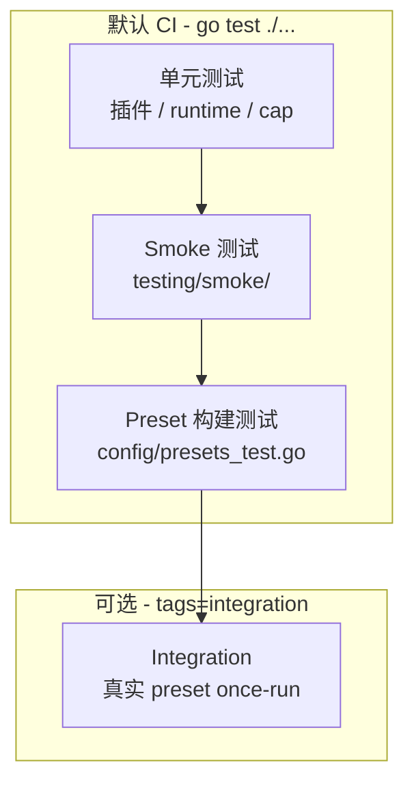

# AgentKit 测试指南

本文描述 AgentKit 的测试分层、共享 testkit 与 CI 入口。设计目标：**生产与测试走同一条 pluginkit 装配路径**，避免「测试专用 wiring」漂移。

## 测试金字塔



| 层级 | 位置 | 命令 | 目的 |
|---|---|---|---|
| 单元 | 各包 `*_test.go` | `go test ./...` | 插件契约、derive/replay、policy、loop 并发 |
| Smoke | `testing/smoke/` | `go test ./testing/smoke/...` | 无 API Key 的 scripted 端到端（subagent、recovery） |
| Preset 构建 | `config/presets_test.go` | `go test ./config/...` | 每个 preset overlay 可 `build.Build[Runner]` |
| Integration | `integration/` | `go test -tags=integration ./integration/...` | 真实 preset + CLI once 跑通并断言 session 事件 |

## 共享 testkit

### `testing/agenttest`

面向 runtime 与工具测试的轻量 helper，**不替代** pluginkit 装配：

| Helper | 用途 |
|---|---|
| `Build` | 从 graph fragment 构建插件实例 |
| `CallTool` | 执行 tool 并返回 JSON |
| `MustScripted` / `AllowAll` | scripted LLM 与审批 |
| `TempFileStore` / `SessionEvents` | 文件 session 与事件读取 |
| `TurnContext` / `LoopTurnContext` / `RunTurn` | agent turn 上下文 |
| `NewSubagentDelegateEnv` | 父→delegate→子 冒烟栈 |
| `AssertSubagentParentSession` | 委派回归断言（无 recovery、单条 delegate result） |
| `AssertDeriveMessagesToolCallsAnswered` | derive 后 tool call 均有 result |
| `NewScriptedAgent` / `SeedCrashedToolCall` | 通用 agent 与崩溃 seed |
| `DenyAllToolsPolicy` | 策略层 deny 场景 |
| `AssertToolResultContains` / `AssertEventAtLeast` | 事件与 tool result 断言 |

### OpenAPI（`testing/openapitest/` + `testing/fixtures/openapi/`）

| 资源 | 用途 |
|---|---|
| `testing/fixtures/openapi/api.json` | 纯索引（auth、bind、`{{BASE_URL}}`、`path`） |
| `testing/fixtures/openapi/api/petstore.json` | 独立 OpenAPI 文档 |
| `openapitest.StartMock` | httptest mock petstore API |
| `openapitest.Materialize` | 复制 fixture 并替换 `{{BASE_URL}}` |
| `openapitest.NewProvider` | 构建 `tool/openapi` provider |

```go
mock := openapitest.StartMock(t)
root := openapitest.Materialize(t, mock.URL)
provider := openapitest.NewProvider(t, root)
tool := openapitest.ToolByName(t, ctx, provider, "petstore__getPet")
out := agenttest.CallTool(t, ctx, tool, `{"id":"42","verbose":true}`)
```

## 场景用例目录

### Smoke（`testing/smoke/`，默认 CI）

| 文件 | 用例 | 覆盖场景 |
|---|---|---|
| `smoke_test.go` | subagent 委派 4 变体 + 崩溃 recovery | delegate 全链路、store session 映射、loop dispatch |
| `subagent_test.go` | 第二轮 turn、子 session 隔离 | 委派后连续 turn、子事件不泄漏 |
| `loop_test.go` | 同 session 串行、跨 session 隔离 | loop 锁与 session 路由 |
| `tool_test.go` | 多 tool derive、policy deny | read 工具链、策略拒绝 |
| `recovery_test.go` | orphan read 修复、干净 session | recovery 合成 interrupted result、不误触发 |
| `web_test.go` | scripted web_search / web_fetch | 网络工具脚本链（无 API Key） |
| `openapi_test.go` | OpenAPI mock + bind + scripted turn | 动态 HTTP 工具、ctx bind、tool runtime 挂载 |

### Integration（`integration/`，`-tags=integration`）

| 文件 | 用例 | 覆盖场景 |
|---|---|---|
| `preset_smoke_test.go` | subagent / autonomous / coding preset | 真实 pluginkit 图 once-run |
| `web_smoke_test.go` | web + web-smoke 链式 preset build | pluginkit 图可构建（ask_user 需交互，不做 once-run） |

示例：

```go
tool := agenttest.Build[agentkit.Tool](t, graph, "tool")
out := agenttest.CallTool(t, context.Background(), tool, `{"path":"README.md"}`)
```

旧代码仍可使用 `plugins/tool/testutil.CallTool`，其已委托到 `agenttest.CallTool`。

### `testing/presettest`

面向 preset 级集成：

```go
result := presettest.RunOnce(t, "用户首条消息", "presets/subagent-smoke.yaml")
events := agenttest.SessionEvents(t, ctx, result.Store, agentkit.SessionID("cli:default"))
```

`RunOnce` 会 chdir 到仓库根、注入 `platform.default.config.prompt` 与 `once: true`，然后 `runner.Run` 直到 CLI 退出。

## 本地命令

```bash
# 默认：全量单元 + smoke（与 CI unit job 一致）
./scripts/test.sh unit

# 仅 smoke
./scripts/test.sh smoke
# 等价: go test ./testing/smoke/...

# preset 集成（较慢，需完整 plugins 图）
./scripts/test.sh integration

# 全部
./scripts/test.sh all
```

## 编写新测试的建议

1. **插件/工具**：优先 `agenttest.Build` + `agenttest.CallTool`；需要 session 时用 `TempFileStore`。
2. **Turn 重放**：用 `llm/scripted` + `agenttest.RunTurn`，断言 `SessionEvents` 与 `DeriveMessages`。
3. **Subagent 回归**：复用 `NewSubagentDelegateEnv` 与 `AssertSubagentParentSession`，不要复制装配代码。
4. **新 preset**：在 `config/presets_test.go` 保证可 build；若有 scripted 步骤，考虑在 `integration/` 加 once-run 断言。
5. **并行**：Smoke 与无共享状态的单元测试使用 `t.Parallel()`；integration preset 默认串行（共享进程 cwd）。

## CI

`.github/workflows/test.yml`：

- **unit**：`go test ./...`（含 smoke 与 preset build）
- **integration**：`go test -tags=integration ./integration/...`

## 与架构文档的关系

平台级测试策略见 [go-agent-harness-architecture.zh.md](../go-agent-harness-architecture.zh.md) 第 11 节；本指南是落地细节与命令入口。
