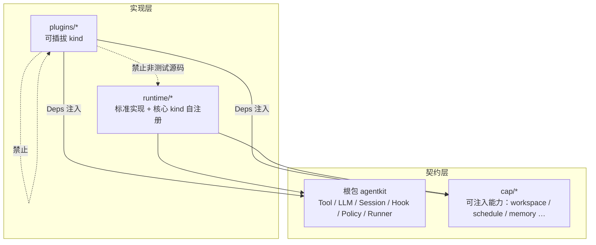

# 契约 / 实现分层 Todo

承接 [go-agent-harness-architecture.zh.md](../go-agent-harness-architecture.zh.md)。本清单只跟踪**分层收敛**，不跟踪功能缺口（功能缺口见 [roadmap.zh.md](../roadmap.zh.md)）。

## 目标

1. **契约层**：根包 `agentkit` 与 `cap/*` 只定义能力接口（接口 + DTO + 常量；允许与接口语义一体的纯函数，如 `workspace.ParseScoped`、`configfile.PeelGlobalFlag`）。
2. **实现层**：`runtime/*` 与 `plugins/*` 是具体实现。`runtime` 放标准/默认实现（含部分 kind 自注册）；`plugins` 放可插拔 kind。
3. **插件只依赖契约**：`plugins/*` 之间不互相 import；跨插件协作只通过配置图 `deps` 注入根包 / `cap` 接口。插件非测试源码不 import 其他插件，也不 import `runtime/*` 实现细节。

| 放哪里 | 内容 |
|---|---|
| 根包 `agentkit` | Agent 通用语义接口与事件模型；轻量辅助（`NewTool`、`PolicyFunc`） |
| `cap/*` | 多插件经 `deps` 注入的可替换能力；工具间共享 DTO |
| `runtime/*` | 上述接口的标准实现、Loop/Runner/Platform、kind 自注册 |
| `plugins/*` | `pluginkit.Register` 的具体插件；默认不对外提供公共方法 |

**允许例外**

- `plugins/all.go`：进程级 blank import，聚合 `plugins/*` 与 `runtime/*` 的 kind 注册。
- `_test.go`：可直接 import 被测实现（runtime 或本插件）；不得借测试 helper 形成插件间生产依赖。
- 同一插件族内部子包：如 `plugins/learning` → `dreaming` / `workshop`。
- `runtime/rctx`：16 个插件仍依赖的上下文协议，**暂不在本清单**（见文末）。

**cap 边界**

- 不放工作流 / 多步 IO。单一消费者下沉到消费方包内；多消费者做成接口 + `runtime` 实现 + `deps` 注入。
- 需要 runtime 内部设施的 kind，可把注册迁入对应 `runtime` 包自注册（先例：`runtime/llm`、`runtime/workspace`、`runtime/agent`）。

排查：`go list -f '{{.ImportPath}}|{{join .Imports "|"}}' ./plugins/...` + 符号级 grep。已符合「非测试源码不碰 runtime」的参照包：`bootstrap`、`policy`、`settings`、`tool/web`、`tool/sessionquery`。

---

## A — 插件改走 cap / 根包接口（消除 `plugins → runtime`）

每项验收：对应插件**非测试源码**不再 import 该 `runtime` 包；能力经 `deps` 注入 cap / 根包接口；`scripts/refresh-preset-goldens` 无意外 diff。

### A1 会话读写（缺 cap，插件仍调包级函数）

- [x] **事件追加 / 派生读取 / 运行状态 → `cap/session`**
  - 落地：`cap/session` 承载事件载荷 DTO（`Todo`/`RunFinishData`/`UsageData` 等）、纯函数投影（`LatestTodos`/`RunStateFromEvents`/`EstimateMessagesChars`/`FlattenTextParts`/`ResolveActiveSessionID`）与按事件域拆分的写接口（`Transcript`/`Lifecycle`/`RunLog`/`Compaction`/`Skills`，组合为 `Events`，恢复标记方法直接挂在 `Events` 上；远程 agent 用 `Conversation`）；`runtime/session/sessevents` 以方法为唯一追加入口（runtime 经 `sessevents.Default` 单例调用）并自注册 `session/events` kind；`ContentTypeAttachmentRef` 常量上移至根包。
  - 接线：`tool/todo`、`tool/finish`（`RunLog`）、`tool/skill`（`Skills`）、`compaction/summary`（`Compaction`）、`agent/acpremote`（`Conversation`）经 `sessionEvents: session.events` 注入同一实例；`hook/turn-continue`、`hook/before-step`、`learning`、`compaction/token-limit` 只用根包 `Session.Read` + cap 纯函数，无需新 dep。
  - 验收：上述插件非测试源码不再 import `runtime/session/sessevents`、`derive`、`sessbind`（`plugins/all.go` 聚合器除外）。

- [x] **sessstore 构造解耦（非测试源码）**
  - 生产代码已不 `NewStore` / `NewJSONL`；仅 `_test.go` 与 `plugins/all.go` 仍引用。

### A2 cap 已有接口、插件仍 import 构造 / 助手

下列 cap 包已存在，缺的是**插件停止 new 实现、改为注入接口**（必要时补齐 cap 方法面）。

- [ ] **`cap/compaction`**：`plugins/hook`（`NewPrune` / `PruneConfig`）、`plugins/compaction`（pipeline / tokenlimit 调 `runtime/compaction`）
- [ ] **`cap/chathistory`**：`plugins/tool/chathistory`（`NewChatHistory`）
- [ ] **`cap/credentials`**：`plugins/credentials`、`tool/mcp`、`tool/openapi`、`tool/shell`（`Store` / `Secret` / `EnvPairResolver` 的 runtime 实现类型）
- [ ] **`cap/memory`**：`plugins/memory`、`learning`、`prompt`（`Service` / `LoadEntries` / `ResolveRel` / `PromptBody`）；`learning` 的 `BackgroundReviewRequiresStaging` 一并收口
- [ ] **`cap/skill`**：`plugins/skill`、`tool/skill`（`Registry` / `Descriptor` / `Content`）
- [ ] **`cap/delivery`**：`learning`、`tool/chathistory`、`tool/send`（路由 ID 等仍走 `runtime/delivery`）
- [ ] **`cap/permission`**：`tool/askuser`、`agent/acpremote`（`Broker` / `Request` / `Result`）
- [ ] **`cap/telemetry`**：`telemetry`、`acpremote`、`mcp`、`openapi`、`recognize`（`BeginObservation` / `WithExporter` 等助手仍在 runtime）
- [ ] **`cap/learning`**：`plugins/learning` 仍 import `runtime/learning`（`ReviewNudge*` / `TryConsumeReviewQuota` 等）
- [ ] **`cap/acp`**：`agent/acpremote` 的 `runtime/acpclient`（`MCPServerNames` / `ToMCPServers`）评估并入现有 `cap/acp`
- [ ] **`cap/filesystem`**：`tool/fs` 的 Grep/Find 统一到 cap DTO（gitignore 匹配留在 `runtime/filesystem`）

### A3 契约尚未成型

- [ ] **LLM 助手**：`plugins/compaction`（`Stream` / `CollectAssistantText` / `IsRetryableError`）、`tool/recognize`（`NewScripted`）、`plugins/prompt` → 上移根包或新建 cap，构造收归装配层
- [ ] **ToolRuntime 构造**：`plugins/tools/deferred`（`NewRuntime`）、`learning`；接口已在根包，构造收归 runtime 装配层
- [ ] **`cap/bind`（空目录）**：`mcp`、`openapi` 的 `ResolveCtxValue` / `In` / `Key`
- [ ] **`cap/media`（空目录）**：`fs`、`recognize` 的媒体路径 / MIME 助手；补齐或并入根包
- [ ] **`runtime/workspace/workpath`**：`acpremote`（`WorkLayout`）、`fs`（`TrimRedundantFSRootPrefix`）归入 `cap/workspace`
- [ ] **投递会话约定**：`plugins/schedule` 的 `runtime/platform/common.WithDeliverySession`；并入 rctx 上移或 `cap/delivery`

### A4 已完成（契约 + 注入）

- [x] **`cap/schedule`**：接口在 cap，cron / fire metadata 在 `runtime/schedule`；插件经 `Engine` deps 注入
- [x] **`cap/workspace.ParseScoped`**：Scope 前缀语法作为契约词汇；`CopyLocalToGlobal` 下沉 `plugins/tool/openapi`
- [x] **`cap/configfile.Writer`**：`credentials` / `mcp` / `openapi` 经 deps 注入；`configfile/writer` kind 在 runtime 自注册

---

## B — 插件之间只依赖接口

生产源码已由 `scripts/check-plugin-imports` 禁止 `plugins/* → plugins/*`（`all.go`、learning 子包除外）。剩余是测试与装配越界。

- [ ] **`plugins/credentials` → `config`**
  - 现状：`EnvLookup` / `MapEnvLookup` / `RegisterGraphEnvSource`
  - 动作：env 图注册改为根包 / cap 契约或 deps 注入

- [ ] **跨插件测试 import**
  - `tool/schedule` 测试 import `plugins/schedule`：改为只依赖 `cap/schedule` + 测试替身
  - `hook` 测试 import `plugins/compaction`：注入 `cap/compaction.Service`
  - `telemetry` 测试 import `plugins/credentials`：注入 `cap/credentials.Store`
  - `tool/web`、`tool/subagent`、`plugins/tool` 根测试 import `plugins/tool/testutil`：helper 迁 `testing/` 或各测试内化
  - `tool/mcp`、`tool/openapi`、`tool/skill`、`tool/testutil` 对 `testing/agenttest` 的用法保持工厂注入，不回退到插件 import

---

## C — 实现层不对外暴露「给别的插件用」的 API

插件模块默认只通过 `init()` + `pluginkit.Register` 出现；包外零使用的符号改小写。

- [ ] **`plugins/learning`**：`NormalizeMemoryNotifications`、`FormatBackgroundReviewNotification`、`NewBackgroundReview`、`NewLearnCaptureTool`、`NewDreamSweep`、`Service` 及其方法
- [ ] **`plugins/learning/dreaming`**：`Run`、`IngestSessions`、评分 / 格式化 / `Store` 方法集（仅父包使用）
- [ ] **`plugins/learning/workshop`**：`Store` / `Proposal`、`FormatList`、`DraftSkillBody` 等
- [ ] **`plugins/tool/send`**：`Dispatch`、`ParseSlashArgs`
- [ ] **各插件 `New*`**：仅被本包 `init()` 引用者改小写（测试随同调整）

---

## D — CI 与架构文档

- [ ] **扩展 `scripts/check-plugin-imports`**
  - 禁止 `plugins/*` → `runtime/*`（核销期间白名单，完成一项删一项）
  - 覆盖 `_test.go` 中的跨插件 import（允许 import 本包与 `testing/`）
  - 禁止 `plugins/*` → `config`
  - 可选：插件导出符号白名单

- [ ] **文档与规则对齐目标分层**
  - [go-agent-harness-architecture.zh.md](../go-agent-harness-architecture.zh.md) 依赖方向
  - [.cursor/rules/project-architecture.mdc](../../.cursor/rules/project-architecture.mdc)（当前仍写 `plugins → runtime`，改为「过渡允许 / 目标禁止」或直接改成目标规则）
  - [plugin-catalog.zh.md](../plugin-catalog.zh.md)

---

## 已完成的反向依赖（testing 非测试源码）

- [x] `testing/agenttest` / `mcptest` / `openapitest` 不再 import `plugins/*`（工厂注入）
- [x] smoke / config / runtime 的 `_test.go` 允许 import 被测插件（叶子测试二进制）

---

## 暂不处理

`runtime/rctx`（session / envelope / route / workspace key / outbound emit）上移根包或 cap，待单独评估。`runtime/platform/common` 的投递路由约定可在该项一并收口。

每完成一项：`go build ./... && scripts/check-plugin-imports`，并确认 `config/testdata/presets/*.resolved.yaml` 无意外 diff。
