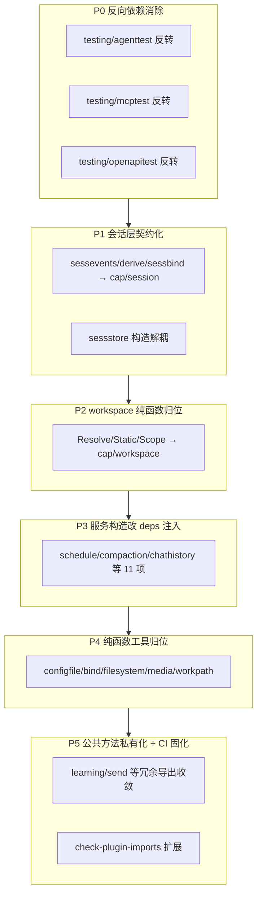

# 插件解耦 Todo — 契约层回归（仅根包 + cap/*）

本清单承接 [go-agent-harness-architecture.zh.md](../go-agent-harness-architecture.zh.md) 的依赖方向规则，目标收敛为：

- 插件只允许 import ① 根包 `agentkit` 接口定义；② `cap/*` 接口定义
- 插件模块默认不对外提供公共方法（仅 `init()` + `pluginkit.Register`）

> **cap 的内容边界（已确认）**：cap 默认只放**抽象后的接口定义**（接口 + DTO + 常量），允许例外仅两类：
> 1. **与接口语义一体的纯函数**（契约词汇）：如 `workspace.ParseScoped` 之于 Scope 常量、`schedule.Schedule.Next` 之于 cron 表达式、`configfile.PeelGlobalFlag` 之于 /add 命令的 `-g` 约定。
> 2. 不放工作流/多步逻辑——单一消费者的下沉到消费方包内（如 `CopyLocalToGlobal` → `plugins/tool/openapi`）；多消费者的**抽象成接口 + runtime 实现 + deps 注入**（如 `configfile.Writer`）。
>
> 重实现插件（需 runtime 内部设施）的另一条出路：**kind 注册迁入对应 runtime 包自注册**（先例：`runtime/llm`、`runtime/workspace`、`runtime/agent` 等 20 处）。

> **暂不处理**：`runtime/rctx`（16 个插件依赖的上下文协议），后续单独立项上移根包/cap，本清单不包含。
>
> 排查方法：`go list -f '{{.ImportPath}}|{{join .Imports "|"}}' ./plugins/...` + 符号级 grep。已符合规则的参照包：`bootstrap`、`policy`、`settings`、`tool/web`、`tool/sessionquery`。

---

## P0 — 反向依赖消除（testing/* 非测试源码 import 插件）

- [x] **testing/agenttest 依赖反转**（最严重，`subagent.go` 为非测试源码）
  - 方案：`SubagentDelegateConfig` 新增 `NewFinishTool`/`NewDelegateTool` 工厂字段，插件构造由调用方注入（`testing/smoke/helpers_test.go` 的 `subagentDelegateConfig()`）。
  - 验收：`grep -rn 'agentkit/plugins/' testing/agenttest --include='*.go'` 无结果。✅

- [x] **testing/mcptest 依赖反转**
  - 方案：`NewProvider(t, newProvider func(configPath, workspaceRoot string))` 工厂注入，smoke 测试传入 `mcpplugin.NewMCP` 适配器。
  - 验收：`grep -rn 'agentkit/plugins/' testing/mcptest --include='*.go'` 无结果。✅

- [x] **testing/openapitest 依赖反转**
  - 方案：`NewProvider(t, root, newProvider func(ws, creds))` 工厂注入；`openapi.CredentialScope` 薄封装替换为 `rtcredentials.OpenAPICredentialScope`。
  - 验收：`grep -rn 'agentkit/plugins/' testing/openapitest --include='*.go'` 无结果。✅

- [x] **testing/smoke 与 config/runtime 测试文件的插件 import——重新界定为允许**
  - 结论：smoke、config、runtime 对插件的 import **全部位于 `_test.go`**（叶子测试二进制，不构成依赖网），且使用类型化 Config/Deps 构造（如 `hook.TurnContinueConfig{MaxContinuations: 3}`）；改注册表反射会丢失编译期类型安全，无架构收益。
  - 调整后的规则：**非测试源码**禁止 import 插件（由 P7 检查脚本保证）；`_test.go` 允许直接 import 被测插件。

## P1 — 会话层契约化（sessevents / derive / sessbind / sessstore）

- [ ] **会话事件读写提为 cap 契约**
  - 现状：`hook`、`compaction`、`tool/todo`、`tool/finish`、`agent/acpremote`、`learning`、`tool/skill` 直接调用 `sessevents.Append*`、`derive.ReadAllEvents`、`sessbind.ResolveActiveSessionID` 等包级函数。
  - 动作：事件追加/派生读取/运行状态抽象为接口（如 `cap/session` 事件服务），由 `runtime/session/*` 实现，经 `deps` 注入插件。
  - 验收：上述插件不再 import `runtime/session/sessevents`、`runtime/session/derive`、`runtime/session/sessbind`。

- [ ] **sessstore 构造解耦**
  - 现状：`hook`、`compaction`、`agent/acpremote` 直接 `sessstore.NewStore` / `NewJSONL` / `NewMemory`。
  - 动作：插件不自行构造存储，改注入根包 `agentkit.SessionStore` 或 cap 存储契约；JSONL/memory 实现选择留在 runtime 装配层。
  - 验收：三个插件不再 import `runtime/session/sessstore`。

## P2 — workspace 纯函数归位

- [x] **`runtime/workspace` 纯函数归位（按 cap 边界规则修正后）**
  - 实际非测试引用仅 2 个插件：`tool/mcp`（ParseScoped×2）、`tool/openapi`（ParseScoped + CopyLocalToGlobal）；其余插件的 `workspace.Service`/Scope 常量本就走 `cap/workspace`。
  - 已做：`ParseScoped` → `cap/workspace/paths.go`（契约词汇：Scope 前缀语法，符合边界例外 1）；`CopyLocalToGlobal` 为 IO 工作流且仅 openapi 一个消费者 → 下沉为 `plugins/tool/openapi/copy_global.go` 包内私有函数（符合边界规则：工作流下沉消费方）；runtime 内部（default/tenant/memory/chatapi）同步改调 cap 版 ParseScoped。
  - 验收：`grep -rn 'runtime/workspace"' plugins/ --include='*.go' | grep -v _test` 仅剩 all.go 聚合。✅
  - 备注：`workpath`（acpremote/fs 使用）归 P4 处理。

## P3 — 服务构造改 deps 注入（逐项核销）

- [x] **runtime/schedule → cap/schedule**：`plugins/schedule`、`plugins/tool/schedule`、`learning`、`runtime/loop`
  - 实际情况：runtime/schedule 是纯算法包（ParseCron/NextFire/JobKind/InFlightExpired + fire_meta 别名），只依赖 cap/schedule；已整体 git mv 入 `cap/schedule` 并删除 runtime 包。符合边界例外 1（cron 表达式与 Job DTO 的领域语义，契约词汇）。✅
- [ ] **runtime/compaction → cap/compaction**：`plugins/hook`（NewPrune/PruneConfig）
- [ ] **runtime/chathistory → cap/chathistory**：`plugins/tool/chathistory`（NewChatHistory）
- [ ] **runtime/credentials → cap/credentials**：`plugins/credentials`、`tool/mcp`、`tool/openapi`、`tool/shell`（Store/Secret/EnvPairResolver）
- [ ] **runtime/llm**：`plugins/compaction`（Stream/CollectAssistantText/IsRetryableError）、`tool/recognize`（NewScripted）、`plugins/prompt`；纯函数助手上移根包或 cap
- [ ] **runtime/memory → cap/memory**：`plugins/memory`、`learning`、`prompt`（Service/LoadEntries/ResolveRel/PromptBody）
- [ ] **runtime/skill → cap/skill**：`plugins/skill`、`tool/skill`（Registry/Descriptor/Content）
- [ ] **runtime/tools**：`plugins/tools/deferred`（NewRuntime）、`learning`；ToolRuntime 契约已在根包，构造收归 runtime 装配层
- [ ] **runtime/delivery → cap/delivery**：`learning`、`tool/chathistory`、`tool/send`（OutboundRouteID 等）
- [ ] **runtime/permission → cap/permission**：`tool/askuser`、`agent/acpremote`（Broker/Request/Result）
- [ ] **runtime/acpclient**：`agent/acpremote`（MCPServerNames/ToMCPServers）；ACP 适配类型评估入 `cap/acp`
- [ ] **runtime/platform/common**：`plugins/schedule`（WithDeliverySession）；投递路由约定并入 rctx 上移时一并处理或入 cap/delivery
- [ ] **runtime/telemetry → cap/telemetry**：`telemetry`、`acpremote`、`mcp`、`openapi`、`recognize`（BeginObservation/WithExporter 等）；`cap/telemetry` 需补齐观测接口契约
- [ ] **runtime/learning**：`plugins/learning`（ReviewNudge*/TryConsumeReviewQuota 等）评估入 `cap/learning`
- [ ] **runtime/memory 后台暂存判定**：`learning` 的 `BackgroundReviewRequiresStaging` 一并随 cap/memory 处理

> 每项验收一致：对应插件不再 import 该 runtime 包；能力经 `deps` 注入 cap 接口；`scripts/refresh-preset-goldens` 无 diff。

## P4 — 纯函数工具归位

- [x] **runtime/configfile → cap 接口 + deps 注入**：`credentials`、`mcp`、`openapi`
  - 已做：`cap/configfile` 定义 `Writer` 接口（WriteTarget/WriteTargetForAdd/WriteAtomic/Restore）+ `PeelGlobalFlag` 纯函数（/add 命令 `-g` 约定的契约词汇）；`runtime/configfile` 保留实现并自注册 `configfile/writer` kind；三插件 Deps 新增 `ConfigFile configfile.Writer`（omitempty，缺失时 /add 命令快速报错）；`config.base.yaml` 新增 `configfile.default` 实例并接入 credentials.default/integrations，scaffold 的 mcp/openapi 规格接入；golden 已重新生成。
  - 验收：`grep -rn 'runtime/configfile' plugins/ --include='*.go' | grep -v _test` 仅剩 all.go 聚合。✅
- [ ] **runtime/bind**：`mcp`、`openapi` 的 `ResolveCtxValue`/`In`/`Key`；`cap/bind` 目前为空目录，补齐契约或并入根包
- [ ] **runtime/filesystem → cap/filesystem**：`tool/fs` 的 Grep/Find DTO 统一到 cap 版（架构文档既定 cap/filesystem 为共享 DTO 归属）
- [ ] **runtime/media**：`fs`、`recognize` 使用点梳理；`cap/media` 目前为空目录，补齐或并入根包
- [ ] **runtime/workspace/workpath**：`acpremote`（WorkLayout）、`fs`（TrimRedundantFSRootPrefix）随 P2 一并归位

## P5 — 越界依赖与插件间测试耦合

- [ ] **plugins/credentials → config 解耦**
  - 现状：使用 `config.EnvLookup`/`MapEnvLookup`/`RegisterGraphEnvSource`。
  - 动作：env 图注册改为根包/cap 契约或经 deps 注入；插件不依赖 config 内部。
- [ ] **插件测试 → testing/agenttest 收敛**：`tool/mcp`、`tool/openapi`、`tool/skill`、`tool/testutil` 的 `agenttest.CallTool` 等用法，随 P0 反转方案一并迁移
- [ ] **tool/testutil 跨插件测试依赖**：`tool/schedule`、`tool/web`、`tool/subagent`、`plugins/tool` 根包测试 import `plugins/tool/testutil`；helper 移入 `testing/` 公共层或各测试内化

## P6 — 公共方法私有化（模块默认不暴露公共 API）

- [ ] **plugins/learning**：`NormalizeMemoryNotifications`、`FormatBackgroundReviewNotification`、`NewBackgroundReview`、`NewLearnCaptureTool`、`NewDreamSweep`、`Service` 及其 8 个方法——包外零使用，全部降级为包内符号
- [ ] **plugins/learning/dreaming**：`Run`、`IngestSessions`、`TopScoredCandidates`、`FormatReviewCandidateBlock`、`FormatStatus`、`Store`/`State`/`Diary` 方法集——仅父包使用，收敛导出面
- [ ] **plugins/learning/workshop**：`Store`/`Proposal` 方法集、`FormatList`、`FormatProposal`、`DraftSkillBody`、`SuggestSkillName`、`Scan`——同上
- [ ] **plugins/tool/send**：`Dispatch`、`ParseSlashArgs` 私有化
- [ ] **各插件 New\* 构造函数**：仅被包内 `init()` 的 `pluginkit.Register` 引用者，统一改小写（测试随同调整）

## P7 — CI 固化

- [ ] **扩展 scripts/check-plugin-imports**
  - 新增禁止 `plugins/*` → `runtime/*`（本清单核销期间用白名单过渡，核销一项移除一项）
  - 覆盖 `_test.go`（捕获 testutil 类跨插件测试依赖）
  - 禁止 `plugins/*` → `config`、`testing/*`
  - 可选：校验插件包导出符号白名单（仅注册必需）
- [ ] **文档同步**：更新 [go-agent-harness-architecture.zh.md](../go-agent-harness-architecture.zh.md) 依赖方向章节与 [plugin-catalog.zh.md](../plugin-catalog.zh.md)，明确「仅根包 + cap/*」为强制规则

---

## 备注

- `runtime/rctx` 上移（16 个插件依赖）**暂不在本清单**，待单独评估后另行立项；届时 `runtime/platform/common` 的路由约定可一并处理。
- 每完成一项：跑 `go build ./... && scripts/check-plugin-imports`，并确认 `config/testdata/presets/*.resolved.yaml` 无意外 diff。
