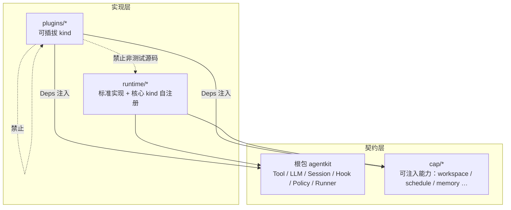

# 契约 / 实现分层 Todo

承接 [go-agent-harness-architecture.zh.md](../go-agent-harness-architecture.zh.md)。本清单只跟踪**分层收敛**，不跟踪功能缺口（功能缺口见 [roadmap.zh.md](../roadmap.zh.md)）。

## 目标

1. **契约层**：根包 `agentkit` 与 `cap/*` 只定义能力接口（接口 + DTO + 常量；允许与接口语义一体的纯函数，如 `workspace.ParseScoped` / `FirstScoped`、`agentkit.PeelGlobalFlag`）。
2. **实现层**：`runtime/*` 与 `plugins/*` 是具体实现。`runtime` 放标准/默认实现（含部分 kind 自注册）；`plugins` 放可插拔 kind。
3. **插件只依赖契约**：`plugins/*` 之间不互相 import；跨插件协作只通过配置图 `deps` 注入根包 / `cap` 接口。插件非测试源码不 import 其他插件，也不 import `runtime/*` 实现细节。

| 放哪里 | 内容 |
|---|---|
| 根包 `agentkit` | Agent 通用语义接口与事件模型；轻量辅助（`NewTool`、`PolicyFunc`） |
| `cap/*` | 多插件经 `deps` 注入的可替换能力；工具间共享 DTO |
| `runtime/*` | 上述接口的标准实现、Loop/Runner/Platform、kind 自注册 |
| `plugins/*` | `pluginkit.Register` 的具体插件；默认不对外提供公共方法 |

**允许例外**

- `plugins/all.go`：进程级 blank import，聚合 `plugins/*` 与 `runtime/*` 的 kind 注册。
- `_test.go`：可直接 import 被测实现（runtime 或本插件）；不得借测试 helper 形成插件间生产依赖。
- 同一插件族内部子包：如 `plugins/learning` → `dreaming` / `workshop`。
- `runtime/rctx`：16 个插件仍依赖的上下文协议，**暂不在本清单**（见文末）。

**cap 边界**

- 不放工作流 / 多步 IO。单一消费者下沉到消费方包内；多消费者做成接口 + `runtime` 实现 + `deps` 注入。
- 需要 runtime 内部设施的 kind，可把注册迁入对应 `runtime` 包自注册（先例：`runtime/llm`、`runtime/workspace`、`runtime/agent`）。

排查：`go list -f '{{.ImportPath}}|{{join .Imports "|"}}' ./plugins/...` + 符号级 grep。已符合「非测试源码不碰 runtime」的参照包：`bootstrap`、`policy`、`tool/web`、`tool/sessionquery`。

---

## A — 插件改走 cap / 根包接口（消除 `plugins → runtime`）

每项验收：对应插件**非测试源码**不再 import 该 `runtime` 包；能力经 `deps` 注入 cap / 根包接口；改 `config.base.yaml` 后 `cd config && go run regen_presets_golden.go` 无意外 diff。

### A1 会话读写（缺 cap，插件仍调包级函数）

- [x] **事件追加 / 派生读取 / 运行状态 → `cap/session`**
  - 落地：`cap/session` 承载事件载荷 DTO（`Todo`/`RunFinishData`/`UsageData` 等）、纯函数投影（`LatestTodos`/`RunStateFromEvents`/`EstimateMessagesChars`/`FlattenTextParts`/`ResolveActiveSessionID`）与按事件域拆分的写接口（`Conversation`——含原 transcript 与 turn/step 括号方法——/`RunLog`/`Compaction`/`Skills`，组合为 `Events`，恢复标记方法直接挂在 `Events` 上；远程 agent 单独用 `Conversation`）；`runtime/session/sessevents` 以方法为唯一追加入口（runtime 经 `sessevents.Default` 单例调用）并自注册 `session/events` kind；`ContentTypeAttachmentRef` 常量上移至根包。
  - 接线：`tool/todo`、`tool/finish`（`RunLog`）、`tool/skill`（`Skills`）、`compaction/summary`（`Compaction`）、`agent/acpremote`（`Conversation`）经 `sessionEvents: session.events` 注入同一实例；`hook/turn-continue`、`hook/before-step`、`learning`、`compaction/token-limit` 只用根包 `Session.Read` + cap 纯函数，无需新 dep。
  - 验收：上述插件非测试源码不再 import `runtime/session/sessevents`、`derive`、`sessbind`（`plugins/all.go` 聚合器除外）。

- [x] **sessstore 构造解耦（非测试源码）**
  - 生产代码已不 `NewStore` / `NewJSONL`；仅 `_test.go` 与 `plugins/all.go` 仍引用。

### A2 cap 已有接口、插件仍 import 构造 / 助手

下列 cap 包已存在。被其他 plugin 非测试源码 import 的，停止 new 实现、改为注入接口；没被其他 plugin import 的，只把该 plugin 里包外无引用的公共函数改小写。

- [x] **`cap/compaction`**：`plugins/hook`、`plugins/compaction` 均调 `runtime/compaction` → 注入
- [x] **`cap/chathistory`**：仅 `tool/chathistory` → 公共函数改小写
- [x] **`cap/credentials`**：`plugins/credentials`、`tool/mcp`、`tool/openapi`、`tool/shell` → 注入
  - 落地：`cap/credentials` 仅 `Store` / `EnvPairResolver` / `Secret` / `GlobalScope`；密文、manifest、scoped 查找在 `plugins/credentials`；mcp / openapi / shell 经 `deps.credentials` 注入 `Store`（shell 另断言 `EnvPairResolver`），各自拼 `mcp.` / `openapi.` / `shell-bash.` scope。
  - 验收：上述插件非测试源码不再 import `runtime/credentials`（该包已删除）。
- [ ] **`cap/memory`**：`plugins/memory`、`learning` → 注入（`prompt` 已走 `cap/memory.Reader`；`learning` 背景审阅信号去重经 `Reader.PreviewAddOutcome`，非测试源码不再 import `runtime/memory`）
- [x] **`cap/skill`**：`plugins/skill`、`tool/skill` → 注入
  - 落地：`cap/skill` 仅 `Registry` / `Descriptor` / `Content`；`skill/filesystem` 实现 Registry；`prompt/section/skills`、`tool/skill` 经 `deps.skills` 注入；`tool/skill` 经 `sessionEvents` 做 `RenderSkillContent` / `AppendSkillLoad`，非测试源码不再 import `runtime/skill`。
  - 验收：`plugins/tool/skill` 非测试源码不再 import `runtime/skill`（解析留在 `plugins/skill` → `runtime/skill`）。
- [x] **`cap/delivery`**：`learning`、`tool/chathistory`、`tool/send` → 注入
  - 落地：`cap/delivery.Assistant`（ResolveRoute / SendAssistantMessage / SendProactiveInboxText）+ `AssistantMessageOptions`；`runtime/delivery` 自注册 `delivery/assistant`；上述插件经 `deps.delivery` 注入（sender 仍用 `cap/delivery.Sender`）。
  - 验收：上述插件非测试源码不再 import `runtime/delivery`。
- [x] **`cap/permission`**：`tool/askuser`、`agent/acpremote` → 注入
  - 落地：`BrokerFrom` / `CapabilityFrom` 与 `NoHuman`/`TimedOut`/… 纯结果构造上移至 `cap/permission`；`runtime/permission` 薄包装保留；插件直调 cap。
  - 验收：`tool/askuser`、`agent/acpremote` 非测试源码不再 import `runtime/permission`。
- [x] **`cap/telemetry`**：`telemetry`、`acpremote`、`mcp`、`openapi`、`recognize` → 注入
  - 落地：`cap/telemetry.Toolkit`（ctx 观测 + 导出助手）；`runtime/telemetry` 自注册 `telemetry/toolkit`；`cap/telemetry.Noop`；各消费者经 `deps.telemetry` 注入；`telemetry/langfuse` 实现 Exporter 仍用 Toolkit 做 ctx 父子 span。
  - 验收：上述插件非测试源码不再 import `runtime/telemetry`。
- [x] **`cap/learning`**：仅 `plugins/learning` → 公共函数改小写
  - 现状：cap 仅接口/DTO，无多余导出函数；learning 编排仍经 `deps.learning` 注入 `ReviewHost` 等。
- [x] **`cap/acp`**：仅 `agent/acpremote` → 公共函数改小写
  - 现状：cap 仅 `SessionMCPProvider` 与 MCP DTO；经 `deps.sessionMcp` 注入。
- [x] **`cap/filesystem`**：`Service`（Read/Write/Append/Stat/List/Grep/Find）+ Grep/Find DTO + `WriteOption`（`WithPerm`）+ `DirEntry/Info.ModTime`；not-found 约定 `errors.Is(err, os.ErrNotExist)`，Write 原子（local=temp+rename），`global:`/`local:` 前缀委托 workspace 双根路由。`filesystem/local` 在 `runtime/filesystem`（gitignore 匹配留在此）。**全部状态插件经 `deps.fs` 注入**：memory、learning（dreaming/workshop/review sidecar）、skills、schedule、credentials（含 `/env add` 0600）、mcp、openapi（含 local→global 复制）、agent/acp-remote（session bind）接 `filesystem.local.state`（root="."）；prompt/agents-md、tool/send（绝对路径）接 unrestricted 的 `filesystem.local.default`。豁免（宿主机语义保留 os 直调）：`acpremote/convert.go` 的 ACP fs 协议、shell 类插件的子进程 cwd。S3/远程另注册 `filesystem/<name>` 即可。

### A3 契约尚未成型

- [ ] **LLM 助手**：`plugins/compaction`（`Stream` / `CollectAssistantText` / `IsRetryableError`）、`tool/recognize`（`NewScripted`）、`plugins/prompt` → 上移根包或新建 cap，构造收归装配层
- [ ] **ToolRuntime 构造**：`plugins/tools/deferred`（`NewRuntime`）、`learning`；接口已在根包，构造收归 runtime 装配层
- [ ] **`cap/bind`（空目录）**：`mcp`、`openapi` 的 `ResolveCtxValue` / `In` / `Key`
- [ ] **`cap/media`（空目录）**：`fs`、`recognize` 的媒体路径 / MIME 助手；补齐或并入根包
- [x] **`runtime/workspace/workpath`**：已删除；路径纯函数在 `cap/workspace`（`NormalizeAgentRel`、`UploadWorkRel` 等），模型/附件落盘统一 `runtime/workspace.ResolveFile`；`TrimRedundantFSRootPrefix` 在 `runtime/filesystem`（`filesystem/local` 用）。
- [x] **投递会话约定**：`plugins/schedule` 的 `runtime/platform/common.WithDeliverySession`；并入 rctx 上移或 `cap/delivery`
  - 落地：`WithInboundRoute` / `WithDeliveryRoute` / `WithDeliverySession` 在 `runtime/rctx`；平台与 `plugins/schedule` 直调 rctx；`runtime/platform/common` 不再提供上述 helper。

### A4 已完成（契约 + 注入）

- [x] **`cap/schedule`**：接口在 cap，cron / fire metadata 在 `runtime/schedule`；插件经 `Engine` deps 注入
- [x] **`cap/workspace.ParseScoped`**：Scope 前缀语法作为契约词汇；`CopyLocalToGlobal` 下沉 `plugins/tool/openapi`
- [x] **slash / 配置路径词汇**：`agentkit.PeelGlobalFlag`；`workspace.FirstScoped`（基于 `ParseScoped`）；`/add` 字节读写走 `filesystem.Service`；session sidecar 的宿主机绝对路径走 `runtime/filesystem.WriteAtomic`

---

## B — 插件之间只依赖接口

生产源码已由 `scripts/check-plugin-imports` 禁止 `plugins/* → plugins/*`（`all.go`、learning 子包除外）。剩余是测试与装配越界。

- [ ] **`plugins/credentials` → `config`**
  - 现状：`EnvLookup` / `MapEnvLookup` / `RegisterGraphEnvSource`
  - 动作：env 图注册改为根包 / cap 契约或 deps 注入

- [ ] **跨插件测试 import**
  - `tool/schedule` 测试 import `plugins/schedule`：改为只依赖 `cap/schedule` + 测试替身
  - `hook` 测试 import `plugins/compaction`：注入 `cap/compaction.Service`
  - `telemetry` 测试 import `plugins/credentials`：注入 `cap/credentials.Store`
  - `tool/web`、`tool/subagent`、`plugins/tool` 根测试 import `plugins/tool/testutil`：helper 迁 `testing/` 或各测试内化
  - `tool/mcp`、`tool/openapi`、`tool/skill`、`tool/testutil` 对 `testing/agenttest` 的用法保持工厂注入，不回退到插件 import

---

## C — 实现层不对外暴露「给别的插件用」的 API

插件模块默认只通过 `init()` + `pluginkit.Register` 出现；包外零使用的符号改小写。

- [ ] **`plugins/learning`**：`NormalizeMemoryNotifications`、`FormatBackgroundReviewNotification`、`NewBackgroundReview`、`NewLearnCaptureTool`、`NewDreamSweep`、`Service` 及其方法
- [ ] **`plugins/learning/dreaming`**：`Run`、`IngestSessions`、评分 / 格式化 / `Store` 方法集（仅父包使用）
- [ ] **`plugins/learning/workshop`**：`Store` / `Proposal`、`FormatList`、`DraftSkillBody` 等
- [ ] **`plugins/tool/send`**：`Dispatch`、`ParseSlashArgs`
- [ ] **各插件 `New*`**：仅被本包 `init()` 引用者改小写（测试随同调整）

---

## D — CI 与架构文档

- [ ] **扩展 `scripts/check-plugin-imports`**
  - 禁止 `plugins/*` → `runtime/*`（核销期间白名单，完成一项删一项）
  - 覆盖 `_test.go` 中的跨插件 import（允许 import 本包与 `testing/`）
  - 禁止 `plugins/*` → `config`
  - 可选：插件导出符号白名单

- [ ] **文档与规则对齐目标分层**
  - [go-agent-harness-architecture.zh.md](../go-agent-harness-architecture.zh.md) 依赖方向
  - [.cursor/rules/project-architecture.mdc](../../.cursor/rules/project-architecture.mdc)（当前仍写 `plugins → runtime`，改为「过渡允许 / 目标禁止」或直接改成目标规则）
  - [plugin-catalog.zh.md](../plugin-catalog.zh.md)

---

## 已完成的反向依赖（testing 非测试源码）

- [x] `testing/agenttest` / `mcptest` / `openapitest` 不再 import `plugins/*`（工厂注入）
- [x] smoke / config / runtime 的 `_test.go` 允许 import 被测插件（叶子测试二进制）

---

## 暂不处理

`runtime/rctx`（session / envelope / route / workspace key / outbound emit）上移根包或 cap，待单独评估。

每完成一项：`go build ./... && scripts/check-plugin-imports`，并确认 `config/testdata/presets/*.resolved.yaml` 无意外 diff。
