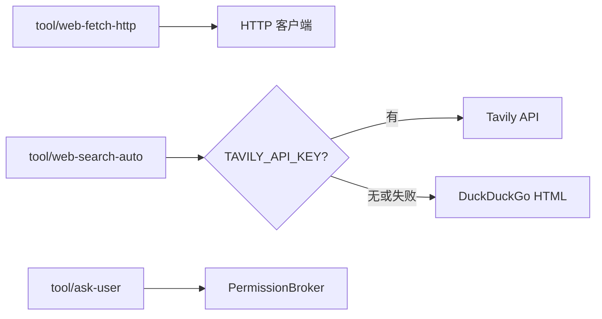

# 工具扩展：网络与 MCP

本文覆盖两类动态/外部工具：**网络抓取与搜索**、**MCP 动态工具**。

## 网络工具

### 插件一览

| 插件 kind | 模型工具名 | 凭据 |
|---|---|---|
| `tool/web-fetch-http` | `web_fetch` | 不需要 |
| `tool/web-search-auto` | `web_search` | L0 默认；有 `TAVILY_API_KEY` 走 Tavily，否则 DuckDuckGo |
| `tool/web-search-tavily` | `web_search` | `TAVILY_API_KEY` / `apiKeyRef` |
| `tool/web-search-duckduckgo` | `web_search` | 不需要 |
| `tool/web-search-exa` | `web_search` | `EXA_API_KEY` / `apiKeyRef` |
| `tool/web-fetch-scripted` | `web_fetch` | 测试替身 |
| `tool/web-search-scripted` | `web_search` | 测试替身 |
| `tool/ask-user` | `ask_user` | 走 [Permission 协议](platform-interaction.zh.md) |



### 抓取（`tool/web-fetch-http`）

| config | 默认 | 说明 |
|---|---|---|
| `timeoutSeconds` | 30 | 单次请求墙钟 |
| `maxBytes` | 1 MiB | 正文读取上限 |
| `maxRedirects` | 5 | 重定向链上限 |
| `allowPrivateHosts` | false | 允许 loopback / 私网 |
| `allowHosts` / `denyHosts` | 空 | 主机白 / 黑名单 |

HTML 转文本；私网地址在 **dial 时**按解析后 IP 拦截（覆盖重定向与 DNS rebinding）。

### 搜索（`tool/web-search-auto`）

Tavily key：`config.tavily.apiKey` → `apiKeyRef` → `TAVILY_API_KEY`。缺 key 或失败时 fallback DuckDuckGo。

### 提问（`ask_user`）

与 policy `DecisionAsk` 统一走 Permission 协议。`platform/headless` 返回 `answered:false` + guidance，不阻塞 turn。**不要挂在子 agent 上**。

### 配置示例

```yaml
tool.web-fetch-http.default:
  use: tool/web-fetch-http

tool.web-search.default:
  use: tool/web-search-auto
  config:
    maxResults: 5
    tavily:
      apiKeyRef: env:TAVILY_API_KEY
  deps:
    credentials: credentials.default

tools.default:
  use: tools/runtime
  deps:
    tools:
      - tool.fs-workspace.default
      - tool.web-fetch-http.default
      - tool.web-search.default
      - tool.ask-user.default
```

冒烟：`presets/web-smoke.yaml`（scripted 替身，无真实请求）。

```sh
export TAVILY_API_KEY=...
go run ./cmd/agent -config presets/web.yaml "查一下官方说法并附来源"
```

## MCP 动态工具

### 配置格式

与 Cursor 等项目一致，顶层 `mcpServers`：

```json
{
  "mcpServers": {
    "github": {
      "command": "docker",
      "args": ["run", "-i", "--rm", "ghcr.io/example/github-mcp"],
      "env": { "GITHUB_TOKEN": "env:GITHUB_TOKEN" },
      "prefix": "github__",
      "timeoutSeconds": 60
    },
    "remote": {
      "url": "http://127.0.0.1:8080/mcp",
      "type": "sse"
    }
  }
}
```

| 字段 | 说明 |
|---|---|
| `command` / `args` | stdio 子进程 |
| `env` | 值可为 `env:NAME`，经 credentials 解析 |
| `url` | HTTP/SSE 端点 |
| `type` | `sse`、`http` / `streamable`；留空先尝试 streamable 再 SSE |
| `prefix` | 模型可见工具名前缀，默认 `<server>__` |
| `allowTools` / `denyTools` | 原始 MCP 工具名白 / 黑名单 |

### 文件查找与挂载

```yaml
mcp.default:
  use: tool/mcp
  config:
    files:
      - .cursor/mcp.json
      - global:mcp.json
  deps:
    workspace: workspace.default
    credentials: credentials.default

tools.default:
  use: tools/runtime
  deps:
    tools:
      - tool.fs-workspace.default
    dynamicTools:
      - mcp.default
```

先命中的文件赢；每次发现工具前重读配置。单个 server 连不上只跳过该 server 并 `slog.Warn`。

多租户场景 MCP 客户端池按 `(租户键, server 名)` 分槽，见 [multi-tenant.zh.md](multi-tenant.zh.md)。
