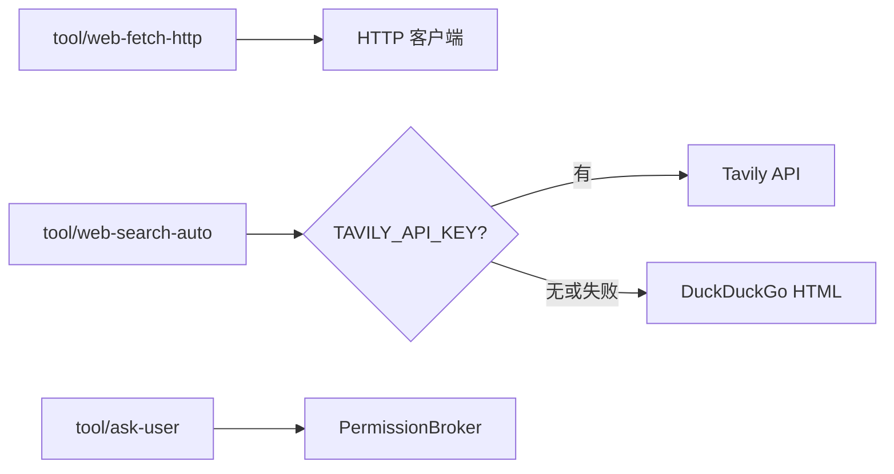

# 工具扩展：网络、MCP 与 OpenAPI

本文覆盖三类动态/外部工具：**网络抓取与搜索**、**MCP 动态工具**、**OpenAPI 动态工具**。

## 网络工具

### 插件一览

| 插件 kind | 模型工具名 | 凭据 |
|---|---|---|
| `tool/web-fetch-http` | `web_fetch` | 不需要 |
| `tool/web-search-auto` | `web_search` | 可选；L0 默认用 `llm.default.hostedTools.web_search`（Responses API 服务端执行） |
| `tool/web-search-tavily` | `web_search` | `TAVILY_API_KEY` / `apiKeyRef` |
| `tool/web-search-duckduckgo` | `web_search` | 不需要 |
| `tool/web-search-exa` | `web_search` | `EXA_API_KEY` / `apiKeyRef` |
| `tool/web-fetch-scripted` | `web_fetch` | 测试替身 |
| `tool/web-search-scripted` | `web_search` | 测试替身 |
| `tool/ask-user` | `ask_user` | 走 [Permission 协议](platform-interaction.zh.md) |



### 抓取（`tool/web-fetch-http`）

| config | 默认 | 说明 |
|---|---|---|
| `timeoutSeconds` | 30 | 单次请求墙钟 |
| `maxBytes` | 1 MiB | 正文读取上限 |
| `maxRedirects` | 5 | 重定向链上限 |
| `allowPrivateHosts` | false | 允许 loopback / 私网 |
| `allowHosts` / `denyHosts` | 空 | 主机白 / 黑名单 |

HTML 转文本；私网地址在 **dial 时**按解析后 IP 拦截（覆盖重定向与 DNS rebinding）。

### 搜索（`tool/web-search-auto`）

Tavily key：`config.tavily.apiKey` → `apiKeyRef` → `TAVILY_API_KEY`。缺 key 或失败时 fallback DuckDuckGo。

### 提问（`ask_user`）

与 policy `DecisionAsk` 统一走 Permission 协议。`platform/headless` 返回 `answered:false` + guidance，不阻塞 turn。**不要挂在子 agent 上**。

### 配置示例

```yaml
tool.web-fetch-http.default:
  use: tool/web-fetch-http

tool.web-search.default:
  use: tool/web-search-auto
  config:
    maxResults: 5
    tavily:
      apiKeyRef: env:TAVILY_API_KEY
  deps:
    credentials: credentials.default

tools.default:
  use: tools/runtime
  deps:
    tools:
      - tool.fs-workspace.default
      - tool.web-fetch-http.default
      - tool.web-search.default
      - tool.ask-user.default
```

冒烟：`presets/web-smoke.yaml`（scripted 替身，无真实请求）。

```sh
export TAVILY_API_KEY=...
go run ./cmd/agent -config presets/web.yaml "查一下官方说法并附来源"
```

## MCP 动态工具

### 配置格式

与 Cursor 等项目一致，顶层 `mcpServers`：

```json
{
  "mcpServers": {
    "github": {
      "command": "docker",
      "args": ["run", "-i", "--rm", "ghcr.io/example/github-mcp"],
      "env": { "GITHUB_TOKEN": "env:GITHUB_TOKEN" },
      "prefix": "github__",
      "timeoutSeconds": 60
    },
    "remote": {
      "url": "http://127.0.0.1:8080/mcp",
      "type": "sse"
    },
    "agenthub": {
      "transport": "streamable-http",
      "url": "env:AGENTHUB_MCP_URL",
      "headers": {
        "X-agenthub-apikey": "env:AGENTHUB_API_KEY"
      }
    }
  }
}
```

| 字段 | 说明 |
|---|---|
| `command` / `args` | stdio 子进程 |
| `env` | 值可为 `env:NAME`，经 credentials 解析 |
| `url` | HTTP/SSE 端点；值可为 `env:NAME` |
| `type` | `sse`、`http` / `streamable` / `streamable-http`；留空先尝试 streamable 再 SSE |
| `transport` | `type` 的别名（与部分部署模板兼容） |
| `headers` | 每次请求都带上的静态 header；值可为 `env:NAME` |
| `prefix` | 模型可见工具名前缀，默认 `<server>__` |
| `allowTools` / `denyTools` | 原始 MCP 工具名白 / 黑名单 |
| `bind` | 从 `context` 透传字段到 MCP server；见下文 |

### 上下文绑定（`bind`）

某些字段（如 `uid`、`trace_id`）不应由模型填写，而应从当前 turn 的 `context.Context` 注入到 MCP server。在 `mcpServers` 条目里用 `bind` 声明：

```json
{
  "mcpServers": {
    "remote": {
      "url": "http://127.0.0.1:8080/mcp",
      "type": "streamable",
      "bind": {
        "X-User-Id": { "from": "ctx:user_id", "in": "header" },
        "X-Agent-Id": { "from": "ctx:agent_id", "in": "header" },
        "trace_id": { "from": "ctx:turn_id", "in": "meta" },
        "AGENTKIT_USER_ID": { "from": "ctx:user_id", "in": "env" }
      }
    }
  }
}
```

| 字段 | 说明 |
|---|---|
| `from` | 值来源，必须为 `ctx:` 前缀 |
| `in` | `header`（HTTP/SSE/Streamable）、`meta`（MCP `_meta`）、`env`（stdio 子进程环境变量） |
| `name` | 目标字段名；省略时用 bind 的 key |

支持的 `from` 值：

| `from` | 对应 context |
|---|---|
| `ctx:user_id` | `KeyUserID` |
| `ctx:session_id` | `KeySessionID` |
| `ctx:store_session_id` | `KeyStoreSessionID` |
| `ctx:history_session_id` | `KeyHistorySessionID`（Loop 预解析，Agent 读写历史首选） |
| `ctx:delivery_session_id` | `KeyDeliverySessionID` |
| `ctx:agent_id` | `KeyAgentID` |
| `ctx:platform_id` | `KeyPlatformID` |
| `ctx:turn_id` | `KeyTurnID` / telemetry turn id |
| `ctx:tool_call_id` | `KeyToolCallID` |
| `ctx:tenant` | 租户键（由 session 推导，如 `slack:C001`） |
| `ctx:metadata.<key>` | `KeyMessageMetadata[key]` |

行为：

- `header` / `meta` 在**每次工具调用**时从当前 ctx 读取；HTTP 传输通过 `HeaderFunc` 注入，不破坏连接池
- `meta` 写入 `CallTool` 请求的 `_meta` 字段，适用于所有传输（含 stdio）
- `env` 仅在 **stdio 子进程启动时**从当时的 ctx 注入；per-call 字段（如 `trace_id`）请用 `meta`
- ctx 值为空时跳过该 bind，不报错

### 文件查找与挂载

```yaml
mcp.default:
  use: tool/mcp
  config:
    enableLocal: true
    files:
      - local:mcp.json
      - global:mcp.json
  deps:
    workspace: workspace.default
    credentials: credentials.default

tools.default:
  use: tools/runtime
  deps:
    tools:
      - tool.fs-workspace.default
    dynamicTools:
      - mcp.default
```

先命中的文件赢。默认只加载 `global:mcp.json`；需要租户/项目级 `local:mcp.json` 时设置 `enableLocal: true`。`/mcp add` 默认写 local，加 `-g` 写全局；`enableLocal` 关闭时只能用 `/mcp add -g`。server 配置和每个 server 的工具列表**只加载一次并缓存在内存里**；`ListTools`/调用工具都读缓存，不会每次都重读 `mcp.json` 或重新对每个 server 发一次 `ListTools` RPC。编辑 `mcp.json`、或重启了某个 server 之后，运行 `/mcp -u` 强制重新读取配置并重新发现工具；也可用 `/mcp add [-g] <name> <json>` 写入配置（先探活校验，失败则回滚文件）。`tool/mcp` 通过 `agentkit.CommandProvider` 贡献这些 command，与模型可见的 Tool 是两套机制，命令本身不会出现在模型的工具列表里。单个 server 连不上只跳过该 server 并 `slog.Warn`。

已建立的 MCP 连接在**空闲**超过 `idleTimeoutSeconds`（默认 300 秒）后会被主动关闭；下次调用时自动重连。设为 `0` 可关闭空闲回收。

**配置约定与维护流程**见 Skill **`mcp-manager`**（`skills/mcp-manager/SKILL.md`，经 `skill(name="mcp-manager")` 加载）。Agent 用 read/edit 改配置后，需请用户执行 `/mcp -u` 刷新动态工具。

多租户场景：`global:mcp.json` 中的 server 进程内共享一条连接；`local:mcp.json` 按 `(租户键, server 名)` 分槽，见 [multi-tenant.zh.md](multi-tenant.zh.md)。

## OpenAPI 动态工具

读取描述普通 HTTP RESTful API 的 `api.json`，把每个 operation 转成模型可见的动态工具——形状上和 `tool/mcp` 一致（同为 `agentkit.ToolProvider`，经 `deps.dynamicTools` 挂载），区别是调用目标是普通 HTTP 端点而不是 MCP server，不需要子进程或长连接。

### 配置格式

`api.json` 是**纯索引文件**：顶层 `apis` 按名字列出 API，每个条目只放 wiring（`path`、`baseUrl`、`auth`、`bind` 等）；OpenAPI 的 `paths`/schema 放在 `path` 指向的独立文档里（可以是原样下载的 spec）。

```json
{
  "apis": {
    "petstore": {
      "path": "api/petstore.json",
      "baseUrl": "https://petstore.example.com",
      "prefix": "petstore__",
      "auth": { "type": "bearer", "token": "env:PETSTORE_TOKEN" },
      "bind": {
        "uid": { "from": "ctx:user_id", "in": "header", "name": "X-User-Id" }
      },
      "allowOperations": ["getPet", "createPet"],
      "timeoutSeconds": 30
    },
    "orders": {
      "path": "api/orders.json",
      "baseUrl": "https://orders.example.com"
    }
  }
}
```

`path` 指向的文件是一份普通 OpenAPI 文档（`openapi` + `info` + `servers` + `paths`，不含 wiring 字段），路径经 `workspace.Resolve` 解析，与 `api.json` 走同一套 `local:`/`global:` 前缀规则。

| 字段 | 说明 |
|---|---|
| `path` | 指向 OpenAPI 文档（推荐） |
| `specFile` | `path` 的遗留别名，二者语义相同；若同时出现且值不同则报错 |
| `paths` | **遗留**：在索引条目内联 OpenAPI paths（仅适合极小 hand-written API）；与 `path` 互斥 |
| `baseUrl` / `servers[0].url` | API 根地址；条目自身 `baseUrl` 优先，其次条目 `servers`，再其次 OpenAPI 文档里的 `servers` |
| `prefix` | 模型可见工具名前缀，默认 `<name>__` |
| `headers` | 每次请求都带上的静态 header |
| `auth` | `bearer` / `header` / `query` / `basic`；敏感字段（`token`/`value`/`password`）支持 `env:NAME`，经 credentials 解析，同 `tool/mcp` |
| `allowOperations` / `denyOperations` | 按 `operationId` 白 / 黑名单 |
| `timeoutSeconds` | 单次请求墙钟，默认 30 |
| `paths.<path>.<method>.parameters[].in` | `path` / `query` / `header` 三种位置，`path` 段用 `{name}` 占位 |
| `paths.<path>.<method>.requestBody` | 仅取 `content["application/json"].schema`，模型侧对应输入的 `body` 字段 |
| `$ref` / `components` | 由 [kin-openapi](https://github.com/getkin/kin-openapi) 解析并展开；OpenAPI 文档内的外部文件引用经 workspace 相对路径加载 |
| `bind` | 从 `context` 程序化注入参数，不暴露给模型；见下文 |

### 上下文绑定（`bind`）

某些参数（如 `uid`、租户 id）不应由模型填写，而应从当前 turn 的 `context.Context` 注入。在 `api.json` 条目里用 `bind` 声明（与 `auth`、`headers` 同属 wiring 层，不必改 OpenAPI spec）：

```json
{
  "apis": {
    "internal": {
      "path": "api/orders.json",
      "baseUrl": "https://api.example.com",
      "bind": {
        "uid": {
          "from": "ctx:user_id",
          "in": "header",
          "name": "X-User-Id"
        },
        "orgId": {
          "from": "ctx:metadata.org_id",
          "in": "query"
        }
      }
    }
  }
}
```

| 字段 | 说明 |
|---|---|
| `from` | 值来源，必须为 `ctx:` 前缀 |
| `in` | `path` / `query` / `header` |
| `name` | HTTP 参数名；省略时用 bind 的 key |
| bind key | 与 OpenAPI spec 中的参数名对应（用于隐藏 schema）；`name` 仅改变实际 HTTP 字段名 |

支持的 `from` 值：

| `from` | 对应 context |
|---|---|
| `ctx:user_id` | `KeyUserID` |
| `ctx:session_id` | `KeySessionID` |
| `ctx:store_session_id` | `KeyStoreSessionID` |
| `ctx:history_session_id` | `KeyHistorySessionID`（Loop 预解析，Agent 读写历史首选） |
| `ctx:delivery_session_id` | `KeyDeliverySessionID` |
| `ctx:agent_id` | `KeyAgentID` |
| `ctx:platform_id` | `KeyPlatformID` |
| `ctx:metadata.<key>` | `KeyMessageMetadata[key]` |

行为：

- 被 bind 的参数**不会**出现在模型可见的 tool input schema 里
- 调用时从 ctx 解析并注入；ctx 值**覆盖**模型传入的同名字段
- ctx 值为空时返回错误，不发起 HTTP 请求
- OpenAPI spec 里可以保留该参数（文档用途）；实际是否注入由 `bind` 决定
- 未在 spec 中出现的 bind（如仅 wiring 层的 header）也会照常注入


每个工具的输入 schema 由 `parameters` + `requestBody` 拼成一个 object：parameter 用各自的 `name` 作为属性名，`requestBody` 对应 `body` 属性。调用结果统一编码为 `{"status":..,"headers":{...},"body":..}` 字符串返回给模型；网络/HTTP 错误也编码为字符串返回，不中断 tool 调用。

### 文件查找与挂载

```yaml
openapi.default:
  use: tool/openapi
  config:
    enableLocal: true
    files:
      - local:api.json
      - global:api.json
  deps:
    workspace: workspace.default
    credentials: credentials.default

tools.default:
  use: tools/runtime
  deps:
    tools:
      - tool.fs-workspace.default
    dynamicTools:
      - openapi.default
```

先命中的文件赢（按 `apis` 里的 name 去重）。默认只加载 `global:api.json`；需要 local 时设 `enableLocal: true`。`/openapi add` 默认写 local，`-g` 写全局；`enableLocal` 关闭时只能用 `/openapi add -g`。解析结果**只加载一次并缓存在内存里**：`ListTools` 读缓存，不会每次都重读 `api.json` 或它引用的 OpenAPI 文档。编辑 `api.json`（或它指向的文档）之后，运行 **`/openapi -u`** 强制重新读取磁盘并刷新动态工具；也可用 **`/openapi add [-g] <name> <json>`** 写入索引（先校验，失败回滚）。`tool/openapi` 通过 `agentkit.CommandProvider` 贡献 slash command，与模型可见的 Tool 是两套机制。维护指南见 Skill **`openapi-manager`**。

### Agent 维护（Skill + `/openapi`）

**约定与字段说明**放在 Skill **`openapi-manager`**（`skills/openapi-manager/SKILL.md`，经 `skill(name="openapi-manager")` 加载）。

**运行时操作**用 slash command（不在模型工具列表里，Agent 改完文件后需请用户执行）：

| 命令 | 作用 |
|---|---|
| `/openapi` | 查看当前已加载 API 与帮助 |
| `/openapi -u` | 重读 `api.json` 与 OpenAPI 文档，刷新动态 HTTP 工具 |
| `/openapi add [-g] <name> <json>` | 追加索引条目（`-g` 写全局；校验、写盘、失败回滚） |

推荐流程：`skill(openapi-manager)` → `read`/`edit` 改文件 → 请用户 `/openapi -u`。
