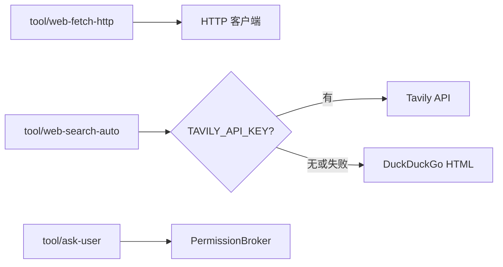

# 工具扩展：网络、MCP 与 OpenAPI

本文覆盖三类动态/外部工具：**网络抓取与搜索**、**MCP 动态工具**、**OpenAPI 动态工具**。

## 网络工具

### 插件一览

| 插件 kind | 模型工具名 | 凭据 |
|---|---|---|
| `tool/web-fetch-http` | `web_fetch` | 不需要 |
| `tool/web-search-auto` | `web_search` | L0 默认；有 `TAVILY_API_KEY` 走 Tavily，否则 DuckDuckGo |
| `tool/web-search-tavily` | `web_search` | `TAVILY_API_KEY` / `apiKeyRef` |
| `tool/web-search-duckduckgo` | `web_search` | 不需要 |
| `tool/web-search-exa` | `web_search` | `EXA_API_KEY` / `apiKeyRef` |
| `tool/web-fetch-scripted` | `web_fetch` | 测试替身 |
| `tool/web-search-scripted` | `web_search` | 测试替身 |
| `tool/ask-user` | `ask_user` | 走 [Permission 协议](platform-interaction.zh.md) |



### 抓取（`tool/web-fetch-http`）

| config | 默认 | 说明 |
|---|---|---|
| `timeoutSeconds` | 30 | 单次请求墙钟 |
| `maxBytes` | 1 MiB | 正文读取上限 |
| `maxRedirects` | 5 | 重定向链上限 |
| `allowPrivateHosts` | false | 允许 loopback / 私网 |
| `allowHosts` / `denyHosts` | 空 | 主机白 / 黑名单 |

HTML 转文本；私网地址在 **dial 时**按解析后 IP 拦截（覆盖重定向与 DNS rebinding）。

### 搜索（`tool/web-search-auto`）

Tavily key：`config.tavily.apiKey` → `apiKeyRef` → `TAVILY_API_KEY`。缺 key 或失败时 fallback DuckDuckGo。

### 提问（`ask_user`）

与 policy `DecisionAsk` 统一走 Permission 协议。`platform/headless` 返回 `answered:false` + guidance，不阻塞 turn。**不要挂在子 agent 上**。

### 配置示例

```yaml
tool.web-fetch-http.default:
  use: tool/web-fetch-http

tool.web-search.default:
  use: tool/web-search-auto
  config:
    maxResults: 5
    tavily:
      apiKeyRef: env:TAVILY_API_KEY
  deps:
    credentials: credentials.default

tools.default:
  use: tools/runtime
  deps:
    tools:
      - tool.fs-workspace.default
      - tool.web-fetch-http.default
      - tool.web-search.default
      - tool.ask-user.default
```

冒烟：`presets/web-smoke.yaml`（scripted 替身，无真实请求）。

```sh
export TAVILY_API_KEY=...
go run ./cmd/agent -config presets/web.yaml "查一下官方说法并附来源"
```

## MCP 动态工具

### 配置格式

与 Cursor 等项目一致，顶层 `mcpServers`：

```json
{
  "mcpServers": {
    "github": {
      "command": "docker",
      "args": ["run", "-i", "--rm", "ghcr.io/example/github-mcp"],
      "env": { "GITHUB_TOKEN": "env:GITHUB_TOKEN" },
      "prefix": "github__",
      "timeoutSeconds": 60
    },
    "remote": {
      "url": "http://127.0.0.1:8080/mcp",
      "type": "sse"
    }
  }
}
```

| 字段 | 说明 |
|---|---|
| `command` / `args` | stdio 子进程 |
| `env` | 值可为 `env:NAME`，经 credentials 解析 |
| `url` | HTTP/SSE 端点 |
| `type` | `sse`、`http` / `streamable`；留空先尝试 streamable 再 SSE |
| `prefix` | 模型可见工具名前缀，默认 `<server>__` |
| `allowTools` / `denyTools` | 原始 MCP 工具名白 / 黑名单 |

### 文件查找与挂载

```yaml
mcp.default:
  use: tool/mcp
  config:
    files:
      - .cursor/mcp.json
      - global:mcp.json
  deps:
    workspace: workspace.default
    credentials: credentials.default

tools.default:
  use: tools/runtime
  deps:
    tools:
      - tool.fs-workspace.default
    dynamicTools:
      - mcp.default
```

先命中的文件赢。server 配置和每个 server 的工具列表**只加载一次并缓存在内存里**；`ListTools`/调用工具都读缓存，不会每次都重读 `mcp.json` 或重新对每个 server 发一次 `ListTools` RPC。编辑 `mcp.json`、或重启了某个 server 之后，运行 `/mcp -u` 强制重新读取配置并重新发现工具；也可用 `/mcp add <name> <json>` 将 server 写入本地 `mcp.json`（先探活校验，失败则回滚文件）。`tool/mcp` 通过 `agentkit.CommandProvider` 贡献这些 command，与模型可见的 Tool 是两套机制，命令本身不会出现在模型的工具列表里。单个 server 连不上只跳过该 server 并 `slog.Warn`。

多租户场景 MCP 客户端池按 `(租户键, server 名)` 分槽，见 [multi-tenant.zh.md](multi-tenant.zh.md)。

## OpenAPI 动态工具

读取描述普通 HTTP RESTful API 的 `api.json`，把每个 operation 转成模型可见的动态工具——形状上和 `tool/mcp` 一致（同为 `agentkit.ToolProvider`，经 `deps.dynamicTools` 挂载），区别是调用目标是普通 HTTP 端点而不是 MCP server，不需要子进程或长连接。

### 配置格式

`api.json` 是一个**索引文件**：顶层 `apis` 按名字列出若干 API，每个条目要么用 `specFile` 指向一个外部的 OpenAPI 文档（可以是原样下载的 spec，不用改动），要么直接内联 `paths`（写精简版时用）——两者二选一，同时给两个会报错。

```json
{
  "apis": {
    "petstore": {
      "specFile": "openapi/petstore.json",
      "baseUrl": "https://petstore.example.com",
      "prefix": "petstore__",
      "auth": { "type": "bearer", "token": "env:PETSTORE_TOKEN" },
      "allowOperations": ["getPet", "createPet"],
      "timeoutSeconds": 30
    },
    "internal": {
      "baseUrl": "https://internal.example.com",
      "paths": {
        "/pets/{id}": {
          "get": {
            "operationId": "getPet",
            "summary": "Get a pet by id",
            "parameters": [
              { "name": "id", "in": "path", "required": true, "schema": { "type": "string" } },
              { "name": "verbose", "in": "query", "schema": { "type": "boolean" } }
            ]
          }
        },
        "/pets": {
          "post": {
            "operationId": "createPet",
            "requestBody": {
              "required": true,
              "content": { "application/json": { "schema": { "type": "object", "properties": { "name": { "type": "string" } } } } }
            }
          }
        }
      }
    }
  }
}
```

`specFile` 指向的文件就是一份普通 OpenAPI 文档（顶层 `servers` + `paths`，没有 wiring 字段），路径经 `workspace.Resolve` 解析，与 `api.json` 自身走同一套 `local:`/`global:` 前缀规则。

| 字段 | 说明 |
|---|---|
| `specFile` | 指向外部 OpenAPI 文档，取其 `paths`；与内联 `paths` 二选一 |
| `baseUrl` / `servers[0].url` | API 根地址；条目自身 `baseUrl` 优先，其次条目 `servers`，再其次 `specFile` 里的 `servers` |
| `prefix` | 模型可见工具名前缀，默认 `<name>__` |
| `headers` | 每次请求都带上的静态 header |
| `auth` | `bearer` / `header` / `query` / `basic`；敏感字段（`token`/`value`/`password`）支持 `env:NAME`，经 credentials 解析，同 `tool/mcp` |
| `allowOperations` / `denyOperations` | 按 `operationId` 白 / 黑名单 |
| `timeoutSeconds` | 单次请求墙钟，默认 30 |
| `paths.<path>.<method>.parameters[].in` | `path` / `query` / `header` 三种位置，`path` 段用 `{name}` 占位 |
| `paths.<path>.<method>.requestBody` | 仅取 `content["application/json"].schema`，模型侧对应输入的 `body` 字段 |

每个工具的输入 schema 由 `parameters` + `requestBody` 拼成一个 object：parameter 用各自的 `name` 作为属性名，`requestBody` 对应 `body` 属性。调用结果统一编码为 `{"status":..,"headers":{...},"body":..}` 字符串返回给模型；网络/HTTP 错误也编码为字符串返回，不中断 tool 调用。

### 文件查找与挂载

```yaml
openapi.default:
  use: tool/openapi
  config:
    files:
      - local:api.json
      - global:api.json
  deps:
    workspace: workspace.default
    credentials: credentials.default

tools.default:
  use: tools/runtime
  deps:
    tools:
      - tool.fs-workspace.default
    dynamicTools:
      - openapi.default
```

先命中的文件赢（按 `apis` 里的 name 去重）。解析结果**只加载一次并缓存在内存里**：`ListTools` 读缓存，不会每次都重读 `api.json` 或它引用的 `specFile`。编辑 `api.json`（或它指向的 spec 文件）之后，运行 `/openapi -u` 强制重新读取磁盘并重建缓存；也可用 `/openapi add <name> <json>` 将 API 写入本地 `api.json`（先校验并生成工具列表，失败则回滚文件）。`tool/openapi` 通过 `agentkit.CommandProvider` 贡献这些 command，与模型可见的 Tool 是两套机制，命令本身不会出现在模型的工具列表里。单个文件解析失败只跳过该文件并 `slog.Warn`。
