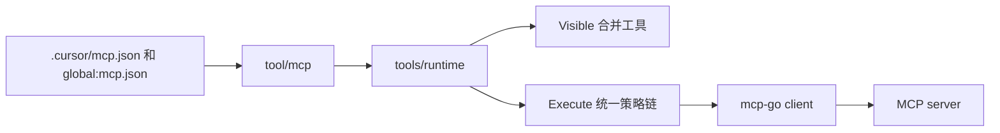

# MCP 动态工具

本文描述 AgentKit 如何把常见项目格式的 `mcpServers` 配置接入模型可见工具列表，并在每次发现工具时动态重读配置。

相关文档：[go-agent-harness-architecture.zh.md](go-agent-harness-architecture.zh.md)、[plugin-catalog.zh.md](plugin-catalog.zh.md)。

## 1. 配置格式

项目级配置文件与 Cursor 等项目一致，顶层为 `mcpServers`：

```json
{
  "mcpServers": {
    "github": {
      "command": "docker",
      "args": ["run", "-i", "--rm", "ghcr.io/example/github-mcp"],
      "env": {
        "GITHUB_TOKEN": "env:GITHUB_TOKEN"
      },
      "prefix": "github__",
      "allowTools": [],
      "denyTools": [],
      "timeoutSeconds": 60
    },
    "remote": {
      "url": "http://127.0.0.1:8080/mcp",
      "type": "sse"
    }
  }
}
```

| 字段 | 说明 |
|---|---|
| `command` / `args` | stdio 子进程启动方式 |
| `env` | 追加环境变量；值可为 `env:NAME`，经 `credentials/env` 或进程环境解析 |
| `url` | HTTP/SSE MCP 端点 |
| `type` | 可选：`sse`、`http` / `streamable`；留空时先尝试 streamable HTTP，再回退 SSE |
| `prefix` | 暴露给模型的工具名前缀，默认 `<server>__` |
| `allowTools` / `denyTools` | 工具白名单 / 黑名单（原始 MCP 工具名，不含 prefix） |
| `timeoutSeconds` | 单次 MCP 调用的墙钟上限 |

AgentKit 扩展字段写在每个 server 条目内，不影响与其他工具共用同一份 `mcp.json`。

## 2. 文件查找

`tool/mcp` 按 `config.files` 顺序读取，**先命中的文件赢**（项目覆盖全局）：

```yaml
mcp.default:
  use: tool/mcp
  config:
    files:
      - .cursor/mcp.json
      - global:mcp.json
  deps:
    workspace: workspace.default
    credentials: credentials.default
```

L0 默认即上述路径：`.cursor/mcp.json` 对应项目根下配置；`global:mcp.json` 对应 `~/.agentkit/mcp.json`。

定义在每次工具发现前重读，改完 JSON 不用重启进程。

## 3. 接入工具运行时

`tool/mcp` 返回动态工具源，经 `tools/runtime` 的 `deps.dynamicTools` 挂载：

```yaml
tools.default:
  use: tools/runtime
  deps:
    tools:
      - tool.fs-workspace.default
    dynamicTools:
      - mcp.default
```

`tools/runtime` 在 `Visible` 时合并静态工具与动态工具；`Execute` 对两类工具走同一条 policy、approval、hook、timeout、结果截断链路。

模型看到的是带 prefix 的工具名、描述和 MCP 原生 input schema，而不是泛化的 `mcp_call`。

## 4. 运行流



单个 server 连不上时只跳过该 server 的工具并 `slog.Warn`，不影响其他 server 与静态工具。

## 5. 跑起来

1. 编辑 `.cursor/mcp.json`，在 `mcpServers` 里加入 server。
2. L0 已默认挂载 `tool/mcp`；直接启动 agent 即可。

```sh
go run ./cmd/agent
> 用 github MCP 查一下某个 PR 的状态
```

若 preset 整颗覆盖了 `tools.default`，需要自行保留 `dynamicTools: [mcp.default]`，见 `presets/web.yaml` 等示例。
