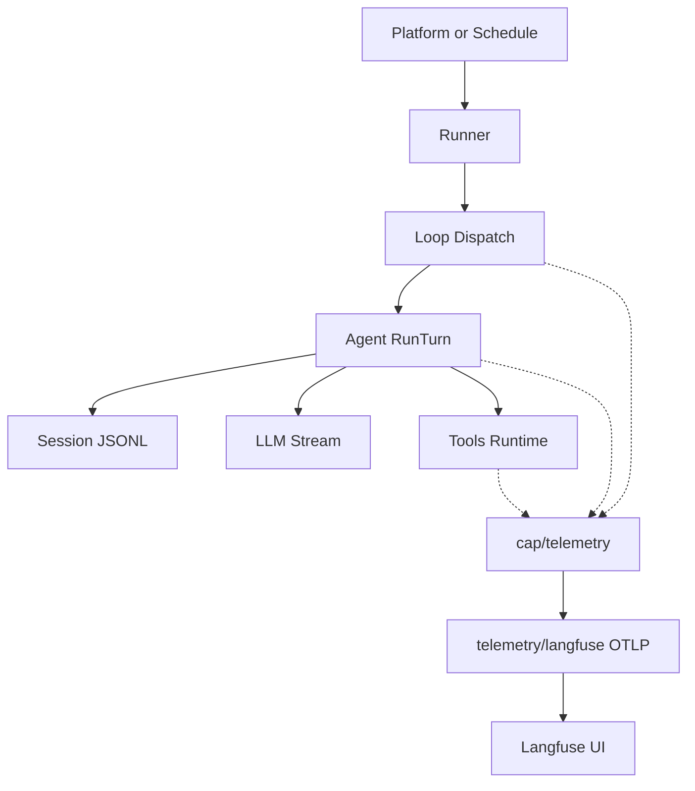

# Langfuse 可观测性设计

本文描述 AgentKit 第一版 Langfuse 直连可观测性方案，与 [roadmap.zh.md](../roadmap.zh.md) M3 观测项对齐。

## 目标

- 在 Langfuse UI 中还原一次 agent turn 的完整链路：用户输入、LLM generation、tool call、usage、错误。
- AgentKit 内部只依赖 `cap/telemetry` 抽象；runner/agent/tools 不直接依赖 Langfuse SDK。
- Session JSONL 仍是权威事实源；Langfuse 为旁路 best-effort 导出，失败不阻断 turn。

## 架构



## Langfuse 映射

| AgentKit 概念 | Langfuse 概念 | 插入点 |
|---|---|---|
| 一次 RunTurn | Trace `agent.turn` | `loop.Dispatch` |
| LLM 调用 | Generation | `agent.runStep` |
| Tool 执行 | Tool observation | `tools.Execute` |
| Token 用量 | `usage_details` | `agent.recordUsage` |
| Turn 错误 | Trace/span error | `runner.dispatch` |

Langfuse v4 推荐经 OTLP/HTTP 写入 `{baseUrl}/api/public/otel`，使用 `langfuse.*` 语义属性。

## 配置

```yaml
telemetry.default:
  use: telemetry/none

telemetry.langfuse:
  use: telemetry/langfuse
  config:
    baseUrl: https://cloud.langfuse.com
    publicKeyRef: env:LANGFUSE_PUBLIC_KEY
    secretKeyRef: env:LANGFUSE_SECRET_KEY
    environment: production
    maxPayloadBytes: 8192
  deps:
    credentials: credentials.default

loop.default:
  deps:
    telemetry: telemetry.default

runner.default:
  deps:
    telemetry: telemetry.default
```

启用 Langfuse 时使用 `presets/langfuse.yaml` 覆盖 `telemetry.default` 为 `telemetry.langfuse`。

## 隐私与可靠性

- input/output 按 `maxPayloadBytes` 截断；敏感 key 名脱敏。
- 导出失败写 `slog.Warn`，不影响 Session 写入。
- `runner.Stop` 与 exporter `Shutdown` 负责 flush，避免短生命周期进程丢 trace。

## 后续

- `telemetry/otel`：通用 OTel 后端。
- `session/sqlite` + 成本汇总 CLI。
- subagent lineage 与 schedule fire 独立 trace。
