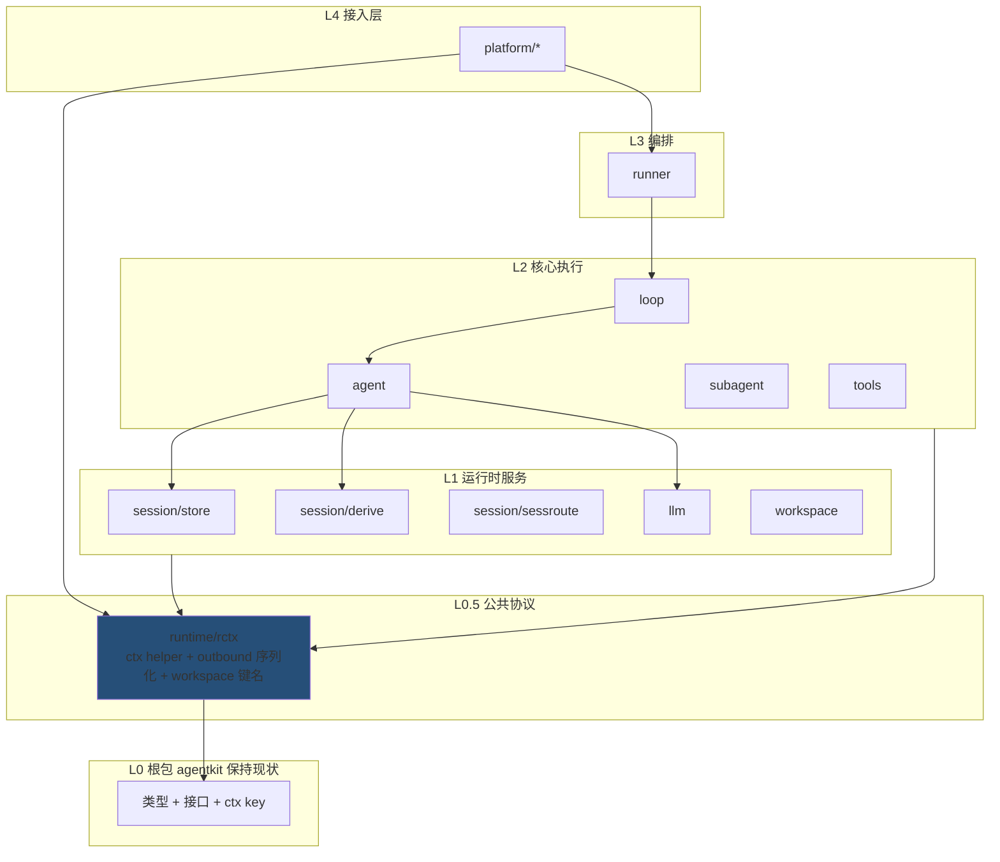

# runtime/ 模块高内聚化重构计划

> **For Claude:** REQUIRED SUB-SKILL: Use superpowers:executing-plans to implement this plan task-by-task.

**Goal:** 消除 runtime/ 下的 god package（session）、层次倒挂（agent→loop）、语义双向依赖（workspace↔session）、god file（feishu.go），使每个模块职责单一。

**Architecture:** 纯结构性重构，不改变任何运行时行为。核心手法：① 新建 `runtime/rctx` 公共协议包，收纳全部 turn 级 ctx helper / outbound 序列化 / workspace 键名——**根包保持现状不膨胀**；② session 按职责拆为子包 + shim 渐进迁移；③ 同包文件级拆分（feishu）。每个 Task 独立提交、可独立 revert。

**设计约束（用户明确）：** 根包 `agentkit` 只保留现有类型、接口、ctx key 定义，**不新增函数**；公共实现内容一律放 `runtime/rctx`。

**Tech Stack:** Go 1.x、pluginkit、`bash scripts/test.sh unit`（含 check-plugin-imports + go test ./...）。

**背景数据（2026-09-18 统计，不含测试代码）：**

| 问题 | 现状 |
|---|---|
| session god package | 53 文件 / 5285 行 / 120+ 导出函数 / 被 23+ 包 import |
| agent→loop 倒挂 | agent 5 文件 import loop，仅为 `MarshalOutboundData` |
| workspace↔session 双向 | workspace/tenant.go 用 `session.WorkspaceFromContext`/`WorkspaceKey` |
| feishu.go god file | 单文件 3875 行 |
| agent 混入命令路由 | commands*.go / catalog_*.go / acp_commands.go ≈700 行 |
| 空目录 | runtime/tenant、runtime/turn（均删除） |

**关键事实（已核实，是本计划的依据）：**

1. 根包 `agentkit.go` 已定义全部 context key（`KeySession`、`KeyTurnEnvelope`、`KeyOutboundEmit`、`KeyScheduleFireTurn` 等，均为导出常量）。`runtime/rctx` 可直接引用，无需改动根包。
2. `runtime/session/route.go` 已有 type alias 先例：`type SessionRouteInput = agentkit.SessionRouteInput`。shim 迁移手法与现状一致。
3. `MarshalOutboundData` 全仓库 15 处调用：agent 5 文件、subagent/emit.go 3 处、delivery/assistant.go 1 处、plugins/agent/acpremote 2 处、loop 自身 2 处。
4. `loop.OutboundEmitFromContext`/`ContextWithOutboundEmit` 使用方：delivery、subagent（2 文件）、loop 自身。类型 `OutboundEmit` 与 key `KeyOutboundEmit` 均在根包。
5. session 外部使用分布：ctx 携带 107 处/25 包、路由 codec 65 处/12 包、事件追加 41 处/8 包、存储 24 处/9 包、消息派生 22 处/7 包、绑定 19 处/4 包、workspace 键名 11 处/4 包。
6. agent 命令文件与 `*Runtime` 的耦合仅 1 处：`commands.go:222` 的 `AgentCatalogEntry()` 方法。
7. plugin kind 是字符串（`agent/catalog-commands`、`session/store`…），与 Go 包路径无关——移动文件不影响 config.base.yaml。

**目标依赖结构：**



**`runtime/rctx` 目标布局：**

```
runtime/rctx/
├── doc.go        # 包说明：turn 上下文协议——一次 turn 内经 context 传递值的读写器
├── outbound.go   # MarshalOutboundData + OutboundEmitFromContext/ContextWithOutboundEmit
├── session.go    # WithSession/SessionFromContext/WithAgentID/*FromContext…
├── envelope.go   # EnvelopeFromContext/ApplyEnvelopeToContext/MergeEnvelopeMetadata
├── metadata.go   # MetadataFromContext/ContextWithMetadata/WithMetadataScope/MetadataString
├── route_ctx.go  # WithRoute/RouteRefFromContext/DeliveryRouteFromContext/ContextWithDeliveryRoute
└── workspace.go  # WorkspaceKey/WithWorkspace/WorkspaceFromContext/WorkspaceDirName/WorkspaceLocalDirName…
```

**全局规则：**

- 每个 Task 完成后必须 `go build ./... && bash scripts/test.sh unit` 全绿再提交。
- 迁移调用点一律机械替换，禁止顺手改逻辑。
- 每个 Phase 结束时同步 `docs/go-agent-harness-architecture.zh.md` 对应段落（用户规则：文档与代码一致）。
- commit message 格式：`refactor(runtime): <task 名>`。

---

## Phase 0: 清理与奠基

### Task 0: 删除空目录 tenant/ 与 turn/，启用 rctx/

**Files:**
- Delete: `runtime/tenant/`、`runtime/turn/`
- Create: `runtime/rctx/doc.go`

**Step 1: 确认两目录无引用**

Run: `grep -rn "runtime/tenant\|runtime/turn" --include="*.go" . | grep -v _test`
Expected: 无输出

**Step 2: 删除空目录，创建 rctx 包占位**

```bash
rmdir runtime/tenant runtime/turn
```

`runtime/rctx/doc.go`：

```go
// Package rctx holds the turn-context protocol: readers and writers for every
// value carried on context.Context during a turn (session, envelope, route,
// metadata, workspace key, outbound emit), plus outbound payload encoding.
// It depends only on the root agentkit package; all runtime layers may depend
// on it.
package rctx
```

**Step 3: 提交**

```bash
git add -A && git commit -m "refactor(runtime): remove empty tenant dir, bootstrap runtime/rctx package"
```

---

## Phase 1: 解层次倒挂（agent→loop），公共 helper 归入 runtime/rctx

### Task 1: `MarshalOutboundData` 与 OutboundEmit ctx helper 移入 runtime/rctx

**Files:**
- Create: `runtime/rctx/outbound.go`
- Modify: `runtime/loop/outbound.go:20-34`（改为转发 wrapper）
- Modify: 15 处 MarshalOutboundData 调用点 + 4 个文件的 OutboundEmit ctx 调用点

**Step 1: 新建 `runtime/rctx/outbound.go`**

实现从 `runtime/loop/outbound.go:20-34` 原样迁移（先读该文件确认两个 ctx helper 的现有实现细节如 nil 处理，原样保留语义）：

```go
package rctx

import (
	"context"
	"encoding/json"

	"github.com/lengzhao/agentkit"
)

// OutboundEmitFromContext returns the per-turn outbound emit hook, if set.
func OutboundEmitFromContext(ctx context.Context) agentkit.OutboundEmit {
	emit, _ := ctx.Value(agentkit.KeyOutboundEmit).(agentkit.OutboundEmit)
	return emit
}

// ContextWithOutboundEmit attaches the per-turn outbound emit hook.
func ContextWithOutboundEmit(ctx context.Context, emit agentkit.OutboundEmit) context.Context {
	return context.WithValue(ctx, agentkit.KeyOutboundEmit, emit)
}

// MarshalOutboundData JSON-encodes an outbound event payload.
func MarshalOutboundData(v any) json.RawMessage {
	raw, _ := json.Marshal(v)
	return raw
}
```

**Step 2: loop/outbound.go 改为转发 wrapper**

```go
// Deprecated: use rctx.OutboundEmitFromContext.
func OutboundEmitFromContext(ctx context.Context) agentkit.OutboundEmit {
	return rctx.OutboundEmitFromContext(ctx)
}
// ContextWithOutboundEmit / MarshalOutboundData 同理
```

`AsyncEmitter`（loop/outbound.go:42-101）含 goroutine 生命周期，**留在 loop**。

**Step 3: 编译验证**

Run: `go build ./...`
Expected: PASS（wrapper 保证兼容）

**Step 4: 迁移全部调用点**

```bash
grep -rl "loop\.MarshalOutboundData" --include="*.go" . | xargs sed -i '' 's/loop\.MarshalOutboundData/rctx.MarshalOutboundData/g'
grep -rl "loop\.OutboundEmitFromContext\|loop\.ContextWithOutboundEmit" --include="*.go" . | xargs sed -i '' \
  -e 's/loop\.OutboundEmitFromContext/rctx.OutboundEmitFromContext/g' \
  -e 's/loop\.ContextWithOutboundEmit/rctx.ContextWithOutboundEmit/g'
```

逐文件用 `goimports -w` 清理 import（新增 `runtime/rctx`、删除不再用的 `runtime/loop`）。涉及文件：
- `runtime/agent/{agent,overflow,recovery,retry,stream_emit}.go`
- `runtime/subagent/emit.go`、`runtime/subagent/async_context.go`
- `runtime/delivery/assistant.go`
- `plugins/agent/acpremote/{acpremote,emit}.go`
- `runtime/loop/{permission,loop}.go`（自身调用改为同包直接调用 rctx）

**Step 5: 删除 loop 中的 wrapper，验证倒挂消除**

Run: `grep -rn "runtime/loop" runtime/agent/*.go runtime/delivery/*.go | grep -v _test`
Expected: 无输出（agent、delivery 不再依赖 loop；subagent 因 `AsyncEmitter`/`SubmitBinder` 仍依赖 loop，属正常 L2 同层协作）

Run: `go build ./... && bash scripts/test.sh unit`
Expected: 全绿

**Step 6: 提交**

```bash
git add -A && git commit -m "refactor(runtime): move MarshalOutboundData and outbound-emit ctx helpers to runtime/rctx"
```

---

### Task 2: session ctx helper 移入 runtime/rctx

**Files:**
- Create: `runtime/rctx/session.go`、`envelope.go`、`metadata.go`、`route_ctx.go`
- Modify: `runtime/session/context_session.go`、`envelope.go`、`metadata.go`、`agent.go`、`channel.go`、`conversation.go`、`route.go`、`scope.go`、`workspace_ctx.go`（纯 ctx 函数改为转发 wrapper）
- Modify: 107 处调用点 / 25 包

**Step 1: 盘点待迁移函数**

筛选标准：**函数体仅含 ctx.Value / context.WithValue + 类型断言**。已知候选（执行时逐一复核）：

| 函数 | 现文件 | 目标文件 |
|---|---|---|
| WithSession / SessionFromContext | context_session.go | rctx/session.go |
| WithAgentID / AgentIDFromContext / SessionIDFromContext / UserIDFromContext / PlatformFromContext | agent.go / channel.go 等 | rctx/session.go |
| EnvelopeFromContext / ApplyEnvelopeToContext / MergeEnvelopeMetadata | envelope.go | rctx/envelope.go |
| MetadataFromContext / ContextWithMetadata / WithMetadataScope / MetadataString | metadata.go | rctx/metadata.go |
| WithRoute / RouteRefFromContext / DeliveryRouteFromContext / ContextWithDeliveryRoute | route.go | rctx/route_ctx.go |
| WithConversation / ConversationFromContext / ConversationFromEvent | conversation.go | rctx/route_ctx.go |
| SessionScopeFromContext | scope.go | rctx/route_ctx.go |
| WithWorkspaceService / WorkspaceServiceFromContext | workspace_ctx.go | rctx/workspace.go |

**明确留下**（涉及 store 或领域逻辑，非纯 ctx）：`ParentSessionForDelegate`、`LoadSession`、`ResolveActiveSessionID`、`ResolveEnvelope`、`ResolveAgentID`、`ResolveEffectiveModel`、`ApplyScope`（含路由策略判断，复核后定）。

**Step 2: 在 runtime/rctx 实现上述函数**

签名中 `agentkit.` 前缀保留（rctx 依赖根包）。例：

```go
// WithSession attaches the turn session to ctx.
func WithSession(ctx context.Context, s agentkit.Session) context.Context {
	return context.WithValue(ctx, agentkit.KeySession, s)
}

// SessionFromContext returns the turn session, if present.
func SessionFromContext(ctx context.Context) (agentkit.Session, bool) {
	s, ok := ctx.Value(agentkit.KeySession).(agentkit.Session)
	return s, ok
}
```

**Step 3: session 包保留转发 wrapper + Deprecated 注释**

```go
// Deprecated: use rctx.WithSession.
func WithSession(ctx context.Context, s agentkit.Session) context.Context {
	return rctx.WithSession(ctx, s)
}
```

**Step 4: 编译验证**

Run: `go build ./...`
Expected: PASS

**Step 5: 分批迁移调用点（每批独立编译+测试）**

批 1（runtime 核心）：`runtime/agent runtime/loop runtime/runner runtime/tools runtime/subagent`
批 2（runtime 周边）：`runtime/platform/* runtime/delivery runtime/telemetry runtime/bind runtime/command runtime/workspace runtime/learning`
批 3（plugins）：`plugins/*`

每批执行（sed 函数名单以 Step 1 复核后的最终清单为准）：

```bash
sed -i '' -E 's/session\.(WithSession|SessionFromContext|EnvelopeFromContext|ApplyEnvelopeToContext|MergeEnvelopeMetadata|WithAgentID|AgentIDFromContext|SessionIDFromContext|UserIDFromContext|PlatformFromContext|WithConversation|ConversationFromContext|ConversationFromEvent|WithRoute|RouteRefFromContext|DeliveryRouteFromContext|ContextWithDeliveryRoute|MetadataFromContext|ContextWithMetadata|WithMetadataScope|MetadataString|SessionScopeFromContext|WithWorkspaceService|WorkspaceServiceFromContext)\(/rctx.\1(/g' <批内文件>
goimports -w <批内文件> && go build ./... && go test ./...
```

**Step 6: 删除 session 中的 wrapper**

Run: `grep -rnE "session\.(WithSession|SessionFromContext|EnvelopeFromContext)" --include="*.go" . | grep -v _test`
Expected: 无输出后删除 wrapper，`go build ./... && bash scripts/test.sh unit` 全绿

**Step 7: 提交**

```bash
git add -A && git commit -m "refactor(runtime): move session ctx helpers to runtime/rctx"
```

---

## Phase 2: 解 workspace↔session 语义双向

### Task 3: workspace 键名与 ctx 移入 runtime/rctx

**Files:**
- Create: `runtime/rctx/workspace.go`
- Modify: `runtime/session/workspace_key.go`、`workspace_ctx.go`、`workspace_local_dir.go`（改 wrapper）
- Modify: `runtime/workspace/tenant.go:172-176`、`tenant_walk.go:17,40-41`
- Modify: 其余 8 处调用点（plugins/agent/acpremote、runtime/platform/chatapi、runtime/platform/common）

**Step 1: 迁移以下符号到 `runtime/rctx/workspace.go`**

`WorkspaceKey`（类型）、`WithWorkspace` / `WorkspaceFromContext`、`WorkspaceKeyFromLocalDir`、`WorkspaceDirName`、`WorkspaceLocalDirName`、`WorkDir`（若为纯路径换算）。先读 `runtime/session/workspace_key.go`、`workspace_local_dir.go` 全文确认：触碰 session 存储布局的函数留在 session，纯命名约定与 ctx 的移走。

**Step 2: session 保留转发（type alias + func wrapper）**

```go
type WorkspaceKey = rctx.WorkspaceKey

// Deprecated: use rctx.WorkspaceFromContext.
func WorkspaceFromContext(ctx context.Context) rctx.WorkspaceKey { ... }
```

**Step 3: 迁移 11 处调用点并删除 wrapper**

重点验证 `runtime/workspace/` 不再 import session：

Run: `grep -rn "runtime/session" runtime/workspace/*.go | grep -v _test`
Expected: 无输出（workspace 只依赖 rctx + 根包，双向依赖解除）

**Step 4: 验证 + 提交**

Run: `go build ./... && bash scripts/test.sh unit`

```bash
git add -A && git commit -m "refactor(runtime): move workspace key naming to runtime/rctx, decouple workspace from session"
```

---

## Phase 3: agent 瘦身

### Task 4: slash command 路由迁往 runtime/command

**Files:**
- Move: `runtime/agent/commands.go`、`commands_model.go`、`acp_commands.go`、`catalog_commands.go`、`catalog_routing.go` → `runtime/command/`
- Modify: `runtime/agent/register.go`（摘除 `agent/catalog-commands` 注册）
- Modify: `runtime/command/register.go`（注册该 kind，字符串不变）
- Test: `runtime/agent/*_test.go` 中命令相关测试随迁

**Step 1: 处理唯一耦合点**

`commands.go:222` 的 `func (a *Runtime) AgentCatalogEntry() string` 是 `*Runtime` 方法——**留在 agent 包**（并入 agent.go 或保留小文件 catalog_entry.go）。通读 catalog_routing.go 确认是否还有其他 `*Runtime` 方法，同法处理。

**Step 2: 移动文件并改包名**

```bash
git mv runtime/agent/commands.go runtime/agent/commands_model.go runtime/agent/acp_commands.go runtime/agent/catalog_commands.go runtime/agent/catalog_routing.go runtime/command/
```

包名 `agent` → `command`，修复 import（对 agent 包导出符号的引用改为 import `runtime/agent`；对 session 的引用按 Phase 1/2 后的新位置用 rctx）。

**Step 3: 迁移 plugin 注册**

`runtime/agent/register.go` 删除 `pluginkit.Register("agent/catalog-commands", NewCatalogCommands)`；`runtime/command/register.go` 增加之。kind 字符串不变 → `config.base.yaml` 的 `agent.catalogCommands.default` 实例无需改动。

**Step 4: 验证注册表完整**

Run: `bash scripts/test.sh unit`（含 plugins/schema_test.go 校验插件图）
Expected: 全绿

**Step 5: 提交**

```bash
git add -A && git commit -m "refactor(runtime): move agent slash commands to runtime/command"
```

---

## Phase 4: session 拆分子包

最大的一块。策略：**先建子包 → session 留 shim → 分批迁移调用方 → 删 shim**。全程任何时刻代码可编译、测试绿。前置：Task 2、3 已完成（ctx 与 workspace 键名已移走，session 只剩存储 / 派生 / 路由 / 绑定四块）。

### Task 5: 建立 sessroute 子包（路由 codec）

架构文档明确"runtime/session 是 RouteKindSession 的 codec owner"——子包延续该归属。

**Files:**
- Create: `runtime/session/sessroute/`（从 session 移入：`route.go` 剩余部分、`router.go`、`delivery.go`、`policy.go`、`platform_policy.go`、`scope.go`、`id.go`、`active_key.go`、`active_resolve.go`）
- Modify: `runtime/session/` 对应文件改 shim

**Step 1: 移动并改包名 `sessroute`**，内部对 session 符号的引用逐一确认（反向依赖 store 的函数留在 session）

**Step 2: session 包加 shim（type alias + func 转发）**，`go build ./...` 绿

**Step 3: 迁移 65 处外部调用点**（12 包：platform/* 7 个、runner、delivery、subagent、plugins/schedule），调用方 import 加 `sessroute "github.com/lengzhao/agentkit/runtime/session/sessroute"`

**Step 4: 删 shim**，`bash scripts/test.sh unit` 全绿，提交

```bash
git add -A && git commit -m "refactor(runtime): extract session route codec into sessroute subpackage"
```

### Task 6: 建立 store 子包（SessionStore 实现 + 事件追加 + 绑定）

**Files:**
- Create: `runtime/session/store/`（移入：`store.go`、`store_cache.go`、`store_runtime.go`、`jsonl.go`、`jsonl_load.go`、`sqlite_index.go`、`index_extract.go`、`index_sync.go`、`layout.go`、`path.go`、`lifecycle.go`、`recovery.go`、`runstate.go`、`sidecar.go`、`static.go`、`conversation.go` 存储部分、`subagent.go`、`runtime_bind.go`、`runtime_global.go`、`runtime_resolve.go`、`runtime_session.go`、`commands_plugin.go`、`memory.go`、`memory_window.go`、`types.go`，以及散布在 `derive.go`/`lifecycle.go`/`memory.go`/`recovery.go`/`runstate.go`/`subagent.go` 中的 `Append*` 事件追加函数）
- plugin 注册（`session/store`、`session/sqlite-index`、`session/commands` 三个 kind）随 `register.go` 移入 store 子包 `init()`，kind 字符串不变

**Step 1-4:** 同 Task 5 节奏（移动 → shim → 迁移调用点（存储 24 处/9 包 + 事件追加 41 处/8 包 + 绑定 19 处/4 包）→ 删 shim → 测试 → 提交）

注意：`NewStore`/`NewJSONL` 等构造器被 `runtime/runner`、`runtime/platform/cli` 直接调用，迁移时逐包替换。

### Task 7: 建立 derive 子包（事件→消息派生）

**Files:**
- Create: `runtime/session/derive/`（移入：`derive.go` 剩余部分、`hydrate.go`、`sanitize.go`、`message_text.go`、`logical_chars.go`、`llm_paths.go`、`tool_result_spill.go`、`recall_format.go`、`prune.go`、`skill_render.go`）

**Step 1-4:** 同节奏（迁移 22 处/7 包：agent、subagent、tools、learning、plugins/compaction 等）

依赖方向约束：`derive → store → sessroute → rctx → 根包`，禁止反向。`derive.go` 依赖 `cap/compaction`、`cap/skill`；`hydrate.go` 依赖 `runtime/media`——保持现有 import 方向即可。

### Task 8: 清空 session 顶层包

**Step 1:** 全部 shim 删除后，`runtime/session/` 顶层应无剩余符号——删除空目录或保留 `doc.go` 说明子包布局

**Step 2:** 全量验证 + 提交

Run: `go build ./... && bash scripts/test.sh all`（含 integration）
Expected: 全绿

```bash
git add -A && git commit -m "refactor(runtime): dissolve session god package into store/derive/sessroute"
```

---

## Phase 5: feishu.go 拆分（同包文件级，零接口风险）

### Task 9: feishu.go 按职责拆为 9 个文件

纯同包内移动函数，不改签名、不改调用方。目标拆分（基于 `grep -nE "^func |^type "` 全文核对）：

| 新文件 | 内容（现 feishu.go 行号区间） |
|---|---|
| `sanitize_log.go` | `sanitizingLogger` 全套（39-98） |
| `user_profile.go` | resolveUserName / cachedUserProfile / fetchUserProfile / userProfileMetadata / mentionMetadata / userIDFromEvent / isValidFeishuLookupID / resolveUserNames / resolveChatName / chatMember* / resolveMentionsInContent（939-1234） |
| `reply_chain.go` | chainMessage / fetchQuotedMessage / resolveBotSenderName / fetchSingleMessage / fetchReplyChain / formatReplyChain / extractPostPlainText（1235-1489） |
| `card_extract.go` | extractInteractiveCardText / extractCardElements / extractCardTable / extractCardListItems（1490-1719） |
| `merge_forward.go` | parseMergeForward / replaceMentions / formatMergeForwardTree（1720-1894） |
| `recall.go` | recalledMessageTTL / markMessageRecalled / isMessageRecalled / isMessageWithdrawnCode / IsMessageRecalled / isMessageWithdrawnError / onMessageRecalled（422-567） |
| `reactions.go`（并入已有文件） | addReaction / addReactionWithEmoji / removeReaction / StartTyping / AddDoneReaction（349-421） |
| `outbound_content.go` | buildOutboundContent / buildPlainTextContent / buildReplyContent / maxCardTables / countMarkdownTables / buildPostMdJSON / preprocessFeishuMarkdown / markdownIndicators / containsMarkdown / isValidFeishuHref / mdLinkRe（2122-末尾） |
| `media_download.go` | downloadImage / downloadResource / detectMimeType / predictMsgType / detectFeishuFileType（2021-2121） |
| `feishu.go`（保留） | Platform struct / Start / webhook / onCardAction / onMessage / dispatchMessage / Reply / sendIMContent / SendImage / SendFile / sendMediaMessage |

**Step 1:** 逐文件移动内容块（每移一个文件 `go build ./runtime/platform/feishu` 一次）

**Step 2:** `bash scripts/test.sh unit` 全绿

**Step 3:** 提交

```bash
git add -A && git commit -m "refactor(platform/feishu): split feishu.go god file by concern"
```

---

## Phase 6: 文档同步

### Task 10: 更新架构文档

**Files:**
- Modify: `docs/go-agent-harness-architecture.zh.md`
- Modify: `.cursor/rules/project-architecture.mdc`（分层描述补充 runtime/rctx）

**Step 1:** 更新以下段落：
- 目录布局（约 1298 行）：新增 `runtime/rctx`、session 子包结构、runtime/command 新职责
- "runtime/session 是 RouteKindSession 的 codec owner"（约 907 行）：改为 sessroute 子包
- 依赖方向节：补充 `runtime/rctx` 层规则——"turn 级 ctx helper 与 outbound 序列化归 runtime/rctx；根包只保留类型、接口与 ctx key"

**Step 2:** 提交

```bash
git add -A && git commit -m "docs: sync architecture doc with runtime modularization"
```

---

## 工作量与顺序

| Task | 内容 | 风险 | 预估 |
|---|---|---|---|
| 0 | 删 tenant/、启用 rctx/ | 无 | 5 min |
| 1 | MarshalOutboundData/emit ctx → rctx | 低（15+6 处） | 30 min |
| 2 | session ctx helper → rctx | 中（107 处，机械） | 1-2 h |
| 3 | workspace 键名 → rctx | 低（11 处） | 30 min |
| 4 | agent 命令迁移 | 中（5 文件） | 1 h |
| 5-8 | session 拆子包 | 高（53 文件/300+ 处） | 半天 |
| 9 | feishu.go 拆分 | 低（同包移动） | 1-2 h |
| 10 | 文档同步 | 无 | 30 min |

**依赖序：** 0 → 1 → 2 → 3 →（4、5-8、9 三者互不依赖，可任意顺序/并行）→ 10。
Task 9 与其他任务零交集，适合并行或穿插。Task 5-8 必须在 2、3 之后（ctx 与 workspace 键名先移走，session 才能干净拆分）。

**回滚策略：** 每个 Task 独立 commit；Task 5-8 的 shim 期任何时刻可安全暂停（shim 保持兼容）。
