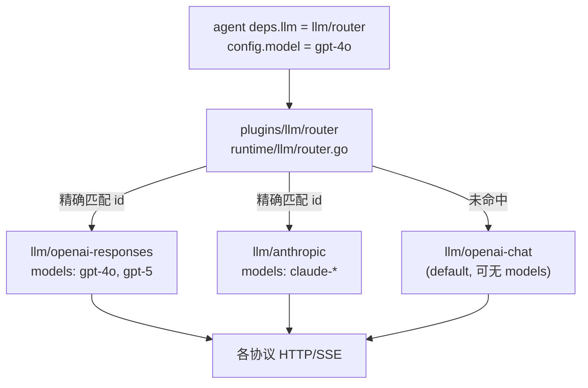

# LLM 协议路由（多插件 + 按模型自动适配）

**状态：** 已实现 L0（2026-09-23）：router、openai-chat/responses、catalog、ModelModalityAwareLLM；`llm/anthropic` 仍 roadmap。  
**关联实现计划：** [2026-09-23-llm-protocol-router.md](./2026-09-23-llm-protocol-router.md)

## 背景

不同模型对应不同的 HTTP wire 协议（OpenAI Chat Completions、OpenAI Responses、Anthropic Messages 等）。Agent 运行时只应维护统一的 `ModelMessage` / `LLMRequest`；协议差异收敛在 LLM 插件边界。

目标（用户确认）：

1. 可配置**多个 LLM 插件实例**，每个实例对应**一种** wire 协议。
2. 单个协议实例的 `config` 内可声明**多种模型**（共享 `baseUrl` / 凭证）。
3. Agent 仅配置 **`config.model`**（或 `/model` 切换模型名），运行时**自动**选中协议。
4. 配置 **`default` 协议实例**：目录未命中时走默认协议（模型名原样转发）。

参考：Pi 的 `model.api` + `createProvider` 分发；Hermes 的 `api_mode` + `ProviderProfile`。Agentkit 采用 **pluginkit 多实例 + 显式模型目录**，不做 URL 启发式猜协议。

## 架构



### 分层

| 层 | 职责 |
|---|---|
| 根包 `agentkit` | `LLMProvider`、`LLMRequest`、可选 `ModalityAwareLLM` / 扩展 `ModelModalityAwareLLM` |
| `cap/llm`（新增） | 协议插件向 router 暴露的**目录契约**（模型 id、modalities），仅类型 |
| `runtime/llm` | 各协议实现、router、fallback 与现有 openai 后端 |
| `plugins/llm/router` | `pluginkit.Register("llm/router", …)` 薄注册 |

**依赖方向：** `plugins/llm/router` → `runtime/llm` → `cap/llm` + 根包；协议插件 `plugins/llm/*` 或现有 `runtime/llm/register.go` 不变更 plugins 互引规则。

## 配置

### 协议实例（一种 wire 一种 kind）

将现有 `llm/openai-compatible` 的 `config.api` **拆成两个 kind**（实现阶段可先做别名兼容）：

| kind | wire | 说明 |
|---|---|---|
| `llm/openai-chat` | Chat Completions | 原 `api: chat` |
| `llm/openai-responses` | Responses API | 原 `api: responses`，含 `hostedTools` |
| `llm/anthropic` | Anthropic Messages | 新实现 |
| `llm/openai-compatible` | （过渡） | 保留一版，`api` 字段仍有效；文档标记 deprecated，preset 逐步迁移 |

协议实例 **公共** 字段：

- `baseUrl`、`apiKey` / `apiKeyRef`、retry、timeout（与现 openai 一致）
- `models[]`：可选；列出则参与**精确路由**；省略则**仅**作 default 兜底

`models[]` 元素：

```yaml
models:
  - id: gpt-4o                    # 与 agent.config.model 精确匹配
    modalities: [text, image]     # 可选；缺省用 DefaultLLMModalities
    # 未来：contextWindow, maxTokens（compaction 用）
```

### Router 实例

```yaml
llm.responses:
  use: llm/openai-responses
  config:
    baseUrl: https://api.openai.com/v1
    apiKeyRef: env:OPENAI_API_KEY
    models:
      - id: gpt-4o
      - id: gpt-5

llm.anthropic:
  use: llm/anthropic
  config:
    apiKeyRef: env:ANTHROPIC_API_KEY
    models:
      - id: claude-sonnet-4-20250514
        modalities: [text, image]

llm.gateway-default:
  use: llm/openai-chat
  config:
    baseUrl: https://gateway.example/v1
    apiKeyRef: env:GATEWAY_KEY
    # 无 models → 不参与精确匹配

llm.router:
  use: llm/router
  deps:
    protocols: [llm.responses, llm.anthropic, llm.gateway-default]
    default: llm.gateway-default

agent.coding:
  deps:
    llm: llm.router
  config:
    model: gpt-4o
```

Agent **`deps.llm` 指向 `llm/router`**（或 `llm/fallback` 外包 router，见下）。

## 路由算法

构建图时（router `New`）：

1. 遍历 `deps.protocols` 中每个 `LLMProvider`；若实现 `cap/llm.ModelCatalog`，读取 `models` 目录。
2. 对每个 `model.id` 建立 `id → protocol实例` 映射；**重复 id → 启动失败**（明确错误信息含两个实例名）。
3. `deps.default` 必须指向 `protocols` 之一；该实例**不**参与映射（即使配置了 `models` 也以 default 角色为准，其 `models` 仅用于 modalities 元数据，不参与精确匹配——避免 default 与精确表冲突）。

运行时 `Stream(ctx, req)`：

1. `m := strings.TrimSpace(req.Model)`；空则用 agent 注入前的校验（保持现有行为）。
2. 若 `catalog[m]` 存在 → 委托该 protocol 的 `Stream`（`req.Model` 不变）。
3. 否则若配置了 `default` → 委托 default protocol 的 `Stream`（**不改写** model 名）。
4. 否则 → 返回错误：`unknown model %q and no default protocol configured`。

Router **`Name()`** 返回 `llm/router`；日志/telemetry 可增加 attribute `llm.protocol=<delegated.Name()>`（实现阶段）。

## Modalities 与 PrepareMessagesForLLM

今日 `ProviderModalities(llm)` 无 model 参数。Router 场景下 modalities **按模型** 变化。

扩展（根包，轻量）：

```go
// ModelModalityAwareLLM is optional. When implemented, the agent runtime
// uses ModalitiesForModel(activeModel) instead of Modalities().
type ModelModalityAwareLLM interface {
    ModalitiesForModel(model string) []string
}
```

- 各协议插件：对 catalog 中的 id 返回条目中的 `modalities`；对 default-only 实例返回 default modalities。
- Router：实现 `ModelModalityAwareLLM`，先走路由规则再委托。
- `runtime/agent`：`prepareStepHistory` 在 agent 未 override `modalities` 时调用 `rtllm.ProviderModalitiesForModel(a.llm, a.model)`（新 helper，优先 `ModelModalityAwareLLM`）。

## 与 `llm/fallback` 的关系

推荐装配：

```yaml
llm.router: …
llm.fallback:
  use: llm/fallback
  deps:
    llm: llm.router
  config:
    fallbackModels: [gpt-4o-mini, claude-haiku-…]
```

Fallback **只改**下一次 `req.Model`；协议选择仍由 router 完成。  
Fallback 实现 `ModelModalityAwareLLM` 时：**按当前 attempt 的 model** 向底层 router 查询 modalities（与现有「链首 provider」语义对齐，但改为 per-model）。

## 协议插件职责

Router **不**修改 `Messages` / `Tools`。跨协议历史兼容在**目标协议**编码前完成（类似 Pi `transformMessages`）：

|  concern | 处理位置 |
|---|---|
| tool call id 规范化 | 各 `runtime/llm/*_convert.go` |
| thinking / reasoning 块 | 同模型保留；跨协议降级或丢弃 |
| 非 vision 模型图片 | 已有 `PrepareMessagesForLLM` + modalities |

## 命令与 UX

- `/model <id>`：仅改 session/agent 绑定的 **model 字符串**；下一 step router 自动选协议。
- `/model` 列表（可选增强）：合并各 catalog 的 id + 标注 protocol kind；未列入 catalog 的模型仍可通过 default 使用。
- 启动校验失败（重复 id、default 不在 protocols 列表）在 **build 图** 阶段失败，避免运行中 silent misroute。

## 非目标（本阶段）

- URL 启发式 `api_mode`（Hermes 式）。
- 单插件内 `api: chat|responses` 切换作为长期方案（保留 deprecated 兼容即可）。
- 动态从远端 `/models` 拉 catalog 自动注册（可后续 `catalog.refresh` 扩展）。

## 测试策略

- `runtime/llm/router_test.go`：匹配、default、重复 id、unknown model。
- 集成：`config/testdata` 增加最小 router preset；smoke 断言 `gpt-4o` 委托到 responses mock。
- `check-plugin-imports`：router 插件不 import 其他 plugins。

## 文档同步

- `docs/plugin-catalog.zh.md`：新增 `llm/router`、`llm/openai-chat`、`llm/openai-responses`。
- `docs/go-agent-harness-architecture.zh.md` §6.8：Provider 选择改为 router + catalog。
- preset / `skills/agentkit-config`：示例迁移路径（非一次性全改 preset）。
