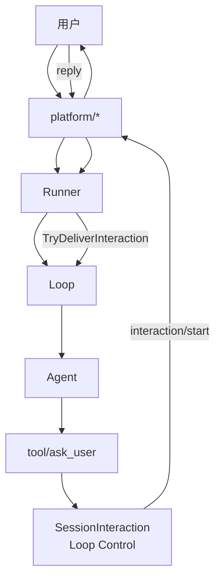

# Platform Human-in-the-loop

`tool/ask_user` 以及未来的 approval / 表单 / 多选，都走同一套 **Human-in-the-loop（HIL）** 控制流：Loop 管 pending，Platform 只负责渲染与回传。

## 架构



| 层 | 职责 |
|---|---|
| `tool/ask-user` | 调用 `SessionInteraction.RunInteraction`；未答时附 guidance |
| `runtime/loop.Control` | pending 状态、`RunInteraction`、`DeliverInteractionReply` |
| `platform/*` | `Send(interaction/start)` 渲染；同步平台另实现 `InteractionHandler` |
| `runner` | 入站消息先走 `TryDeliverInteraction`，避免误开新 turn |

## 核心接口

```go
type SessionInteraction interface {
    RunInteraction(context.Context, HumanInteraction) (InteractionResult, error)
}

type InteractionHandler interface {
    ReadInteractionReply(context.Context, HumanInteraction) (InteractionReply, error)
}

type AsyncInteractionPlatform interface {
    AsyncInteraction() bool
}
```

- **CLI**：实现 `InteractionHandler`，`Send` 渲染提示，`ReadInteractionReply` 读 stdin
- **IM（未来 Lark）**：实现 `AsyncInteractionPlatform`，`Send` 发卡片，用户回复经 `TryDeliverInteraction` 唤醒 pending
- **Headless worker/timer**：两者皆无 → 立即 `answered:false`

## 事件

| Type | 含义 |
|---|---|
| `interaction/start` | 开始一次 HIL 提示 |
| `interaction/end` | 提示结束 |

`HumanInteraction.Kind` 区分 `question` / `approval` / `confirmation` / `choice`。

## 配置

`tool/ask-user` **不再** deps `ask/*`：

```yaml
tool.ask-user.default:
  use: tool/ask-user
```

交互能力完全由 inbound `platform/*` 决定。

## 与 approval 的区别

| | approval | HIL interaction |
|---|---|---|
| 问题 | 这个工具调用允许吗 | 这个开放问题你怎么选 |
| 返回 | bool | 文本 / 选项下标 |
| 无人值守 | `approval/auto-allow` | platform 不支持交互 → `answered:false` |

## Lark 接入指南（待实现）

1. `platform/feishu` 实现 `AsyncInteractionPlatform`
2. `Send` 把 `interaction/start` 转成卡片
3. `Receive` 收到用户回复时，若 `TryDeliverInteraction` 为 true 则不要开新 turn
