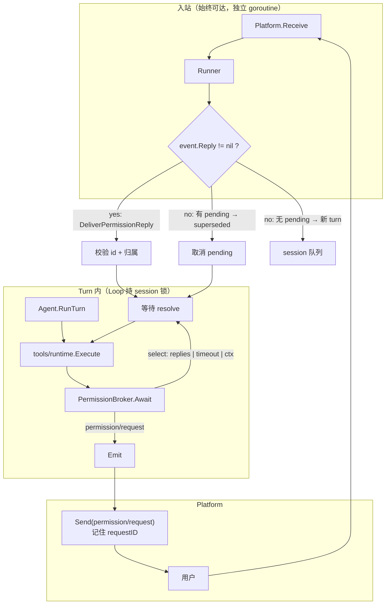
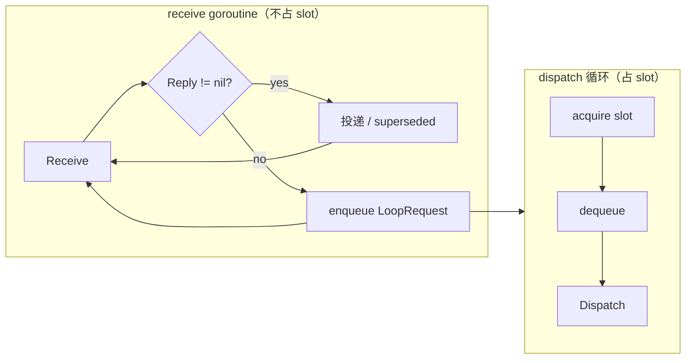

# Platform Human-in-the-loop（Permission 协议）

本文描述 **当前架构**：人机交互（`ask_user`、工具审批、表单/多选）统一走 **Permission 协议**，对齐 [cc-connect](https://github.com/lengzhao/cc-connect) 的 `pendingPermission` + 入站分流模型，不再在 tool 调用栈里分叉 sync/async platform。

> **命名**：这里的 *Permission* 指「**一次需要人类输入才能继续的裁决**」，不限于权限检查——`ask_user` 的开放提问同样走这条通道。allow/deny 与 question 是同一协议的两个 `Kind`。

> **代码状态（2026-08-26）**：P1–P5 已落地。`MessageEvent.Reply` 为 `json.RawMessage`；类型与 Broker/Capability 均在 `cap/permission`；仅 `KeySessionControl` 承载 Broker；`KindQuestion` 一次一题。

## 1. 为什么要改（迁移前问题，已解决）

当前 HIL（`cap/interaction` + `Control.Run`，**已删除**）曾存在结构性问题：

| 问题 | 说明 |
|---|---|
| Runner 与 turn 占 slot 耦合 | `dispatch.go` 的 intake 先 `acquire` 再 `Receive`；默认 `maxConcurrentTurns=1` 时 turn 阻塞在 `waitAsyncInteraction`，Runner 无法再 `Receive` → 异步 IM 路径**确定性死锁** |
| sync / async 双路径 | `Handler` 优先于 `AsyncPlatform`；CLI 与 IM 两套机制，platform 需同时实现展示与读取。`multiplex` 恒满足 `Handler` → 异步分支不可达 |
| `KeySessionControl` 过载 | 同一 `Control` 兼 steer/follow-up 与 `interaction.Session`；`ask_user` 断言的接口与 key 文档类型不一致 |
| approval 与 ask 分裂 | `approval/cli.go` 自开 `bufio.NewReader(os.Stdin)`，与 `cli.Input` 的两个 reader 共三个 stdin 读者；`Approval.Ask` 与 `ask_user` 各走一路 |
| 入站误开新 turn | `TryDeliverInteraction` **失败**时用户回复被当成新 turn；新 turn 又阻塞在 session 锁上，而旧 turn 在等永不到来的回复 → **session 锁层死锁** |
| 等待无界 | `Approval.Ask` 在 tool timeout **之前**调用（`runtime/tools/runtime.go:179` vs `:203`），allow_deny 没有任何时间上界；等待期间整个 Dispatch 持 session 锁并占一个 slot |
| 无作答者归属 | pending 只按 SessionID 挂。`ScopeChannel` 下整群共用一个 SessionID，**群里任何人都能替别人批准工具执行** |
| `Result` 靠魔法值 | `Answered bool` + `Selected: -1`（12 处手写）区分不了 timeout / no_human / cancelled；`Multiple` 声明了但无人实现 |

cc-connect 的做法：**Agent/Runtime 发出 permission 请求 → Engine 渲染并挂 pending → 入站消息先匹配 pending（不占 session 锁）→ 写回 resolve**。AgentKit 是 in-process Agent，但 **入站与 turn 执行解耦** 的原则同样适用。

超时与持久化语义参考 [n8n Wait 节点](https://docs.n8n.io/integrations/builtin/core-nodes/n8n-nodes-base.wait)：*Limit Wait Time* 到点是**强制继续**而非报错；短等待留在内存、长等待才落库。

## 2. 设计目标

1. **一次 Await 一个待答问题**：pending 表按 `(rootSessionID, requestID)` 键；同一 session 并发挂第二个 pending 时**显式报错**，不静默覆盖（见 §5 不变量）。
2. **入站分流由 Platform 判定，Loop 只校验**：Platform 渲染时知道 requestID，回传时填 `MessageEvent.Reply`；Runner 见到 `Reply != nil` 直接投递，**不开新 turn**，也不需要猜。
3. **Receive 与 slot 解耦**：turn 等待用户回复时，Runner 仍能收 inbound（独立 receive goroutine）。
4. **Platform 只负责渲染与回传**：不再有 `Handler.ReadReply`；用户答案一律经 `Platform.Receive` → Runner → Loop。
5. **降级明确、等待有界**：无交互 platform 立即降级（不 emit、不挂 pending）；有交互时必须有超时上界，到点强制继续。
6. **与 Policy 平面分工清晰**：Policy 裁决 allow/deny/ask；Permission 平面只处理 **需要人输入** 的 ask 出口（含 `ask_user` 与 `DecisionAsk`）。
7. **作答者归属可约束**：pending 记 `AskedBy`；`answerScope=asker`（默认）时只接受发起者的作答。
8. **结果语义正交**：「等待怎么结束的」（`Outcome`）与「裁决内容」（`Allow` / `Answer`）分开表达，不用魔法值。

## 3. 架构



与 cc-connect 对照：

| cc-connect | AgentKit（当前） |
|---|---|
| `EventPermissionRequest` | 出站 `permission/request` |
| `interactiveState.pending` | `loop.Control.pending`（按 requestID 键） |
| `handlePendingPermission`（绕过 session 锁） | Runner 在 `Dispatch` 前投递，不占 slot |
| `RespondPermission`（独立方法，不走消息通道） | `MessageEvent.Reply`（类型化字段，与 `Message` 互斥） |
| `CardSender` / `InlineButtonSender` + `supportsCards(p)` | `permission.Capable`，按 `PlatformID` 解析 **leaf** 平台 |
| `processInteractiveEvents` ∥ `Send` | receive goroutine ∥ dispatch goroutine |

## 4. 核心类型（`cap/permission`，已落地）

```go
type Kind string

const (
    KindAllowDeny Kind = "allow_deny" // 工具是否允许执行
    KindQuestion  Kind = "question"   // 开放问题 / 单选 / 多选（ask_user）
)

type Option struct {
    Label       string `json:"label"`
    Description string `json:"description,omitempty"`
}

type Question struct {
    Prompt      string   `json:"prompt"`
    Header      string   `json:"header,omitempty"`
    Options     []Option `json:"options,omitempty"`
    Default     string   `json:"default,omitempty"`
    MultiSelect bool     `json:"multiSelect,omitempty"`
}

// Request 一次待人类裁决的请求。KindQuestion 只允许 **一题**（`Question` 字段）。
type Request struct {
    ID     string `json:"id"`
    Kind   Kind   `json:"kind"`
    Reason string `json:"reason,omitempty"`

    ToolCall *agentkit.ToolCall `json:"toolCall,omitempty"` // allow_deny 必填
    Question *Question          `json:"question,omitempty"` // question 必填，且仅一题

    // Timeout 是本次等待的上界；0 表示取 EffectiveTimeout（Capability.DefaultTimeout，交互平台兜底 10 分钟）。
    Timeout time.Duration `json:"timeout,omitempty"`
    AskedBy string             `json:"askedBy,omitempty"`
}

// Reply 是平台回传的一次作答。Loop 侧用 permission.DecodeReply 解析。
// KindAllowDeny：Decision（"allow"/"deny" 或 y/n/yes/no），Text 为 CLI 兜底；UpdatedInput 为人类改参；Cancelled 为显式放弃。
// KindQuestion：仅用 Text / Selected，不设 Decision。
type Reply struct {
    RequestID    string         `json:"requestId"`
    UserID       string         `json:"userId,omitempty"`
    Decision     string         `json:"decision,omitempty"` // 仅 KindAllowDeny
    Selected     []int          `json:"selected,omitempty"`
    Text         string         `json:"text,omitempty"`
    UpdatedInput map[string]any `json:"updatedInput,omitempty"`
    Cancelled    bool           `json:"cancelled,omitempty"`
}

// Outcome 说明等待是**怎么结束的**，与裁决内容正交。
type Outcome string

const (
    OutcomeResolved   Outcome = "resolved"   // 拿到人类作答
    OutcomeTimeout    Outcome = "timeout"    // 超过 Timeout
    OutcomeNoHuman    Outcome = "no_human"   // 平台不具备交互能力
    OutcomeCancelled  Outcome = "cancelled"  // 用户显式放弃，或 turn 被取消
    OutcomeSuperseded Outcome = "superseded" // 被同 session 的新输入取代
)

type QuestionResult struct {
    Text     string `json:"text,omitempty"`
    Selected []int  `json:"selected,omitempty"`
}

type Result struct {
    ID      string  `json:"id,omitempty"` // permission/resolved 事件携带 request ID
    Outcome Outcome `json:"outcome"`
    // Allow 仅 KindAllowDeny 有意义。Outcome != resolved 时它是**降级裁决**
    // （默认 deny），而 Outcome 保留了「为什么不是人答的」——审计需要这个区分。
    Allow bool `json:"allow,omitempty"`
    // Answer 仅 KindQuestion；一次一题。
    Answer       *QuestionResult `json:"answer,omitempty"`
    UpdatedInput map[string]any  `json:"updatedInput,omitempty"`

    Reason   string `json:"reason,omitempty"`
    Guidance string `json:"guidance,omitempty"` // 非 resolved 时给模型的继续指引
}

func (r Result) Resolved() bool { return r.Outcome == OutcomeResolved }

// 构造器取代手写魔法值：Deny/NoHuman/TimedOut/Cancelled/Superseded。
func NoHuman(req Request, reason string) Result
func TimedOut(req Request) Result
```

平台能力协商（对齐 cc-connect 的 `supportsCards(p)` 模式）：

```go
type AnswerScope string

const (
    ScopeAsker  AnswerScope = "asker"  // 只接受发起 turn 的用户作答（默认）
    ScopeAnyone AnswerScope = "anyone" // 会话内任何人都可作答
)

type Capability struct {
    Interactive    bool          // false → 立即降级，不 emit、不挂 pending
    MultiSelect    bool
    DefaultTimeout time.Duration // 未显式设置时默认 10 分钟；headless 等非交互平台为 0
    AnswerScope    AnswerScope
}

// Capable 由 **leaf** platform 实现。
type Capable interface {
    PermissionCapability() Capability
}

// CapabilityRouter 由 multiplex 等聚合 platform 实现，按 PlatformID 转发 leaf 能力。
type CapabilityRouter interface {
    PermissionCapabilityFor(platformID string) Capability
}

// Broker 由 Loop Control 经 KeySessionControl 注入；tools/runtime 与 ask_user 通过 permission.BrokerFrom(ctx) 获取。
type Broker interface {
    Await(context.Context, Request) (Result, error)
}
```

`agentkit` 包只保留 **`KeySessionControl`**（`*loop.Control`，同时实现 `permission.Broker`）。Runner 把 leaf platform 的 `Capability` 放进 `LoopRequest.Capability`，Loop 在 turn 开始时写入 `Control.setTurnCapability`。

**已删除**：`KeyPermissionBroker`、`KeyPermissionCapability`、`KeyInteractionHandler`、`KeyAsyncInteraction`；`cap/interaction` 主路径；`plugins/approval/cli`。

## 5. Loop：pending 表与 `Await`

`runtime/loop.Control` 增加专用 pending（与 steer/follow-up **字段分离**，仍可由同一 struct 实现 `Broker`）。pending 只表示 **一个待答问题**：

```go
type pendingPermission struct {
    requestID string
    askedBy   string
    scope     permission.AnswerScope
    replies   chan permission.Reply
    once      sync.Once
}
```

**不变量**：同一 root session 同时至多一个 pending；`KindQuestion` 每次 `Await` 只带 **一题**（`Question` 指针）。重入时 `Await` 返回 error，**不覆盖**现有 pending。

**subagent**：`runtime/subagent/inprocess.go` 置 `KeySessionControl=nil`（Broker 与 steer 一并禁用）。子 session 的 pending 永远等不到 IM 父 session 的回复。

```go
func (c *Control) Await(ctx context.Context, req permission.Request) (permission.Result, error) {
    capab := permission.CapabilityFrom(ctx)
    if !capab.Interactive {
        // 不 emit、不挂 pending，直接降级。
        return permission.NoHuman(req, "platform has no interactive user"), nil
    }
    if req.Timeout == 0 {
        req.Timeout = permission.EffectiveTimeout(req, capab)
    }
    if req.Timeout > 0 {
        var cancel context.CancelFunc
        ctx, cancel = context.WithTimeout(ctx, req.Timeout)
        defer cancel()
    }

    switch req.Kind {
    case permission.KindAllowDeny, permission.KindQuestion:
        return c.awaitOne(ctx, req, capab)
    }
}
```

`awaitOne` 的职责，顺序固定：

1. 注册 pending（重入 → error）；
2. emit `permission/request`；
3. `select { <-ctx.Done() → timeout/cancelled; reply := <-pending.replies → 解析 }`；
4. emit `permission/resolved`——**失败只记日志，绝不因此丢掉已拿到的答案**；
5. 清理 pending。

```go
func (c *Control) DeliverPermissionReply(root agentkit.SessionID, reply permission.Reply) bool
func (c *Control) SupersedePending(root agentkit.SessionID, reason string) bool
func (l *Default) TryDeliverPermission(event agentkit.MessageEvent) bool
```

**校验**（`DeliverPermissionReply` 内，全部不通过就返回 false，由调用方决定后续）：

- `reply.RequestID` 与 pending 匹配；
- `scope == ScopeAsker` 时 `reply.UserID == pending.askedBy`。

**选项匹配**：`permission.MatchReply(reply, question)` —— 仅用 `Selected` / `Text`（忽略 `Decision`）。数字下标匹配只在该题**有** Options 时启用，避免自由文本 `"2"` 被吞成第 2 项。allow/deny 解析用 `permission.MatchAllowDeny(reply)`。

## 6. 事件契约与入站分流

替换 `interaction/start` / `interaction/end`：

| Type | 含义 | Payload |
|---|---|---|
| `permission/request` | 开始一次人机等待 | `permission.RequestPayload`（嵌入 `Request`） |
| `permission/resolved` | 结束等待 | `permission.Result`（含 `id`） |

`events.go` 迁移期可同时发新旧事件（一版兼容），最终只保留 permission 事件。

Platform `Send` 职责：

- CLI：stderr 渲染 prompt / y/n（**不再** `Handler.ReadReply`），并**记住当前 requestID**；
- 飞书 / Telegram：卡片 / inline button，callback 里编码 requestID + questionIndex + optionIndex（编码格式是平台内部实现细节，不是协议的一部分）。

入站不再靠字符串前缀猜，`MessageEvent` 增加类型化字段：

```go
type MessageEvent struct {
    // ...
    // Reply 非空 JSON 时，是对 permission/request 的作答：Runner 直接 TryDeliverPermission，绝不开新 turn。
    Reply json.RawMessage `json:"reply,omitempty"` // permission.MarshalReply / DecodeReply
}
```

删除 `InteractionReplyTo`（不改名为 `PermissionReplyTo`——requestID 已经在 `Reply` 里）。

**判定责任在 Platform**：它 `Send` 时就知道自己渲染了哪个 requestID，回传时理应带上。
- CLI：`Send(permission/request)` 记下 id → `Receive` 读到的行包成 `Reply{RequestID: id, Text: line}` → `permission/resolved` 时清除。这也顺带回答了「CLI 怎么区分答案行和新 prompt 行」。
- IM：按钮 callback 自带 id；纯文本回复则看是否 reply 到那条卡片消息。

**`Reply` 为空但存在 pending**（用户改主意、插话）：`SupersedePending` → pending 以 `OutcomeSuperseded` 收尾，消息再按 steer / 新 turn 处理。

## 7. tools/runtime 与 `ask_user`

### 7.1 Policy `DecisionAsk`

```mermaid
sequenceDiagram
    participant TR as tools/runtime
    participant Broker as PermissionBroker
    participant Loop
    participant Platform

    TR->>TR: evaluatePolicies → ask
    TR->>TR: auto-allow / auto-deny 短路（不创建 pending）
    TR->>Broker: Await(KindAllowDeny, ToolCall)
    Broker->>Loop: emit permission/request
    Loop->>Platform: Send
    Note over Platform: 用户 y/n 或按钮
    Platform->>Loop: MessageEvent.Reply
    Loop->>Broker: resolve → Outcome + Allow
    Broker->>TR: Result
    TR->>TR: Allow 则继续 Execute（可用 UpdatedInput 覆盖入参）
```

`agentkit.Approval` 的定位收窄为 **policy 平面的自动应答器**：只有 `auto-allow` / `auto-deny` / 规则型实现，**不做任何 UI 或 IO**，在 `Broker.Await` 之前短路。渲染全部归 Platform `Send`。

因此 `plugins/approval/cli.go` **删除**，不保留成「文案 helper」——它是当前第三个抢 stdin 的读者，留着就还得维护那套竞态。

`Await` 必须在 tool timeout 之外单独有界：`Approval.Ask` 今天在 `context.WithTimeout(tool)` **之前**调用，靠 tool 超时兜不住。

### 7.2 `tool/ask_user`

```go
broker, ok := permission.BrokerFrom(ctx)
if !ok {
    return unanswered("no permission broker on this session"), nil // 子 agent
}
result, err := broker.Await(ctx, permission.Request{
    Kind: permission.KindQuestion,
    Question: &permission.Question{Prompt: question, Options: opts, Default: def},
})
```

输出映射保持 today `AskUserOutput` 形状（`answered` / `answer` / `selected` / `guidance`），由 `Result.Outcome` 推导 `answered`；`reason` 带上 outcome 便于模型区分「没人在」和「超时了」。

## 8. Runner 改造

**核心**：receive 路径不依赖 turn 结束。



- receive goroutine：只负责 `Receive` + 投递作答 + 把 **新 turn** 请求投入 session 队列；
- dispatch：按 today scheduler 占 slot、保 session 顺序。

> **不要用「单循环 + acquire 仅在 submit 之前」的方案。** 它看起来是最小改动，实际有确定性死锁：`acquire` 阻塞时 receive 手上已握着一条新-turn 消息、无法继续 `Receive`；若此刻 pending 所需的作答正在传输队列里，两边永久互等。这与今天 `intake 先 acquire 再 Receive` 是同一个 bug，只是窗口更窄。**必须双 goroutine。**

read-ahead 由 session 队列容量界定，不再由 slot 界定。`LoopRequest` 删除 `InteractionHandler`、`AsyncInteraction`，新增 `Capability permission.Capability`（Runner 按 `event.PlatformID` 解析 leaf 平台后填入，Loop 注入 ctx）。

## 9. Platform 接入指南

| 平台 | Capability | 展示 | 回传 |
|---|---|---|---|
| `platform/cli` | `Interactive`, `DefaultTimeout=10m`, `ScopeAnyone` | `Send` → stderr | `Receive` 文本行 → 包成 `Reply` |
| `platform/feishu`（待建） | `Interactive`, `MultiSelect`, `DefaultTimeout≥10m`, `ScopeAsker` | 卡片 + inline button | 按钮 callback 或 reply-to 卡片 |
| `platform/headless` | `Interactive=false` | 无 | Broker 直接 `NoHuman` |
| `platform/multiplex` | **转发 leaf 的 Capability** | 按 `PlatformID` 路由子平台 `Send` | 子平台 `Receive` 原样上送 |

`multiplex` 必须按 `PlatformID` 转发 `PermissionCapability()`，不能自己实现——今天它恒满足 `interaction.Handler` 就是因为在 root 上做类型断言，导致异步子平台永远走不到。

**stdin 统一**：`cli.Input` 只保留 **一个** reader（`Receive`）。`ReadAnswer` / `waiting`/`armed`/`cond`/`discardStale` 整套随 `Handler` 一并删除——它们存在的唯一理由是「两个读者抢 stdin」，而目标态只有一个。

## 10. 无人值守与 Policy 分工

| 场景 | 行为 |
|---|---|
| `approval/auto-allow` | runtime 短路 allow，**不**创建 pending |
| `approval/auto-deny` | runtime 短路 deny，**不**创建 pending |
| `policy` deny | 不进入 Permission 平面 |
| headless / `Interactive=false` | `KindAllowDeny` → `NoHuman` + `Allow=false`；`KindQuestion` → `NoHuman` + guidance |
| 有交互但超时 | `Timeout` + `Allow=false`（allow_deny）/ guidance（question） |

`auto-allow` / `auto-deny` 只作用于 **allow_deny** 平面；它们不是 question 的降级手段——`KindQuestion` **始终**走 Broker，无人值守靠 `Interactive=false` 降级 + guidance 让模型自洽（与 [roadmap M1](roadmap.zh.md#m1--网络能力已落地) 结论一致）。

## 11. 超时、持久化与重启

**超时**：`Request.Timeout` → `Capability.DefaultTimeout` → 交互平台兜底 `permission.DefaultTimeout`（**10 分钟**）。到点按 §10 降级并**继续**，不报错。

**持久化分级**（借 n8n 的阈值思路，不借它的执行模型）：

| 等待时长 | 处理 |
|---|---|
| 短（< `persistAfter`，建议 60s） | 纯内存 pending，不写 session log，CLI 常态 |
| 长（≥ `persistAfter`） | `permission/request` 落入 session 事件流（模型不可见，仅审计与恢复） |

**明确不做 durable resume**：turn 是持有 LLM 上下文与工具状态的 goroutine，无法序列化挂起再水合。落盘的目的只是**重启后历史自洽**：

- `session/recovery` 把悬挂的 pending 收尾为 `OutcomeCancelled`；
- 给对应的悬空 `tool/call` 补一条 deny / unanswered 的 `tool/result`，避免会话里出现没有结果的工具调用；
- 重启后到达的迟到作答匹配不到 pending → 按普通新消息处理（不再静默吞掉）。

## 12. 与外部 Agent（Claude Code 等）对接

若未来接入子进程 Agent（cc-connect 形态）：

1. Agent adapter 将 `can_use_tool` / `AskUserQuestion` 译为出站 `permission/request`；
2. 作答经同一条 `MessageEvent.Reply` 路径到达 adapter，再写 `control_response`（`RespondPermission` 等价物）；
3. in-process `Broker` 与 adapter **共用** Loop pending 表与同一 requestID 空间，避免两套状态；
4. `UpdatedInput` 语义与 in-process 保持一致（人类改写后的工具入参）。

## 13. 迁移计划（已完成）

| 阶段 | 内容 | 验收 |
|---|---|---|
| **P0 文档** | 本文 + 更新 README / roadmap | ✅ |
| **P1 Runner** | receive goroutine 与 slot 解耦（双 goroutine） | ✅ 单测 `TestReceiveDeliversPermissionWhileTurnBlocked` |
| **P2 cap/permission + Broker** | `Control.Await` / pending 表；`Outcome`；超时；作答者归属；`superseded` | ✅ `permission_test.go` |
| **P3 runtime 接入** | `DecisionAsk` → Broker；`ask_user` → Broker；删除 `approval/cli`；subagent 置 `KeySessionControl=nil` | ✅ |
| **P4 Platform** | `MessageEvent.Reply` + `Capability`；CLI 去 `Handler`；multiplex 转发 capability | ✅ |
| **P5 清理** | 删 `cap/interaction` 主路径、`KeyInteractionHandler`、旧事件 | ✅ grep 无残留 |
| **后续** | session log 落盘与 recovery 收尾（§11 `permissionPersistAfterSeconds`） | 未做 |

P2 里超时与归属校验**不能后置**：前者是可用性底线（无界等待拖死进程），后者是授权正确性（群里代答）。

## 14. 已删除项（P5）

| 项 | 替代 |
|---|---|
| `cap/interaction.Session` | `permission.Broker` |
| `interaction.Handler` | Platform `PermissionCapability()` + `Receive` → `Reply` |
| `interaction.AsyncPlatform` | 无 async 特例；能力由 `Capability` 声明 |
| `EventInteractionStart` / `End` | `permission/request` / `resolved` |
| `MessageEvent.InteractionReplyTo` | `Reply json.RawMessage` + `permission.DecodeReply` |
| `plugins/approval/cli` | Platform 渲染 allow/deny；`Approval` 只留 `auto-allow` / `auto-deny` |
| `cli.Input.ReadAnswer` / `waiting` / `armed` | 单一 `ReadPrompt` reader |
| `Loop.TryDeliverInteraction` | `TryDeliverPermission` |
| `interaction.Result.Selected` / `Multiple` | `QuestionResult.Selected []int` |

## 15. 配置（当前）

```yaml
tool.ask-user.default:
  use: tool/ask-user

tools.default:
  use: tools/runtime
  deps:
    tools:
      - tool.ask-user.default
    # approval 只在需要自动裁决时才配；交互式审批不需要 approval 插件。
    # approval: approval.auto-deny

platform.default:
  use: platform/cli
  # 不再要求 interaction.Handler；能力由 PermissionCapability() 声明

loop.default:
  use: loop/default
  config:
    permissionPersistAfterSeconds: 60   # 超过则把 pending 落入 session log
```

## 16. 参考

- cc-connect：`core/engine.go` — `handlePendingPermission`、`processInteractiveEvents` 与 `Send` 并行、`sendAskQuestionPrompt`；capability 接口 `CardSender` / `InlineButtonSender` + `supportsCards(p)` 模式
- cc-connect：`agent/claudecode/session.go` — `handleControlRequest` / `RespondPermission`（作答不走消息通道，独立方法）
- [n8n Wait 节点](https://docs.n8n.io/integrations/builtin/core-nodes/n8n-nodes-base.wait) — *Limit Wait Time*（到点强制继续）、resume URL 的 per-execution 唯一性与 Webhook Suffix（一个执行里多个等待点必须各自可寻址）、65s 内存/落库阈值
- AgentKit 实现代码：`cap/permission/`、`runtime/loop/permission.go`、`runtime/runner/{runner,dispatch}.go`、`runtime/tools/runtime.go`、`runtime/platform/cli/permission.go`、`runtime/subagent/inprocess.go`
