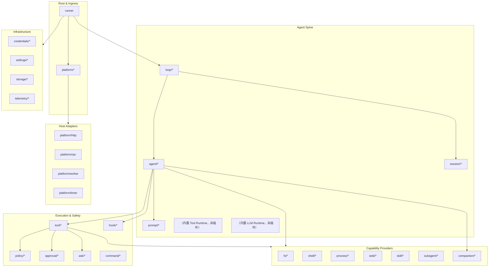
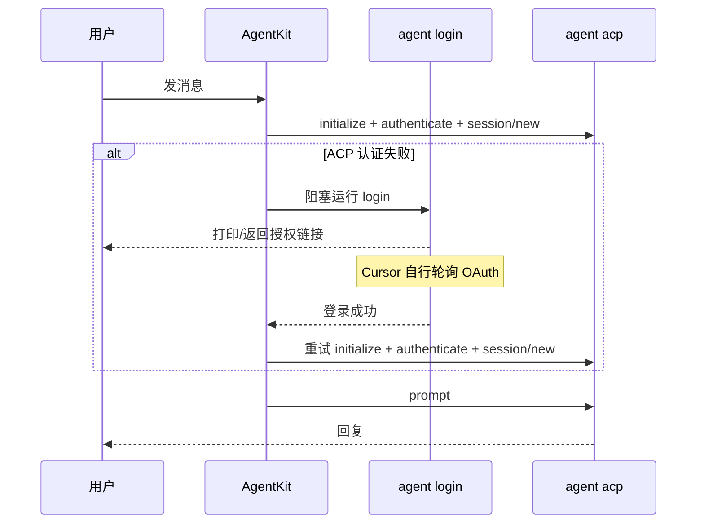

# AgentKit 插件目录

本文定义 AgentKit 的 **Plugin Kind** 命名规范、分类体系和分阶段落地范围。Kind 通过 `pluginkit.Register(kind, New)` 注册；配置中使用 `use: <kind>` 引用。

相关文档：[go-agent-harness-architecture.zh.md](go-agent-harness-architecture.zh.md)、[roadmap.zh.md](roadmap.zh.md)。

## 1. 命名规范

```
<role>/<name>[/<variant>]
```

| 规则 | 示例 | 说明 |
|---|---|---|
| 小写 + 连字符 | `tool/read-file` | 不用 camelCase |
| role 表示运行时角色 | `llm/openai` | 不是包路径 |
| variant 表示实现 | `workspace/tenant` | 可选 |
| 同一 kind 进程内唯一 | — | 重复 Register panic |

**返回值类型决定运行时角色和挂载槽位**。例如单工具插件返回 `agentkit.Tool`，`tool/fs-workspace` 返回 `agentkit.ToolPack`，`tool/mcp` 返回 `agentkit.ToolProvider`，`tools/runtime` 与 `tools/deferred` 返回 `agentkit.ToolRuntime`（后者包装内层 catalog，渐进披露 MCP/OpenAPI，见 [deferred-tools.zh.md](guides/deferred-tools.zh.md)）。

## 2. 插件分类总览



## 3. 插件 Kind 目录

### 3.1 Root & Platform

| Kind | 返回类型 | 职责 | 参考 |
|---|---|---|---|
| `runner` | `agentkit.Runner` | 进程 root，启动 Platform + Loop + `schedule.Runtime`，管理 StartStop；`sessionScope` 折叠 delivery SessionID（默认 channel）；`maxConcurrentTurns` 控制跨 session 并发（默认 64，同 session 内始终保序）；`config.inject` 在 dispatch 前 prepend `[meta ...]`（sender_id / timestamp / task_id 等，对齐 cc-connect）；per-turn panic 隔离，关停等待 in-flight turn | DSH Loader root / Pi AgentSession 外层 |
| `platform/cli` | `agentkit.Platform` + `permission.Capable` | 终端 stdin/stdout；稳定 delivery `cli:default`，经 `session/store` active-session 映射恢复 conversation；slash 走 `common.ProcessSlash`（含 `/new`、`/help`）；allow/deny 与 ask 经 Permission 协议读 stdin | Pi TUI / DSH headless |
| `platform/slack` | `agentkit.Platform` + `chathistory.Provider` | Slack Socket Mode；生成 cc-connect 风格 SessionID；供 `tool/chat-history` 读取频道/线程历史 | cc-connect `platform/slack` |
| `platform/feishu` | `agentkit.Platform` + `chathistory.Provider` | 飞书 WebSocket；生成 cc-connect 风格 SessionID；`progressStyle: card` 时 thinking / tool / 正文同卡刷新，`legacy` 仅流式正文；`showThinking` / `showToolProgress` 控制过程卡展示；供 `tool/chat-history` 读取 IM 群/话题历史 | cc-connect `platform/feishu` |
| `platform/lark` | `agentkit.Platform` + `chathistory.Provider` | 国际版 Lark（`platform/feishu` 的 domain 预设）；流式卡片配置同 feishu | cc-connect `platform/feishu` |
| `platform/chat-api` | `agentkit.Platform` | HTTP + SSE 调试台；会话/消息 API（可选 `deps.sessionIndex` 与 `session-query` 共用 SQLite 索引列会话）；SSE 断线重连（`POST /chat-messages` + `run_id`）；`POST /runs/{id}/cancel`；文件上传下载；`registerOnly` 时只挂载 `http.DefaultServeMux`，由 `platform/http` 等插件监听 | `sessionIndex` |
| `platform/multiplex` | `agentkit.Platform` | 聚合多个 Platform（CLI + IM 等共存） | 多入口 fan-in / 按 PlatformID 精确回写（`PlatformID` 为空则拒绝，不广播） |
| `platform/http` | `agentkit.Platform` | 监听并服务 `http.DefaultServeMux`；与 `chat-api.registerOnly` 或其它 `http.Handle` 扩展组合 | DSH Web Host |
| `platform/acp` | `agentkit.Platform` + `permission.Capable` | stdio ACP Agent；供 Zed 等 ACP 客户端子进程接入；权限经 ACP `request_permission` 回传客户端 | — |
| `platform/rpc` | `agentkit.Platform` | JSON-RPC / JSONL stdio（roadmap） | Pi RPC 模式 |
| `platform/worker` | `agentkit.Platform` | headless 一次性任务 runner（从不读 stdin，`output` 支持 text / json）。task 为 `prompt`（agent turn）或 `script`（bash 脚本，需 `deps.workspace` + `deps.shell`）；日历 cron 用 `schedule/cron` | DSH headless |
| `platform/timer` | `agentkit.Platform` | 进程内定时器：按固定间隔自己发起 turn，tick 锚定启动时间、跳过错过的 boundary | — |

**IM 附件**：`platform/slack`、`platform/feishu`、`platform/lark`、`platform/chat-api` 的 `deps.workspace` 为必填。入站图片会先落到租户 `work/upload/`，session 存 `attachment_ref`（路径相对租户根，如 `work/upload/foo.png`），Agent 调用 LLM 前再从 workspace hydrate 为 vision；未挂 workspace 时图片会在落盘时被丢弃。

**HTTP 组合**：`chat-api` 默认自建监听（`listenAddr`，默认 `:8030`）。需要与其它 HTTP 路由共用同一端口时，设 `registerOnly: true`（或 `listenAddr: "-"`），由 `platform/http` 监听 `http.DefaultServeMux`；其它插件可在构建阶段 `http.Handle` 挂载自定义路由。

```yaml
platform.default:
  use: platform/multiplex
  deps:
    platforms: [platform.chat-api, platform.http]

platform.chat-api:
  use: platform/chat-api
  config:
    registerOnly: true
    path: /v1/

platform.http:
  use: platform/http
  config:
    listenAddr: ":8080"
```

### 3.2 Agent Spine

| Kind | 返回类型 | 职责 | 参考 |
|---|---|---|---|
| `loop/default` | `agentkit.Loop` | Turn/Step 调度、按 `TurnEnvelope.Conversation` 串行，并向 ctx 写入 `KeyTurnEnvelope` 等 context key | DSH `agent-loop` / Pi `agentLoop` |
| `loop/harness` | `agentkit.Loop` | 多 Lane + 操作化 run/compaction/navigation（roadmap） | Pi AgentHarness |
| `agent/coding` | `agentkit.Agent` | Coding Agent；`config`：`id` / `model` / `retry` / `maxSteps`（默认 200，`0`=不限）/ `maxPromptTokens`（发送前兜底，`0`=关闭）；自主续跑靠 `deps.hooks`（如 `hook/turn-continue`） | 两者默认 Agent |
| `agent/acp-remote` | `agentkit.Agent` | 通过 ACP 调用外部 Agent（Claude Code、Cursor CLI 等） | DSH `dsh-acp` |
| `agent/catalog-commands` | `agentkit.CommandProvider` | `/agent`、`/model`、`/acp` slash；deps 注入 `loop`、`sessionStore`、`workspace` | — |
| `agent/readonly` | `agentkit.Agent` | 只读审查 Agent（roadmap） | DSH permission preset |
| `session/memory` | `agentkit.Session` | 内存 Session（测试用） | — |
| `session/jsonl` | `agentkit.Session` | 单文件 JSONL 追加日志 | Pi JSONL v3 |
| `session/store` | `agentkit.SessionStore` | 按不透明 SessionID 懒加载 `{safe_id}.jsonl`；LRU 热缓存 + 内存 tail 窗口（`maxLoadedEvents`）；压缩后裁剪内存；完整历史 `Read(0)` 读盘 | cc-connect SessionKey |
| `session/events` | `cap/session.Events`（组合 `Transcript` / `Lifecycle` / `RunLog` / `Compaction` / `Skills`，另含恢复标记方法） | 会话事件追加/索引契约的标准实现（无状态）；插件经 `sessionEvents` 注入同一实例，deps 类型取最小面（todo/finish→`RunLog`，skill→`Skills`，compaction/summary→`Compaction`，acp-remote→`Conversation`）；runtime 经 `sessevents.Default` 单例追加契约事件 | — |
| `session/commands` | `agentkit.CommandProvider` | `/new`、`/session` 会话生命周期 slash；deps 注入 `sessionStore` | — |
| `session/sqlite-index` | `cap/sessionindex.Service` | 租户内 session JSONL 的 SQLite FTS5 索引（`sessions/.index.sqlite`）；`Sync(ctx)` 自行按 `sessionsRel`（默认 `sessions`）解析会话目录 | DSH session-query-sqlite |
| `hook/session-index` | `agentkit.HookProvider` | 每轮成功后异步刷新 session FTS | — |
| `tool/session-query` | `agentkit.Tool` | `session_search`：`mode=search`（FTS）、`list`、`scroll`（同租户） | DSH session-query |
| `tool/memory` | `agentkit.Tool` | 主 agent `memory`：`add` / `replace` / `remove`（`memory.md`）；Hermes 式 WHEN/HOW/SKIP 说明（`MemoryToolDescription`） | memory.default |
| `prompt/assembler/default` | `agentkit.PromptAssembler` | Section 排序与组装 | DSH `system-prompt` |
| `prompt/section/agents-md` | `agentkit.SectionProvider` | AGENTS.md 层级加载（deps `fs` 接 unrestricted 实例；向上遍历传宿主机绝对路径，非本地后端静默 miss） | DSH `agent-instructions` / Pi AGENTS.md |
| `prompt/section/static` | `agentkit.SectionProvider` | 配置内联自定义 system prompt 文本 | — |
| `prompt/section/skills` | `agentkit.SectionProvider` | Skill catalog 注入 | DSH/Pi Skills |
| `prompt/section/memory` | `agentkit.SectionProvider` | `global:memory.md` + 租户 local `memory.md`（无目录递归）；同 turn 冻结快照 | — |
| `prompt/section/subagents` | `agentkit.SectionProvider` | 可委派子 Agent 名单注入；定义在磁盘上会变，所以走每轮重建的 section 而不是 `delegate` 的静态 description。可选 `deps.llm`：主模型为 text-only 且存在**显式**声明 `modalities` 含 image 的子 Agent 时，追加委派看图提示 | — |
| `prompt/section/time` | `agentkit.SectionProvider` | 当前时间上下文（roadmap） | DSH `time-context` |
| `llm/openai-compatible` | `agentkit.LLMProvider` | OpenAI 兼容 API；`api: responses` 时可配 `hostedTools`（如 `web_search`，服务端执行） | Pi openai-responses |
| `llm/fallback` | `agentkit.LLMProvider` | 主模型/主 provider 失败时按序切换备用 model 或 provider；同 endpoint 只需一份底层 provider | — |
| `llm/anthropic` | `agentkit.LLMProvider` | Anthropic Messages API（roadmap） | Pi anthropic-messages |
| `llm/deepseek` | `agentkit.LLMProvider` | DeepSeek API（roadmap） | DSH llm-deepseek |
| `llm/replay` | `agentkit.LLMProvider` | 录制回放（测试，roadmap） | DSH llm-replay |

**`llm/openai-compatible`**：`config.modalities` 声明输入能力（`text` / `image` / `audio`，默认可看图）；纯文本模型设 `[text]`，运行时会把附件降为 `[attachment: …]` 文本。`api` 为 `responses`（L0 默认）或 `chat`；`hostedTools` 仅在 `responses` 下生效，用于 OpenAI 内置工具（如 `web_search`），由 provider 服务端执行，不走 agentkit 工具循环。L0 已默认启用 `hostedTools.web_search`，`tools.default` 不再挂 `tool/web-search-*`。若改回 Tavily/DuckDuckGo 等本地搜索插件，需同时设 `api: chat` 并自行把 `tool/web-search-*` 加回 `tools`。超时分两档：`responseHeaderTimeoutSeconds` 限制 **连接 + TLS + HTTP 响应头**（默认 60，对应 `net/http` `ResponseHeaderTimeout`）；`timeoutSeconds` 限制 **首 token / TTFB**（默认 180，应用层 `streamWithRequestTimeout`，流式常先返回 200 再等模型）。后续流式 token 不受 `timeoutSeconds` 限制。与 agent turn 步数、工具 `timeoutSeconds` 独立（agent runtime 默认不限步）。示例：

```yaml
llm.default:
  config:
    api: responses
    hostedTools:
      - type: web_search
        parameters:
          search_context_size: medium
```


**`llm/fallback`**：装饰器插件，包装一个或多个底层 `LLMProvider`。同 provider 换 model 时只配一份 `llm/openai-compatible`，在 fallback 里列 `fallbackModels`；主 model 来自 agent 的 `config.model`。跨 provider 时在 `deps.fallbacks` 列出多个实例并配 `config.models`。`fallbackOn` 默认 `retryable`（复用 `llm.IsRetryableError`；**首 token 超时** `context.DeadlineExceeded` 在尚未输出任何内容时也会切下一候选）。`context.Canceled` 不触发 fallback。也可设 `quota` 或 `any`。实现 `ModalityAwareLLM` 时 **`Modalities()` 仅反映链上第一个 provider**（与 LLM 调用前 `PrepareMessagesForLLM` 的 hydrate/demote 一致）；若主候选 text-only、备用为多模态，不会为备用自动 hydrate 图片。

```yaml
llm.default:
  use: llm/openai-compatible
  config:
    baseUrl: https://api.openai.com/v1
    apiKeyRef: env:OPENAI_API_KEY

llm.fallback:
  use: llm/fallback
  config:
    fallbackModels:
      - gpt-4o
      - gpt-4o-mini
  deps:
    provider: llm.default
```

**`agent/acp-remote`**：通过 stdio ACP 调用外部 Agent 子进程（如 Cursor CLI `agent acp`）。`authMethod: cursor_login` 时，登录与 ACP 是两条独立链路：



要点：

- **工作目录**：`config.cwd`（未设则默认 `work/`，与 `tool/shell-bash` 一致）同时作为 ACP 子进程的 `cmd.Dir` 与 `session/new` 的 `Cwd`。代码仓库在 `work/agent-harness` 等子目录时设 `cwd: work/agent-harness`（或 `local:work/agent-harness`）。bind 文件会记录 cwd；变更 cwd 后会新建 ACP session 而非 resume 旧 cwd。
- **子进程清理**：L0 对 `agent.cursor` / `agent.claude` 启用 `releaseSubprocessAfterTurn: true`——每个 RunTurn 结束后按进程组 SIGTERM/SIGKILL 回收 `agent acp` 及其子进程（language server、worker-server 等），避免多次委派后内存上涨。Unix 上使用进程组；子进程异常退出时会取消进行中的 `Prompt`，让 async 委派尽快失败并触发 `subagent/end` + follow-up，而不是挂到 `timeoutSeconds`。
- **先连 ACP**：不调用 `agent status` 预检；直接启动 `agent acp`，认证失败再登录。
- **登录**：`agent login`（配置注入 `NO_OPEN_BROWSER=1`），由 Cursor CLI 阻塞等待浏览器授权；stdout/stderr 原样透传到对话。
- **不要混用**：`authenticate` 返回的链接与 `agent login` 的 challenge 不是同一次 OAuth；登录只走 `agent login`。
- **API Key 路径**（可选）：`agent -p` 用 `CURSOR_API_KEY`；ACP 用 `CURSOR_AUTH_TOKEN`（`--auth-token`），与 `cursor_login` 互斥。
- **会话续聊（Docker 重启）**：`NewSession` 成功后把 ACP `sessionId` 经 deps `fs` 写入 `acp/<session>/acp-session.<agentId>.json`（插件自有目录，与 session 存储后端无关；多个 `acp-remote` 按 agent id 分文件）。进程重启后优先 `session/resume`；失败则 `NewSession` 并从 `sessionStore` 重放 harness 历史。Claude 侧 transcript 在 `~/.claude/projects/`，容器内需挂载该目录与 `sessions/` 工作区。
- **Harness MCP（可选）**：不把 `mcp.json` 再传给远端（Claude/Cursor 自行加载项目 MCP）。若需按当前 turn 的会话上下文向远端注入额外 MCP，在 deps 注入 `cap/acp.SessionMCPProvider`（配置键 `sessionMcp`）。`session/new` 与 `session/resume` 均携带当时解析出的最新 `mcpServers`。后续可用此扩展把 Loop 内 tools 虚拟成 MCP（如 ACP transport）。
- **出站工具结果**：ACP `ToolCallUpdate` 在 `completed` / `failed` 时除 `toolcall_end` 外还会发 harness `tool/result`（输出取自 `rawOutput` / `content`），供飞书过程卡与 `forwardParentEmit` 转发的 async 子 Agent 进度展示；不写入 harness session 事件流（与 Loop 内 `tool.Execute` 路径不同）。
- **Langfuse**：每个 ACP `Prompt` 对应一条 `acp.generation` observation（input 为本 turn 用户消息；output 含 `AgentThoughtChunk` 与最终回复）；ACP 上报的 `ToolCall` 导出为嵌套 span。Cursor 在进程内执行且未通过 ACP 推送的工具调用不会出现在 Langfuse；token/model 以远端 Agent 为准，harness 不补全。

```yaml
agent.cursor.default:
  use: agent/acp-remote
  config:
    id: cursor
    command: [agent, --trust, acp]
    cwd: work
    releaseSubprocessAfterTurn: true
    authMethod: cursor_login
    env:
      NO_OPEN_BROWSER: "1"
    autoApprove: false
  deps:
    workspace: workspace.default
    sessionStore: sessionStore.default
```

通过 `/agent use cursor` 或 chat-api `agent_id=cursor` 切换到此 Agent。

**Claude Agent SDK（`claude-agent-acp`）**：通过 `npx @agentclientprotocol/claude-agent-acp` 启动 ACP 子进程；不设 `authMethod`，凭证由 env 注入子进程（需 Node.js ≥ 22）：

```yaml
agent.claude.default:
  use: agent/acp-remote
  config:
    id: claude
    command: [npx, -y, "@agentclientprotocol/claude-agent-acp"]
    env:
      ANTHROPIC_API_KEY: ${var:ANTHROPIC_API_KEY}
      ANTHROPIC_BASE_URL: ${var:ANTHROPIC_BASE_URL:-https://api.anthropic.com}
    autoApprove: false
  deps:
    workspace: workspace.default
    sessionStore: sessionStore.default
```

- **API Key**：`OPENAI_API_KEY` 等（`/env add` 写入 `global:secrets.enc.json`，或 export；需 L1 配置 `AGENTKIT_SECRETS_KEY`）
- **自定义网关 / 代理**：`ANTHROPIC_BASE_URL` 指向兼容 Anthropic Messages API 的 base URL
- 通过 `/agent use claude` 或 chat-api `agent_id=claude` 切换；主 agent 也可 `delegate` 到 `claude`

**ACP 会话配置（`/acp`）**：AgentKit slash 与 ACP 子进程原生命令是两套东西。`/model` 等原生命令在 ACP 规范里只能通过 `session/prompt` 发送，与直接对话等价；**真正独立的控制面**是 `session/set_config_option`（model / mode / boolean 等）。`/acp` 只走后者：

```text
/acp                              # 列出 acp-remote agent
/acp claude                       # 查看 config options 与原生命令目录
/acp claude config                # 列出可改的 config 及可选值
/acp claude config model claude-sonnet-5   # session/set_config_option
```

原生命令（如 `/fast`）在与该 agent 对话时直接输入即可；目录由 ACP `available_commands_update` 缓存展示，不经过 `/acp` 执行。

### 3.3 Tool 插件（模型可见工具）

Tool 插件按工具来源返回不同类型：单工具插件返回 `agentkit.Tool`，多工具插件返回 `agentkit.ToolPack`，动态工具插件返回 `agentkit.ToolProvider`。它们经 `tools/runtime` 或 `tools/deferred`（deps 槽位相同）的 `deps.tools`、`deps.toolPacks`、`deps.dynamicTools` 聚合后暴露给模型。

| Kind | 依赖 | 职责 |
|---|---|---|
| `tools/deferred` | 与 `tools/runtime` 相同（`hooks`、`tools`、`toolPacks`、`dynamicTools`、`policies`、`approval`） | 内部构造 runtime；`enabled: true` 时将动态工具换为 `tool_search` / `tool_describe` / `tool_call`，unwrap 后走同一执行平面 |

| Kind | 依赖 | 模型工具名 | 职责 |
|---|---|---|---|
| `tool/fs-workspace` | `fs`（`filesystem.Service`）、`workspace?` | `read` / `write` / `edit` / `grep` / `find` / `ls` | 工作区文件工具组；`config.readOnly` / `config.tools` 可限制能力。路径根与 gitignore 在 `deps.fs`（默认 `filesystem/local`） |
| `tool/fs-memory` | — | 同上 | 内存 `filesystem.Service`，测试与冒烟 |
| `tool/shell-bash` | `workspace`, `credentials`（L0 默认 `integrations`） | `bash` | Shell；L1 `scopedEnv` 或 `/env add` 注入 gh/npm 等 token，见 [guides/credentials.zh.md](guides/credentials.zh.md) |
| `tool/web-search-auto` | `credentials?` | `web_search` | 可选：Tavily 优先，缺 key/失败时 fallback DuckDuckGo |
| `tool/web-search-tavily` | `credentials?` | `web_search` | Tavily 搜索 |
| `tool/web-search-duckduckgo` | — | `web_search` | DuckDuckGo HTML 抓取，无需 key |
| `tool/web-search-exa` | `credentials?` | `web_search` | Exa 搜索（可选替代） |
| `tool/web-fetch-http` | — | `web_fetch` | HTTP 抓取；私网地址在 dial 时拦截 |
| `tool/web-search-scripted` | — | `web_search` | 预置命中，测试与冒烟 |
| `tool/web-fetch-scripted` | — | `web_fetch` | 预置页面，测试与冒烟 |
| `tool/skill` | `skills`, `sessionStore` | `skill` | 按名加载 `SKILL.md` 并注入会话；附属文件用 `read`，脚本用 `bash` |
| `tool/subagent` | `subagent` | `delegate` | 子 Agent 委派 |
| `tool/ask-user` | — | `ask_user` | 向用户提问（HIL） |
| `tool/todo` | `sessionStore` | `todo` | durable 任务清单 |
| `tool/finish` | `sessionStore` | `finish` | 显式收尾 |
| `tool/schedule` | `schedule` | `schedule` | agent 自主排期 |
| `tool/send` | `sender`, `workspace?`, `fs?` | `send` | 经 delivery.Sender 主动发送文本或工作区文件；`/send [-r\|--raw] <chatId> <message>` 管理面投递（同平台裸 chat/channel id，消息可多行；`-r` 跳过平台 Markdown 转换）；L0 `tools.default` 已启用 |
| `tool/chat-history` | `history`（`agentkit.Platform`，运行时适配为 `chathistory.Router`） | `chat_history` | 读取 IM 传输层群/会话历史；平台未实现 Provider 时返回空；`thread` 默认 true；L0 `tools.default` 已启用 |
| `tool/recognize` | `llm`, `workspace` | `recognize_image` | 对 `work/` 下图片做视觉理解并返回文本；`config.model` 指定视觉模型（可与主 Agent 模型不同）。L0 `tools.default` 已启用 |
| `tool/mcp` | `fs`, `credentials?`, `configfile?` | *(动态)* | 读取 `mcpServers` JSON 并暴露 MCP 工具；维护指南见 Skill `mcp-manager`（`skills/mcp-manager/SKILL.md`）。详见 [guides/tools.zh.md](guides/tools.zh.md)。 |
| `tool/openapi` | `fs`, `credentials?`, `configfile?` | *(动态)* | 读取 `api.json` 索引并暴露 HTTP 工具；维护指南见 Skill `openapi-manager`；`/openapi -u` 重载。详见 [guides/tools.zh.md](guides/tools.zh.md)。 |

**`filesystem/local` 插件 config**（kind 在 `runtime/filesystem`）：

| 字段 | 默认 | 说明 |
|---|---|---|
| `root` | `.` | 相对 workspace 根的读写根 |
| `unrestricted` | `false` | 为 `true` 时关闭路径权限控制，不将路径限制在 `root` 内（含 `../`、绝对路径等） |

L0 `config.base.yaml` 有两个实例：`filesystem.local.default`（`root: work`、`unrestricted: true`，fs 工具与 agents-md/send 的绝对路径读取）与 `filesystem.local.state`（`root: "."`，memory/learning/skills/schedule/credentials/mcp/openapi/acp-remote 的状态与配置文件）。`global:`/`local:` 前缀一律委托 workspace 双根路由，不受 `root` 限制。

**`tool/fs-workspace` 插件 config**（另有 `maxBytes` / `maxMatches` / `maxResults` / `maxListEntries` 上限）：

| 字段 | 默认 | 说明 |
|---|---|---|
| `readOnly` | `false` | 拒绝 `write` / `edit` |
| `tools` | 全部 | 限制注册的模型工具子集 |

`root` / `unrestricted` 若仍写在 tool 上会被忽略，请配在 `filesystem/local`。换对象存储或远程盘：实现 `cap/filesystem.Service` 并注册 `filesystem/<name>`，将 `deps.fs` 指向该实例。

**`tool/fs-workspace` 模型参数**：

| 工具 | 关键参数 | 行为要点 |
|---|---|---|
| `read` | `path`, `offset`, `limit` | `path` 相对 fs `root` 或绝对路径（不解析 `local:`/`global:`）；返回带行号的纯文本；大文件截断并在末尾附续读 hint |
| `write` | `path`, `content` | 同 `read` 的 `path` 规则 |
| `edit` | `edits[]` | 每条 `oldText` 均对**原文**匹配后再一次性应用；返回 `Edited path` / `No changes applied` |
| `grep` | `pattern`, `path`, `limit`, `literal`, `context` | 返回 `path:line:` 纯文本；无匹配时 `No matches found` |
| `find` | `pattern`, `path`, `limit` | 返回路径列表纯文本；无结果时 `No files found` |
| `ls` | `path`, `limit` | 返回目录条目纯文本；目录以 `/` 结尾 |

### 3.4 Policy & Safety

| Kind | 返回类型 | 职责 | 参考 |
|---|---|---|---|
| `policy/deny-dangerous-shell` | `agentkit.Policy` | 拦截危险 shell 命令 | 两者常见 Extension |
| `policy/path-denylist` | `agentkit.Policy` | 路径黑名单（glob，默认拒 `.git/**`、`**/.env*`、`**/.ssh/**`、`**/*.pem`） | Pi path protection 示例 |
| `policy/shell-allowlist` | `agentkit.Policy` | shell 命令前缀白名单；`strict` 时白名单外一律 deny，链式命令每段都要命中 | — |
| `policy/network-deny` | `agentkit.Policy` | 禁止网络类工具（未做；`web/http-fetch` 自带的 scheme / host / 私网约束是它的雏形） | DSH sandbox policy |
| `policy/plan-mode` | `agentkit.Policy` | Plan 模式下限制写操作（roadmap） | DSH plan-mode |
| `approval/auto-deny` | `agentkit.Approval` | 自动拒绝 ask | 测试 / CI |
| `approval/auto-allow` | `agentkit.Approval` | 自动允许 ask（无人值守）；**不做任何过滤**，必须与 `policy/shell-allowlist` + `policy/path-denylist` 同时挂载 | 开发模式 |

> **说明**：交互式终端审批走 platform `permission.Capable`（见 [guides/platform-interaction.zh.md](guides/platform-interaction.zh.md)）。

### 3.5 Hooks（观察与改写，非裁决）

| Kind | 返回类型 | Hook 点 | 参考 |
|---|---|---|---|
| `hook/before-step` | `agentkit.HookProvider` | Turn 开始前注入/检查 | DSH `agent/pre-step` |
| `hook/turn-continue` | `agentkit.HookProvider` | Turn 末裁决续跑/收尾（`TurnStopping` seam）；`maxContinuations`（0=不续跑）、`stallLimit`、`requireFinish`、`requireTodosDone`、`continuePrompt`；贡献 `/status` | DSH `agent/turn-stopping` |
| `hook/session-index` | `agentkit.HookProvider` | 每轮成功后异步刷新 session FTS | — |
| `hook/background-review` | `agentkit.HookProvider` | Turn 成功后后台 LLM review（`TurnComplete`）；内建 `learn_capture`；deps `learning`（`ReviewHost` + `SkillProposer`）、`memory`（`Capture`）、`llm` | [guides/learning-dreaming.zh.md](guides/learning-dreaming.zh.md) §9 |

**已就绪的 hook 点接口**（`agentkit.HookRuntime` 支持，任何 `HookProvider` 插件均可贡献，尚无独立 kind）：

| Hook 点 | 接口 | 说明 |
|---|---|---|
| BeforeStep | `OnBeforeStep` | model step 前注入/检查；payload 带 `Step`/`Segment`（turn 内 0 起） |
| BeforeTool | `OnBeforeTool` | 工具 input 改写（policy allow 之后） |
| AfterTool | `OnAfterTool` | 工具 result 截断/改写 |
| TurnStopping | `OnTurnStopping` | Turn 末续跑/收尾裁决 |
| TurnComplete | `OnTurnComplete` | Turn 成功后后台任务（FTS 刷新、review fork 等）；payload 带 `Steps`/`Segments`/`TurnTokens` |

### 3.6 共享运行时插件

以下插件仍独立存在，供多个 tool / runtime 复用：

#### Skills & Subagent

| Kind | 返回类型 | 说明 |
|---|---|---|
| `skill/filesystem` | `skill.Registry` | 目录扫描 SKILL.md（deps `fs`，dirs 支持 `global:`/`local:` 前缀） |
| `skill/badge` | `skill.Registry` | Badge 元数据（roadmap） |
| `memory/default` | `CommandProvider` + `cap/memory.Service` | 租户 `memory.md`、ledger、staged、`/memory` 命令；`tool/memory` 与 prompt 注入；存储走 deps `fs` |
| `learning/default` | `CommandProvider` | Grounded Dreaming、Skill Workshop；`/learn` 巩固与技能（记忆见 `/memory`）；sidecar（dreaming state/diary/report、review nudge/quota、skills policy、workshop proposals）走 deps `fs` |
| `learning/dream-sweep` | `schedule.Runtime` | 后台三阶段 dreaming sweep（默认每天 03:00） |
| `subagent/inprocess` | `subagent.Spawner` | 进程内子 Agent：定义来自 `dirs` 下的 `agents/*.md`（frontmatter + 正文即 system prompt），串行 `Run` 一个子 agent 并只把结论带回；`deps.tools` 必须是**不含 `tool/subagent`** 的兄弟实例（既避开依赖环，也让"子 agent 不能再委派"成为结构性事实）。详见 [guides/subagent.zh.md](guides/subagent.zh.md) |
| `subagent/loop-agent` | `subagent.Spawner` + `subagent.SubmitBinder` | 委派到 Loop 里已注册的 agent（如 `agent/acp-remote` 的 `cursor`）。可委派名单来自实例 `config.agents`；支持 `async: true`：立即返回 `status=running`，完成后经 runner 向父 session 投递 follow-up turn。deps 可注入 `telemetry`（通常 `telemetry.default`），为每次子 agent 运行导出独立 Langfuse trace |
| `subagent/composite` | `subagent.Spawner` + `subagent.SubmitBinder` | 合并 `inprocess` 与 `loop-agent` 的可委派名单；L0 `subagent.default` 使用此 kind |
| `subagent/rpc` | `subagent.Spawner` | RPC 子 Agent（roadmap） |

#### Schedule

| Kind | 返回类型 | 说明 |
|---|---|---|
| `schedule/file` | `schedule.Registry` | JSON 文件持久化的 cron job 表（deps `fs`）；原子写由 `filesystem.Service.Write` 保证，无进程内互斥锁，并发靠读完整快照 + 原子写 |
| `schedule/cron` | `schedule.Runtime` | 常驻日历调度：轮询 registry、到期后 submit inbound turn；由 runner 启动，与 `tool/schedule` 共用 registry |

#### Compaction & Context

| Kind | 返回类型 | 说明 |
|---|---|---|
| `compaction/summary` | `compaction.Service` | LLM 摘要压缩；`config`：`keepRecentTokens` / `reserveTokens` / `maxInputTokens`（摘要输入上限，默认 400k）/ `summaryModel` / `retry` |
| `compaction/prune-tool-results` | `compaction.Service` | 无模型工具结果裁剪 |
| `compaction/token-limit` | `compaction.Service` | 按 token 阈值门控内层压缩链（deps.services）；阈值取 `maxTokens` 或 `contextWindow × triggerRatio` |
| `compaction/pipeline` | `compaction.Service` | 按序执行 deps.services 中的压缩链，供 agent / hook 单点引用 |

### 3.7 Infrastructure

| Kind | 返回类型 | 说明 |
|---|---|---|
| `workspace/default` | `workspace.Service` | 双根工作区：`global`（默认 `~/.agentkit`）+ `local`（默认 `.agentkit`）；`scope` 选默认根；路径可用 `global:rel` / `local:rel` 前缀 |
| `workspace/tenant` | `workspace.Service` | 多租户工作区：`global` 全租户共享，`local` 根按 `TurnEnvelope.Workspace`（默认 `localBase/<键>`，可用 `tenants` 钉到已有目录，`omitPlatformPrefix` 去掉目录名里的 platform 段）；`..` 一律不解析 |
| `filesystem/local` | `filesystem.Service` | 本地盘文件存储：`workspace.Resolve` + `.gitignore`；`root` / `unrestricted`；`global:`/`local:` 前缀委托 workspace 双根路由（不受 root 限制）；`Write` 原子（temp+rename，`WithPerm` 可指定 mode），`Append` 追加 |
| `bootstrap/shell` | `agentkit.AppInitializer` | 启动前在 workspace 目录按序执行 `bash -lc` 命令；挂到 `runner.deps.init` |
| `credentials/env` | `credentials.Store` | YAML 级 `env:` ref；dotenv / 加密 secrets / 进程 env（deps `fs`，`/env add` 写 0600）；`Resolve(ctx, GlobalScope, ref)`。详见 [guides/credentials.zh.md](guides/credentials.zh.md) |
| `credentials/integrations` | `Store` + `EnvPairResolver` | Scoped `Resolve`、`EnvPairs`（shell env）、manifest allowlist（经 deps `fs` 读 mcp.json/api.json）、`/env`；详见 [guides/credentials.zh.md](guides/credentials.zh.md) |
| `credentials/file` | `credentials.Store` | 文件存储（roadmap） |
| `settings/file` | `settings.Store` | YAML/JSON 设置（deps `fs`） |
| `storage/json` | `storage.Store` | 通用 KV 存储（roadmap） |
| `telemetry/langfuse` | `telemetry.Exporter` | Langfuse Go SDK（ingestion API）导出 |
| `telemetry/none` | `telemetry.Exporter` | 无遥测 |
| `telemetry/otel` | `telemetry.Exporter` | 通用 OpenTelemetry（未做） |

### 3.8 Commands（不经过模型）

Slash 命令由能力插件实现 `agentkit.CommandProvider` 贡献。`commands/registry` 汇总命令并支持 `allow` / `deny` 过滤（默认全部启用）；`runner` 在 `Run(ctx, buildResult)` 时通过 `build.WireContributions` 自动收集并调用 `CommandCollector.SetCommands`。Platform 通过 `deps.commands` 依赖 registry 实例。

| Kind | 返回类型 | 说明 |
|---|---|---|
| `commands/registry` | `agentkit.Commands` | 汇总 CommandProvider，支持 allow/deny 过滤；`config.admins` + `config.adminOnly` 限制仅管理员可执行的 slash（`ctx` 写入 `KeyIsAdmin`）；dispatch 日志 args 由各命令可选实现 `CommandLogSanitizer` 脱敏 |

| 贡献方 | 命令 |
|---|---|
| `commands/registry` | `/plugin` |
| `agent/catalog-commands` | `/agent`、`/acp` |
| `runner` | `/stop` |
| `subagent/inprocess` | `/subagent` |
| `session/commands` | `/new`、`/session` |
| `hook/before-step` | `/compact` |
| `hook/turn-continue` | `/status` |
| `credentials/integrations` | `/env` | scoped 密文；SCOPE 含 `mcp.*`、`openapi.*`、`shell-bash.*`，见 [guides/credentials.zh.md](guides/credentials.zh.md) |
| `tool/mcp` | `/mcp`（查看工具；`/mcp add <name> <json>` 写入 `mcp.json` 并探活校验；`/mcp -u` 重读配置） |
| `tool/openapi` | `/openapi`（查看工具；`/openapi add <name> <json>` 写入 `api.json` 并校验；`/openapi -u` 重读配置） |
| `tool/shell-bash` | `/shell`、`/sh`（本地执行 shell 命令，不经过模型） |
| `tool/send` | `/send`（向同平台 chat/channel id 主动发消息，正文可多行，不经过模型；`-r`/`--raw` 原样发送不做 Markdown 转换） |
| `memory/default` | `/memory`（show / add / pending / approve / policy；见 [guides/learning-dreaming.zh.md](guides/learning-dreaming.zh.md)） |
| `learning/default` | `/learn`（dreaming / skill workshop / session 信号） |

示例：

```yaml
platform:
  use: platform/cli
  deps:
    commands: commands

commands:
  use: commands/registry
  config:
    deny: [compact]
    admins: [U02ABC, U03DEF]
    adminOnly: [shell, sh, cron, env, mcp, openapi, send]
```

## 4. 能力包与工具结构

单个能力域推荐按以下结构组织（详见架构文档 [§7](go-agent-harness-architecture.zh.md#7-能力扩展模型)）：

```text
cap/<domain>/
  *.go               # 可替换能力接口与 DTO（workspace、compaction、permission…）
  doc.go             # 接口文档（可选）

runtime/<domain>/    # cap 对应实现（session、delivery、bind、chathistory、compaction、workspace、credentials、permission、skill、media、telemetry、schedule…）
cap/schedule/        # Registry/Runtime/Engine 契约；cron 求值实现见 runtime/schedule（schedule/engine）
runtime/schedule/    # ParseCron/NextFire、fire metadata；schedule/engine kind
cap/configfile/      # Writer 接口（/env add、/mcp add、/openapi add 的原子写与回滚）+ PeelGlobalFlag；实现见 runtime/configfile（configfile/writer kind，deps 注入）
cap/memory/          # Service、Tool、Capture、Reader（memory/default 实现）
cap/learning/        # SkillProposer、ReviewHost、DreamSweepScheduler（learning/default）；memory 见 cap/memory
runtime/memory/      # MemoryStore、ledger、staged、parse/render memory.md
runtime/learning/    # review 循环、ApplyCapture、nudge/quota/skills policy
runtime/session/sessstore/  # FTS SyncSessionIndex、SearchSyncedSessions
runtime/session/derive/    # FormatSessionRecall

cap/telemetry/       # Exporter 接口与 DTO；实现见 runtime/telemetry

cap/filesystem/      # Service + grep/find DTO；标准实现 filesystem/local 见 runtime/filesystem

plugins/
  tool/fs/           # tool/fs-workspace（注入 filesystem.Service）、tool/fs-memory（内存实现）
  tool/              # shell、web、skill、subagent…
  compaction/        # summary、prune-tool-results
  approval/          # cli、auto-deny、auto-allow
  web/               # http-fetch、exa-search…
  prompt/            # section/agents-md、section/static、section/skills
  skill/             # filesystem
  policy/            # deny-dangerous-shell
  hook/              # before-step
  credentials/       # env
  schedule/          # file、cron
  settings/          # file
  memory/            # memory/default、tool/memory
  learning/          # learning/default、learning/dream-sweep、hook/background-review
```

`workspace/default`、`workspace/tenant` 在 **`runtime/workspace`**；`filesystem/local` 在 **`runtime/filesystem`**，均不在 `plugins/`。

**规则**：

- **`cap/*` 只放接口与类型，函数实现放在 `runtime/*`**（如 `cap/delivery.Sender` + `runtime/delivery.ResolveRoute`）。唯一例外是与接口语义一体的纯函数（契约词汇），如 `workspace.ParseScoped` 之于 Scope 常量、`configfile.PeelGlobalFlag` 之于 /add 命令的 `-g` 约定；工作流/多步逻辑不下放 cap——单一消费者并入消费方包内，多消费者抽象成接口经 deps 注入（如 `configfile.Writer`、`schedule.Engine`、`filesystem.Service`）。
- 文件工具的模型面在 `tool/fs-workspace`；共享 deps 是 `filesystem.Service`（换本地盘 / S3 / 远程不换 tool kind）。
- 只有 workspace、filesystem、credentials、session、compaction 等跨插件能力保留 Provider + `cap/*` 接口。
- 换 filesystem Provider（如 `filesystem/local` → `filesystem/s3`）不换 tool kind：修改 `deps.fs` 即可。

## 5. 配置示例：Coding Agent 最小 Preset

```yaml
apiVersion: agentkit.dev/v1
kind: Preset
metadata:
  name: coding-minimal

graph:
  runner:
    use: runner
    deps:
      platform:
        use: platform/cli
      loop:
        use: loop/default
        deps:
          agents:
            - agent.coder

  agent.coder:
    use: agent/coding
    deps:
      session:
        use: session/jsonl
        config:
          path: .agent/sessions
      llm:
        use: llm/openai-compatible
        config:
          model: gpt-4o
          baseUrl: https://api.openai.com/v1
      tools:
        - use: tool/read-file
          deps:
            fs:
              use: fs/local
              config:
                root: .
        - use: tool/edit-file
          deps:
            fs:
              use: fs/local
              config:
                root: .
        - use: tool/write-file
          deps:
            fs:
              use: fs/local
              config:
                root: .
        - use: tool/shell
          deps:
            shell:
              use: shell/bash
              config:
                timeout: 60s
            approval:
              use: approval/auto-deny
      policies:
        - use: policy/deny-dangerous-shell
      prompts:
        - use: prompt/section/agents-md
```

## 6. 分阶段落地

**接下来做什么以 [roadmap.zh.md](roadmap.zh.md) 为准。** 本节 §3 的 Kind 目录是完整清单；roadmap 标注各能力的落地状态与优先级。

未做项速查：`session/sqlite`、`platform/rpc`、`telemetry/otel`、`policy/network-deny`、`policy/plan-mode`、`loop/harness`、`agent/readonly`、`llm/anthropic`、`llm/deepseek`、`llm/replay`、`subagent/rpc`、`skill/badge`、`prompt/section/time`、`credentials/file`、`storage/json`、OS 级沙箱。

## 7. 新增插件 Checklist

新增 Plugin Kind 时确认：

- [ ] `init()` 仅调用 `pluginkit.Register`，无 IO / goroutine
- [ ] 构造函数签名符合 `New` / `New(cfg)` / `New(cfg, deps)` 之一
- [ ] Config struct 字段有 `json` tag；未知字段 decode 失败
- [ ] Deps 字段类型为接口，非具体 Provider
- [ ] 需生命周期时实现 `agentkit.StartStop`
- [ ] 需启动前一次性准备时实现 `agentkit.AppInitializer`，并由 `runner.deps.init` 挂载
- [ ] 构造函数与 Config 字段写好 godoc（`// NewXxx registers <kind>:` + 字段注释）；CLI `/plugin <kind>` 通过 `go doc` 展示
- [ ] 工具/注入内容写入 Session，满足 Model-visible ⟺ Logged
- [ ] Policy 裁决走 `agentkit.Policy`；Hook 不充当 deny 通道
- [ ] 加入 import 生成器 manifest
- [ ] 补充 Preset 示例或 Feature 片段
- [ ] 更新本文档对应分类表
- [ ] **tool 插件**：主 agent 默认经 scaffold 黑名单排除测试/替身实现；子 agent 须加入 `DefaultSubagentToolWhitelist()` 才会进入子 agent 工具集（见 [guides/config-simplification.zh.md](guides/config-simplification.zh.md)）
