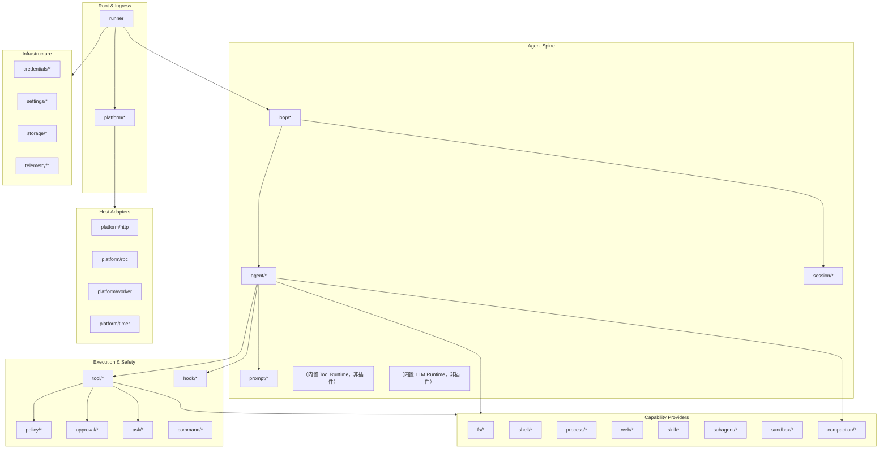

# AgentKit 插件目录

本文定义 AgentKit 的 **Plugin Kind** 命名规范、分类体系和分阶段落地范围。Kind 通过 `pluginkit.Register(kind, New)` 注册；配置中使用 `use: <kind>` 引用。

相关文档：[go-agent-harness-architecture.zh.md](go-agent-harness-architecture.zh.md)、[reference-analysis.zh.md](reference-analysis.zh.md)。

## 1. 命名规范

```
<role>/<name>[/<variant>]
```

| 规则 | 示例 | 说明 |
|---|---|---|
| 小写 + 连字符 | `tool/read-file` | 不用 camelCase |
| role 表示运行时角色 | `llm/openai` | 不是包路径 |
| variant 表示实现 | `fs/sandbox-landlock` | 可选 |
| 同一 kind 进程内唯一 | — | 重复 Register panic |

**返回值类型决定运行时角色**。例如 `tool/fs-workspace` 返回 `agentkit.ToolPack`，`tools/runtime` 返回 `agentkit.ToolRuntime`。

## 2. 插件分类总览



## 3. 插件 Kind 目录

### 3.1 Root & Platform

| Kind | 返回类型 | 职责 | 参考 |
|---|---|---|---|
| `runner` | `agentkit.Runner` | 进程 root，启动 Platform + Loop，管理 StartStop；`maxConcurrentTurns` 控制跨 session 并发（默认 1，同 session 内始终保序），per-turn panic 隔离，关停等待 in-flight turn | DSH Loader root / Pi AgentSession 外层 |
| `platform/cli` | `agentkit.Platform` + `permission.Capable` | 终端 stdin/stdout；启动时读 `sessions/cli_current.jsonl` 软链恢复上次会话，`/new` 会换新 id 并更新软链；allow/deny 与 ask 经 Permission 协议读 stdin | Pi TUI / DSH headless |
| `platform/slack` | `agentkit.Platform` | Slack Socket Mode；生成 cc-connect 风格 SessionID | cc-connect `platform/slack` |
| `platform/feishu` | `agentkit.Platform` | 飞书/Lark；生成 cc-connect 风格 SessionID | cc-connect `platform/feishu` |
| `platform/multiplex` | `agentkit.Platform` | 聚合多个 Platform（CLI + IM 等共存） | 多入口 fan-in / 按 PlatformID 回写 |
| `platform/http` | `agentkit.Platform` | HTTP/WebSocket API | DSH Web Host |
| `platform/rpc` | `agentkit.Platform` | JSON-RPC / JSONL stdio | Pi RPC 模式 |
| `platform/worker` | `agentkit.Platform` | headless 任务 runner（从不读 stdin，`output` 支持 text / json）。task 带 `cron` 时转为常驻定时模式，需 `deps.schedule`；task 为 `prompt`（agent turn）或 `script`（bash 脚本，需 `deps.workspace` + `deps.shell`） | DSH headless |
| `platform/timer` | `agentkit.Platform` | 进程内定时器：按固定间隔自己发起 turn，tick 锚定启动时间、跳过错过的 boundary | — |

### 3.2 Agent Spine

| Kind | 返回类型 | 职责 | 参考 |
|---|---|---|---|
| `loop/default` | `agentkit.Loop` | Turn/Step 调度、按 SessionID 串行，并向 ctx 写入 agentkit context key | DSH `agent-loop` / Pi `agentLoop` |
| `loop/harness` | `agentkit.Loop` | 多 Lane + 操作化 run/compaction/navigation | Pi AgentHarness |
| `agent/coding` | `agentkit.Agent` | Coding Agent；从 `ctx.Value(KeySessionID)` 取 ID 并通过 `deps.sessionStore` 加载 Session | 两者默认 Agent |
| `agent/readonly` | `agentkit.Agent` | 只读审查 Agent | DSH permission preset |
| `session/memory` | `agentkit.Session` | 内存 Session（测试用） | — |
| `session/jsonl` | `agentkit.Session` | 单文件 JSONL 追加日志 | Pi JSONL v3 |
| `session/store` | `agentkit.SessionStore` | 按不透明 SessionID 目录多文件；Agent 依赖，非 Loop | cc-connect SessionKey |
| `session/sqlite` | `agentkit.Session` | SQLite + 索引 | DSH session-query-sqlite |
| `prompt/assembler/default` | `agentkit.PromptAssembler` | Section 排序与组装 | DSH `system-prompt` |
| `prompt/section/agents-md` | `agentkit.SectionProvider` | AGENTS.md 层级加载 | DSH `agent-instructions` / Pi AGENTS.md |
| `prompt/section/static` | `agentkit.SectionProvider` | 配置内联自定义 system prompt 文本 | — |
| `prompt/section/skills` | `agentkit.SectionProvider` | Skill catalog 注入 | DSH/Pi Skills |
| `prompt/section/subagents` | `agentkit.SectionProvider` | 可委派子 Agent 名单注入；定义在磁盘上会变，所以走每轮重建的 section 而不是 `delegate` 的静态 description | — |
| `prompt/section/time` | `agentkit.SectionProvider` | 当前时间上下文 | DSH `time-context` |
| `llm/openai-compatible` | `agentkit.LLMProvider` | OpenAI 兼容 API | Pi openai-responses |
| `llm/anthropic` | `agentkit.LLMProvider` | Anthropic Messages API | Pi anthropic-messages |
| `llm/deepseek` | `agentkit.LLMProvider` | DeepSeek API | DSH llm-deepseek |
| `llm/replay` | `agentkit.LLMProvider` | 录制回放（测试） | DSH llm-replay |

### 3.3 Tool 插件（模型可见工具）

Tool 插件返回 `agentkit.ToolPack`（一个或多个 `agentkit.Tool`），通过 `tools/runtime` 聚合后暴露给模型。

| Kind | 依赖 | 模型工具名 | 职责 |
|---|---|---|---|
| `tool/fs-workspace` | `workspace` | `read` / `write` / `edit` / `grep` / `find` / `ls` | 工作区文件工具组；`config.readOnly` / `config.tools` 可限制能力 |
| `tool/fs-memory` | — | 同上 | 内存 FS，测试与冒烟 |
| `tool/shell-bash` | `workspace` | `bash` | Shell 命令执行 |
| `tool/web-search-exa` | `credentials?` | `web_search` | Exa 搜索；缺 key 不阻断构造 |
| `tool/web-fetch-http` | — | `web_fetch` | HTTP 抓取；私网地址在 dial 时拦截 |
| `tool/web-search-scripted` | — | `web_search` | 预置命中，测试与冒烟 |
| `tool/web-fetch-scripted` | — | `web_fetch` | 预置页面，测试与冒烟 |
| `tool/skill` | `skills`, `sessionStore` | `skill` | Skill 发现与加载 |
| `tool/subagent` | `subagent` | `delegate` | 子 Agent 委派 |
| `tool/ask-user` | — | `ask_user` | 向用户提问（HIL） |
| `tool/todo` | `sessionStore` | `todo` | durable 任务清单 |
| `tool/finish` | `sessionStore` | `finish` | 显式收尾 |
| `tool/schedule` | `schedule` | `schedule` | agent 自主排期 |
| `tool/mcp` | `workspace`, `credentials?` | *(动态)* | 读取 `mcpServers` JSON 并暴露 MCP 工具；经 `deps.dynamicTools` 挂载。详见 [mcp.zh.md](mcp.zh.md) |

### 3.4 Policy & Safety

| Kind | 返回类型 | 职责 | 参考 |
|---|---|---|---|
| `policy/deny-dangerous-shell` | `agentkit.Policy` | 拦截危险 shell 命令 | 两者常见 Extension |
| `policy/path-denylist` | `agentkit.Policy` | 路径黑名单（glob，默认拒 `.git/**`、`**/.env*`、`**/.ssh/**`、`**/*.pem`） | Pi path protection 示例 |
| `policy/shell-allowlist` | `agentkit.Policy` | shell 命令前缀白名单；`strict` 时白名单外一律 deny，链式命令每段都要命中 | — |
| `policy/network-deny` | `agentkit.Policy` | 禁止网络类工具（未做；`web/http-fetch` 自带的 scheme / host / 私网约束是它的雏形） | DSH sandbox policy |
| `policy/plan-mode` | `agentkit.Policy` | Plan 模式下限制写操作 | DSH plan-mode |
| `approval/auto-deny` | `approval.Service` | 自动拒绝 ask | 测试 / CI |
| `approval/auto-allow` | `approval.Service` | 自动允许 ask（无人值守）；**不做任何过滤**，必须与 `policy/shell-allowlist` + `policy/path-denylist` 同时挂载 | 开发模式 |

> **说明**：交互式终端审批不再使用 `approval/cli` 插件——policy `DecisionAsk` 在无 `approval` 插件时走 platform 可选能力 `permission.Capable` / `CapabilityRouter`（见 [platform-interaction.zh.md](platform-interaction.zh.md)）。

### 3.5 Hooks（观察与改写，非裁决）

| Kind | 返回类型 | Hook 点 | 参考 |
|---|---|---|---|
| `hook/before-step` | `agentkit.HookProvider` | Turn 开始前注入/检查 | DSH `agent/pre-step` |
| `hook/before-tool` | `agentkit.HookProvider` | 工具 input 改写 | DSH post-policy / Pi beforeToolCall |
| `hook/after-tool` | `agentkit.HookProvider` | 工具 result 截断/改写 | DSH `tools/post-execute` |
| `hook/llm-request` | `agentkit.HookProvider` | LLM 请求改写 | Pi `before_provider_request` |
| `hook/turn-continue` | `agentkit.HookProvider` | Turn 末裁决续跑/收尾（`TurnStopping` seam）；贡献 `/status` | DSH `agent/turn-stopping` |
| `hook/repeat-tool-reminder` | `agentkit.HookProvider` | 重复工具调用提醒 | DSH repeat-tool-reminder |
| `hook/timeout` | `agentkit.HookProvider` | Turn/Step 超时 | DSH timeout-policy |

### 3.6 共享运行时插件

以下插件仍独立存在，供多个 tool / runtime 复用：

#### Skills & Subagent

| Kind | 返回类型 | 说明 |
|---|---|---|
| `skill/filesystem` | `skill.Registry` | 目录扫描 SKILL.md |
| `skill/badge` | `skill.Registry` | Badge 元数据 |
| `subagent/inprocess` | `subagent.Spawner` | 进程内子 Agent：定义来自 `dirs` 下的 `agents/*.md`（frontmatter + 正文即 system prompt），串行 `Run` 一个子 agent 并只把结论带回；`deps.tools` 必须是**不含 `tool/subagent`** 的兄弟实例（既避开依赖环，也让"子 agent 不能再委派"成为结构性事实）。详见 [subagent.zh.md](subagent.zh.md) |
| `subagent/rpc` | `subagent.Spawner` | RPC 子 Agent |

#### Schedule

| Kind | 返回类型 | 说明 |
|---|---|---|
| `schedule/file` | `schedule.Registry` | JSON 文件持久化的 cron job 表；临时文件 + rename 写入，agent 排的 job 跨重启存活 |

#### Sandbox

| Kind | 返回类型 | 说明 |
|---|---|---|
| `sandbox/none` | `sandbox.Service` | 无沙箱（透传） |
| `sandbox/landlock` | `sandbox.Service` | Linux Landlock |
| `sandbox/seatbelt` | `sandbox.Service` | macOS Seatbelt |

#### Compaction & Context

| Kind | 返回类型 | 说明 |
|---|---|---|
| `compaction/summary` | `compaction.Service` | LLM 摘要压缩 |
| `compaction/prune-tool-results` | `compaction.Service` | 无模型工具结果裁剪 |
| `compaction/token-limit` | `compaction.Service` | 按 token 阈值门控内层压缩链（deps.services）；阈值取 `maxTokens` 或 `contextWindow × triggerRatio` |

### 3.7 Infrastructure

| Kind | 返回类型 | 说明 |
|---|---|---|
| `workspace/default` | `workspace.Service` | 双根工作区：`global`（默认 `~/.agentkit`）+ `local`（默认 `.agentkit`）；`scope` 选默认根；路径可用 `global:rel` / `local:rel` 前缀 |
| `workspace/tenant` | `workspace.Service` | 多租户工作区：`global` 全租户共享，`local` 根按 `cap/tenant` 租户键一租户一个（默认 `localBase/<键>`，可用 `tenants` 钉到已有目录）；`..` 一律不解析 |
| `credentials/env` | `credentials.Store` | 环境变量 |
| `credentials/file` | `credentials.Store` | 文件存储 |
| `settings/file` | `settings.Store` | YAML/JSON 设置 |
| `storage/json` | `storage.Store` | 通用 KV 存储 |
| `telemetry/otel` | `telemetry.Exporter` | OpenTelemetry |
| `telemetry/none` | `telemetry.Exporter` | 无遥测 |

### 3.8 Commands（不经过模型）

Slash 命令由能力插件实现 `agentkit.CommandProvider` 贡献。`commands/registry` 汇总命令并支持 `allow` / `deny` 过滤（默认全部启用）；`runner` 在 `Run(ctx, buildResult)` 时通过 `build.Collect[CommandProvider]` 自动收集并调用 `CommandCollector.SetCommands`。Platform 通过 `deps.commands` 依赖 registry 实例。

| Kind | 返回类型 | 说明 |
|---|---|---|
| `commands/registry` | `agentkit.Commands` | 汇总 CommandProvider，支持 allow/deny 过滤 |

| 贡献方 | 命令 |
|---|---|
| `session/store` | `/new`、`/session` |
| `hook/before-step` | `/compact` |
| `hook/turn-continue` | `/status` |

示例：

```yaml
platform:
  use: platform/cli
  deps:
    commands: commands

commands:
  use: commands/registry
  config:
    deny: [compact]
```

## 4. 三角色能力包结构

单个能力域推荐按以下结构组织（详见架构文档 [§7](go-agent-harness-architecture.zh.md#7-能力扩展模型)）：

```text
cap/<domain>/
  definition.go      # 能力接口（如 filesystem.Service）
  doc.go             # 接口文档

plugins/
  fs/                # local、memory、readonly 三个 kind
  tool/              # read-file、write-file、edit-file、grep、find、list-dir、shell、skill
  compaction/        # summary、prune-tool-results
  approval/          # cli、auto-deny、auto-allow
  ask/               # cli、unavailable
  web/               # http-fetch、exa-search、scripted-fetch、scripted-search
  prompt/            # section/agents-md、section/static、section/skills
  skill/             # filesystem
  shell/             # bash
  policy/            # deny-dangerous-shell
  hook/              # before-step
  credentials/       # env
  schedule/          # file
  settings/          # file
```

同一能力域内多个 kind 共用一个 Go package，通过 `register.go` 集中注册；各 kind 保留独立的 Config/Deps 与构造函数（如 `NewLocal`、`NewReadFile`）。

**规则**：

- Consumer（`tool/*`）只依赖 Definition 接口。
- Provider（`fs/*`, `shell/*`）只实现能力，不决定模型 schema。
- 换 Provider 不换 Tool：修改 deps 指向即可（如 `fs/local` → `fs/sandbox`）。

## 5. 配置示例：Coding Agent 最小 Preset

```yaml
apiVersion: agentkit.dev/v1
kind: Preset
metadata:
  name: coding-minimal

graph:
  runner:
    use: runner
    deps:
      platform:
        use: platform/cli
      loop:
        use: loop/default
        deps:
          agents:
            - agent.coder

  agent.coder:
    use: agent/coding
    deps:
      session:
        use: session/jsonl
        config:
          path: .agent/sessions
      llm:
        use: llm/openai-compatible
        config:
          model: gpt-4o
          baseUrl: https://api.openai.com/v1
      tools:
        - use: tool/read-file
          deps:
            fs:
              use: fs/local
              config:
                root: .
        - use: tool/edit-file
          deps:
            fs:
              use: fs/local
              config:
                root: .
        - use: tool/write-file
          deps:
            fs:
              use: fs/local
              config:
                root: .
        - use: tool/shell
          deps:
            shell:
              use: shell/bash
              config:
                timeout: 60s
            approval:
              use: approval/auto-deny
      policies:
        - use: policy/deny-dangerous-shell
      prompts:
        - use: prompt/section/agents-md
```

## 6. 分阶段落地

Phase 1–3 是历史分期，记录"当初打算怎么走"。**接下来做什么以 [roadmap.zh.md](roadmap.zh.md) 为准**——下表已按 2026-08-25 的代码标注状态。

### Phase 1 — 可运行 Runner（MVP）

| 类别 | Kind |
|---|---|
| Root | `runner` |
| Platform | `platform/cli` |
| Spine | `loop/default`, `agent/coding`, `session/jsonl`, `session/memory` |
| LLM | `llm/openai-compatible` |
| Tools | `tool/read-file`, `tool/edit-file`, `tool/write-file`, `tool/shell` |
| Cap | `fs/local`, `fs/memory`, `shell/bash` |
| Safety | `policy/deny-dangerous-shell`, Platform Permission（交互式 ask）, `approval/auto-deny` |
| Prompt | `prompt/assembler/default`, `prompt/section/agents-md` |
| Infra | `credentials/env` |

### Phase 2 — 长会话与扩展

| 类别 | Kind |
|---|---|
| Compaction | `compaction/summary`, `compaction/prune-tool-results`, `compaction/token-limit`, `hook/before-step` |
| 崩溃恢复 | Agent 内置：`ScanIncomplete` / `RepairIncomplete` + `session/recovery` 事件 |
| 守护外壳 | `platform/worker`, `platform/timer`；runner 并发分发 + per-turn panic 隔离 + 优雅关停；overlay 链式合并 |
| 日历定时 | `schedule/file` + worker cron 模式 + `tool/schedule`（agent 自主排期） |
| 自主运行 | `hook/turn-continue`, `tool/todo`, `tool/finish`, `approval/auto-allow`, `policy/shell-allowlist`, `policy/path-denylist` |
| Skills | `skill/filesystem`, `tool/skill`, `prompt/section/skills` |
| 更多 Tools | `tool/grep`, `tool/find`, `tool/list-dir` |
| Session | `session/sqlite`（未做 → [roadmap M3](roadmap.zh.md#m3--可运营观测--接入)） |
| Settings | `settings/file` |
| Telemetry | `telemetry/otel`（未做 → [roadmap M3](roadmap.zh.md#m3--可运营观测--接入)） |
| Commands | `commands/registry` + `CommandProvider` |

### Phase 3 — 高级编排

| 类别 | Kind |
|---|---|
| Subagent | `subagent/inprocess`, `tool/subagent`, `prompt/section/subagents`（串行版已落地，见 `presets/subagent.yaml`；并行 fan-out 待做） |
| MCP | `tool/mcp`（`mcpServers` JSON 动态工具，见 `docs/mcp.zh.md`） |
| Web | `web/http-fetch`, `web/exa-search`, `tool/web-fetch`, `tool/web-search`, `tool/ask-user`（HIL 由 Loop + platform 承载 → [roadmap M1](roadmap.zh.md#m1--网络能力已落地)，见 [web.zh.md](web.zh.md) 与 [platform-interaction.zh.md](platform-interaction.zh.md)） |
| Sandbox | `sandbox/landlock`, `fs/sandbox`, `process/sandbox`（未做 → [roadmap M2](roadmap.zh.md#m2--隔离--守护收尾)） |
| Platform | `platform/http`, `platform/rpc`（未做 → [roadmap M3](roadmap.zh.md#m3--可运营观测--接入)；`platform/multiplex` / `timer` / `worker` 已落地） |
| Multi-Agent | `loop/harness`, AgentSet 配置（未做 → [roadmap M4](roadmap.zh.md#m4--并行与多-agent需求驱动)） |
| Policy | `policy/path-denylist` 已落地；`policy/plan-mode` 未做；`policy/network-deny` 未做（SSRF 约束现落在 `web/http-fetch` 里 → [roadmap M2](roadmap.zh.md#m2--隔离--守护收尾)） |

### Phase 4 — 专项（按需）

Terminal/PTY、LSP、Workflow、Jobs、Web UI、ACP、E2B 远程沙箱等 — 参考 DSH 子系统文档，按产品需求逐个添加 Kind。

## 7. 与参考项目的 Kind 映射

| AgentKit Kind | DSH 包 | Pi 等价 |
|---|---|---|
| `runner` | Cordis Loader + bundles | AgentSession 外层 |
| `loop/default` | `dsh-agent-loop` | `agentLoop` |
| `agent/coding` | `dsh-agent` + presets | Agent + 内置工具 |
| `session/jsonl` | `dsh-session-persistence-jsonl` | SessionManager |
| `tool/read-file` | `dsh-tool-fs` (read) | `read` tool |
| `tool/shell` | `dsh-tool-bash` | `bash` tool |
| `fs/local` | `dsh-fs-local` | 默认 Operations |
| `shell/bash` | `dsh-bash-local` | bash 执行器 |
| `llm/openai-compatible` | `dsh-llm-*` | pi-ai provider |
| `policy/deny-dangerous-shell` | permission-presets | extension 示例 |
| Platform Permission（CLI） | `dsh-approval` | `ctx.ui.confirm` |
| `compaction/summary` | `dsh-compaction-basic` | `session_before_compact` |
| `skill/filesystem` | `dsh-skill-filesystem` | skills 目录 |
| `hook/before-step` | `agent/pre-step` listeners | `context` event |
| `platform/rpc` | `dsh-sdk-server` | RPC 模式 |

## 8. 新增插件 Checklist

新增 Plugin Kind 时确认：

- [ ] `init()` 仅调用 `pluginkit.Register`，无 IO / goroutine
- [ ] 构造函数签名符合 `New` / `New(cfg)` / `New(cfg, deps)` 之一
- [ ] Config struct 字段有 `json` tag；未知字段 decode 失败
- [ ] Deps 字段类型为接口，非具体 Provider
- [ ] 需生命周期时实现 `agentkit.StartStop`
- [ ] 构造函数与 Config 字段写好 godoc（`// NewXxx registers <kind>:` + 字段注释）；CLI `/help plugin <kind>` 通过 `go doc` 展示
- [ ] 工具/注入内容写入 Session，满足 Model-visible ⟺ Logged
- [ ] Policy 裁决走 `agentkit.Policy`；Hook 不充当 deny 通道
- [ ] 加入 import 生成器 manifest
- [ ] 补充 Preset 示例或 Feature 片段
- [ ] 更新本文档对应分类表
