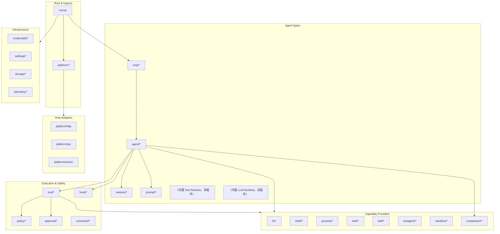

# AgentKit 插件目录

本文定义 AgentKit 的 **Plugin Kind** 命名规范、分类体系和分阶段落地范围。Kind 通过 `pluginkit.Register(kind, New)` 注册；配置中使用 `use: <kind>` 引用。

相关文档：[go-agent-harness-architecture.zh.md](go-agent-harness-architecture.zh.md)、[reference-analysis.zh.md](reference-analysis.zh.md)。

## 1. 命名规范

```
<role>/<name>[/<variant>]
```

| 规则 | 示例 | 说明 |
|---|---|---|
| 小写 + 连字符 | `tool/read-file` | 不用 camelCase |
| role 表示运行时角色 | `llm/openai` | 不是包路径 |
| variant 表示实现 | `fs/sandbox-landlock` | 可选 |
| 同一 kind 进程内唯一 | — | 重复 Register panic |

**返回值类型决定运行时角色**，不是 kind 字符串本身。例如 `tool/read-file` 返回 `agentkit.Tool`，`fs/local` 返回 `filesystem.Service`。

## 2. 插件分类总览



## 3. 插件 Kind 目录

### 3.1 Root & Platform

| Kind | 返回类型 | 职责 | 参考 |
|---|---|---|---|
| `runner` | `agentkit.Runner` | 进程 root，启动 Platform + Loop，管理 StartStop | DSH Loader root / Pi AgentSession 外层 |
| `platform/cli` | `agentkit.Platform` | 终端 stdin/stdout 消息入口 | Pi TUI / DSH headless |
| `platform/multiplex` | `agentkit.Platform` | 聚合多个 Platform（CLI + IM 等共存） | 多入口 fan-in / 按 PlatformID 回写 |
| `platform/http` | `agentkit.Platform` | HTTP/WebSocket API | DSH Web Host |
| `platform/rpc` | `agentkit.Platform` | JSON-RPC / JSONL stdio | Pi RPC 模式 |
| `platform/worker` | `agentkit.Platform` | 一次性任务 runner | DSH headless |

### 3.2 Agent Spine

| Kind | 返回类型 | 职责 | 参考 |
|---|---|---|---|
| `loop/default` | `agentkit.Loop` | Turn/Step 调度，多 Agent 路由 | DSH `agent-loop` / Pi `agentLoop` |
| `loop/harness` | `agentkit.Loop` | 多 Lane + 操作化 run/compaction/navigation | Pi AgentHarness |
| `agent/coding` | `agentkit.Agent` | Coding Agent 默认组合 | 两者默认 Agent |
| `agent/readonly` | `agentkit.Agent` | 只读审查 Agent | DSH permission preset |
| `session/memory` | `agentkit.Session` | 内存 Session（测试用） | — |
| `session/jsonl` | `agentkit.Session` | 单文件 JSONL 追加日志 | Pi JSONL v3 |
| `session/store` | `agentkit.SessionStore` | 按 SessionID 目录多文件（IM 多会话） | — |
| `session/sqlite` | `agentkit.Session` | SQLite + 索引 | DSH session-query-sqlite |
| `prompt/assembler/default` | `agentkit.PromptAssembler` | Section 排序与组装 | DSH `system-prompt` |
| `prompt/section/agents-md` | `agentkit.SectionProvider` | AGENTS.md 层级加载 | DSH `agent-instructions` / Pi AGENTS.md |
| `prompt/section/skills` | `agentkit.SectionProvider` | Skill catalog 注入 | DSH/Pi Skills |
| `prompt/section/time` | `agentkit.SectionProvider` | 当前时间上下文 | DSH `time-context` |
| `llm/openai-compatible` | `agentkit.LLMProvider` | OpenAI 兼容 API | Pi openai-responses |
| `llm/anthropic` | `agentkit.LLMProvider` | Anthropic Messages API | Pi anthropic-messages |
| `llm/deepseek` | `agentkit.LLMProvider` | DeepSeek API | DSH llm-deepseek |
| `llm/replay` | `agentkit.LLMProvider` | 录制回放（测试） | DSH llm-replay |

### 3.3 Tool Consumers（模型可见工具）

Tool 插件返回 `agentkit.Tool`，通过 `Deps` 注入 Capability Provider。

| Kind | 依赖 | 职责 | 参考 |
|---|---|---|---|
| `tool/read-file` | `fs` | 读文件，支持截断 | Pi `read` |
| `tool/write-file` | `fs` | 写文件 | Pi `write` |
| `tool/edit-file` | `fs` | 结构化编辑 | Pi `edit` |
| `tool/grep` | `fs` | 内容搜索 | Pi `grep` |
| `tool/find` | `fs` | 文件查找 | Pi `find` |
| `tool/list-dir` | `fs` | 目录列表 | Pi `ls` |
| `tool/shell` | `shell`, `approval?` | Shell 命令执行 | Pi `bash` / DSH `tool-bash` |
| `tool/web-search` | `web` | 网络搜索 | DSH `tool-web` |
| `tool/web-fetch` | `web` | URL 抓取 | DSH `tool-web` |
| `tool/skill` | `skills` | Skill 发现与加载 | DSH/Pi skill tool |
| `tool/subagent` | `subagent` | 子 Agent 委派 | DSH `tool-subagent` |
| `tool/ask-user` | `approval` | 向用户提问 | DSH `tool-ask-user` |
| `tool/todo` | — | 任务列表（可选） | DSH `tool-todo` |
| `tool/session-query` | `session-query` | 跨 Session 检索 | DSH `tool-session-query` |

### 3.4 Policy & Safety

| Kind | 返回类型 | 职责 | 参考 |
|---|---|---|---|
| `policy/deny-dangerous-shell` | `agentkit.Policy` | 拦截危险 shell 命令 | 两者常见 Extension |
| `policy/path-denylist` | `agentkit.Policy` | 路径黑名单 | Pi path protection 示例 |
| `policy/network-deny` | `agentkit.Policy` | 禁止网络类工具 | DSH sandbox policy |
| `policy/plan-mode` | `agentkit.Policy` | Plan 模式下限制写操作 | DSH plan-mode |
| `approval/cli` | `approval.Service` | 终端 y/n 审批 | Pi `ctx.ui.confirm` |
| `approval/auto-deny` | `approval.Service` | 自动拒绝 ask | 测试 / CI |
| `approval/auto-allow` | `approval.Service` | 自动允许 ask | 开发模式 |

### 3.5 Hooks（观察与改写，非裁决）

| Kind | 返回类型 | Hook 点 | 参考 |
|---|---|---|---|
| `hook/before-step` | `agentkit.HookProvider` | Turn 开始前注入/检查 | DSH `agent/pre-step` |
| `hook/before-tool` | `agentkit.HookProvider` | 工具 input 改写 | DSH post-policy / Pi beforeToolCall |
| `hook/after-tool` | `agentkit.HookProvider` | 工具 result 截断/改写 | DSH `tools/post-execute` |
| `hook/llm-request` | `agentkit.HookProvider` | LLM 请求改写 | Pi `before_provider_request` |
| `hook/turn-stopping` | `agentkit.HookProvider` | 控制 Turn 结束 | DSH `agent/turn-stopping` |
| `hook/repeat-tool-reminder` | `agentkit.HookProvider` | 重复工具调用提醒 | DSH repeat-tool-reminder |
| `hook/timeout` | `agentkit.HookProvider` | Turn/Step 超时 | DSH timeout-policy |

### 3.6 Capability Providers

Provider 返回能力接口；Consumer（Tool）通过 `deps` 绑定，不 import 具体 Provider 包。

#### Filesystem

| Kind | 返回类型 | 说明 |
|---|---|---|
| `fs/local` | `filesystem.Service` | 本地工作区 |
| `fs/memory` | `filesystem.Service` | 内存 FS（测试） |
| `fs/sandbox` | `filesystem.Service` | 沙箱包装 local |
| `fs/readonly` | `filesystem.Service` | 只读包装 |

#### Shell & Process

| Kind | 返回类型 | 说明 |
|---|---|---|
| `shell/bash` | `shell.Executor` | Bash 执行 |
| `shell/pwsh` | `shell.Executor` | PowerShell |
| `process/local` | `process.Service` | 本地子进程 |
| `process/sandbox` | `process.Service` | 沙箱子进程 |

#### Web

| Kind | 返回类型 | 说明 |
|---|---|---|
| `web/http-fetch` | `web.Service` | HTTP 抓取 |
| `web/exa-search` | `web.Service` | Exa 搜索 Provider |

#### Skills & Subagent

| Kind | 返回类型 | 说明 |
|---|---|---|
| `skill/filesystem` | `skill.Registry` | 目录扫描 SKILL.md |
| `skill/badge` | `skill.Registry` | Badge 元数据 |
| `subagent/inprocess` | `subagent.Spawner` | 进程内子 Agent |
| `subagent/rpc` | `subagent.Spawner` | RPC 子 Agent |

#### Sandbox

| Kind | 返回类型 | 说明 |
|---|---|---|
| `sandbox/none` | `sandbox.Service` | 无沙箱（透传） |
| `sandbox/landlock` | `sandbox.Service` | Linux Landlock |
| `sandbox/seatbelt` | `sandbox.Service` | macOS Seatbelt |

#### Compaction & Context

| Kind | 返回类型 | 说明 |
|---|---|---|
| `compaction/summary` | `compaction.Service` | LLM 摘要压缩 |
| `compaction/prune-tool-results` | `compaction.Service` | 无模型工具结果裁剪 |
| `compaction/token-limit` | `compaction.Service` | Token 阈值触发 |

### 3.7 Infrastructure

| Kind | 返回类型 | 说明 |
|---|---|---|
| `credentials/env` | `credentials.Store` | 环境变量 |
| `credentials/file` | `credentials.Store` | 文件存储 |
| `settings/file` | `settings.Store` | YAML/JSON 设置 |
| `storage/json` | `storage.Store` | 通用 KV 存储 |
| `telemetry/otel` | `telemetry.Exporter` | OpenTelemetry |
| `telemetry/none` | `telemetry.Exporter` | 无遥测 |

### 3.8 Commands（不经过模型）

| Kind | 返回类型 | 说明 |
|---|---|---|
| `command/builtin` | `command.Registry` | 内置 slash 命令集 |
| `command/compact` | `command.Handler` | `/compact` |
| `command/tree` | `command.Handler` | Session 树导航 |

## 4. 三角色能力包结构

单个能力域推荐按以下结构组织（详见架构文档 [§7](go-agent-harness-architecture.zh.md#7-能力扩展模型)）：

```text
cap/<domain>/
  definition.go      # 能力接口（如 filesystem.Service）
  doc.go             # 接口文档

plugins/
  fs/local/          # kind: fs/local → filesystem.Service
  fs/sandbox/        # kind: fs/sandbox → filesystem.Service
  tool/read-file/    # kind: tool/read-file → agentkit.Tool, deps.fs
  tool/edit-file/    # kind: tool/edit-file → agentkit.Tool, deps.fs
  policy/path-deny/  # kind: policy/path-denylist → agentkit.Policy
```

**规则**：

- Consumer（`tool/*`）只依赖 Definition 接口。
- Provider（`fs/*`, `shell/*`）只实现能力，不决定模型 schema。
- 换 Provider 不换 Tool：修改 deps 指向即可（如 `fs/local` → `fs/sandbox`）。

## 5. 配置示例：Coding Agent 最小 Preset

```yaml
apiVersion: agentkit.dev/v1
kind: Preset
metadata:
  name: coding-minimal

graph:
  runner:
    use: runner
    deps:
      platform:
        use: platform/cli
      loop:
        use: loop/default
        deps:
          agents:
            - agent.coder

  agent.coder:
    use: agent/coding
    deps:
      session:
        use: session/jsonl
        config:
          path: .agent/sessions
      llm:
        use: llm/openai-compatible
        config:
          model: gpt-4o
          baseUrl: https://api.openai.com/v1
      tools:
        - use: tool/read-file
          deps:
            fs:
              use: fs/local
              config:
                root: .
        - use: tool/edit-file
          deps:
            fs:
              use: fs/local
              config:
                root: .
        - use: tool/write-file
          deps:
            fs:
              use: fs/local
              config:
                root: .
        - use: tool/shell
          deps:
            shell:
              use: shell/bash
              config:
                timeout: 60s
            approval:
              use: approval/cli
      policies:
        - use: policy/deny-dangerous-shell
      prompts:
        - use: prompt/section/agents-md
```

## 6. 分阶段落地

### Phase 1 — 可运行 Runner（MVP）

| 类别 | Kind |
|---|---|
| Root | `runner` |
| Platform | `platform/cli` |
| Spine | `loop/default`, `agent/coding`, `session/jsonl`, `session/memory` |
| LLM | `llm/openai-compatible` |
| Tools | `tool/read-file`, `tool/edit-file`, `tool/write-file`, `tool/shell` |
| Cap | `fs/local`, `fs/memory`, `shell/bash` |
| Safety | `policy/deny-dangerous-shell`, `approval/cli`, `approval/auto-deny` |
| Prompt | `prompt/assembler/default`, `prompt/section/agents-md` |
| Infra | `credentials/env` |

### Phase 2 — 长会话与扩展

| 类别 | Kind |
|---|---|
| Compaction | `compaction/summary`, `compaction/prune-tool-results`, `hook/before-step` |
| Skills | `skill/filesystem`, `tool/skill`, `prompt/section/skills` |
| 更多 Tools | `tool/grep`, `tool/find`, `tool/list-dir` |
| Session | `session/sqlite` |
| Settings | `settings/file` |
| Telemetry | `telemetry/otel` |
| Commands | `command/builtin`, `command/compact` |

### Phase 3 — 高级编排

| 类别 | Kind |
|---|---|
| Subagent | `subagent/inprocess`, `tool/subagent` |
| Web | `web/http-fetch`, `tool/web-fetch` |
| Sandbox | `sandbox/landlock`, `fs/sandbox`, `process/sandbox` |
| Platform | `platform/http`, `platform/rpc` |
| Multi-Agent | `loop/harness`, AgentSet 配置 |
| Policy | `policy/plan-mode`, `policy/path-denylist` |

### Phase 4 — 专项（按需）

Terminal/PTY、LSP、Workflow、Jobs、Web UI、ACP、E2B 远程沙箱等 — 参考 DSH 子系统文档，按产品需求逐个添加 Kind。

## 7. 与参考项目的 Kind 映射

| AgentKit Kind | DSH 包 | Pi 等价 |
|---|---|---|
| `runner` | Cordis Loader + bundles | AgentSession 外层 |
| `loop/default` | `dsh-agent-loop` | `agentLoop` |
| `agent/coding` | `dsh-agent` + presets | Agent + 内置工具 |
| `session/jsonl` | `dsh-session-persistence-jsonl` | SessionManager |
| `tool/read-file` | `dsh-tool-fs` (read) | `read` tool |
| `tool/shell` | `dsh-tool-bash` | `bash` tool |
| `fs/local` | `dsh-fs-local` | 默认 Operations |
| `shell/bash` | `dsh-bash-local` | bash 执行器 |
| `llm/openai-compatible` | `dsh-llm-*` | pi-ai provider |
| `policy/deny-dangerous-shell` | permission-presets | extension 示例 |
| `approval/cli` | `dsh-approval` | `ctx.ui.confirm` |
| `compaction/summary` | `dsh-compaction-basic` | `session_before_compact` |
| `skill/filesystem` | `dsh-skill-filesystem` | skills 目录 |
| `hook/before-step` | `agent/pre-step` listeners | `context` event |
| `platform/rpc` | `dsh-sdk-server` | RPC 模式 |

## 8. 新增插件 Checklist

新增 Plugin Kind 时确认：

- [ ] `init()` 仅调用 `pluginkit.Register`，无 IO / goroutine
- [ ] 构造函数签名符合 `New` / `New(cfg)` / `New(cfg, deps)` 之一
- [ ] Config struct 字段有 `json` tag；未知字段 decode 失败
- [ ] Deps 字段类型为接口，非具体 Provider
- [ ] 需生命周期时实现 `agentkit.StartStop`
- [ ] 工具/注入内容写入 Session，满足 Model-visible ⟺ Logged
- [ ] Policy 裁决走 `agentkit.Policy`；Hook 不充当 deny 通道
- [ ] 加入 import 生成器 manifest
- [ ] 补充 Preset 示例或 Feature 片段
- [ ] 更新本文档对应分类表
