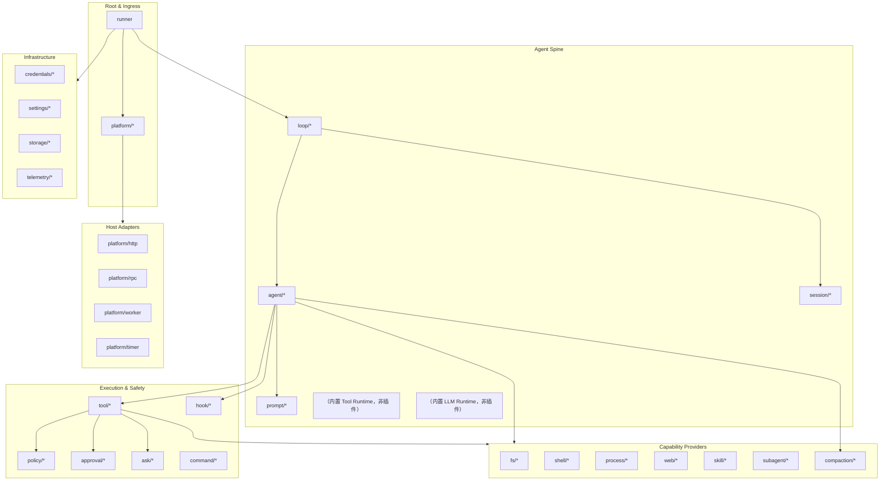

# AgentKit 插件目录

本文定义 AgentKit 的 **Plugin Kind** 命名规范、分类体系和分阶段落地范围。Kind 通过 `pluginkit.Register(kind, New)` 注册；配置中使用 `use: <kind>` 引用。

相关文档：[go-agent-harness-architecture.zh.md](go-agent-harness-architecture.zh.md)、[roadmap.zh.md](roadmap.zh.md)。

## 1. 命名规范

```
<role>/<name>[/<variant>]
```

| 规则 | 示例 | 说明 |
|---|---|---|
| 小写 + 连字符 | `tool/read-file` | 不用 camelCase |
| role 表示运行时角色 | `llm/openai` | 不是包路径 |
| variant 表示实现 | `workspace/tenant` | 可选 |
| 同一 kind 进程内唯一 | — | 重复 Register panic |

**返回值类型决定运行时角色和挂载槽位**。例如单工具插件返回 `agentkit.Tool`，`tool/fs-workspace` 返回 `agentkit.ToolPack`，`tool/mcp` 返回 `agentkit.ToolProvider`，`tools/runtime` 返回 `agentkit.ToolRuntime`。

## 2. 插件分类总览



## 3. 插件 Kind 目录

### 3.1 Root & Platform

| Kind | 返回类型 | 职责 | 参考 |
|---|---|---|---|
| `runner` | `agentkit.Runner` | 进程 root，启动 Platform + Loop + `schedule.Runtime`，管理 StartStop；`sessionScope` 折叠 delivery SessionID（默认 channel）；`maxConcurrentTurns` 控制跨 session 并发（默认 64，同 session 内始终保序）；`config.inject` 在 dispatch 前 prepend `[meta ...]`（sender_id / timestamp / task_id 等，对齐 cc-connect）；per-turn panic 隔离，关停等待 in-flight turn | DSH Loader root / Pi AgentSession 外层 |
| `platform/cli` | `agentkit.Platform` + `permission.Capable` | 终端 stdin/stdout；启动时读 `sessions/cli_current.jsonl` 软链恢复上次会话，`/new` 会换新 id 并更新软链；allow/deny 与 ask 经 Permission 协议读 stdin | Pi TUI / DSH headless |
| `platform/slack` | `agentkit.Platform` | Slack Socket Mode；生成 cc-connect 风格 SessionID | cc-connect `platform/slack` |
| `platform/feishu` | `agentkit.Platform` | 飞书 WebSocket；生成 cc-connect 风格 SessionID；`progressStyle: card/compact` 时整轮 thinking/tool/正文复用一张 Interactive Card 原地更新；`showThinking` / `showToolProgress` 控制进度区展示 | cc-connect `platform/feishu` |
| `platform/lark` | `agentkit.Platform` | 国际版 Lark（`platform/feishu` 的 domain 预设）；流式卡片配置同 feishu | cc-connect `platform/feishu` |
| `platform/chat-api` | `agentkit.Platform` | HTTP + SSE 调试台；会话/消息 API；文件上传下载；`registerOnly` 时只挂载 `http.DefaultServeMux`，由 `platform/http` 等插件监听 | — |
| `platform/multiplex` | `agentkit.Platform` | 聚合多个 Platform（CLI + IM 等共存） | 多入口 fan-in / 按 PlatformID 精确回写（`PlatformID` 为空则拒绝，不广播） |
| `platform/http` | `agentkit.Platform` | 监听并服务 `http.DefaultServeMux`；与 `chat-api.registerOnly` 或其它 `http.Handle` 扩展组合 | DSH Web Host |
| `platform/acp` | `agentkit.Platform` + `permission.Capable` | stdio ACP Agent；供 Zed 等 ACP 客户端子进程接入；权限经 ACP `request_permission` 回传客户端 | — |
| `platform/rpc` | `agentkit.Platform` | JSON-RPC / JSONL stdio | Pi RPC 模式 |
| `platform/worker` | `agentkit.Platform` | headless 一次性任务 runner（从不读 stdin，`output` 支持 text / json）。task 为 `prompt`（agent turn）或 `script`（bash 脚本，需 `deps.workspace` + `deps.shell`）；日历 cron 用 `schedule/cron` | DSH headless |
| `platform/timer` | `agentkit.Platform` | 进程内定时器：按固定间隔自己发起 turn，tick 锚定启动时间、跳过错过的 boundary | — |

**IM 附件**：`platform/slack`、`platform/feishu`、`platform/lark`、`platform/chat-api` 的 `deps.workspace` 为必填。入站图片会先落到租户 `work/upload/`，session 存 `attachment_ref`，Agent 调用 LLM 前再从 workspace hydrate 为 vision；未挂 workspace 时图片会在落盘时被丢弃。

**HTTP 组合**：`chat-api` 默认自建监听（`listenAddr`，默认 `:8030`）。需要与其它 HTTP 路由共用同一端口时，设 `registerOnly: true`（或 `listenAddr: "-"`），由 `platform/http` 监听 `http.DefaultServeMux`；其它插件可在构建阶段 `http.Handle` 挂载自定义路由。

```yaml
platform.default:
  use: platform/multiplex
  deps:
    platforms: [platform.chat-api, platform.http]

platform.chat-api:
  use: platform/chat-api
  config:
    registerOnly: true
    path: /v1/

platform.http:
  use: platform/http
  config:
    listenAddr: ":8080"
```

### 3.2 Agent Spine

| Kind | 返回类型 | 职责 | 参考 |
|---|---|---|---|
| `loop/default` | `agentkit.Loop` | Turn/Step 调度、按 SessionID 串行，并向 ctx 写入 agentkit context key | DSH `agent-loop` / Pi `agentLoop` |
| `loop/harness` | `agentkit.Loop` | 多 Lane + 操作化 run/compaction/navigation | Pi AgentHarness |
| `agent/coding` | `agentkit.Agent` | Coding Agent；从 `ctx.Value(KeySessionID)` 取 ID 并通过 `deps.sessionStore` 加载 Session | 两者默认 Agent |
| `agent/acp-remote` | `agentkit.Agent` | 通过 ACP 调用外部 Agent（Claude Code、Cursor CLI 等） | DSH `dsh-acp` |
| `agent/readonly` | `agentkit.Agent` | 只读审查 Agent | DSH permission preset |
| `session/memory` | `agentkit.Session` | 内存 Session（测试用） | — |
| `session/jsonl` | `agentkit.Session` | 单文件 JSONL 追加日志 | Pi JSONL v3 |
| `session/store` | `agentkit.SessionStore` | 按不透明 SessionID 懒加载 `{safe_id}.jsonl`；LRU 热缓存 + 内存 tail 窗口（`maxLoadedEvents`）；压缩后裁剪内存；完整历史 `Read(0)` 读盘 | cc-connect SessionKey |
| `session/sqlite` | `agentkit.Session` | SQLite + 索引 | DSH session-query-sqlite |
| `prompt/assembler/default` | `agentkit.PromptAssembler` | Section 排序与组装 | DSH `system-prompt` |
| `prompt/section/agents-md` | `agentkit.SectionProvider` | AGENTS.md 层级加载 | DSH `agent-instructions` / Pi AGENTS.md |
| `prompt/section/static` | `agentkit.SectionProvider` | 配置内联自定义 system prompt 文本 | — |
| `prompt/section/skills` | `agentkit.SectionProvider` | Skill catalog 注入 | DSH/Pi Skills |
| `prompt/section/memory` | `agentkit.SectionProvider` | memory.md 层级加载（同 agents-md）；依赖 `learning/default` 接入 `/learn` | — |
| `prompt/section/subagents` | `agentkit.SectionProvider` | 可委派子 Agent 名单注入；定义在磁盘上会变，所以走每轮重建的 section 而不是 `delegate` 的静态 description | — |
| `prompt/section/time` | `agentkit.SectionProvider` | 当前时间上下文 | DSH `time-context` |
| `llm/openai-compatible` | `agentkit.LLMProvider` | OpenAI 兼容 API；`api: responses` 时可配 `hostedTools`（如 `web_search`，服务端执行） | Pi openai-responses |
| `llm/fallback` | `agentkit.LLMProvider` | 主模型/主 provider 失败时按序切换备用 model 或 provider；同 endpoint 只需一份底层 provider | — |
| `llm/anthropic` | `agentkit.LLMProvider` | Anthropic Messages API | Pi anthropic-messages |
| `llm/deepseek` | `agentkit.LLMProvider` | DeepSeek API | DSH llm-deepseek |
| `llm/replay` | `agentkit.LLMProvider` | 录制回放（测试） | DSH llm-replay |

**`llm/openai-compatible`**：`api` 为 `responses`（L0 默认）或 `chat`；`hostedTools` 仅在 `responses` 下生效，用于 OpenAI 内置工具（如 `web_search`），由 provider 服务端执行，不走 agentkit 工具循环。L0 已默认启用 `hostedTools.web_search`，`tools.default` 不再挂 `tool/web-search-*`。若改回 Tavily/DuckDuckGo 等本地搜索插件，需同时设 `api: chat` 并自行把 `tool/web-search-*` 加回 `tools`。示例：

```yaml
llm.default:
  config:
    api: responses
    hostedTools:
      - type: web_search
        parameters:
          search_context_size: medium
```


**`llm/fallback`**：装饰器插件，包装一个或多个底层 `LLMProvider`。同 provider 换 model 时只配一份 `llm/openai-compatible`，在 fallback 里列 `fallbackModels`；主 model 来自 agent 的 `config.model`。跨 provider 时在 `deps.fallbacks` 列出多个实例并配 `config.models`。`fallbackOn` 默认 `retryable`（复用 `llm.IsRetryableError`），也可设 `quota` 或 `any`。

```yaml
llm.default:
  use: llm/openai-compatible
  config:
    baseUrl: https://api.openai.com/v1
    apiKeyRef: env:OPENAI_API_KEY

llm.fallback:
  use: llm/fallback
  config:
    fallbackModels:
      - gpt-4o
      - gpt-4o-mini
  deps:
    provider: llm.default
```


### 3.3 Tool 插件（模型可见工具）

Tool 插件按工具来源返回不同类型：单工具插件返回 `agentkit.Tool`，多工具插件返回 `agentkit.ToolPack`，动态工具插件返回 `agentkit.ToolProvider`。它们分别经 `tools/runtime` 的 `deps.tools`、`deps.toolPacks`、`deps.dynamicTools` 聚合后暴露给模型。

| Kind | 依赖 | 模型工具名 | 职责 |
|---|---|---|---|
| `tool/fs-workspace` | `workspace` | `read` / `write` / `edit` / `grep` / `find` / `ls` | 工作区文件工具组；`config.readOnly` / `config.tools` 可限制能力 |
| `tool/fs-memory` | — | 同上 | 内存 FS，测试与冒烟 |
| `tool/shell-bash` | `workspace` | `bash` | Shell 命令执行 |
| `tool/web-search-auto` | `credentials?` | `web_search` | 可选：Tavily 优先，缺 key/失败时 fallback DuckDuckGo |
| `tool/web-search-tavily` | `credentials?` | `web_search` | Tavily 搜索 |
| `tool/web-search-duckduckgo` | — | `web_search` | DuckDuckGo HTML 抓取，无需 key |
| `tool/web-search-exa` | `credentials?` | `web_search` | Exa 搜索（可选替代） |
| `tool/web-fetch-http` | — | `web_fetch` | HTTP 抓取；私网地址在 dial 时拦截 |
| `tool/web-search-scripted` | — | `web_search` | 预置命中，测试与冒烟 |
| `tool/web-fetch-scripted` | — | `web_fetch` | 预置页面，测试与冒烟 |
| `tool/skill` | `skills`, `sessionStore` | `skill` | Skill 发现与加载 |
| `tool/subagent` | `subagent` | `delegate` | 子 Agent 委派 |
| `tool/ask-user` | — | `ask_user` | 向用户提问（HIL） |
| `tool/todo` | `sessionStore` | `todo` | durable 任务清单 |
| `tool/finish` | `sessionStore` | `finish` | 显式收尾 |
| `tool/schedule` | `schedule` | `schedule` | agent 自主排期 |
| `tool/send` | `platform`, `workspace?` | `send` | 经 platform 主动发送文本或工作区文件；`/send` 管理面投递（指定 session / Slack channel / @user）；L0 `tools.default` 已启用 |
| `tool/mcp` | `workspace`, `credentials?` | *(动态)* | 读取 `mcpServers` JSON 并暴露 MCP 工具；维护指南见 Skill `mcp-manager`（`skills/mcp-manager/SKILL.md`）。详见 [guides/tools.zh.md](guides/tools.zh.md)。 |
| `tool/openapi` | `workspace`, `credentials?` | *(动态)* | 读取 `api.json` 索引并暴露 HTTP 工具；维护指南见 Skill `openapi-manager`；`/openapi -u` 重载。详见 [guides/tools.zh.md](guides/tools.zh.md)。 |

**`tool/fs-workspace` 模型参数**（插件 `config` 另有 `maxBytes` / `maxMatches` / `maxResults` / `maxListEntries` 上限）：

| 工具 | 关键参数 | 行为要点 |
|---|---|---|
| `read` | `offset`, `limit` | 返回带行号的纯文本；大文件截断并在末尾附续读 hint |
| `edit` | `edits[]` | 每条 `oldText` 均对**原文**匹配后再一次性应用；返回 `Edited path` / `No changes applied` |
| `grep` | `pattern`, `path`, `limit`, `literal`, `context` | 返回 `path:line:` 纯文本；无匹配时 `No matches found` |
| `find` | `pattern`, `path`, `limit` | 返回路径列表纯文本；无结果时 `No files found` |
| `ls` | `path`, `limit` | 返回目录条目纯文本；目录以 `/` 结尾 |

### 3.4 Policy & Safety

| Kind | 返回类型 | 职责 | 参考 |
|---|---|---|---|
| `policy/deny-dangerous-shell` | `agentkit.Policy` | 拦截危险 shell 命令 | 两者常见 Extension |
| `policy/path-denylist` | `agentkit.Policy` | 路径黑名单（glob，默认拒 `.git/**`、`**/.env*`、`**/.ssh/**`、`**/*.pem`） | Pi path protection 示例 |
| `policy/shell-allowlist` | `agentkit.Policy` | shell 命令前缀白名单；`strict` 时白名单外一律 deny，链式命令每段都要命中 | — |
| `policy/network-deny` | `agentkit.Policy` | 禁止网络类工具（未做；`web/http-fetch` 自带的 scheme / host / 私网约束是它的雏形） | DSH sandbox policy |
| `policy/plan-mode` | `agentkit.Policy` | Plan 模式下限制写操作 | DSH plan-mode |
| `approval/auto-deny` | `approval.Service` | 自动拒绝 ask | 测试 / CI |
| `approval/auto-allow` | `approval.Service` | 自动允许 ask（无人值守）；**不做任何过滤**，必须与 `policy/shell-allowlist` + `policy/path-denylist` 同时挂载 | 开发模式 |

> **说明**：交互式终端审批走 platform `permission.Capable`（见 [guides/platform-interaction.zh.md](guides/platform-interaction.zh.md)）。

### 3.5 Hooks（观察与改写，非裁决）

| Kind | 返回类型 | Hook 点 | 参考 |
|---|---|---|---|
| `hook/before-step` | `agentkit.HookProvider` | Turn 开始前注入/检查 | DSH `agent/pre-step` |
| `hook/before-tool` | `agentkit.HookProvider` | 工具 input 改写 | DSH post-policy / Pi beforeToolCall |
| `hook/after-tool` | `agentkit.HookProvider` | 工具 result 截断/改写 | DSH `tools/post-execute` |
| `hook/llm-request` | `agentkit.HookProvider` | LLM 请求改写 | Pi `before_provider_request` |
| `hook/turn-continue` | `agentkit.HookProvider` | Turn 末裁决续跑/收尾（`TurnStopping` seam）；贡献 `/status` | DSH `agent/turn-stopping` |
| `hook/repeat-tool-reminder` | `agentkit.HookProvider` | 重复工具调用提醒 | DSH repeat-tool-reminder |
| `hook/timeout` | `agentkit.HookProvider` | Turn/Step 超时 | DSH timeout-policy |

### 3.6 共享运行时插件

以下插件仍独立存在，供多个 tool / runtime 复用：

#### Skills & Subagent

| Kind | 返回类型 | 说明 |
|---|---|---|
| `skill/filesystem` | `skill.Registry` | 目录扫描 SKILL.md |
| `skill/badge` | `skill.Registry` | Badge 元数据 |
| `learning/default` | `CommandProvider` | 租户个人 memory.md、Grounded Dreaming、Skill Workshop；`/learn` 管理记忆/巩固/技能提案 |
| `learning/dream-sweep` | `schedule.Runtime` | 后台三阶段 dreaming sweep（默认每天 03:00） |
| `subagent/inprocess` | `subagent.Spawner` | 进程内子 Agent：定义来自 `dirs` 下的 `agents/*.md`（frontmatter + 正文即 system prompt），串行 `Run` 一个子 agent 并只把结论带回；`deps.tools` 必须是**不含 `tool/subagent`** 的兄弟实例（既避开依赖环，也让"子 agent 不能再委派"成为结构性事实）。详见 [guides/subagent.zh.md](guides/subagent.zh.md) |
| `subagent/rpc` | `subagent.Spawner` | RPC 子 Agent |

#### Schedule

| Kind | 返回类型 | 说明 |
|---|---|---|
| `schedule/file` | `schedule.Registry` | JSON 文件持久化的 cron job 表；临时文件 + rename 写入，agent 排的 job 跨重启存活 |
| `schedule/cron` | `schedule.Runtime` | 常驻日历调度：轮询 registry、到期后 submit inbound turn；由 runner 启动，与 `tool/schedule` 共用 registry |

#### Compaction & Context

| Kind | 返回类型 | 说明 |
|---|---|---|
| `compaction/summary` | `compaction.Service` | LLM 摘要压缩 |
| `compaction/prune-tool-results` | `compaction.Service` | 无模型工具结果裁剪 |
| `compaction/token-limit` | `compaction.Service` | 按 token 阈值门控内层压缩链（deps.services）；阈值取 `maxTokens` 或 `contextWindow × triggerRatio` |

### 3.7 Infrastructure

| Kind | 返回类型 | 说明 |
|---|---|---|
| `workspace/default` | `workspace.Service` | 双根工作区：`global`（默认 `~/.agentkit`）+ `local`（默认 `.agentkit`）；`scope` 选默认根；路径可用 `global:rel` / `local:rel` 前缀 |
| `workspace/tenant` | `workspace.Service` | 多租户工作区：`global` 全租户共享，`local` 根按 `cap/tenant` 租户键一租户一个（默认 `localBase/<键>`，可用 `tenants` 钉到已有目录，`omitPlatformPrefix` 去掉目录名里的 platform 段）；`..` 一律不解析 |
| `bootstrap/shell` | `agentkit.AppInitializer` | 启动前在 workspace 目录按序执行 `bash -lc` 命令；挂到 `runner.deps.init` |
| `credentials/env` | `credentials.Store` | 环境变量；`config.env` 内联内存键值、`config.files` 读取 dotenv 文件；优先级：进程 env > config env > files；`/env add` 写入 `.env`，`/env -u` 重载 files |
| `credentials/file` | `credentials.Store` | 文件存储 |
| `settings/file` | `settings.Store` | YAML/JSON 设置 |
| `storage/json` | `storage.Store` | 通用 KV 存储 |
| `telemetry/langfuse` | `telemetry.Exporter` | Langfuse Go SDK（ingestion API）导出 |
| `telemetry/none` | `telemetry.Exporter` | 无遥测 |
| `telemetry/otel` | `telemetry.Exporter` | 通用 OpenTelemetry（未做） |

### 3.8 Commands（不经过模型）

Slash 命令由能力插件实现 `agentkit.CommandProvider` 贡献。`commands/registry` 汇总命令并支持 `allow` / `deny` 过滤（默认全部启用）；`runner` 在 `Run(ctx, buildResult)` 时通过 `build.WireContributions` 自动收集并调用 `CommandCollector.SetCommands`。Platform 通过 `deps.commands` 依赖 registry 实例。

| Kind | 返回类型 | 说明 |
|---|---|---|
| `commands/registry` | `agentkit.Commands` | 汇总 CommandProvider，支持 allow/deny 过滤；`config.admins` + `config.adminOnly` 限制仅管理员可执行的 slash（`ctx` 写入 `KeyIsAdmin`） |

| 贡献方 | 命令 |
|---|---|
| `commands/registry` | `/plugin` |
| `loop/default` | `/agent` |
| `subagent/inprocess` | `/subagent` |
| `session/store` | `/new`、`/session` |
| `hook/before-step` | `/compact` |
| `hook/turn-continue` | `/status` |
| `credentials/env` | `/env`（查看缓存；`/env add KEY=VALUE` 写入 `.env` 并校验，失败回滚；`/env -u` 重读文件） |
| `tool/mcp` | `/mcp`（查看工具；`/mcp add <name> <json>` 写入 `mcp.json` 并探活校验；`/mcp -u` 重读配置） |
| `tool/openapi` | `/openapi`（查看工具；`/openapi add <name> <json>` 写入 `api.json` 并校验；`/openapi -u` 重读配置） |
| `tool/shell-bash` | `/shell`、`/sh`（本地执行 shell 命令，不经过模型） |
| `tool/send` | `/send`（向指定 session、Slack channel 或 @user 主动发消息，不经过模型） |
| `learning/default` | `/learn`（memory / dreaming / skill workshop；见 [guides/learning-dreaming.zh.md](guides/learning-dreaming.zh.md)） |

示例：

```yaml
platform:
  use: platform/cli
  deps:
    commands: commands

commands:
  use: commands/registry
  config:
    deny: [compact]
    admins: [U02ABC, U03DEF]
    adminOnly: [shell, sh, cron, env, mcp, openapi, send]
```

## 4. 能力包与工具结构

单个能力域推荐按以下结构组织（详见架构文档 [§7](go-agent-harness-architecture.zh.md#7-能力扩展模型)）：

```text
cap/<domain>/
  *.go               # 可替换能力接口（workspace、compaction、permission…）
  doc.go             # 接口文档（可选）

cap/filesystem/      # 例外：grep/find DTO + gitignore，非 Provider 边界

plugins/
  tool/fs/           # tool/fs-workspace、tool/fs-memory（内聚实现，共用 cap/filesystem 类型）
  tool/              # shell、web、skill、subagent…
  compaction/        # summary、prune-tool-results
  approval/          # cli、auto-deny、auto-allow
  web/               # http-fetch、exa-search…
  prompt/            # section/agents-md、section/static、section/skills
  skill/             # filesystem
  policy/            # deny-dangerous-shell
  hook/              # before-step
  credentials/       # env
  schedule/          # file、cron
  settings/          # file
  workspace/         # default、tenant（runtime/workspace）
```

**规则**：

- 文件/Shell 等模型工具优先单插件内聚；共享 deps 通常是 `workspace.Service`，不是 `filesystem.Service`。
- 只有 workspace、credentials、session、compaction 等跨插件能力保留 Provider + `cap/*` 接口。
- 换 workspace Provider（如 `workspace/default` → `workspace/tenant`）不换 tool kind：修改 deps 指向即可。

## 5. 配置示例：Coding Agent 最小 Preset

```yaml
apiVersion: agentkit.dev/v1
kind: Preset
metadata:
  name: coding-minimal

graph:
  runner:
    use: runner
    deps:
      platform:
        use: platform/cli
      loop:
        use: loop/default
        deps:
          agents:
            - agent.coder

  agent.coder:
    use: agent/coding
    deps:
      session:
        use: session/jsonl
        config:
          path: .agent/sessions
      llm:
        use: llm/openai-compatible
        config:
          model: gpt-4o
          baseUrl: https://api.openai.com/v1
      tools:
        - use: tool/read-file
          deps:
            fs:
              use: fs/local
              config:
                root: .
        - use: tool/edit-file
          deps:
            fs:
              use: fs/local
              config:
                root: .
        - use: tool/write-file
          deps:
            fs:
              use: fs/local
              config:
                root: .
        - use: tool/shell
          deps:
            shell:
              use: shell/bash
              config:
                timeout: 60s
            approval:
              use: approval/auto-deny
      policies:
        - use: policy/deny-dangerous-shell
      prompts:
        - use: prompt/section/agents-md
```

## 6. 分阶段落地

**接下来做什么以 [roadmap.zh.md](roadmap.zh.md) 为准。** 本节 §3 的 Kind 目录是完整清单；roadmap 标注各能力的落地状态与优先级。

未做项速查：`session/sqlite`、`platform/http`、`platform/rpc`、`telemetry/otel`、`policy/network-deny`、`policy/plan-mode`、`loop/harness`、OS 级沙箱。

## 7. 新增插件 Checklist

新增 Plugin Kind 时确认：

- [ ] `init()` 仅调用 `pluginkit.Register`，无 IO / goroutine
- [ ] 构造函数签名符合 `New` / `New(cfg)` / `New(cfg, deps)` 之一
- [ ] Config struct 字段有 `json` tag；未知字段 decode 失败
- [ ] Deps 字段类型为接口，非具体 Provider
- [ ] 需生命周期时实现 `agentkit.StartStop`
- [ ] 需启动前一次性准备时实现 `agentkit.AppInitializer`，并由 `runner.deps.init` 挂载
- [ ] 构造函数与 Config 字段写好 godoc（`// NewXxx registers <kind>:` + 字段注释）；CLI `/plugin <kind>` 通过 `go doc` 展示
- [ ] 工具/注入内容写入 Session，满足 Model-visible ⟺ Logged
- [ ] Policy 裁决走 `agentkit.Policy`；Hook 不充当 deny 通道
- [ ] 加入 import 生成器 manifest
- [ ] 补充 Preset 示例或 Feature 片段
- [ ] 更新本文档对应分类表
- [ ] **tool 插件**：主 agent 默认经 scaffold 黑名单排除测试/替身实现；子 agent 须加入 `DefaultSubagentToolWhitelist()` 才会进入子 agent 工具集（见 [guides/config-simplification.zh.md](guides/config-simplification.zh.md)）
