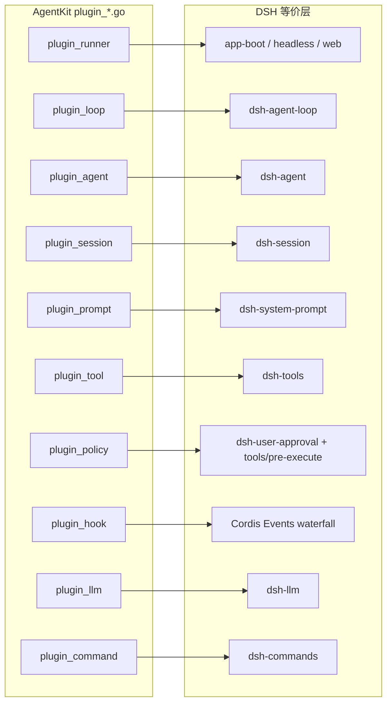

# AgentKit `plugin_*.go` 与 DeepSeek Harness 插件定义对比

本文对比 `agentkit` 根包中的 `plugin_*.go` 接口契约与 [DeepSeek Harness](https://github.com/deepseek-ai/deepseek-harness)（下称 **DSH**）在 Cordis 微内核上的等价能力定义，提炼可互相借鉴的设计点。

相关文档：[reference-analysis.zh.md](reference-analysis.zh.md)、[plugin-catalog.zh.md](plugin-catalog.zh.md)、[go-agent-harness-architecture.zh.md](go-agent-harness-architecture.zh.md)。

> **核对基线 2026-08-25**：本文的 AgentKit 侧断言均已对代码逐条核对，核对命令见 [roadmap.zh.md](roadmap.zh.md#怎么维护这份路线图)。取长补短的落地优先级已迁到 [roadmap.zh.md](roadmap.zh.md)，本文只保留接口级对比。
>
> **2026-08 接口重整**：`MessageEvent`/`OutboundEvent` 必填 `SessionID`；Loop 在 `Dispatch` 时写入 `ctx.Value(agentkit.KeySessionID)` / `ctx.Value(agentkit.KeyAgentID)` / `ctx.Value(agentkit.KeyUserID)`；`TurnInput` 不再重复携带路由字段。`SessionStore` 由 Agent 依赖并在 `RunTurn` 内用 context key 取出的 SessionID 执行 `Get`。SessionID 格式对齐 cc-connect（`platform:segment:...`），由 `platform/*` 生成。

## 1. 对比范围说明

| 维度 | AgentKit | DSH |
|---|---|---|
| 语言 | Go | TypeScript |
| 接口文件 | `plugin_agent.go` … `plugin_tool.go`（10 个，含 `plugin_command.go`） | 分散在 `packages/core/*`、`packages/*/src/index.ts` |
| 装配方式 | `pluginkit.Register(kind, New)` + YAML 实例图 | Cordis `Plugin`（`name` / `inject` / `Config` / `apply`）+ `cordis.yml` patch |
| 运行时访问 | 构造期 `Deps` 注入，请求路径不查容器 | `ctx.<service>` 服务容器 + 事件总线 |

DSH 没有与 `plugin_*.go` 一一对应的单文件；其「插件定义」是 **Cordis 插件形状** + **核心 Service 接口** + **事件扩展点** 三者的组合。下表按 AgentKit 文件组织对比。



## 2. 扩展模型：根本差异

### 2.1 DSH Cordis 插件形状

每个 npm 包导出 namespace plugin：

```typescript
// 典型形状（见 packages/sdk/server/tests/plugin-shape.spec.ts）
export const name = 'sdk-jsonrpc-server'
export const inject = ['agents']
export const Config = z.object({ ... })
export function apply(ctx: Context, config: Config) { ... }
```

特点：

- **运行时注册**：`apply(ctx)` 向 `ctx` 挂载服务、注册事件监听、注册工具。
- **依赖声明**：`inject` 数组保证拓扑排序；支持 intercept config。
- **配置校验**：`Config` 使用 Standard Schema / zod，启动前校验。
- **可逆副作用**：Fiber dispose 时撤销注册。

### 2.2 AgentKit pluginkit 插件形状

```go
func init() {
    pluginkit.Register("tool/read-file", New)
}
func New(cfg Config, deps Deps) (agentkit.Tool, error) { ... }
```

特点：

- **类型即角色**：构造函数返回值类型（`Tool`、`Loop`、`Policy`…）决定运行时角色，kind 字符串仅用于配置引用。
- **静态依赖**：`Deps` struct + `json` tag，构建期类型检查，无全局 `ctx`。
- **接口极简**：`plugin_*.go` 只定义语义契约，不含注册/事件框架代码。

### 2.3 取舍小结

| 方面 | DSH 优势 | AgentKit 优势 |
|---|---|---|
| 扩展粒度 | 事件点极细（20+ waterfall），scope 过滤 | 接口少、Policy/Hook 职责清晰 |
| 类型安全 | TS 模块增强（`SessionEventMap` 可扩展） | Go 接口 + 构建期 deps 检查 |
| 动态组合 | patch.yml 运行时替换任意插件 | 编译期链接，部署简单 |
| 测试 | `ctx.plugin()` 轻量挂载 | 直接构造接口实现，无框架 mock |
| 学习曲线 | 需理解 Cordis 事件模式 | 标准 Go interface 即可 |

## 3. 逐文件接口对比

### 3.1 `plugin_runner.go` — 进程入口

**AgentKit**

```go
type Runner interface {
    Run(context.Context) error
    Stop(context.Context) error
}
type Platform interface {
    Receive(context.Context) (MessageEvent, error)
    Send(context.Context, OutboundEvent) error
}
```

**DSH 等价**

- 无单一 `Runner` 接口；由 **profile + bundle**（`dsh-base`、`dsh-web-app`、`dsh-headless`）组装 Cordis 树。
- 消息入口分散：`host-apiproxy`（Web）、`headless`（一次性任务）、`acp`（ACP 协议）等，均实现各自的 transport，最终写入 `ctx.agents` / inbox。

| 对比项 | AgentKit | DSH |
|---|---|---|
| 生命周期 | `Run` / `Stop` 显式 | Cordis Fiber `dispose` |
| 入口抽象 | `Platform` 统一 Receive/Send | 各 Host 适配器独立 |
| 多入口 | `platform/multiplex`（已实现）+ `platform/timer` / `platform/worker` | Web + CLI + ACP 原生共存 |

**取长补短**

- AgentKit 可取：Runner/Platform 二分清晰，适合 Go 单二进制部署。
- DSH 可取：多 Host 并存是一等公民；AgentKit 应确保 `PlatformID` 在 `OutboundEvent` 中贯穿（已做），multiplex 尽快落地。
- AgentKit 缺口：架构文档提到 `StartStop`，但根包尚未定义该接口；Runner 应负责收集并有序启停子组件（对齐 DSH Fiber 生命周期）。

---

### 3.2 `plugin_loop.go` — 调度器

**AgentKit**

```go
type Loop interface {
    Dispatch(context.Context, LoopRequest) error
    Steer(context.Context, ModelMessage) error
    FollowUp(context.Context, ModelMessage) error
}
```

**DSH 等价**：`ctx.agentLoop`（`dsh-agent-loop`）

- 实现 `AgentFactory`：`createAgent` / `resume`，含 setup 事务、session 发布、loop 启动。
- 内部 `ReactLoopAgent` 驱动 turn/step 状态机，而非外部 `Dispatch` 单次调用。

| 对比项 | AgentKit | DSH |
|---|---|---|
| 调度模型 | Loop 被动 `Dispatch`，Agent 跑完一次 turn | Agent 常驻 goroutine，inbox 驱动 |
| Session 路由 | Loop 按 SessionID 串行；Agent 持 `SessionStore` 并 `Get` | Agent.id == SessionId，一一对应 |
| Follow-up | `FollowUpMode`（one-at-a-time / all） | inbox `next-turn` 队列，FIFO |
| Steer | Loop.Steer → SessionControl | `agent.steer()` → inbox `next-step` |
| 创建/恢复 | 不在 Loop 接口内 | `AgentFactory.create/resume` + `AgentSetup` |

**取长补短**

- AgentKit 可取：`Loop` 接口极简，易于测试单次 Dispatch；`FollowUpMode` 显式可配置。
- DSH 可取：
  - **Agent 与 Session 同 ID**，路由无歧义。
  - **inbox 持久化**（`agent/inbox/spliced` 会话事件），重启可恢复队列。
  - **AgentSetup** 在发布前完成 scoped 注册，观察者不见半成品。
- AgentKit 建议：
  - 长期考虑将 turn 驱动内聚到 Agent（类似 DSH），Loop 只做路由与多 Agent 仲裁。
  - Loop 按 SessionID 串行 + Agent 依赖 `SessionStore` 已对齐 cc-connect 不透明 SessionKey；可补充 inbox 持久事件。

---

### 3.3 `plugin_agent.go` — 执行体

**AgentKit**

```go
type Agent interface {
    ID() AgentID
    RunTurn(context.Context, TurnInput) error
}
type TurnInput struct {
    Message ModelMessage
    Emit    OutboundEmit
}
```

**根包不再定义 `SessionControl` 接口**。控制面拆成了两半，靠 context 值对接：

- 供给侧 `runtime/loop.Control`（具体类型，Loop 每个 SessionID 持一个）提供 `Steer` / `FollowUp` / `Cancel` / `DrainFollowUps`，Loop 在 `Dispatch` 时写入 `ctx.Value(agentkit.KeySessionControl)`。
- 消费侧 `runtime/agent/turn_control.go` 的**私有窄接口** `turnControl`（`BeginStep` / `PopSteering` / `PopCancelReason` / `ClearTurnCancel` / `ShouldContinueAfterInterrupt`）从同一个 context 值鸭子类型取出；取不到则退化为 `noopTurnControl`。子 agent 正是走这条退化路径（`runtime/subagent/inprocess.go` 显式把该 key 置 nil），因此不被父 turn 的 steering / cancel 语义牵连。

代价是这条 seam 没有编译期契约：Loop 侧改了方法签名，Agent 侧只会在运行时静默退化成 noop。好处是 Agent 不必依赖 Loop 的队列语义。

Loop 在调用 Agent 前把 `MessageEvent.SessionID`、`AgentID`、`PlatformID`、`UserID` 写入 context key；Agent 插件通过 `ctx.Value(agentkit.KeySessionID)` 取 ID，并用 `deps.sessionStore` 在 `RunTurn` 内加载 Session。Loop 不注入 `Session` 对象。

**DSH 等价**：`Agent`（`dsh-agent/runtime-types.ts`）

```typescript
interface Agent {
  id: SessionId
  session: Session
  inbox: Inbox
  status: 'idle' | 'running'
  ctx: Context          // agent-scoped Cordis 子树
  cancel(cause, options?)
  whenIdle(): Promise<void>
  runMaintenance(task)
  send(message, target, wakeup)
  followup(message)
  steer(message)
  inject(message)      // 注入上下文，不唤醒
}
```

| 对比项 | AgentKit | DSH |
|---|---|---|
| 控制面 | `runtime/loop.Control` 经 `KeySessionControl` 传递，Agent 侧私有窄接口消费 | Agent 自身方法 + inbox |
| Session 加载 | Agent `SessionStore.Get(ctx.Value(KeySessionID))` | Agent 内嵌 `session` 字段 |
| inject | **无** | `inject()` 排队 next-step 上下文，不唤醒 |
| 队列持久化 | **无**（`Control` 的 steering / follow-up 队列纯内存，进程挂即丢） | `agent/inbox/spliced` 会话事件 |
| cancel | `runtime/loop.Control.Cancel(reason)`，取消当前 step | `cancel(cause, { keepInbox? })` + AbortSignal 贯穿 turn |
| 状态 | 无 status 概念 | `idle` / `running` + `agent/status` 事件 |
| scoped 世界 | 无 agent-scoped ctx | `agent.ctx` 隔离工具/prompt/监听器 |
| 维护任务 | 无 | `runMaintenance` 在 idle 相运行非 turn 任务 |

**取长补短**

- AgentKit 可取：Agent 只做 `RunTurn`，控制面与执行面分离，适合 pluginkit 静态图。
- DSH 可取：
  - **`inject()`** 是独立能力（审批结果、子任务完成通知），AgentKit 仅有 steer/follow-up，缺少「静默注入」。
  - **`AgentCancelCause`** 结构化（user/parent/hook/disposed），比单纯 reason 字符串更可观测。
  - **`whenIdle()`** 便于测试与编排（子 agent 等待父 agent 空闲）。
- AgentKit 建议：`Inject` 的落点是 `runtime/loop.Control` + Agent 侧窄接口（根包已无 `SessionControl` 类型可加），并顺带补 `Cancel` 的 `keepQueue`；队列持久化见 [roadmap M2](roadmap.zh.md#m2--隔离--守护收尾)。

---

### 3.4 `plugin_session.go` — 会话存储

**AgentKit**

```go
type Session interface {
    ID() SessionID
    Append(ctx, SessionEvent) (EventSeq, error)
    Read(ctx, EventSeq) ([]SessionEvent, error)
    DeriveMessages(ctx) ([]ModelMessage, error)
}
// SessionStore resolves durable sessions by opaque SessionID.
// Agent plugins depend on SessionStore; Loop only routes SessionID.
type SessionStore interface {
    Get(ctx, SessionID) (Session, error)
}
```

**DSH 等价**：`ctx.sessions`（`dsh-session`）

- `Session` 含 `deriveMessages()`、fork、epoch header、`request/header` 事件。
- `SessionEventMap` 通过 TS module augmentation 扩展事件类型（插件可追加事件种类）。
- `SessionHeader` 持久化 cwd、parentSession、delegationDepth、agentPreset 等元数据。
- 独立 `ctx.sessionPersistence` seam（jsonl / sqlite）。

| 对比项 | AgentKit | DSH |
|---|---|---|
| 事件类型 | `EventType` 字符串常量 | 强类型 `SessionEventMap` + 可扩展 |
| 元数据 | `SessionEvent` 含 AgentID | `SessionHeader` 丰富持久字段 |
| Fork | 未在接口层暴露 | `sessions.fork(source, boundary?)` |
| LLM 配置 | 不在 Session | `request/header` 记录 `LlmCallConfig` |
| Store | `SessionStore.Get` | 内存 store + persistence 双层 |

**取长补短**

- AgentKit 可取：四方法接口极简，易于实现 memory/jsonl/sqlite。
- DSH 可取：
  - **Session 即真相源**贯彻更彻底：inbox splice、tool code-dispatch 均记入日志。
  - **Fork / resume** 是一等 API。
  - **LlmCallConfig 按会话记录**，换模型不丢历史语义。
- AgentKit 建议：评估 `Session` 是否需 `Fork`；`DeriveMessages` 保持纯函数，但事件类型考虑用注册表扩展（类似 DSH 的 module augmentation 思路可用 Go 的 typed event data + `json.RawMessage` 分发）。

---

### 3.5 `plugin_prompt.go` — 提示词组装

**AgentKit**

```go
type PromptAssembler interface {
    Assemble(ctx, PromptRequest) (Prompt, error)
}
type SectionProvider interface {
    Sections() []Section  // Name, Order, Build func
}
```

**DSH 等价**：`ctx.systemPrompt`（`dsh-system-prompt`）

- **Section**：静态或动态 `text`，支持 `{{variable}}` 插值。
- **Context**：动态用户角色快照（与 section 分开）。
- **Variables**：键值对，渲染时替换。
- **Tools**：组装时收集 scoped tool schemas。
- **`system-prompt/assemble` waterfall**：监听器可改写 assembly，但有 `complete` section 保护。

| 对比项 | AgentKit | DSH |
|---|---|---|
| 组装入口 | 单一 `Assemble` | registry + waterfall |
| 动态上下文 | 合并在 Section.Build | 独立 `PromptContext` |
| 工具 schema | `PromptRequest.Tools` 传入 | 从 `ctx.tools` scoped 收集 |
| 变量插值 | 无 | `{{var}}` + `variables` 表 |
| Scope | 无 | global / agent scope 分层 |

**取长补短**

- AgentKit 可取：`SectionProvider` + `Order` 与 DSH section 一致，简单直接。
- DSH 可取：
  - **Context vs Section 分离**：section 是 system，context 是 user-role 快照，职责更清晰。
  - **assemble waterfall** 允许运行时调整，但 `complete` 防覆盖。
  - **scoped 组装**：不同 agent preset 看到不同 tools/sections。
- AgentKit 建议：`Prompt` 增加 `Contexts []PromptSection`；`PromptAssembler` 实现层参考 DSH 做 scope 过滤（与 context key 对齐）。

---

### 3.6 `plugin_tool.go` — 工具

**AgentKit**

```go
type Tool interface {
    Name() / Description() / InputSchema() / Call(ctx, ToolCall) (ToolResult, error)
}
type ToolRuntime interface {
    Visible(context.Context) ([]ToolSpec, error)
    Execute(ctx, ToolCall) (ToolResult, error)
}
```

**DSH 等价**：`ctx.tools`（`dsh-tools`）

- 注册：`tools.register(name, handler, schema, options)`。
- 执行流水线（waterfall）：
  - `tools/pre-execute` → allow / deny / ask
  - `tools/execute` → around（超时/重试）
  - `tools/post-execute` → 改写 result
  - `tools/result` → 观察（emit）
- **Code Mode**：`run_code` 折叠工具为 SDK 程序调用。
- **Presentation**：`ToolCallView` / `ToolResultView` 供 UI 渲染。

| 对比项 | AgentKit | DSH |
|---|---|---|
| 消费者接口 | `Tool` 四方法 | `defineTool` + schema 推导 |
| 运行时 | `ToolRuntime` 统一 Visible/Execute | `ToolRuntime` service + 事件链 |
| 策略 | 外置 `Policy` | `pre-execute` 内嵌 allow/deny/ask |
| 改写结果 | `Hook AfterTool` | `post-execute` waterfall |
| UI 呈现 | 无 | `presentation.ts` 丰富视图类型 |
| Scope | context key（`KeySessionID` / `KeyAgentID` / `KeyUserID` / `KeyTurnID`） | `dsh-scope` 多层 restrict |

**取长补短**

- AgentKit 可取：**Policy 与 Hook 分离**——DSH 的 `pre-execute` 同时承担策略与观察，AgentKit 用 `Policy.Evaluate` + `BeforeToolHook` 拆开，边界更清晰（与 reference-analysis 一致）。
- DSH 可取：
  - **`tools/execute` around** 适合超时/重试/指标，AgentKit 尚无等价 Hook。
  - **Presentation 层**与工具解耦，Web UI 可渲染 diff/terminal/web 等专用视图。
  - **Code Mode** 降低 tool schema token 消耗。
- AgentKit 建议：增加 `AroundToolHook` 或让 Tool Runtime 内置 execute 包装链；长期考虑 presentation 类型（可在 `cap/` 或 `runtime/tools` 定义，不进 `plugin_tool.go`）。

---

### 3.7 `plugin_policy.go` — 策略与审批

**AgentKit**

```go
type Policy interface {
    Evaluate(ctx, PolicyInput) (Decision, error)
}
// DecisionKind: allow | deny | ask
type Approval interface {
    Ask(ctx, ApprovalRequest) (ApprovalDecision, error)
}
```

**DSH 等价**

- 策略：`tools/pre-execute` waterfall → `PreToolDecision { allow | deny | ask }`
- 审批：`ctx.approval`（`dsh-user-approval`）→ `approval/request` waterfall → `ApprovalOutcome`
- Permission presets：`ctx.permissionPresets` 按 agent 预设组合策略

| 对比项 | AgentKit | DSH |
|---|---|---|
| 裁决入口 | 独立 `Policy` 接口 | 事件 `tools/pre-execute` |
| ask 路径 | `DecisionAsk` + `Approval.Ask` | pre-execute `ask` → approval service |
| 审计 | `Decision.Audit` map | 分散在各 listener |
| 预设 | 靠多个 Policy 插件组合 | `permission-presets` 一等概念 |

**取长补短**

- AgentKit 可取：Policy Plane 单点裁决，不会与 Hook 改写混淆。
- DSH 可取：
  - **permission presets** 把 allow/deny/ask 策略打包为 agent 级配置，适合「只读审查 agent」等场景。
  - **approval/request waterfall** 允许多 UX 提供方链式尝试。
- AgentKit 建议：在 `cap/approval` 或 preset 层增加「按 AgentID 绑定 Policy 链」；保持 `Evaluate` 同步、轻量。

---

### 3.8 `plugin_hook.go` — 钩子

**AgentKit（当前实现）**

```go
type HookProvider interface { Hooks() []Hook }
type BeforeStepHook / BeforeToolHook / AfterToolHook / TurnStoppingHook
// HookProvider 贡献的 hook 按 deps.providers 列表顺序执行；同一 provider 内 Hooks() 返回顺序保留。
```

**DSH 等价（节选）**

| DSH 事件 | 模式 | AgentKit 映射 |
|---|---|---|
| `agent/pre-step` | waterfall | `BeforeStepHook`（但无 reject/enter 决策类型） |
| `agent/request` | waterfall | 文档规划 `hook/llm-request`，**未实现** |
| `agent/request-error` | waterfall | **未实现** |
| `agent/turn-stopping` | serial | `TurnStoppingHook`（已实现，`hook/turn-continue` 为默认驱动） |
| `tools/pre-execute` | waterfall | `Policy`（裁决，非 Hook） |
| `tools/post-execute` | waterfall | `AfterToolHook`（但无 block/replace 决策） |
| `tools/execute` | waterfall | **未实现** |
| `system-prompt/assemble` | waterfall | 可在 `PromptAssembler` 内部扩展 |

| 对比项 | AgentKit | DSH |
|---|---|---|
| 钩子类型 | 4 种 typed interface | 20+ 事件点 |
| 链式语义 | deps 列表顺序，error 中断 | waterfall `next()` 委托 |
| 改写 vs 否决 | Hook 返回 error 中断 | `PreStepDecision.reject` / `PreToolDecision.deny` 显式 |
| Scope | 无 | agent-scoped 监听器 |

**取长补短**

- AgentKit 可取：typed hook 易读、易测；Policy 不混入 Hook。
- DSH 可取：
  - **`PreStepDecision`**：`reject` vs `enter(messages)` 比单纯返回 error 语义更精确。
  - **`agent/turn-stopping`**：已补齐为 `TurnStoppingHook`（`Continue` 延长 turn / `Stop` 强制收尾，硬预算优先），见 [autonomous-run.zh.md](autonomous-run.zh.md)。
  - **waterfall `next()`**：链式组合比纯 Order 更灵活（可短路或委托）。
- AgentKit 建议：
  - `BeforeStep` 增加 `StepDecision`（Allow / Reject / EnterMessages）。
  - `AfterTool` 增加可选「替换结果」返回值，对齐 `post-execute`。
  - 按 plugin-catalog 补齐 `BeforeLLMRequest` 接口（`TurnStopping` 已补齐）。

---

### 3.9 `plugin_llm.go` — 模型提供方

**AgentKit**

```go
type LLMProvider interface {
    Name() string
    Stream(ctx, LLMRequest) (LLMStream, error)
}
type LLMRequest struct { Model, Messages, Tools }
type LLMEvent struct { Type, Message, Delta, ToolCall, Usage, Raw }
```

**DSH 等价**：`ctx.llm`（`dsh-llm`）

- Adapter 注册：`registerAdapter(provider, model, streamFn, options)`。
- **`LlmCallConfig`** 按会话记录在 `request/header` 事件。
- **`llm/stream` waterfall**：可包装流（日志、限速）。
- **`agent/request` waterfall**：提议替换 call config。
- 消息类型：`Message` 含 `ContentBlock`（text/thinking/toolCall/toolResult）。
- `deepFreeze` 保证请求不可变。

| 对比项 | AgentKit | DSH |
|---|---|---|
| 配置状态 | 每次 `LLMRequest` 传入 | 会话级 `LlmCallConfig` + header 事件 |
| 流事件 | 复用 Pi RPC `AssistantMessageEventType` | adapter 自有 chunk → `assistant/chunk` 会话事件 |
| 请求拦截 | 无接口 | `agent/request` waterfall |
| 错误恢复 | **已落地**（无 hook 接口，实现在 Runtime）：provider 级 `runtime/llm/retry.go` + agent 级 `runtime/agent/retry.go` + `retry/start\|end` 事件 | `agent/request-error` + retry policy |
| Thinking | 通过 `thinking_*` 事件 | adapter 层统一 reasoningEffort |

**取长补短**

- AgentKit 可取：Provider 只管 `Stream`，适配层薄；与 Pi RPC 事件词汇对齐便于互通。
- DSH 可取：
  - **会话级 call config** 避免静默改模型；变更有日志。
  - ~~**request-error 恢复链**~~ 已落地为两层 retry（provider 退避 + agent 重试），差别是 DSH 把它做成可替换的 waterfall，AgentKit 写死在 Runtime 里。
- AgentKit 建议：`LLMRequest` 增加 `CallConfig` 字段并由 Session 记录；在 LLM Runtime（非 `plugin_llm.go`）实现 request 拦截与 retry。

---

## 4. AgentKit 有规划但 DSH 已成熟的能力

下表按 2026-08-25 的代码重新核对（此前版本把已落地的三项误标为缺失，见 [roadmap §0.3](roadmap.zh.md#03-已知的文档漂移已在-m0-修正)）：

| 能力 | plugin-catalog | 当前代码 | DSH |
|---|---|---|---|
| Slash 命令 | `command/*` | **已落地**：`plugin_command.go` + `commands/registry` + `CommandProvider` / `CommandCollector` | `ctx.commands` |
| Compaction | `compaction/*` + hook | **已落地**：`compaction/summary`、`compaction/prune-tool-results`、`compaction/token-limit` + `hook/before-step` | `ctx.compaction` seam |
| Settings | `settings/*` | **已落地**：`settings/file` | `ctx.settings` |
| 生命周期 | `StartStop` | **仍缺**：仅文档，无类型；`runtime/runner.Root.Stop` 是空实现 | Fiber dispose |
| Scope 隔离 | 隐含于 context key | **仍缺**：只有 context key，无分层 restrict | `dsh-scope` 多层 |
| Telemetry | `telemetry/*` | **仍缺**：`cap/telemetry` 是空壳，`usage` 事件无人汇总 | `ctx.sessionTelemetry` |
| Session Query | `tool/session-query` | **仍缺**：`cap/sessionquery` 是空壳 | SQLite 投影 + 全文检索 |
| Web / Sandbox | `web/*`、`sandbox/*` | **仍缺**：`cap/web`、`cap/sandbox`、`cap/process` 均为空壳 | `dsh-web-*`、landlock / bwrap / seatbelt |

## 5. 综合取长补短

### 5.1 AgentKit 应保留的优势

1. **静态依赖注入**：`Deps` struct 优于运行时 `ctx.get()`，利于测试与重构。
2. **Policy / Hook 分离**：避免 Pi/DSH 式「一个扩展点既 block 又改写」的模糊边界。
3. **返回值定角色**：插件 kind 是配置别名，接口类型是真相，降低「字符串驱动」错误。
4. **薄 Provider 接口**：`LLMProvider` 只流式输出，横切逻辑放 Runtime。

### 5.2 建议从 DSH 吸收的设计

状态列为 2026-08-25 核对结果；排期见 [roadmap.zh.md](roadmap.zh.md)。

| 项 | 状态 | 建议落点 |
|---|---|---|
| `request-error` 恢复链 | **已落地** | `runtime/llm/retry.go` + `runtime/agent/retry.go` |
| `command` 插件接口 | **已落地** | `plugin_command.go` + `commands/registry` |
| `tools/execute` around — 超时 | **已落地** | `runtime/tools` 的 `defaultTimeoutSeconds` / `toolTimeouts` |
| `tools/execute` around — 重试与指标 | 未做 | Tool Runtime 包装链 |
| `StartStop` 生命周期 | 未做 | 新 `plugin_lifecycle.go`；`Root.Stop` 目前是空实现 |
| inbox 持久化事件 | 未做 | `events.go` + `session/*`；`runtime/loop.Control` 队列纯内存 |
| `PreStepDecision` 显式 reject/enter | 未做 | 扩展 `BeforeStepHook` 返回值 |
| `agent/request` 出栈拦截 | 未做 | `BeforeLLMRequest` hook 或 LLM Runtime |
| `Inject` 静默上下文 | 未做 | `runtime/loop.Control` + Agent 侧窄接口（根包已无 `SessionControl`） |
| Session `Fork` + `SessionHeader` | 未做 | `plugin_session.go` |
| Prompt Context 与 Section 分离 | 未做 | `plugin_prompt.go` |
| Tool presentation 视图 | 未做 | `cap/` 或 `runtime/tools/presentation` |
| Permission preset 组合 | 未做 | `presets/` + Policy 链 |
| Code Mode 工具折叠 | 未做 | `tool/code-mode` 插件 |

### 5.3 DSH 可借鉴 AgentKit 的设计

1. **显式 FollowUpMode**：DSH inbox 默认 FIFO one-at-a-time，AgentKit 将其提升为配置项。
2. **ToolRuntime 与 Tool 分离**：DSH 的 `ctx.tools` 混合注册与执行；AgentKit 的 `Tool`（consumer）+ `ToolRuntime`（编排）更清晰。
3. **Loop 无状态 Dispatch**：更易于水平扩展 Worker 模式（`platform/worker`）。

## 6. 接口演进路线图

排期与验收标准统一维护在 [roadmap.zh.md](roadmap.zh.md)。本文只负责说清每一项**改哪个接口**（见 [§5.2](#52-建议从-dsh-吸收的设计) 的落点列）。

原先此处的三阶段图已作废：Phase 1 的 `Inject` 落点（`SessionControl`）在接口重整中消失，Phase 2 的 `request-error` 与 Phase 3 的 `command` 接口已经落地，继续按旧图推进会做错。

## 7. 文件级对照索引

| AgentKit 文件 | 核心类型 | DSH 包 / ctx 键 |
|---|---|---|
| `plugin_runner.go` | `Runner`, `Platform` | app-boot, headless, host-apiproxy |
| `plugin_loop.go` | `Loop` | `dsh-agent-loop` → `ctx.agentLoop` |
| `plugin_agent.go` | `Agent`, `SessionControl` | `dsh-agent` → `ctx.agents` |
| `plugin_session.go` | `Session`, `SessionStore` | `dsh-session` → `ctx.sessions` |
| `plugin_prompt.go` | `PromptAssembler`, `SectionProvider` | `dsh-system-prompt` → `ctx.systemPrompt` |
| `plugin_tool.go` | `Tool`, `ToolRuntime` | `dsh-tools` → `ctx.tools` |
| `plugin_policy.go` | `Policy`, `Approval` | `tools/pre-execute` + `dsh-user-approval` |
| `plugin_hook.go` | `HookProvider`, `*Hook` | Cordis `agent/*`, `tools/*` events |
| `plugin_llm.go` | `LLMProvider`, `LLMStream` | `dsh-llm` → `ctx.llm` |
| `plugin_command.go` | `CommandProvider`, `Command`, `Commands`, `CommandCollector` | `dsh-commands` → `ctx.commands` |
| （缺失）lifecycle | `StartStop`（文档） | Cordis Fiber lifecycle |

---

*文档版本：2026-08-25（对代码重新核对，修正 §3.3 控制面、§3.9 错误恢复、§4 三行过期状态、§5.2 优先级表），基于 agentkit 工作区 `plugin_*.go` 与 deepseek-harness `master` 分支 `packages/core/*` 只读对比。*
