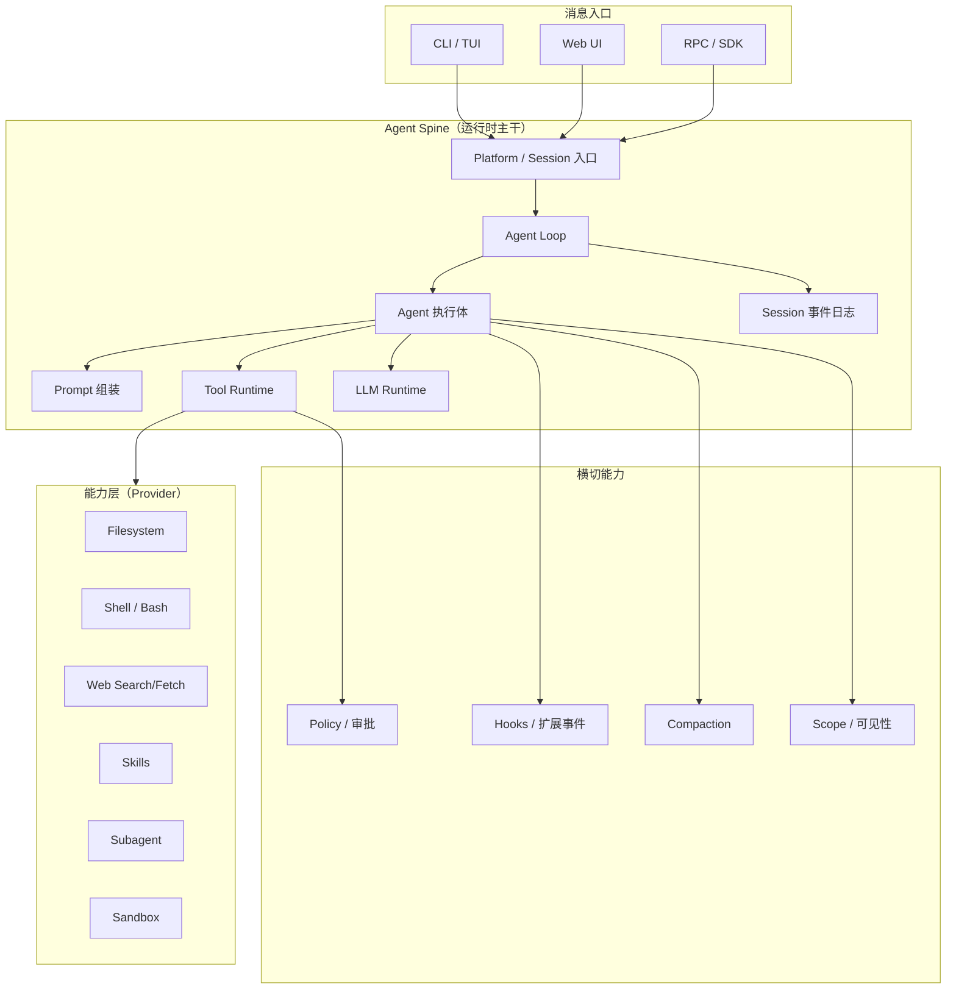
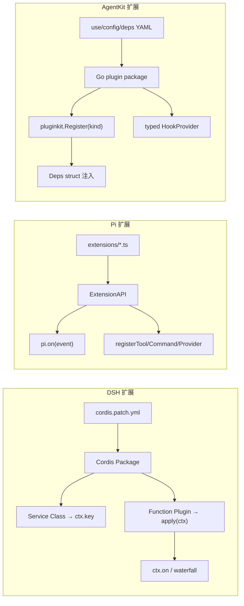
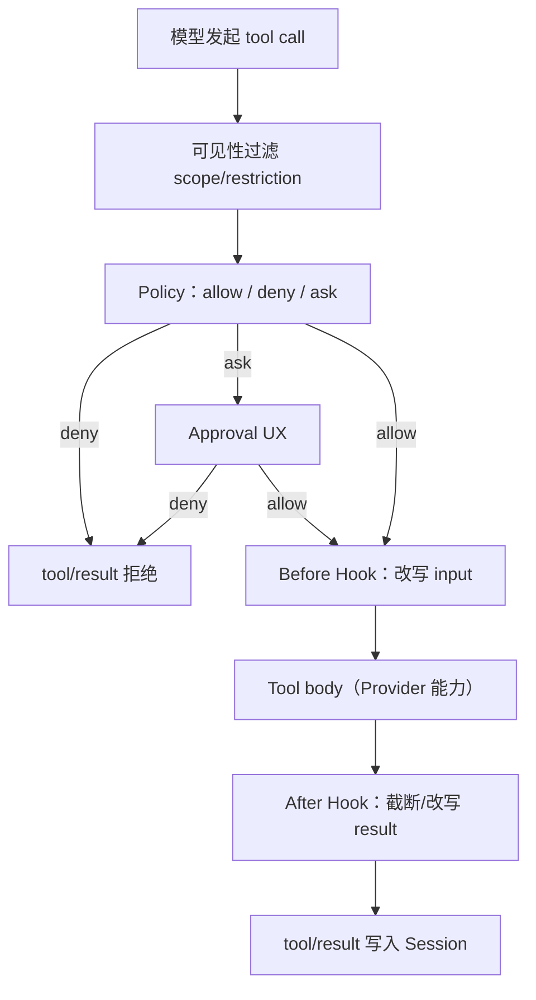

# 参考项目分析：DeepSeek Harness 与 Pi

本文对比 [DeepSeek Harness](https://github.com/deepseek-ai/deepseek-harness)（下称 **DSH**）与 [Pi](https://github.com/badlogic/pi)（下称 **Pi**），提炼 Agent Harness 的通用能力，并映射到 AgentKit 的插件模型。

相关文档：[go-agent-harness-architecture.zh.md](go-agent-harness-architecture.zh.md)、[plugin-catalog.zh.md](plugin-catalog.zh.md)、[roadmap.zh.md](roadmap.zh.md)。

> **本文是"业界做了什么"，不是"我们做到哪"**。AgentKit 的落地状态以 [roadmap.zh.md §0](roadmap.zh.md#0-现状基线2026-08-25) 为准；下面表格里的状态标注核对于 2026-08-25。

## 1. 项目定位对比

| 维度 | DeepSeek Harness (DSH) | Pi | AgentKit |
|---|---|---|---|
| 语言 | TypeScript (Node) | TypeScript (Node) | Go |
| 插件框架 | Cordis（Service + Event） | Extension API（事件 + 注册） | pluginkit（Register + Deps 注入） |
| 核心理念 | 一切皆插件，无特权内核 | 核心极简，能力靠扩展 | Agent 语义上移，装配交给 pluginkit |
| 默认形态 | Web UI + Headless CLI | 终端 TUI + RPC/JSON/SDK | CLI + headless worker / timer + multiplex（HTTP / RPC 未做） |
| 扩展方式 | npm 包 + cordis.yml patch | TS 文件 + jiti 热加载 | Go 包 + import 生成器 |
| 配置分层 | Profile → Bundle → Patch | 全局 settings + 项目 `.pi/` | Preset → Feature → root graph |

两者都是 **Coding Agent Harness**，不是 LLM SDK。模型调用、工具执行、Session 日志、循环调度被明确分层；差异主要在插件机制与产品默认能力集。

## 2. 架构共性

### 2.1 共同设计原则

| 原则 | DSH | Pi | AgentKit 对应 |
|---|---|---|---|
| **Session 即真相源** | `ctx.sessions` 追加式 JSONL/SQLite | JSONL 树形 Session v3 | `session/*` 插件 |
| **Model-visible ⟺ Logged** | 强制不变量 | `context` 事件 + Session 条目 | Session 事件 + `DeriveMessages` |
| **Consumer 依赖接口** | Capability Seam 三角色 | Operations 注入 + Extension | Definition / Provider / Consumer |
| **Policy 单点裁决** | `tools/pre-execute` waterfall | `tool_call` 可 block | Policy Plane + `Decision` |
| **Steering / Follow-up** | `steer()` / `followup()` | `steer()` / `followUp()` 双队列 | `Agent.Steer/FollowUp` + `Loop.Dispatch` 消费 |
| **Turn / Step 生命周期** | turn/start → step → tool → turn/end | turn_start → tool → turn_end | Loop 序列图（§6.5） |
| **作用域隔离** | global / agent scope + shadow | 扩展 `setActiveTools` | global / preset / agent / turn |
| **极简核心 + 生态扩展** | 60+ 子系统包 | 刻意不内置 MCP/子 Agent | Phase 分阶段落地 |

## 3. 运行时组件映射

| 通用组件 | DSH | Pi | AgentKit Plugin Kind |
|---|---|---|---|
| 进程 Root | Cordis Context + Loader | AgentSession | `runner` |
| 消息入口 | Web Host / Headless / ACP | TUI / print / RPC | `platform/*` |
| 循环驱动 | `ctx.agentLoop` | `agentLoop` / AgentHarness | `loop/*` |
| Agent 实体 | `ctx.agents` | `Agent` 类 | `agent/*` |
| Session 存储 | `ctx.sessions` + persistence | SessionManager JSONL | `session/*` |
| Prompt 组装 | `ctx.systemPrompt` | AGENTS.md + Skills + SYSTEM.md | `prompt/section/*` |
| 工具运行时 | `ctx.tools` | 内置 + `registerTool` | Tool Runtime + `tool/*` |
| LLM 适配 | `ctx.llm` | `@earendil-works/pi-ai` | `llm/*` |
| 策略/审批 | `tools/pre-execute` + `ctx.approval` | Extension `tool_call` block | `policy/*` + `approval/*` |
| 扩展钩子 | Cordis events / waterfall | Extension `pi.on()` | `hook/*` |
| 压缩 | `ctx.compaction` | `session_before_compact` | `compaction/*` + hook |
| 人机交互 | `ctx.commands` / `ctx.userQuestions` | `/command` + `ctx.ui` | `command/*` + `approval/*` |

## 4. 能力层（Capability）对比

DSH 用 **Definition / Provider / Consumer** 三角色；Pi 用 **Operations 接口 + 内置 Tool**；AgentKit 统一为 **cap 接口 + Provider 插件 + Tool Consumer 插件**。

### 4.1 核心能力（两者共有或高度重叠）

| 能力 | DSH Provider 示例 | Pi 实现 | 优先级 | AgentKit 状态 |
|---|---|---|---|---|
| **Filesystem** | `dsh-fs-local`, `dsh-fs-sandbox` | `read` / `edit` / `write` 工具 + Operations | P0 | ✅ `fs/local`、`fs/memory`、`fs/readonly` |
| **Shell** | `dsh-bash-local`, `dsh-bash-sandbox` | `bash` 工具 + BashOperations | P0 | ✅ `shell/bash`（无沙箱） |
| **LLM** | `dsh-llm-deepseek`, `dsh-llm-pi-ai` | pi-ai 多 Provider | P0 | ✅ `llm/openai-compatible`、`llm/scripted` |
| **Skills** | `dsh-skill-filesystem` + `dsh-tool-skill` | `SKILL.md` + `/skill:name` | P1 | ✅ `skill/filesystem` + `tool/skill` + `prompt/section/skills` |
| **Compaction** | `dsh-compaction-basic` | `session_before_compact` | P1 | ✅ summary / prune-tool-results / token-limit |
| **Approval** | `dsh-approval`, `dsh-tool-ask-user` | Extension `tool_call` + `ctx.ui.confirm` | P1 | ✅ `approval/cli`、`auto-allow`、`auto-deny`；`tool/ask-user`（Loop HIL + platform，见 [platform-interaction.zh.md](platform-interaction.zh.md)） |
| **Web** | `dsh-web-search-exa`, `dsh-web-fetch-http` | 无内置，靠 Extension | P2 | ✅ `web/http-fetch` + `web/exa-search` + 两个 scripted 替身（[web.zh.md](web.zh.md)） |
| **Subagent** | `dsh-subagent-*` + `dsh-tool-subagent` | 无内置，靠 Extension/Package | P2 | 🟡 `subagent/inprocess` 串行版已落地（[subagent.zh.md](subagent.zh.md)）；并行 fan-out 未做 |
| **Sandbox** | landlock / bwrap / seatbelt | 无内置，Operations 可替换 | P2 | ❌ `cap/sandbox` / `cap/process` 空壳 → [M2](roadmap.zh.md#m2--隔离--守护收尾) |
| **Terminal/PTY** | `dsh-terminal-bash` | 无 | P3 | ❌ |
| **LSP** | `dsh-lsp-stdio` | 无 | P3 | ❌ |
| **Workflow/Jobs** | `dsh-workflow`, `dsh-jobs` | 无 | P3 | 🟡 `schedule/file` + worker cron + `tool/schedule`（日历定时）；无 workflow 编排 |

### 4.2 DSH 独有、Pi 靠扩展实现

| 能力 | DSH | Pi 等价路径 |
|---|---|---|
| Web UI + Slot 系统 | `packages/client/` + `ctx.slots` | 无（纯 TUI） |
| 动态 Cordis 扩展 | `dsh-tool-cordis` | Extension 热加载 `/reload` |
| Plan Mode | `dsh-plan-mode` | Extension 自行实现 |
| Goal / Ralph 循环 | `dsh-goal`, `dsh-tool-ralph` | Extension / Package |
| E2B 远程沙箱 | `dsh-e2b` | Extension Operations |
| ACP / SDK Server | `dsh-acp`, `dsh-sdk-server` | RPC 模式 |
| Session Query/Projection | SQLite 全文检索、投影 | `/tree` + branch_summary |
| Token Meter | `dsh-token-meter` | 无 |

### 4.3 Pi 独有、DSH 有对应或更细

| 能力 | Pi | DSH 等价 |
|---|---|---|
| AgentHarness（多 Lane） | `packages/agent` harness | 多 Agent + `ctx.agents.withInitiator` |
| 消息双层模型 | `AgentMessage` + `convertToLlm()` | Session 事件 → LLM 消息 |
| Provider 快速注册 | `registerProvider()` | LLM adapter 插件 |
| Pi Packages（npm/git） | `pi install npm:...` | npm bundle + cordis patch |
| Project Trust | `.pi/settings.json` + trust.json | Profile + settings |
| Thinking 级别统一 | `off` → `max` + 跨 Provider 转换 | model settings + adapter |
| 文件变更串行队列 | `file-mutation-queue` | tool 层 sequential mode |
| Prompt Templates | `{{变量}}` + `/templatename` | slash commands + context inject |

## 5. 扩展机制对比

| 扩展点 | DSH 机制 | Pi 机制 | AgentKit 映射 |
|---|---|---|---|
| 拦截工具调用 | `tools/pre-execute` waterfall | `tool_call` → `{ block }` | `policy/*`（裁决）+ `hook/before-tool`（改写） |
| 注入上下文 | `agent/pre-step` + Session 事件 | `context` 事件 | `hook/before-step` + `prompt/section/*` |
| 注册工具 | `ctx.tools.register()` | `pi.registerTool()` | `tool/*` 插件 |
| 注册命令 | `ctx.commands.register()` | `pi.registerCommand()` | `command/*` 插件 |
| 替换 LLM | `ctx.llm.registerAdapter()` | `pi.registerProvider()` | `llm/*` 插件 |
| 压缩策略 | `agent/pre-step` + compaction service | `session_before_compact` | `compaction/*` + hook |
| 审批 UX | `ctx.approval` + Web UI | `ctx.ui.confirm()` | `approval/*` 插件 |
| 生命周期 | Cordis Fiber dispose | `/reload` jiti | `StartStop` + Runner 管理 |
| 动态发现 | npm + cordis.yml | 目录扫描 + trust | import 生成器 + Preset |

**关键差异**：DSH 的 waterfall 允许链式 short-circuit；Pi 的 Extension 返回 `{ block, terminate, message }` 可拦截；AgentKit 将 **裁决（Policy）** 与 **观察/改写（Hook）** 严格分离，避免多通道拒绝。

## 6. Session 与上下文模型

| 方面 | DSH | Pi | 通用抽象 |
|---|---|---|---|
| 存储格式 | JSONL / SQLite | JSONL 树 v3 | 追加式事件日志 |
| 分支 | Fork / Resume | `/tree` in-place 导航 | parentId 树 |
| 压缩 | 替换旧消息 + Session 事件 | compaction 条目保留原始 | 摘要条目，不删审计 |
| 模型历史 | `DeriveMessages` from events | `convertToLlm(messages)` | 事件 → LLM 消息投影 |
| 自定义状态 | Session projection | `appendEntry` custom | custom 事件类型 |
| AGENTS.md | `dsh-agent-instructions` | 目录链拼接 | `prompt/section/agents-md` |
| Skills 注入 | skill inject + durable event | `<skill>` 块 | skill provider + prompt section |

**共同不变量**：任何进入模型请求的内容，必须能从 Session 日志重建（含 system prompt section、tool schema、注入上下文）。

## 7. 工具执行管线（共性）

两者工具路径语义一致，AgentKit 已在 [§5.5](go-agent-harness-architecture.zh.md#55-工具执行路径) 形式化：

| 阶段 | DSH 事件 | Pi 事件 | AgentKit |
|---|---|---|---|
| 可见性 | scope + `tools.restrict()` | `setActiveTools` / CLI `--tools` | Tools Runtime scope |
| 策略 | `tools/pre-execute` | `tool_call` block | Policy Plane |
| 审批 | `ctx.approval` | `ctx.ui.confirm` | `approval/*` |
| 执行前 | `tools/pre-execute`（allow 后） | `beforeToolCall` | `OnBeforeTool` |
| 执行 | `tools/execute` | tool `execute()` | Tool body |
| 执行后 | `tools/post-execute` | `afterToolCall` | `OnAfterTool` |
| 持久化 | `tool/*` Session 事件 | message 条目 | Session Append |

## 8. 配置模型对比

| 层级 | DSH | Pi | AgentKit |
|---|---|---|---|
| 默认值 | Schemastery schema | settings.json 字段 | 插件 Config struct tag |
| 产品预设 | Profile + Bundle | 无（靠 settings 默认值） | Preset YAML |
| 能力片段 | Bundle patch 层 | Extension/Package | Feature YAML |
| 用户覆盖 | `$DSH_HOME/cordis.patch.yml` | `.pi/settings.json` | CLI flag + override |
| Agent 级组合 | `agent.cordis.yml` preset | 扩展 + `--tools` | AgentSet + overrides |
| 热重载 | settings 热 reconcile | `/reload` extensions | 进程重启（go run） |

## 9. 提炼的通用能力清单

以下能力在两个参考项目中均被验证为 Harness 必需品或高频扩展点，AgentKit 插件目录以此为主干（详见 [plugin-catalog.zh.md](plugin-catalog.zh.md)）。括注为 AgentKit 落地状态（2026-08-25），排期见 [roadmap.zh.md](roadmap.zh.md)。

### 9.1 Spine（P0 — 无此不可运行）· 全部落地

1. **Runner** — 进程生命周期、Platform ↔ Loop 连接
2. **Platform** — 外部消息 ↔ 内部事件
3. **Loop** — Turn/Step 调度、多 Agent 路由
4. **Agent** — Session + Prompt + LLM + Tools 组合体
5. **Session** — 追加式事件日志、消息投影
6. **Prompt** — Section 组装、tool schema 注入
7. **Tools** — 注册、schema、执行管线
8. **LLM** — 流式 Provider、错误分类

### 9.2 执行能力（P0 — Coding Agent 最小集）· 全部落地

9. **Filesystem** — read / write / edit
10. **Shell** — bash 执行、超时、环境注入
11. **Policy** — 工具/路径/命令裁决
12. **Approval** — ask 决策的人机通道

### 9.3 上下文与记忆（P1 — 长会话必需）· 全部落地

13. **Compaction** — 上下文窗口管理
14. **Skills** — 按需能力包
15. **Agent Instructions** — AGENTS.md / 项目规则注入
16. **Credentials** — API Key / OAuth 解析（✅ `credentials/env`；`credentials/file` 未做）
17. **Settings** — 模型默认、工具开关

### 9.4 协作与编排（P2 — 高级场景）

18. **Subagent** — 任务委派、并行子任务（🟡 串行委派已落地；并行 fan-out 未做）
19. **Web** — search / fetch（✅ `web/http-fetch` + `web/exa-search` + `tool/web-fetch` + `tool/web-search`）
20. **Sandbox** — 进程/文件系统隔离（❌ → [M2](roadmap.zh.md#m2--隔离--守护收尾)）
21. **Commands** — 不经过模型的 Slash 命令（✅ `commands/registry`）
22. **User Questions** — 结构化问答（✅ `tool/ask-user` + Loop HIL / platform-interaction）

### 9.5 平台与观测（P2 — 产品化）

23. **Session Persistence** — JSONL / SQLite 持久化（✅ `session/jsonl`；`session/sqlite` 未做）
24. **Session Query** — 检索、lineage（❌ → [M3](roadmap.zh.md#m3--可运营观测--接入)）
25. **Telemetry** — OTel / 用量统计（❌ `usage` 事件已有但无人汇总 → [M3](roadmap.zh.md#m3--可运营观测--接入)）
26. **Host Adapters** — HTTP / RPC / ACP（❌ 只有 CLI / worker / timer / multiplex → [M3](roadmap.zh.md#m3--可运营观测--接入)）

### 9.6 专项能力（P3 — 按需）· 全部未做

27. Terminal/PTY、LSP、Workflow、Jobs、Code Runtime、Plan Mode、Goal、Attachment、Web UI Slots（`schedule/file` + worker cron 覆盖了 Jobs 的定时那一半）

## 10. 对 AgentKit 的设计启示

1. **不要重复造 Cordis**：pluginkit 已覆盖 Register + Deps + Build；AgentKit 专注 Agent 语义与 typed hook。
2. **Policy 与 Hook 分离**：借鉴 DSH waterfall 的单决策点，但拒绝 Pi 式「Extension 既可 block 又可改结果」的模糊边界。
3. **Phase 1 对齐 Pi 最小集**：read / bash / edit / write + openai-compatible LLM + JSONL session + CLI platform。
4. **Phase 2 对齐 DSH 能力缝**：filesystem/shell Provider 可替换、approval、compaction、skills。
5. **Extension 生态用 Go 插件 + Preset 替代 jiti**：Go 无运行时 TS 加载；用 import 生成器 + Feature 组合达到类似体验。
6. **保留 Pi 的消息投影模式**：Session 事件与 LLM 消息分离，便于 UI 富类型与跨 Provider 切换。
7. **Steering/Follow-up 一等公民**：两者均证明运行中纠偏是 Harness 核心 UX，需在 Agent 接口层暴露。

## 11. 文档索引

| 文档 | 内容 |
|---|---|
| [roadmap.zh.md](roadmap.zh.md) | 现状基线与 M0–M4 目标（本文的状态标注以它为准） |
| [go-agent-harness-architecture.zh.md](go-agent-harness-architecture.zh.md) | AgentKit 完整架构 |
| [plugin-catalog.zh.md](plugin-catalog.zh.md) | 插件 Kind 目录与 MVP 范围 |
| [plugin-interface-comparison.zh.md](plugin-interface-comparison.zh.md) | `plugin_*.go` 与 DSH 的接口级逐文件对比 |
| [autonomous-run.zh.md](autonomous-run.zh.md) | 自主运行：预算分层、turn 续跑、崩溃恢复 |
| [subagent.zh.md](subagent.zh.md) | 子 Agent 委派（串行版） |
| [web.zh.md](web.zh.md) | 网络抓取 / 搜索 / 向用户提问，含 SSRF 边界与无 key 降级 |
| DSH `docs/architecture.md` | Cordis 微内核 + Agent Spine |
| DSH `docs/capability-seams.md` | 能力缝服务图 |
| Pi `packages/coding-agent/docs/extensions.md` | Extension 事件模型 |
| Pi `packages/agent/docs/harness.md` | AgentHarness 多 Lane 设计 |
