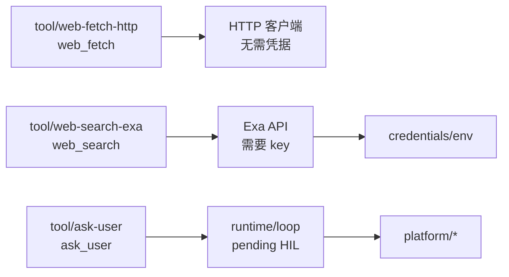

# 网络能力与向用户提问

本文描述 AgentKit 的三个网络/交互工具：`web_fetch`、`web_search`、`ask_user`。

相关文档：[roadmap.zh.md M1](roadmap.zh.md#m1--网络能力已落地)、[plugin-catalog.zh.md](plugin-catalog.zh.md)。

## 1. 具体 tool 插件，不再两段接线

抓取与搜索各自是一个完整的 tool 插件，配置直接写在插件上：

| 插件 kind | 模型工具名 | 凭据 |
|---|---|---|
| `tool/web-fetch-http` | `web_fetch` | 不需要 |
| `tool/web-search-exa` | `web_search` | `EXA_API_KEY` / `apiKeyRef` |
| `tool/web-fetch-scripted` | `web_fetch` | 测试替身 |
| `tool/web-search-scripted` | `web_search` | 测试替身 |

没有 EXA key 时实例图照常构建；搜索在调用时返回模型可读的错误，抓取不受影响。



## 2. 抓取：`tool/web-fetch-http`

| config | 默认 | 说明 |
|---|---|---|
| `timeoutSeconds` | 30 | 单次请求墙钟 |
| `maxBytes` | 1 MiB | 正文读取上限 |
| `maxRedirects` | 5 | 重定向链上限 |
| `allowPrivateHosts` | false | 允许 loopback / 私网 / link-local |
| `allowHosts` / `denyHosts` | 空 | 主机白名单 / 黑名单 |

HTML 走内置扫描器转成文本；非文本响应返回占位说明。私网地址在 **dial 时**按解析后的 IP 拦截，覆盖重定向与 DNS rebinding。

## 3. 搜索：`tool/web-search-exa`

key 解析：`config.apiKey` → `config.apiKeyRef`（经 `deps.credentials`）→ `EXA_API_KEY`。

缺 key 时构造期只 `slog.Warn`，调用时返回：

```
tool/web-search-exa has no API key: set EXA_API_KEY, or config.apiKeyRef with a credentials dep
```

请求走 `POST /search`，header 是 `x-api-key`。默认只要 `highlights`，`includeText: true` 才附全文。

## 4. 提问：`ask_user` 与 Human-in-the-loop

`tool/ask-user` 走 Loop 的 HIL 控制流。platform 不支持交互时返回 `answered:false` + guidance，不阻塞 turn。

**不要挂在子 agent 上**——它跑在 `delegate` 背后，提问没人看见。

## 5. 配置示例

```yaml
tool.web-fetch-http.default:
  use: tool/web-fetch-http
  config:
    timeoutSeconds: 30
    maxBytes: 1048576
    allowPrivateHosts: false

tool.web-search-exa.default:
  use: tool/web-search-exa
  config:
    apiKeyRef: env:EXA_API_KEY
    maxResults: 5
  deps:
    credentials: credentials.default

tools.default:
  use: tools/runtime
  deps:
    tools:
      - tool.fs-workspace.default
      - tool.web-fetch-http.default
      - tool.web-search-exa.default
      - tool.ask-user.default
```

冒烟时把 `tool/web-search-exa` 和 `tool/web-fetch-http` 换成 `tool/web-search-scripted` / `tool/web-fetch-scripted` 即可，见 `presets/web-smoke.yaml`。
