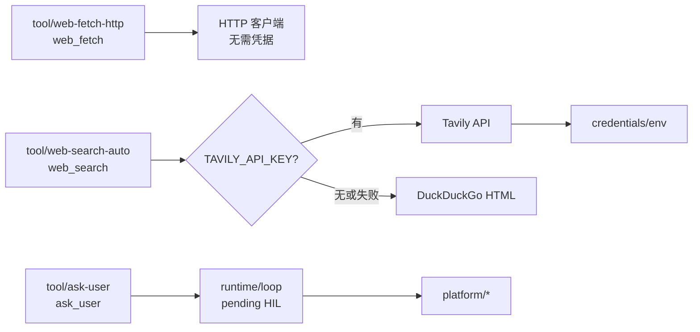

# 网络能力与向用户提问

本文描述 AgentKit 的三个网络/交互工具：`web_fetch`、`web_search`、`ask_user`。

相关文档：[roadmap.zh.md M1](roadmap.zh.md#m1--网络能力已落地)、[plugin-catalog.zh.md](plugin-catalog.zh.md)。

## 1. 具体 tool 插件，不再两段接线

抓取与搜索各自是一个完整的 tool 插件，配置直接写在插件上：

| 插件 kind | 模型工具名 | 凭据 |
|---|---|---|
| `tool/web-fetch-http` | `web_fetch` | 不需要 |
| `tool/web-search-auto` | `web_search` | L0 默认；有 `TAVILY_API_KEY` 走 Tavily，否则 DuckDuckGo |
| `tool/web-search-tavily` | `web_search` | `TAVILY_API_KEY` / `apiKeyRef` |
| `tool/web-search-duckduckgo` | `web_search` | 不需要 |
| `tool/web-search-exa` | `web_search` | `EXA_API_KEY` / `apiKeyRef`（可选替代） |
| `tool/web-fetch-scripted` | `web_fetch` | 测试替身 |
| `tool/web-search-scripted` | `web_search` | 测试替身 |

缺 Tavily key 时实例图照常构建；`tool/web-search-auto` 会自动 fallback 到 DuckDuckGo。



## 2. 抓取：`tool/web-fetch-http`

| config | 默认 | 说明 |
|---|---|---|
| `timeoutSeconds` | 30 | 单次请求墙钟 |
| `maxBytes` | 1 MiB | 正文读取上限 |
| `maxRedirects` | 5 | 重定向链上限 |
| `allowPrivateHosts` | false | 允许 loopback / 私网 / link-local |
| `allowHosts` / `denyHosts` | 空 | 主机白名单 / 黑名单 |

HTML 走内置扫描器转成文本；非文本响应返回占位说明。私网地址在 **dial 时**按解析后的 IP 拦截，覆盖重定向与 DNS rebinding。

## 3. 搜索：`tool/web-search-auto`

L0 默认搜索插件。有 `TAVILY_API_KEY` 时优先走 Tavily（每月 1000 次免费额度）；缺 key 或 Tavily 调用失败时自动 fallback 到 DuckDuckGo HTML 抓取（无需 key，但可能被限流）。

也可单独挂载 `tool/web-search-tavily` 或 `tool/web-search-duckduckgo`。

Tavily key 解析：`config.tavily.apiKey` → `config.tavily.apiKeyRef`（经 `deps.credentials`）→ `TAVILY_API_KEY`。

## 4. 提问：`ask_user` 与 Human-in-the-loop

`tool/ask-user` 与 policy `DecisionAsk` 统一走 **Permission 协议**（`cap/permission` + Loop `PermissionBroker`），见 [platform-interaction.zh.md](platform-interaction.zh.md)。Platform 经 `Receive` 回传 `MessageEvent.Reply`；`platform/headless` 等非交互 platform 返回 `answered:false` + guidance，不阻塞 turn。

**不要挂在子 agent 上**——它跑在 `delegate` 背后，提问没人看见。

## 5. 配置示例

```yaml
tool.web-fetch-http.default:
  use: tool/web-fetch-http
  config:
    timeoutSeconds: 30
    maxBytes: 1048576
    allowPrivateHosts: false

tool.web-search.default:
  use: tool/web-search-auto
  config:
    maxResults: 5
    tavily:
      apiKeyRef: env:TAVILY_API_KEY
      searchDepth: basic
    duckduckgo: {}
  deps:
    credentials: credentials.default

tools.default:
  use: tools/runtime
  deps:
    tools:
      - tool.fs-workspace.default
      - tool.web-fetch-http.default
      - tool.web-search.default
      - tool.ask-user.default
```

冒烟时把 `tool/web-search.default` 和 `tool/web-fetch-http` 换成 `tool/web-search-scripted` / `tool/web-fetch-scripted` 即可，见 `presets/web-smoke.yaml`。
