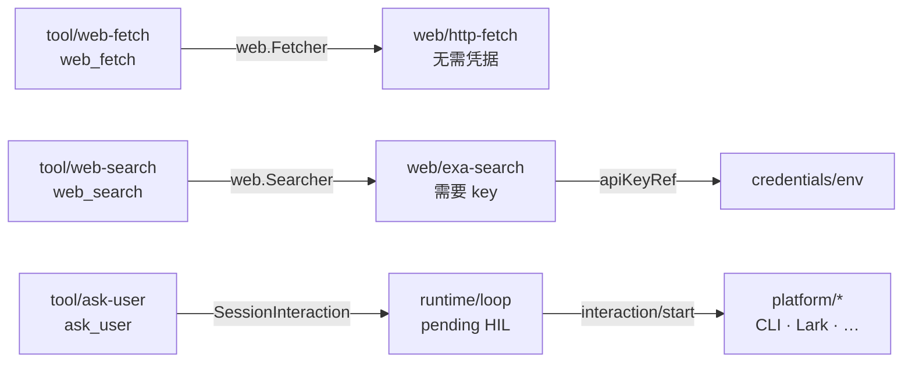

# 网络能力与向用户提问

本文描述 AgentKit 的三个网络/交互工具：`web_fetch`、`web_search`、`ask_user`——它们各自依赖哪个 cap、私网地址怎么挡、没有 API Key 或没有人可问的时候会发生什么。

相关文档：[roadmap.zh.md M1](roadmap.zh.md#m1--网络能力已落地)、[plugin-catalog.zh.md](plugin-catalog.zh.md)。

## 1. 为什么抓取和搜索是两个接口

`cap/web` 没有一个大而全的 `Service`，而是两个独立接口：

```go
type Fetcher interface { Fetch(context.Context, FetchRequest) (FetchResult, error) }
type Searcher interface { Search(context.Context, SearchRequest) (SearchResult, error) }
```

pluginkit 是**按 Go 接口类型**匹配 deps 的。合成一个接口，等于要求任何提供抓取的插件同时提供搜索——而抓取不需要任何凭据，搜索需要一个第三方 key。拆开之后，"没有 EXA_API_KEY 但 `web_fetch` 照样能用"不是靠代码里的 if，而是实例图本身的形状。



## 2. 抓取：`web/http-fetch`

| config | 默认 | 说明 |
|---|---|---|
| `timeoutSeconds` | 30 | 单次请求墙钟 |
| `maxBytes` | 1 MiB | 正文读取上限；工具入参里的 `maxBytes` 只能往小调，不能放大 |
| `maxRedirects` | 5 | 重定向链上限，每一跳都重新过一遍校验 |
| `userAgent` | Go 默认 | 覆盖出站 UA |
| `allowPrivateHosts` | false | 允许 loopback / 私网 / link-local |
| `allowHosts` | 空 | 非空时只许这些主机（含子域） |
| `denyHosts` | 空 | 黑名单，在 `allowHosts` 之后生效 |

返回 `{url, status, contentType, title, content, bytes, truncated}`。HTML 走一个不依赖第三方库的扫描器转成文本：`script` / `style` / `noscript` / `svg` / `head` / `template` / `iframe` 整块丢掉，块级标签之间给一个换行（开闭标签成对只算一次，否则一个列表的 token 成本会翻倍），实体解码含数字实体。非文本响应不会把字节倒给模型，而是返回一行 `[non-text content: <type>, <n> bytes read]`。

### 2.1 私网地址在 dial 时挡，不在 URL 上挡

```go
dialer.Control = func(_, address string, _ syscall.RawConn) error { /* 校验解析后的 IP */ }
```

`Control` 在 **DNS 解析之后、每次连接尝试时**跑一遍。放在这里而不是校验 hostname，是因为两种绕过只有在这一层才挡得住：

- **重定向**：`https://ok.example.com/r` 302 到 `http://169.254.169.254/latest/meta-data/`；
- **DNS rebinding**：一个公网域名把 A 记录指向 `127.0.0.1` 或 `10.0.0.5`。

覆盖的范围除了常见的 loopback / 私网 / link-local / multicast / unspecified，还有几个容易漏的：CGNAT `100.64/10`、`192.0.0.0/24`、benchmark `198.18/15`、保留的 `240/4`、IPv6 ULA `fc00::/7`。scheme 只允许 `http` / `https`。

这套约束现在长在 provider 里。将来做 `policy/network-deny`（[roadmap M2](roadmap.zh.md#m2--隔离--守护收尾)）时，它才会变成 OS 层 + policy 层的裁决；在那之前，**别为了抓内网服务顺手打开 `allowPrivateHosts`**——那等于把云元数据端点交给模型。

## 3. 搜索：`web/exa-search`

key 的解析顺序与 `llm/openai-compatible` 同构：`config.apiKey` → `config.apiKeyRef`（经 `deps.credentials`）→ `EXA_API_KEY`。

但有一处**故意的不同**：LLM provider 在 key 拿不到时构造期硬失败，搜索只 `slog.Warn`，实例图照常建起来，等真的被调用时返回一句模型可读的

```
web/exa-search has no API key: set EXA_API_KEY, or config.apiKeyRef with a credentials dep
```

理由很简单：LLM 没有 key 这个 agent 根本跑不了，而搜索是可选能力——一个 preset 不该因为少一个可选凭据就起不来。

请求走 `POST /search`，header 是 `x-api-key`（不是 Bearer）。默认只要 `highlights`（与查询相关的片段）而不要整页 `text`，`includeText: true` 才附全文——highlights 便宜得多，要全文应该让模型改调 `web_fetch`。snippet 由 highlights 拼接、退回 `text`，再按 `snippetChars`（默认 800）截断，截断时会退到 UTF-8 字符边界。

`web/scripted-search` 与 `web/scripted-fetch` 是它们的无网络替身，给测试和冒烟 preset 用，用法同 `llm/scripted`。

## 4. 提问：`ask_user` 与 Human-in-the-loop

`tool/ask-user` 走 **Loop 的 HIL 控制流**，不再依赖独立的 `ask/*` 插件。语义上与 approval 相反：

| | approval | HIL interaction |
|---|---|---|
| 回答的问题 | "这个工具调用允许吗" | "这个开放问题你怎么选" |
| 返回 | bool | 文本 / 选项下标 |
| 无人值守时的正确接法 | `approval/auto-allow`（放行） | platform 不支持交互 → `answered:false` |

复用 approval 实例会在无人值守场景直接出事：`presets/autonomous.yaml` 挂的是 `approval/auto-allow`，那 agent 问的每一个问题都会被默默答成"是"。

### 4.1 平台路由（默认）

提问由**入站消息所在的 platform** 决定（见 [platform-interaction.zh.md](platform-interaction.zh.md)）：

| 入口 | 提问方式 |
|---|---|
| `platform/cli` | `interaction/start` 渲染到 stderr，stdin 同步作答 |
| `platform/feishu`（待实现） | 发 Lark 卡片，inbound 经 `TryDeliverInteraction` 回传 |
| headless / cron | 无 `InteractionHandler` → 立即 `answered:false` |

Loop 在 turn context 注入 `SessionInteraction`；CLI platform 另实现 `InteractionHandler` 读 stdin。

### 4.2 没人可答不是错误

**不能因为"没有人可问"就返回 error**，那是 `Answered: false` 加一句 `Reason`。工具结果因此长这样：

```json
{"answered":false,"selected":-1,"reason":"no interactive user on this platform",
 "guidance":"Nobody answered. Do not ask again: pick the most reasonable option yourself, state the assumption you made, and continue."}
```

`guidance` 放在**结果里**而不是工具 description 里——模型在真正被拒的那一刻读到它，比在几千 token 之前的工具清单里读到有效得多。

`presets/autonomous.yaml` 与 headless platform 配对时，提问会正确降级——它和把 `approval/cli` 换成 `approval/auto-allow` 是同一个决定的两个方向。

### 4.3 超时要单独放宽

人思考几分钟很正常，默认 120s 的工具超时会把提问砍掉：

```yaml
tools.default:
  config:
    toolTimeouts:
      ask_user: 900
```

## 5. 跑起来

```sh
# 完整能力（搜索需要 key，抓取不需要）
export EXA_API_KEY=...
go run ./cmd/agent -config presets/web.yaml "查一下 xxx 的官方说法，给我结论并附来源"

# 不花任何 key 的冒烟：scripted LLM + scripted web，走完 搜索 → 抓取 → 提问降级 → 引用来源作答
go run ./cmd/agent -config presets/web.yaml,presets/web-smoke.yaml "loop 怎么保证同一 session 串行？"
```

冒烟跑完可以对着 session 文件核对四件事：`web_search` 的结果里有 snippet 与 url；`web_fetch` 的 `content` 里 `<script>` 已经消失、`title` 已提取；`ask_user` 的结果是 `answered:false` 且 **turn 没有因此中断**；最后一条 assistant 文本带着来源 URL。

`presets/web.yaml` 也给子 agent 挂了 `web_fetch` + `web_search`（调研类子 agent 的价值正是烧掉十几轮检索只回一段结论），但**不给它 `ask_user`**——子 agent 跑在 `delegate` 调用背后，它的提问没人看得见。

## 6. 本期不做

- `policy/network-deny`：网络裁决目前长在 provider 的配置里，还没有独立的 policy 插件（[M2](roadmap.zh.md#m2--隔离--守护收尾)）。
- 除 Exa 之外的搜索 provider（Brave / Tavily / SearXNG 等）；接口已经是 `web.Searcher`，加一个 kind 即可。
- 抓取结果的缓存与去重、robots.txt、PDF / 图片解析。
- 富交互提问（多选、表单）：`HumanInteraction` 已预留 `Kind` / `Multiple`，CLI 当前只实现单选 + 自由文本。
