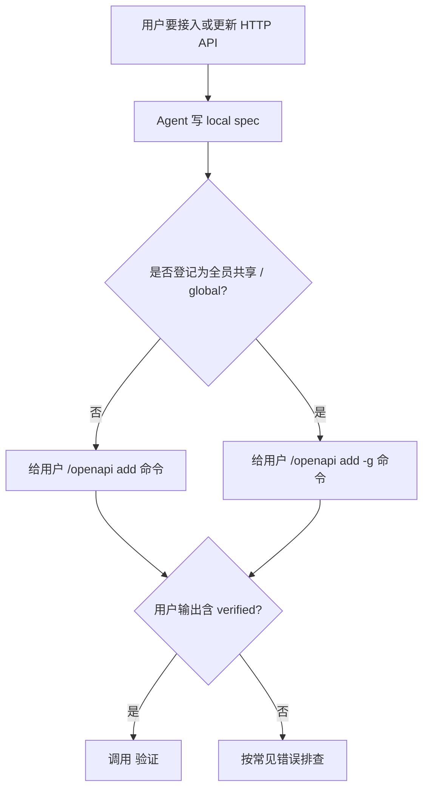
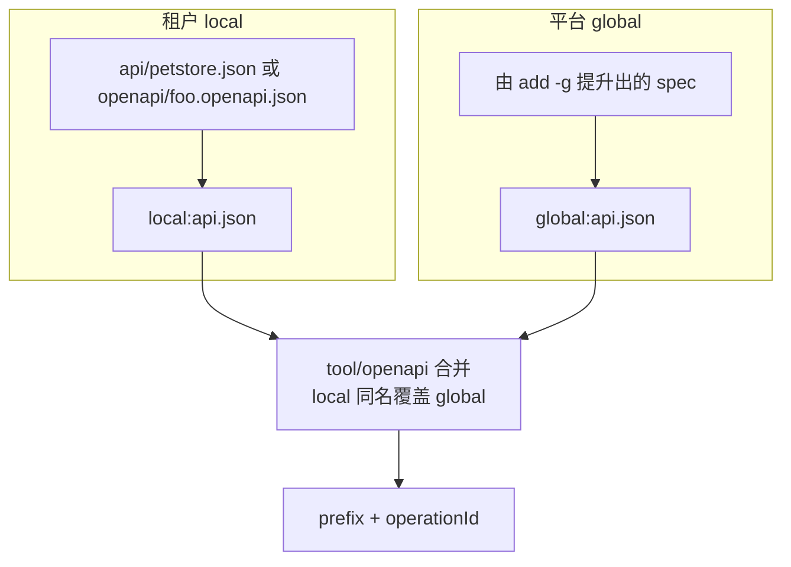

# OpenAPI 维护指南

## 核心原则

- **统一流程**：所有新接入都先落 local spec；配置细节留到排障阶段。
- **Agent 写文件，用户跑 slash**：Agent 生成/编辑 spec 或索引 JSON，并把 `/openapi` 命令交给用户执行。
- **spec 独立，索引只写 wiring**：OpenAPI 全文放独立文件；`api.json` 只放 `path`、`prefix`、`auth`、`bind`、`allowOperations` 等 wiring。
- **登记目标由 `-g` 决定**：默认形式写当前租户；`-g` 形式由 `/openapi add -g` 把 local spec 提升登记到 global。
- **敏感值走引用**：token/password 用 `env:VAR`；用户身份、租户等上下文参数用 `bind`。

## 何时使用

- 用户提供 OpenAPI 文件、HTTP 接口文档，或说“把这个 API 接进来”。
- 需要把 REST API 暴露成 AgentKit 动态工具，按 `<prefix><operationId>` 调用。
- 需要更新已有 spec / `api.json` 后刷新动态工具。
- 需要排查 `/openapi add`、`/openapi -u`、动态工具缺失、auth/bind/baseUrl 问题。

## 决策流程



## 统一接入流程

适用于当前租户和 global 接入；差别只在最后给用户默认形式还是 `-g` 形式。

1. **Agent 落盘 local spec**

   将 OpenAPI 3 写到 local workspace 内，常用路径：

   - `api/<apiName>.json`（仓库测试夹具惯例）
   - `openapi/<apiName>.openapi.json`（部分部署约定）

   spec 内保留 `servers`、`paths`、`operationId`。`auth`、`bind`、`baseUrl` 等 wiring 写在索引命令里。

2. **让用户登记索引**

   给用户一条可复制命令；JSON 只写 wiring + `path`：

   ```text
   /openapi add petstore {"path":"local:api/petstore.json","prefix":"pet__","auth":{"type":"bearer","token":"env:PETSTORE_TOKEN"},"allowOperations":["getPet"]}
   ```

   若要登记为 global，只改命令形式，`path` 仍指向 local spec：

   ```text
   /openapi add -g petstore {"path":"local:api/petstore.json","prefix":"pet__","auth":{"type":"bearer","token":"env:PETSTORE_TOKEN"},"allowOperations":["getPet"]}
   ```

   - 默认形式：写当前租户 `local:api.json`。
   - `-g` 形式：运行时复制主 local spec 到 global 相同相对路径，并把索引条目改写为 global 路径。
   - `path` 用运行时可解析的 local 路径，常用 `local:api/...` 或 `local:openapi/...`。
   - 成功输出含 `verified` 时，已完成校验并重载。

3. **处理凭据**

   索引里的 `env:VAR` 需要用户配置 credentials / 环境。改 credentials 插件配置通常需要重启；若部署提供 `/env add VAR=value`，可让用户按部署能力设置。

4. **验证工具**

   用户确认 `add` 成功后，调用 `<prefix><operationId>`，例如 `pet__getPet`。

## 登记模式

| 用户意图 | Agent 写 spec | 给用户的命令 | 结果 |
|---|---|---|---|
| 当前会话/当前租户私有 | `local:api/<name>.json` 或 `local:openapi/<name>.openapi.json` | `/openapi add <name> <json>` | 写入 `local:api.json` |
| 全员共享 / bootstrap / 运维 global | 同上，仍是 local spec | `/openapi add -g <name> <json>` | 复制主 spec 到 global，并写入 `global:api.json` |

`add -g` 只提升主 spec 文件；同级 `$ref` 依赖需要同步到 global 可解析位置。

## 更新已有 API

- 更新也优先改 local spec；需要 global 生效时，让用户重新执行 `/openapi add -g <name> <json>`。
- 手动改已加载的 spec 或 `api.json`：改完后请用户执行 `/openapi -u`。
- 用 `/openapi add` 成功且输出含 `verified`：已校验并重载，可直接进入工具验证。
- 改 `openapi.default`、`workspace`、credentials 插件配置：需要重启。

## 文件模型

OpenAPI 使用两层 workspace；Agent 新接入一律从 local spec 开始。运行时按配置合并索引，local 同名 API 覆盖 global。

| 层 | 典型路径 | 谁维护 | 用途 |
|---|---|---|---|
| **租户** | `local:api.json` + `local:api/<name>.json`（或 `local:openapi/*.openapi.json`） | 会话内 Agent + 用户 `/openapi add` | 本租户/频道私有 API |
| **平台** | `global:api.json` + `global:api/*.json` | `/openapi add -g` 提升、运维 bootstrap / assets | 全员共享 |



## 索引 wiring 示例

```json
{
  "apis": {
    "petstore": {
      "path": "local:api/petstore.json",
      "baseUrl": "https://petstore.example.com",
      "prefix": "petstore__",
      "auth": { "type": "bearer", "token": "env:PETSTORE_TOKEN" },
      "bind": {
        "uid": { "from": "ctx:user_id", "in": "header", "name": "X-User-Id" }
      },
      "allowOperations": ["getPet"],
      "denyOperations": ["deletePet"],
      "timeoutSeconds": 30
    }
  }
}
```

新接入时命令里的 `path` 使用 local 路径，常用 `local:api/...` 或 `local:openapi/...`。`add -g` 成功后，运行时会在 global 索引中改写为 global 路径。

## api.json 字段摘要

| 字段 | 说明 |
|---|---|
| `path` | 指向 OpenAPI 文档（推荐） |
| `specFile` | `path` 的遗留别名 |
| `paths` | 遗留内联 paths；主流程使用 `path` |
| `baseUrl` | API 根；优先于 spec 的 `servers`；基址放 spec `servers` 或明文 |
| `prefix` | 工具名前缀，默认 `<name>__` |
| `headers` | 每次请求附带的静态 header |
| `auth` | `bearer` / `header` / `query` / `basic`；敏感值用 `env:NAME` |
| `allowOperations` / `denyOperations` | 按 `operationId` 白/黑名单 |
| `timeoutSeconds` | 单次请求超时，默认 30 |
| `bind` | 从 context 注入参数，并从模型 schema 隐藏 |

## bind 约定

- `from` 须带 `ctx:` 前缀，如 `ctx:user_id`、`ctx:metadata.org_id`。
- `in`：`path` / `query` / `header`；`name` 为 HTTP 字段名，省略时用 bind key。
- bind key 与 OpenAPI 参数名对应；ctx 值为空时请求会被拦截。
- 与 chat 平台的 `metadataHeaders` 对齐时，`from` 与配置须逐字一致。

## 动态工具命名

**`<prefix><operationId>`**（如 `petstore__getPet`）。输入 schema 由 parameters + `body`（requestBody JSON）组成。OpenAPI 的 `$ref` / `components` 由 kin-openapi 解析。

## Slash 命令

| 命令 | 作用 |
|---|---|
| `/openapi` | 已加载 API 与帮助 |
| `/openapi -u` | 重读索引与 spec，刷新动态工具；缺 `env:` 时输出 warning 并提示 `/env add KEY=<value>` |
| `/openapi add [-g] <name> <json>` | 追加条目；默认形式写 local，`-g` 形式从 local spec 提升到 global（校验、写盘、失败回滚） |

Agent 给出命令让用户执行；用户确认 `verified` 后，再说明工具已刷新。

## 常见错误

| 现象 | 原因 |
|---|---|
| `/openapi -u` → 0 APIs | 当前运行时只加载 global；使用 `/openapi add -g` 登记到 global，或启用 local 后重启 |
| `unsupported protocol scheme "env"` | 基址放 spec `servers` 或明文 `baseUrl`；secret 继续用 `env:VAR` |
| `add` 找不到 `path` | 先把 spec 写到命令里 `path` 指向的位置，再执行 `add` |
| global 侧 `$ref` 失败 | `add -g` 只复制主文件；依赖文件同步到 global 可解析位置 |
| 工具刷新状态存疑 | 以用户确认 `/openapi -u` 成功或 `add` 输出 `verified` 为准 |
| reload 后 warning: missing credentials | 按输出中的 `hint: /env add KEY=<value>` 配置凭据（或 export 环境变量），再 `/openapi -u` |
| 文件或对话出现 secret | 改成 `env:VAR`，由用户通过 credentials / 环境配置值 |

## 配置与文档参考

- 常规接入直接按统一流程添加。
- 只有排障、修改运行时配置、确认 `enableLocal` 行为时，参考 `docs/guides/tools.zh.md` 的 **tool/openapi** 章节。
- `openapi.default` / `workspace` / credentials 配置变更后需要重启；spec / `api.json` 变更后用 `/openapi -u` 或 `/openapi add`。

## 与 agent-harness 的差异（可选）

仓库内 `.agentkit/SKILL.md`（`harness-openapi-manager`）描述 harness 部署：默认目录名 `openapi/*.openapi.json`、与 chat-api 上传路径等。机制与本文相同，路径命名可按部署约定调整。
