# AgentKit TODO

基于代码、`docs/` 设计文档，以及与 [Pi](../../pi) 的功能对比整理。

**优先级**：P0 核心契约（已完成）→ P1 对齐 Pi 最小可用 → P2 长会话与集成 → P3 产品化 → P4 工程与清理

**对照基准**：[docs/reference-analysis.zh.md](docs/reference-analysis.zh.md) · [docs/plugin-catalog.zh.md](docs/plugin-catalog.zh.md)

---

## 状态总览

| 维度 | AgentKit 现状 | Pi 参考 |
|---|---|---|
| Spine（Runner/Loop/Agent/Session/Tools/LLM） | ✅ MVP 可运行 | ✅ |
| 核心工具 read/write/edit/bash/skill | ✅ | ✅ + grep/find/ls |
| Compaction + Skills + AGENTS.md | ✅ | ✅ |
| Tool 执行管线（Policy/Approval/Hook/超时） | ✅ | ✅ |
| Steering 队列 | ✅ steer + followUp 双队列 | ✅ |
| Follow-up 队列 | ❌ 接口有，未调度 | ✅ |
| Slash 命令 | ❌ 仅 /help /quit | ✅ 20+ 内置 |
| Session 树 / fork | ❌ 线性 JSONL | ✅ JSONL v3 树 |
| 多 Provider / 运行时换模型 | ❌ 仅 openai-compatible | ✅ 30+ Provider |
| TUI / RPC / SDK | ❌ 简易 REPL | ✅ 四模式 |
| 运行时扩展 | ❌ Go 编译期插件 | ✅ TS Extension `/reload` |
| pluginkit Manager + multiplex | ✅ Pi 无 | — |

---

## 已完成（Phase 1 + P0 核心契约）

<details>
<summary>展开查看已完成项</summary>

### 工具执行管道

```
可见性 → Policy → Approval → OnBeforeTool → 超时/取消 → body → OnAfterTool → Session
```

- [x] `HookRuntime` 注入 `tools.Runtime`
- [x] `OnBeforeTool` / `OnAfterTool` hook 调用
- [x] `DefaultTimeoutSeconds` 与 per-tool timeout
- [x] `OnAfterTool` 执行后截断大结果（prune 在 derive 阶段）

### Session 生命周期事件

- [x] `turn/start`、`turn/end`、`step/start`、`step/end`
- [x] 与 `user/message`、`assistant/message`、`tool/call`、`tool/result` 顺序一致

### 凭据与配置安全

- [x] LLM 经 `credentials.Store` 解析 `apiKeyRef`
- [x] `presets/coding.yaml` + `config.example.yaml`，`config.yaml` 在 `.gitignore`

### FS 边界

- [x] `fs/readonly` 包装 + `presets/coding.yaml` 统一 workspace 策略（见 `docs/coding-workspace.zh.md`）

### 配置与装配

- [x] `manager.FromYAML` + `Document.ToGraph()` + `build.Build`
- [x] `cmd/agent -manager` 工作台（装配树 / 试装配 / 写回）
- [x] `go generate` → `plugins/all.go` 自动 import

### Platform 拆分

- [x] `platform/cli`、`platform/multiplex`
- [x] `session/store`（多 SessionID 目录，IM 场景）

### Phase 2 部分提前落地

- [x] `compaction/summary` + `compaction/prune-tool-results` + `hook/before-step`
- [x] `skill/filesystem` + `tool/skill` + `prompt/section/skills`
- [x] `settings/file` 插件（未接入主流程）

</details>

---

## P1 — 对齐 Pi 最小可用

> 目标：不追求 TUI，但 Coding Agent 日常可用，工具集与队列语义与 Pi 默认集对齐。

### 1.1 补全内置工具（Pi 默认 7 工具差 3 个）

- [x] `tool/grep` — 内容搜索
- [x] `tool/find` — 文件查找
- [x] `tool/list-dir` — 目录列表（Pi `ls`）
- [x] 更新 `presets/coding.yaml` 默认启用上述工具

### 1.2 Steering / Follow-up 双队列

Pi 核心 UX：`steer()` 中断当前 turn、`followUp()` turn 结束后排队。

- [x] `RunTurn` turn 结束后消费 `followUps` 并继续调度（对齐 Pi `followUpMode`）
- [x] Loop / Platform 暴露 steer / followUp 入口（为 RPC 预留）
- [x] 支持 `all` / `one-at-a-time` 模式（可先硬编码默认）

### 1.3 Slash 命令（`command/*` 插件层）

Pi 高频命令优先；无 TUI 时走 stderr 文本交互。

- [ ] `command/registry` — 注册与分发框架
- [ ] `/compact` — 手动触发 compaction（`command/compact`）
- [ ] `/new` — 新 Session
- [ ] `/session` — 显示 session id、路径、消息数
- [ ] `platform/cli` 接入 command registry（替代硬编码 switch）
  - 注：`Command` / `CommandRegistry` 空接口已删除，落地时连同实现一起定义

### 1.4 Agent 执行增强

- [ ] 并行 tool 执行（Pi 默认 `parallel`：preflight 串行，body 并发）
- [ ] `shouldStopAfterTurn` / `OnTurnStopping` hook
  - 注：`TurnStoppingHook` / `TurnState` / `StopDecision` 空接口已删除，落地时一并定义
- [ ] 文件变更串行队列（避免并发 write/edit 竞态，参考 Pi `file-mutation-queue`）

### 1.5 模型与 Provider

- [ ] 第二 LLM Provider（`llm/anthropic` 或保持 openai-compatible 多 baseUrl）
- [ ] 运行时切换 model（`/model` 命令或 settings 热更新，不必一次上 30 Provider）
- [ ] Thinking level 配置与流式事件打通（类型已有 `thinking_*`，需 LLM 层接入）

---

## P2 — 长会话与集成

> 目标：长会话可管理、可嵌入、可过滤工具，对齐 Pi Phase 2 能力。

### 2.1 Session 树与分支

Pi JSONL v3：`parentId` 树、`/tree` `/fork` `/clone`。

- [ ] Session 事件增加 `parentId` / 树形导航 API
- [ ] `command/tree` — 分支切换（CLI 文本版即可）
- [ ] `command/fork` — 从历史 user 消息 fork 新 Session
- [ ] `/resume` — 浏览历史 Session（配合 `session/store` 或按目录扫描）
- [ ] Session 导出（JSONL；HTML 可后置）

### 2.2 Tool Scope / 可见性

文档 §8；当前 `Visible()` 返回全部工具。

- [ ] 按 `ToolScope`（global / preset / agent / turn）过滤
- [ ] restriction 只减不增；更小 scope 可 shadow 同名工具
- [ ] CLI `--tools` 或配置级工具白名单

### 2.3 Loop 增强

- [ ] Turn 级 Session 事件与 Agent 职责文档化（或上移到 Loop）
- [ ] 多 Agent 路由（AgentID、slash command、未来 AgentSet）
- [ ] `LoopResult` 有意义地返回（当前被丢弃）

### 2.4 Platform 扩展

- [ ] `platform/rpc` — JSONL stdin/stdout（对齐 Pi RPC 模式）
- [ ] `platform/http` — HTTP/WebSocket API
- [ ] `platform/slack` / `platform/feishu` — IM 接入（配合 `multiplex`）

### 2.5 Session 持久化进阶

- [ ] `session/sqlite` — 索引与检索
- [ ] `tool/session-query` + `SessionQuery` 接口落地（空接口已删除，落地时定义）
- [ ] `settings/file` 接入主配置（模型默认、工具开关，对齐 `.pi/settings.json`）

### 2.6 可观测性

- [ ] `telemetry/otel` — 用量与 trace
- [ ] 统一 slog 字段：`session_id`、`agent_id`、`tool_call_id`、`plugin_kind`

---

## P3 — 高级编排与产品化

> 目标：Subagent、沙箱、Harness 多 Lane；按需推进。

### 3.1 AgentHarness（Pi `packages/agent`）

- [ ] `loop/harness` — 多 Lane + operation state machine
- [ ] crash recovery / checkpoint
- [ ] usage ledger

### 3.2 能力层（Phase 3 plugin-catalog）

- [ ] `subagent/inprocess` + `tool/subagent`
- [ ] `web/http-fetch` + `tool/web-fetch`
- [ ] `sandbox/landlock` + `fs/sandbox` + `process/sandbox`
- [ ] `policy/plan-mode`、`policy/path-denylist`

### 3.3 交互产品化（Pi 最大差距）

- [ ] TUI 层（自建或接入现有库）：流式渲染、diff、Markdown
- [ ] Prompt Templates（`{{变量}}` + `/templatename`）
- [ ] 图片输入 / `ModalityImage` 接入 Platform 与 LLM
  - 注：`Modality` / `AttachmentRef` 及 `ContentPart` 的 MIME/Data/URI/Meta 字段已删除，接入时重新设计
- [ ] OAuth `/login` 流程（订阅类 Provider）

### 3.4 配置高层语法

- [ ] Preset / Feature / AgentSet → 展开为 root graph（架构文档 §5.7）
- [ ] 消除 flat YAML 重复（model 单一来源、YAML anchor、共用 `llm` 实例）
- [ ] `config resolve` CLI（引入 Feature 合并时需要）

---

## P4 — 工程、测试与清理

### 4.1 诊断 CLI

- [ ] `plugins list` — `pluginkit.Lookup`
- [ ] `config graph` — 实例 id、kind、deps
- [ ] `build dry-run` — 类型检查不启动 Runner
- [ ] `session replay <id>` — 重放模型上下文
- [ ] `hooks list` — 已装配 hook 顺序

### 4.2 测试金字塔

- [ ] Build graph test — unknown kind、重复 tool name、deps 类型错误
- [ ] Tool pipeline test — deny / ask / allow + approval/auto-deny
- [ ] Session golden test — `DeriveMessages` 快照
- [ ] Preset smoke test — `presets/coding-smoke.yaml`
- [ ] Import coverage test — 配置引用的 kind 已注册

### 4.3 StartStop 生命周期

- [ ] `build.Build` 后收集 `StartStop` 组件（`StartStop` 空接口已删除，落地时定义）
- [ ] 按依赖顺序 `Start`；失败反向 `Stop`（带超时）

### 4.4 JSON Schema 生成

- [x] 反射 `json` + `jsonschema` tag，或 `invopop/jsonschema`
- [x] 移除 `tool_builder.go` type switch 硬编码

### 4.5 文档与结构

- [ ] 架构文档 §5.2：Policy 挂在 `tools/runtime`（示例同步）
- [ ] plugin-catalog / README 标注「已实现 / 规划中」
- [ ] `cap/*` 空壳：删除或标注 Phase，避免误以为已实现
- [ ] （可选）根目录 `plugin_*.go` 合并为 `interfaces.go` / `doc.go`

---

## 路线图

```mermaid
flowchart LR
  subgraph done ["已完成"]
    A1["Phase 1 Spine + 核心工具"]
    A2["P0 管线 / Session 事件 / 凭据"]
    A3["Compaction + Skills + Manager"]
  end

  subgraph p1 ["P1 对齐 Pi 最小可用"]
    B1["grep/find/ls"]
    B2["FollowUp 队列"]
    B3["command/* 基础"]
    B4["并行 tool + 换模型"]
  end

  subgraph p2 ["P2 长会话与集成"]
    C1["Session 树"]
    C2["Tool scope"]
    C3["platform/rpc"]
    C4["sqlite + telemetry"]
  end

  subgraph p3 ["P3 产品化"]
    D1["Harness 多 Lane"]
    D2["Subagent / Sandbox"]
    D3["TUI / OAuth"]
  end

  done --> p1 --> p2 --> p3
```



---

## 不必做

- 自研 plugin kernel（已用 pluginkit）
- 服务容器 / 请求路径 `Use(Key)` 定位
- 运行时扫描 `.go` 热加载（Go 无 jiti；用 Preset + import 生成器替代 Pi Extension）
- 一次实现全部 `cap/*` 空接口
- 复刻 Pi 完整 TUI 再推进 Harness 核心（可并行，但不阻塞 P1）

---

## 参考

- [docs/go-agent-harness-architecture.zh.md](docs/go-agent-harness-architecture.zh.md)
- [docs/plugin-catalog.zh.md](docs/plugin-catalog.zh.md)
- [docs/reference-analysis.zh.md](docs/reference-analysis.zh.md)
- [docs/coding-workspace.zh.md](docs/coding-workspace.zh.md)
- Pi：`packages/coding-agent/docs/extensions.md`、`packages/agent/docs/harness.md`
