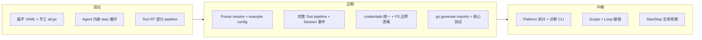

# AgentKit 架构改进 TODO

基于代码与 `docs/` 设计文档的对比分析。优先级：P0 核心契约 > P1 开发者体验 > P2 运行时能力 > P3 包结构清理。

---

## P0 — 核心契约与安全

### 补全工具执行管道

文档 §5.5 规定的顺序：

```
可见性 → Policy → Approval → OnBeforeTool → 超时/取消 → body → OnAfterTool → Session
```

当前 `runtime/tools/runtime.go` 仅实现 Policy + Approval + body。

- [x] 将 `HookRuntime` 注入 `tools.Runtime`（或 Agent 委托完整 pipeline）
- [x] 实现 `OnBeforeTool` / `OnAfterTool` hook 调用
- [x] 启用 `RuntimeConfig.DefaultTimeoutSeconds` 与 per-tool timeout
- [x] `OnAfterTool` 负责执行后即时截断大结果（与 compaction/prune 职责划分：prune 在 derive 阶段）

### Session 生命周期事件

常量已在 `events.go` 定义，Agent 未写入。

- [x] 在 `Agent.RunTurn` 写入 `turn/start`、`turn/end`
- [x] 在 `runStep` 写入 `step/start`、`step/end`
- [x] 确认与现有 `user/message`、`assistant/message`、`tool/call`、`tool/result` 事件顺序一致
- [x] 为 `session replay` 与 compaction `BeforeSeq` 提供稳定锚点

### 凭据与配置安全

`credentials/env` 插件已存在，主配置未接入；`config.yaml` 含硬编码 API Key。

- [x] LLM provider 经 `credentials.Store` 解析 `apiKeyRef`（如 `env:OPENAI_API_KEY`）
- [x] 主配置改用 `presets/coding.yaml`（apiKey 为空 + env fallback）
- [x] 提供 `config.example.yaml`，本地 `config.yaml` 加入 `.gitignore` 或仅作本地 override

### FS 边界一致性

当前 `config.yaml` 中 read/write 用 `fs.local.agent`（`.agent/`），edit 用 `fs.local`（`.`），shell `workDir: .agent/`。

- [x] 明确是否为有意隔离；若是，用 Feature 或文档说明
- [x] 统一 workspace 实例，或用 `fs/readonly` 包装表达只读/读写边界
- [x] 对齐 `presets/coding.yaml` 与 `config.yaml` 的 FS 策略

---

## P1 — 配置与开发者体验

### 配置模型（pluginkit root graph + manager）

MVP 已落地：**扁平 root 实例图**（顶层共享实例 + deps 引用）即 `build.Build` 输入；`cmd/agent -manager` 提供 pluginkit 工作台（装配树 / 共享实例 / edit+build API / ValidateBuild）。

- [x] 用 `manager.FromYAML` + `Document.ToGraph()` 加载配置并构建 Runner
- [x] `-config` 指定 YAML（本地 `config.yaml` 作为 override，不另做 merge 层）
- [x] 对接新版 manager：`InitialYAML`、`OnChange`（显式 `-config` 时自动写回）、`OnBuild`（试装配成功写回本地配置）
- [ ] （可选，Phase 2+）Preset / Feature / AgentSet 高层语法 → 展开为 root graph（见架构文档 §5.7）
- [ ] （可选）`config resolve` CLI：仅当引入 Feature 合并时需要；当前可直接编辑/导出 flat YAML

### 消除配置重复

pluginkit 共享实例已支持 deps 引用顶层 id（如 `credentials`、多 Agent 共用 `llm`）；重复字段（如 `model` 在 agent / llm / llm.summary）属于 flat YAML 便利性问题，不是装配能力缺失。

- [ ] 能共用的实例合并引用（如 summary 与主 LLM 同参时可共用 `llm`）
- [ ] 或插件层：Agent `model` 作为唯一来源，LLM provider 默认继承
- [ ] 或 YAML anchor / 顶层 `defaults`（纯语法糖，非 Preset 层）

### import 生成

- [x] `go generate` 扫描含 `pluginkit.Register` 的 `plugins/*` 与 `runtime/*` 包
- [x] 自动生成 `plugins/all.go`（`scripts/gen-imports`），新增插件不再漏 import

### 拆分 Platform

- [x] 抽出 `runtime/platform/cli/`（kind: `platform/cli`）
- [x] `runtime/runner/` 只保留 Runner root
- [x] 新增 `platform/multiplex`：多 Platform fan-in / 按 `PlatformID` 回写，为 Slack / 飞书等 IM 插件预留共存能力
- [ ] 后续 `platform/http`、`platform/slack`、`platform/feishu` 等待实现

### 诊断 CLI

文档 §10 列出的命令均未实现。

- [ ] `plugins list` — 基于 import manifest + `pluginkit.Lookup`
- [ ] `config resolve --preset coding` — 输出 Resolved Graph
- [ ] `config graph` — 实例 id、kind、deps
- [ ] `build dry-run` — 类型检查不启动 Runner
- [ ] `session replay <id>` — 从 Session 重放模型上下文
- [ ] `hooks list` — 已装配 hook 顺序

---

## P2 — 运行时能力

### Loop 职责上移

当前 Loop 仅做 Agent 路由，`LoopResult` 被丢弃。

- [ ] Turn 级 Session 事件协调（或与 Agent 分工明确）
- [ ] `OnTurnStopping` hook
- [ ] 多 Agent 路由策略（AgentID、slash command、未来 AgentSet）
- [ ] `FollowUp` 队列在 turn 结束后的调度

### Scope / 可见性

`tools.Runtime.Visible()` 返回全部工具，未实现文档 §8。

- [ ] 按 `ToolScope`（global / preset / agent / turn）过滤可见工具
- [ ] restriction 只减不增；更小 scope 可 shadow 同名工具

### StartStop 生命周期

`agentkit.StartStop` 已定义，Runner 未收集/启动/反向 Stop。

- [ ] `build.Build` 后收集实现 `StartStop` 的组件
- [ ] 按依赖顺序 `Start`；失败时反向 `Stop`
- [ ] `Stop` 带超时与错误收集

### JSON Schema 生成

`tool_builder.go` 的 `schemaFor` 硬编码 3 种 struct，不可扩展。

- [ ] 反射读取 `json` + `jsonschema` tag，或引入 `invopop/jsonschema`
- [ ] 移除 type switch 硬编码

### 文档与实现对齐

- [ ] 更新架构文档 §5.2：Policy 挂在 `tools/runtime` 而非 Agent deps（实现更合理，文档示例需同步）
- [ ] 在文档中标注「已实现 / 规划中」，避免按目标态假设能力已存在

---

## P3 — 包结构与 cap 层

### cap/* 空壳接口

`cap/web`、`cap/sandbox`、`cap/subagent` 等仅有空 struct。

- [ ] **YAGNI**：删除未实现 cap 包，Phase 3 再加；或
- [ ] 保留 interface 但在 `plugin-catalog` 标注 Phase，避免误以为已实现

### 根目录接口文件

`plugin_*.go` 分散在根包。

- [ ] （可选）合并为 `interfaces.go` / `types.go`，或加 `doc.go` 说明语义接口层

### SessionQuery

`plugin_session.go` 已定义 `SessionQuery`，无实现与插件 kind。

- [ ] Phase 2/3：`session/sqlite` + `tool/session-query` 落地时再实现
- [ ] 或暂从公开接口移入 `cap/sessionquery` 仅作占位

---

## 测试与可观测性

文档 §11 测试金字塔；当前仅 `agent_test.go`、`p1_test.go`、`runtime/runner/cli_test.go` 等少量测试。

- [ ] Build graph test — unknown kind、重复 tool name、deps 类型错误
- [ ] Tool pipeline test — deny / ask / allow + approval/auto-deny
- [ ] Session golden test — RunTurn 后 `DeriveMessages` 快照
- [ ] Preset smoke test — `build.Build[Runner](presets/coding-smoke.yaml)`
- [ ] Import coverage test — 配置引用的 kind 已在 generated imports 注册
- [ ] 统一 slog 字段：`session_id`、`agent_id`、`tool_call_id`、`plugin_kind`

---

## 路线图



---

## 不必做

- 自研 plugin kernel（已用 pluginkit）
- 服务容器 / 请求路径 `Use(Key)` 定位
- 运行时扫描 `.go` 源码热加载
- 过早实现全部 `cap/*` 空接口对应的 Provider

---

## 参考

- [docs/go-agent-harness-architecture.zh.md](docs/go-agent-harness-architecture.zh.md)
- [docs/plugin-catalog.zh.md](docs/plugin-catalog.zh.md)
- [docs/reference-analysis.zh.md](docs/reference-analysis.zh.md)
